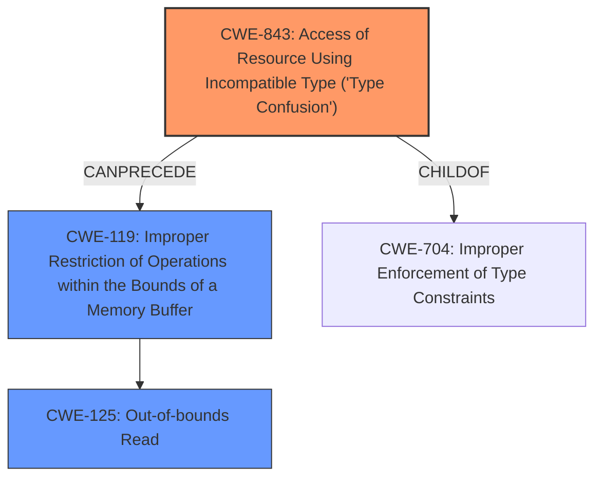

# Analysis for CVE-2020-28611

# Summary
| CWE ID  | CWE Name                                                     | Confidence | CWE Abstraction Level | CWE Vulnerability Mapping Label | CWE-Vulnerability Mapping Notes |
| :-------- | :----------------------------------------------------------- | :--------- | :-------------------- | :------------------------------ | :------------------------------ |
| CWE-843   | Access of Resource Using Incompatible Type ('Type Confusion') | 0.9        | Base                  | Primary                         | Allowed                         |
| CWE-125   | Out-of-bounds Read                                           | 0.9        | Base                  | Secondary                       | Allowed                         |

## Evidence and Confidence

*   **Confidence Score:** 0.9
*   **Evidence Strength:** HIGH

## Relationship Analysis
The primary weakness is **type confusion**, which can lead to an **out-of-bounds read**, ultimately resulting in code execution. CWE-843 (Type Confusion) is a peer of CWE-704 (Incorrect Type Conversion or Cast), both being children of CWE-704 (Improper Enforcement of Type Constraints). CWE-843 can precede CWE-119 (Improper Restriction of Operations within the Bounds of a Memory Buffer), which in turn can lead to CWE-125 (Out-of-bounds Read). The abstraction levels are appropriate, with both CWE-843 and CWE-125 being at the Base level.

## Vulnerability Chain
The chain of events is as follows:
1.  **Type Confusion (CWE-843)**: A resource is accessed using an incompatible type.
2.  **Improper Restriction of Operations within the Bounds of a Memory Buffer (CWE-119)**: The type confusion leads to memory corruption.
3.  **Out-of-bounds Read (CWE-125)**: The memory corruption allows reading data beyond the intended buffer.
4.  **Code Execution (Impact)**: The **out-of-bounds read** enables an attacker to execute arbitrary code.

## Summary of Analysis
The analysis is based on the provided vulnerability description, which clearly indicates both an **out-of-bounds read** and **type confusion**. The description states: "Multiple code execution vulnerabilities exists in the Nef polygon-parsing functionality of CGAL libcgal CGAL-5.1.1. A specially crafted malformed file can lead to an **out-of-bounds read** and **type confusion**, which could lead to code execution."

The graph relationships support the selection of CWE-843 as the primary cause, leading to CWE-125. CWE-843 is the root cause, and CWE-125 is a direct consequence.

The selected CWEs are at the optimal level of specificity, as they accurately represent the **weaknesses** described in the vulnerability. CWE-843 describes the **type confusion**, and CWE-125 describes the **out-of-bounds read**.

Relevant CWE Information:

# Enhanced Context (25 CWEs)
The following CWEs were identified as potentially relevant to this vulnerability:

## CWE-843: Access of Resource Using Incompatible Type ('Type Confusion')
**Abstraction Level**: Base
**Similarity Score**: 362.79 (for 'type confusion' keyphrase)
**Source**: sparse

**Description**:
The product allocates or initializes a resource such as a pointer, object, or variable using one type, but it later accesses that resource using a type that is incompatible with the original type.

**Mapping Guidance**:
- Usage: Allowed
- Rationale: This CWE entry is at the Base level of abstraction, which is a preferred level of abstraction for mapping to the root causes of vulnerabilities.

## CWE-125: Out-of-bounds Read
**Abstraction Level**: Base
**Similarity Score**: 555.80 (for 'out-of-bounds read' keyphrase)
**Source**: sparse

**Description**:
The product reads data past the end, or before the beginning, of the intended buffer.

**Mapping Guidance**:
- Usage: Allowed
- Rationale: This CWE entry is at the Base level of abstraction, which is a preferred level of abstraction for mapping to the root causes of vulnerabilities.

### Other CWEs Considered But Not Used:

*   **CWE-129: Improper Validation of Array Index:** While this could be related to the **out-of-bounds read**, the vulnerability description explicitly mentions **type confusion** as a separate issue, making CWE-843 a more appropriate primary CWE. Therefore, CWE-129 is not used.
*   **CWE-190: Integer Overflow or Wraparound:** This is not directly indicated in the description, so it's not selected.
*   **CWE-787: Out-of-bounds Write:** The description mentions an **out-of-bounds read**, not a write, so this is not selected.
*   **CWE-1284: Improper Validation of Specified Quantity in Input:** While a malformed file is mentioned, the core issues are **type confusion** and **out-of-bounds read**, making this less relevant.
*   **CWE-120: Buffer Copy without Checking Size of Input ('Classic Buffer Overflow'):** This is related to buffer overflows, but the vulnerability description specifies **type confusion** and **out-of-bounds read** as distinct issues.
*   **CWE-197: Numeric Truncation Error:** While this could be related to **type confusion**, the description doesn't mention truncation specifically, so CWE-843 is more appropriate.

# Enhanced Query for CVE-2020-28611

# Vulnerability Description

    Multiple code execution vulnerabilities exists in the Nef polygon-parsing functionality of CGAL libcgal CGAL-5.1.1. A specially crafted malformed file can lead to an **out-of-bounds read** and **type confusion**, which could lead to code execution. An attacker can provide malicious input to trigger any of these vulnerabilities. An oob read vulnerability exists in Nef_S2/SM_io_parser.h SM_io_parserread_vertex() set_first_out_edge().

    # Keyphrase-Specific CWE Analysis
    This vulnerability contains multiple keyphrases that may map to different CWEs. 
    Please analyze each keyphrase separately and determine the most appropriate CWE(s) for each.

    ## WEAKNESS: 'out-of-bounds read'

Relevant CWEs for this WEAKNESS:

### 1. CWE-129: Improper Validation of Array Index (Score: 836.28)

The product uses untrusted input when calculating or using an array index, but the product does not validate or incorrectly validates the index to ensure the index references a valid position within the array....

### 2. CWE-125: Out-of-bounds Read (Score: 555.80)

The product reads data past the end, or before the beginning, of the intended buffer....

### 3. CWE-190: Integer Overflow or Wraparound (Score: 412.23)

The product performs a calculation that can
         produce an integer overflow or wraparound when the logic
         assumes that the resulting value will always be larger than
         the original value. This occurs when an integer value is
         incremented to a value that is too large to st...

### 4. CWE-193: Off-by-one Error (Score: 391.93)

A product calculates or uses an incorrect maximum or minimum value that is 1 more, or 1 less, than the correct value....

### 5. CWE-787: Out-of-bounds Write (Score: 391.31)

The product writes data past the end, or before the beginning, of the intended buffer....

## WEAKNESS: 'type confusion'

Relevant CWEs for this WEAKNESS:

### 1. CWE-129: Improper Validation of Array Index (Score: 836.28)

The product uses untrusted input when calculating or using an array index, but the product does not validate or incorrectly validates the index to ensure the index references a valid position within the array....

### 2. CWE-125: Out-of-bounds Read (Score: 555.80)

The product reads data past the end, or before the beginning, of the intended buffer....

### 3. CWE-190: Integer Overflow or Wraparound (Score: 412.23)

The product performs a calculation that can
         produce an integer overflow or wraparound when the logic
         assumes that the resulting value will always be larger than
         the original value. This occurs when an integer value is
         incremented to a value that is too large to st...

### 4. CWE-843: Access of Resource Using Incompatible Type ('Type Confusion') (Score: 362.79)

The product allocates or initializes a resource such as a pointer, object, or variable using one type, but it later accesses that resource using a type that is incompatible with the original type....

### 5. CWE-197: Numeric Truncation Error (Score: 347.60)

Truncation errors occur when a primitive is cast to a primitive of a smaller size and data is lost in the conversion....

## IMPACT: 'code execution'

Relevant CWEs for this IMPACT:

### 1. CWE-129: Improper Validation of Array Index (Score: 836.28)

The product uses untrusted input when calculating or using an array index, but the product does not validate or incorrectly validates the index to ensure the index references a valid position within the array....

### 2. CWE-125: Out-of-bounds Read (Score: 555.80)

The product reads data past the end, or before the beginning, of the intended buffer....

### 3. CWE-190: Integer Overflow or Wraparound (Score: 412.23)

The product performs a calculation that can
         produce an integer overflow or wraparound when the logic
         assumes that the resulting value will always be larger than
         the original value. This occurs when an integer value is
         incremented to a value that is too large to st...

### 4. CWE-787: Out-of-bounds Write (Score: 391.31)

The product writes data past the end, or before the beginning, of the intended buffer....

### 5. CWE-1284: Improper Validation of Specified Quantity in Input (Score: 120.77)

The product receives input that is expected to specify a quantity (such as size or length), but it does not validate or incorrectly validates that the quantity has the required properties....

## VECTOR: 'specially crafted malformed file'

Relevant CWEs for this VECTOR:

### 1. CWE-129: Improper Validation of Array Index (Score: 836.28)

The product uses untrusted input when calculating or using an array index, but the product does not validate or incorrectly validates the index to ensure the index references a valid position within the array....

### 2. CWE-125: Out-of-bounds Read (Score: 555.80)

The product reads data past the end, or before the beginning, of the intended buffer....

### 3. CWE-190: Integer Overflow or Wraparound (Score: 412.23)

The product performs a calculation that can
         produce an integer overflow or wraparound when the logic
         assumes that the resulting value will always be larger than
         the original value. This occurs when an integer value is
         incremented to a value that is too large to st...

### 4. CWE-787: Out-of-bounds Write (Score: 391.31)

The product writes data past the end, or before the beginning, of the intended buffer....

### 5. CWE-1284: Improper Validation of Specified Quantity in Input (Score: 120.77)

The product receives input that is expected to specify a quantity (such as size or length), but it does not validate or incorrectly validates that the quantity has the required properties....

## ATTACKER: 'attacker'

Relevant CWEs for this ATTACKER:

### 1. CWE-129: Improper Validation of Array Index (Score: 836.28)

The product uses untrusted input when calculating or using an array index, but the product does not validate or incorrectly validates the index to ensure the index references a valid position within the array....

### 2. CWE-125: Out-of-bounds Read (Score: 555.80)

The product reads data past the end, or before the beginning, of the intended buffer....

### 3. CWE-190: Integer Overflow or Wraparound (Score: 412.23)

The product performs a calculation that can
         produce an integer overflow or wraparound when the logic
         assumes that the resulting value will always be larger than
         the original value. This occurs when an integer value is
         incremented to a value that is too large to st...

### 4. CWE-787: Out-of-bounds Write (Score: 391.31)

The product writes data past the end, or before the beginning, of the intended buffer....

### 5. CWE-1284: Improper Validation of Specified Quantity in Input (Score: 120.77)

The product receives input that is expected to specify a quantity (such as size or length), but it does not validate or incorrectly validates that the quantity has the required properties....

## PRODUCT: 'CGAL libcgal'

Relevant CWEs for this PRODUCT:

### 1. CWE-129: Improper Validation of Array Index (Score: 836.28)

The product uses untrusted input when calculating or using an array index, but the product does not validate or incorrectly validates the index to ensure the index references a valid position within the array....

### 2. CWE-125: Out-of-bounds Read (Score: 555.80)

The product reads data past the end, or before the beginning, of the intended buffer....

### 3. CWE-190: Integer Overflow or Wraparound (Score: 412.23)

The product performs a calculation that can
         produce an integer overflow or wraparound when the logic
         assumes that the resulting value will always be larger than
         the original value. This occurs when an integer value is
         incremented to a value that is too large to st...

### 4. CWE-787: Out-of-bounds Write (Score: 391.31)

The product writes data past the end, or before the beginning, of the intended buffer....

### 5. CWE-1284: Improper Validation of Specified Quantity in Input (Score: 120.77)

The product receives input that is expected to specify a quantity (such as size or length), but it does not validate or incorrectly validates that the quantity has the required properties....

## VERSION: 'CGAL-5.1.1'

Relevant CWEs for this VERSION:

### 1. CWE-129: Improper Validation of Array Index (Score: 836.28)

The product uses untrusted input when calculating or using an array index, but the product does not validate or incorrectly validates the index to ensure the index references a valid position within the array....

### 2. CWE-125: Out-of-bounds Read (Score: 555.80)

The product reads data past the end, or before the beginning, of the intended buffer....

### 3. CWE-190: Integer Overflow or Wraparound (Score: 412.23)

The product performs a calculation that can
         produce an integer overflow or wraparound when the logic
         assumes that the resulting value will always be larger than
         the original value. This occurs when an integer value is
         incremented to a value that is too large to st...

### 4. CWE-787: Out-of-bounds Write (Score: 391.31)

The product writes data past the end, or before the beginning, of the intended buffer....

### 5. CWE-1284: Improper Validation of Specified Quantity in Input (Score: 120.77)

The product receives input that is expected to specify a quantity (such as size or length), but it does not validate or incorrectly validates that the quantity has the required properties....

## COMPONENT: 'Nef polygon-parsing functionality'

Relevant CWEs for this COMPONENT:

### 1. CWE-129: Improper Validation of Array Index (Score: 836.28)

The product uses untrusted input when calculating or using an array index, but the product does not validate or incorrectly validates the index to ensure the index references a valid position within the array....

### 2. CWE-125: Out-of-bounds Read (Score: 555.80)

The product reads data past the end, or before the beginning, of the intended buffer....

### 3. CWE-190: Integer Overflow or Wraparound (Score: 412.23)

The product performs a calculation that can
         produce an integer overflow or wraparound when the logic
         assumes that the resulting value will always be larger than
         the original value. This occurs when an integer value is
         incremented to a value that is too large to st...

### 4. CWE-787: Out-of-bounds Write (Score: 391.31)

The product writes data past the end, or before the beginning, of the intended buffer....

### 5. CWE-120: Buffer Copy without Checking Size of Input ('Classic Buffer Overflow') (Score: 128.83)

The product copies an input buffer to an output buffer without verifying that the size of the input buffer is less than the size of the output buffer, leading to a buffer overflow....

    # Analysis Instructions
    1. For each keyphrase, identify the most appropriate CWE(s) that represent the weakness.
    2. Consider how the different keyphrases might relate to each other in the vulnerability chain.
    3. Provide a final determination of primary CWE(s) and any secondary CWEs.
    4. Format your response using the standard analysis template.

    Please analyze how these different weaknesses interact and provide a comprehensive CWE classification.
    