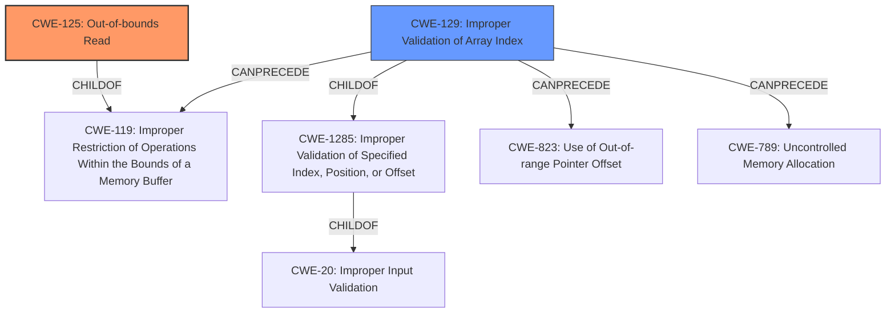

# Enhanced Analysis for CVE-2020-28612

# Summary
| CWE ID | CWE Name | Confidence | CWE Abstraction Level | CWE Vulnerability Mapping Label | CWE-Vulnerability Mapping Notes |
|---|---|---|---|---|---|
| CWE-125 | Out-of-bounds Read | 1.0 | Base | Allowed | Primary CWE |
| CWE-129 | Improper Validation of Array Index | 0.7 | Variant | Allowed | Secondary Candidate |

## Evidence and Confidence

*   **Confidence Score:** 0.9
*   **Evidence Strength:** HIGH

## Relationship Analysis
The primary CWE is CWE-125 **Out-of-bounds Read**, which indicates that the software reads data past the end or before the beginning of the intended buffer. This CWE is a base-level weakness and accurately reflects the vulnerability.

CWE-129 **Improper Validation of Array Index** is a variant-level weakness and a child of CWE-20 **Improper Input Validation**. While relevant because the **out-of-bounds read** occurs due to a lack of index validation, CWE-125 is a more direct representation of the vulnerability.



## Vulnerability Chain
The vulnerability chain starts with the lack of proper bounds checking, leading to an **out-of-bounds read**, and culminating in potential code execution due to type confusion.

1.  **Root Cause:** **Missing bounds check** on the index used to access the `Edge_of` vector.
2.  **Weakness:** CWE-125 **Out-of-bounds Read** - The code reads data past the end of the intended buffer.
3.  **Impact:** Code Execution - Due to type confusion and **out-of-bounds reads**, the attacker can cause the program to execute arbitrary code.

## Summary of Analysis
The initial assessment identified CWE-125 **Out-of-bounds Read** as the primary weakness due to the code's direct indexing into the `Edge_of` vector without proper validation. The retriever results also suggested CWE-129 **Improper Validation of Array Index**, which is relevant because the root cause involves a **missing bounds check**.

The evidence for CWE-125 is strong, with the vulnerability description explicitly stating "**out-of-bounds read**" and the CVE reference summary highlighting the **lack of proper bounds checking** when parsing Nef polygon files. Specifically, the code reads an index from the input file and uses it to access elements in the `Edge_of` vector without verifying if the index is within the valid bounds of the vector. The relevant code snippet shows the assignment `vh->svertices_begin() = (index >= 0 ? Edge_of[index] : this->svertices_end());`, where `Edge_of[index]` is accessed without validating `index`.

The relationship analysis indicates that CWE-125 is a direct consequence of the **missing bounds check**. While CWE-129 **Improper Validation of Array Index** is related, it is more abstract and doesn't directly capture the **out-of-bounds read** itself. Therefore, CWE-125 is the more specific and appropriate choice.

The selection of CWE-125 is based on the evidence from the vulnerability description, the CVE reference summary, and the relationship analysis. It is at the optimal level of specificity, directly addressing the **out-of-bounds read** vulnerability.

Relevant CWE Information:

# Enhanced Context (25 CWEs)
The following CWEs were identified as potentially relevant to this vulnerability:

## CWE-1289: Improper Validation of Unsafe Equivalence in Input
**Abstraction Level**: Base
**Similarity Score**: 0.80
**Source**: dense

**Description**:
The product receives an input value that is used as a resource identifier or other type of reference, but it does not validate or incorrectly validates that the input is equivalent to a potentially-unsafe value.
...
## CWE-1288: Improper Validation of Consistency within Input
**Abstraction Level**: Base
**Similarity Score**: 0.77
**Source**: dense

**Description**:
The product receives a complex input with multiple elements or fields that must be consistent with each other, but it does not validate or incorrectly validates that the input is actually consistent.
...
## CWE-197: Numeric Truncation Error
**Abstraction Level**: Base
**Similarity Score**: 0.76
**Source**: dense

**Description**:
Truncation errors occur when a primitive is cast to a primitive of a smaller size and data is lost in the conversion.
...
## CWE-183: Permissive List of Allowed Inputs
**Abstraction Level**: Base
**Similarity Score**: 0.75
**Source**: dense

**Description**:
The product implements a protection mechanism that relies on a list of inputs (or properties of inputs) that are explicitly allowed by policy because the inputs are assumed to be safe, but the list is too permissive - that is, it allows an input that is unsafe, leading to resultant weaknesses.
...
## CWE-129: Improper Validation of Array Index
**Abstraction Level**: Variant
**Similarity Score**: 0.75
**Source**: dense

**Description**:
The product uses untrusted input when calculating or using an array index, but the product does not validate or incorrectly validates the index to ensure the index references a valid position within the array.
...
## CWE-606: Unchecked Input for Loop Condition
**Abstraction Level**: Base
**Similarity Score**: 0.75
**Source**: dense

**Description**:
The product does not properly check inputs that are used for loop conditions, potentially leading to a denial of service or other consequences because of excessive looping.
...
## CWE-681: Incorrect Conversion between Numeric Types
**Abstraction Level**: Base
**Similarity Score**: 0.75
**Source**: dense

**Description**:
When converting from one data type to another, such as long to integer, data can be omitted or translated in a way that produces unexpected values. If the resulting values are used in a sensitive context, then dangerous behaviors may occur.
...
## CWE-115: Misinterpretation of Input
**Abstraction Level**: Base
**Similarity Score**: 0.75
**Source**: dense

**Description**:
The product misinterprets an input, whether from an attacker or another product, in a security-relevant fashion.
...
## CWE-179: Incorrect Behavior Order: Early Validation
**Abstraction Level**: Base
**Similarity Score**: 0.75
**Source**: dense

**Description**:
The product validates input before applying protection mechanisms that modify the input, which could allow an attacker to bypass the validation via dangerous inputs that only arise after the modification.
...
## CWE-184: Incomplete List of Disallowed Inputs
**Abstraction Level**: Base
**Similarity Score**: 0.75
**Source**: dense

**Description**:
The product implements a protection mechanism that relies on a list of inputs (or properties of inputs) that are not allowed by policy or otherwise require other action to neutralize before additional processing takes place, but the list is incomplete.
...
## CWE-190: Integer Overflow or Wraparound
**Abstraction Level**: Base
**Similarity Score**: 7816.57
**Source**: sparse

**Description**:
The product performs a calculation that can
         produce an integer overflow or wraparound when the logic
         assumes that the resulting value will always be larger than
         the original value. This occurs when an integer value is
         incremented to a value that is too large to store in the
         associated representation. When this occurs, the value may
         become a very small or negative number.
...
## CWE-125: Out-of-bounds Read
**Abstraction Level**: Base
**Similarity Score**: 7575.83
**Source**: sparse

**Description**:
The product reads data past the end, or before the beginning, of the intended buffer.
...
## CWE-197: Numeric Truncation


## CWE Relationship Analysis

Current CWEs represent these abstraction levels: .


### Vulnerability Chain Analysis

**Chain starting from CWE-823:**
- 823 (Use of Out-of-range Pointer Offset) - ROOT


**Chain starting from CWE-1288:**
- 1288 (Improper Validation of Consistency within Input) - ROOT


### CWE Relationship Diagram

```mermaid
graph TD
    classDef primary fill:#f96,stroke:#333,stroke-width:2px
    classDef secondary fill:#69f,stroke:#333
    classDef tertiary fill:#9e9,stroke:#333
```