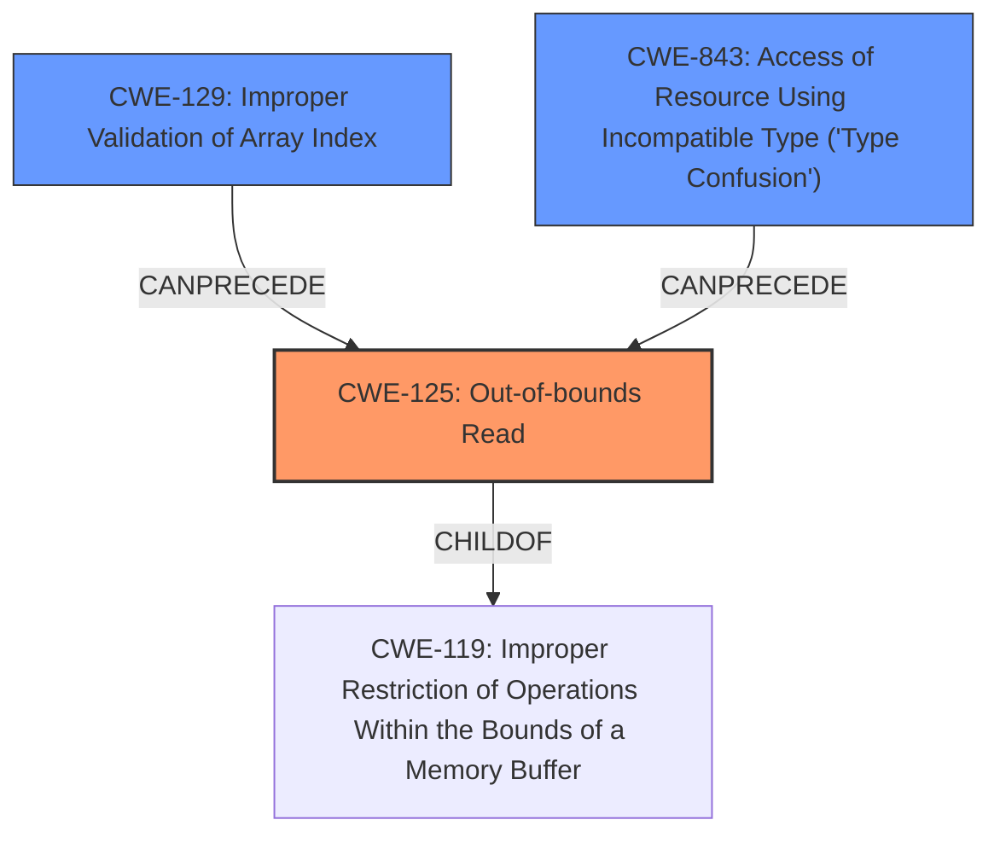

# Analysis for CVE-2020-28613

# Summary
| CWE ID | CWE Name | Confidence | CWE Abstraction Level | CWE Vulnerability Mapping Label | CWE-Vulnerability Mapping Notes |
|---|---|---|---|---|---|
| CWE-125 | Out-of-bounds Read | 1 | Base | Allowed | Primary CWE |
| CWE-843 | Access of Resource Using Incompatible Type ('Type Confusion') | 0.9 | Base | Allowed | Secondary Candidate |
| CWE-129 | Improper Validation of Array Index | 0.8 | Variant | Allowed | Secondary Candidate |

## Evidence and Confidence

*   **Confidence Score:** 0.9
*   **Evidence Strength:** HIGH

## Relationship Analysis
The primary weakness is an out-of-bounds read (CWE-125). This can be caused by improper validation of an array index (CWE-129), or by type confusion (CWE-843) leading to the use of an incorrect index.

## Vulnerability Chain
The chain of events is as follows:
1.  The root cause could be **type confusion** (CWE-843) or **improper validation of array index** (CWE-129).
2.  This leads to an **out-of-bounds read** (CWE-125).
3.  The impact is **code execution**.

## Summary of Analysis
The vulnerability is primarily an **out-of-bounds read** (CWE-125), as directly stated in the vulnerability description and CVE summary: "An oob read vulnerability exists in Nef_S2/SNC_io_parser.h SNC_io_parserread_vertex() vh->svertices_last()." and "The vulnerability is an out-of-bounds read."
The vulnerability description also mentions **type confusion**, which could contribute to the out-of-bounds read by causing the code to access memory using an incorrect type and thus an invalid index. The CVE summary also mentions **lack of input validation** which can be represented by CWE-129.

*   **CWE-125: Out-of-bounds Read:** The vulnerability description explicitly states an **out-of-bounds read** in the `SNC_io_parserread_vertex()` function. The CVE summary confirms that the code reads an index from the input file and uses it to access a vector without proper bounds checking, leading to the out-of-bounds read. This aligns perfectly with the description of CWE-125. Confidence: 1.
*   **CWE-843: Access of Resource Using Incompatible Type ('Type Confusion'):** The vulnerability description mentions **type confusion**. The CVE summary states that by providing out-of-bounds indices, an attacker can force the code to use arbitrary memory locations as CGAL objects, leading to type confusion. This makes CWE-843 a strong candidate. Confidence: 0.9.
*   **CWE-129: Improper Validation of Array Index:** The CVE summary highlights the **lack of input validation**, specifically the absence of checks to ensure index values are within the bounds of the vectors. This aligns with CWE-129. Confidence: 0.8.

Other CWEs Considered but Not Used:

*   CWE-190, CWE-191, CWE-193, CWE-197, CWE-681: These CWEs relate to integer overflow/underflow and numeric conversion errors, which are not explicitly mentioned in the vulnerability description or CVE summary. While these could potentially contribute to the vulnerability, the primary weaknesses described are the out-of-bounds read, type confusion, and lack of input validation.
*   CWE-787: Out-of-bounds Write. Although code execution is listed as a possible outcome, the root cause described in the vulnerability is related to an out-of-bounds read, not a write.
*   CWE-120: Buffer Copy without Checking Size of Input ('Classic Buffer Overflow'). The vulnerability doesn't specifically involve copying data without checking the size, therefore this CWE is not applicable.

The selected CWEs are at the optimal level of specificity, as they directly address the root cause and contributing factors described in the vulnerability.