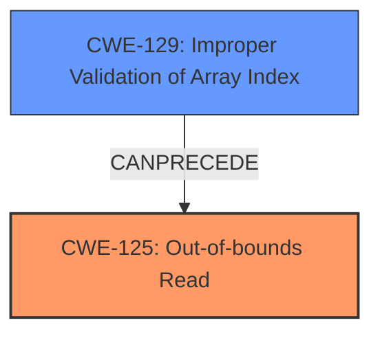

# Raw Analyzer Response for CVE-2020-28615

# Summary
| CWE ID    | CWE Name                               | Confidence | CWE Abstraction Level | CWE Vulnerability Mapping Label | CWE-Vulnerability Mapping Notes |
| --------- | -------------------------------------- | ---------- | ----------------------- | ------------------------------- | ------------------------------- |
| CWE-125   | Out-of-bounds Read                     | 1          | Base                    | Primary                         | Allowed                       |
| CWE-129   | Improper Validation of Array Index     | 0.9        | Variant                 | Secondary                       | Allowed                       |

## Evidence and Confidence

*   **Confidence Score:** 0.95
*   **Evidence Strength:** HIGH

## Relationship Analysis
The primary weakness is CWE-125 **Out-of-bounds Read**. CWE-125 is a base level CWE.
CWE-129 **Improper Validation of Array Index** is a variant level CWE, and it CanPrecede CWE-125 **Out-of-bounds Read**, indicating it can be a contributing factor.

## Vulnerability Chain
The vulnerability chain starts with **Improper Validation of Array Index (CWE-129)**, which leads to an **Out-of-bounds Read (CWE-125)**, and eventually results in code execution.

## Summary of Analysis
The primary weakness identified is CWE-125 **Out-of-bounds Read**. This is based on the vulnerability description which states "A specially crafted malformed file can lead to an **out-of-bounds read** and type confusion, which could lead to code execution." The **out-of-bounds read** is the most direct and impactful issue.
The "CVE Reference Links Content Summary" section supports this, stating: "The code directly uses indices from the input file to access vector elements without validation, resulting in **out-of-bounds reads** when an index exceeds the vector's size."
CWE-129 **Improper Validation of Array Index** is included because the summary also states "Improper validation of array index (CWE-129): The code fails to properly validate array indices before using them to access vector elements." This clearly indicates a failure to validate the array index, making it a contributing factor to the **out-of-bounds read**.
CWE-190 **Integer Overflow or Wraparound** was considered but not selected as there is no direct evidence suggesting an integer overflow is occurring. The vulnerability description and summary focus on the **lack of validation** of array indices, rather than a calculation error leading to the overflow.
CWE-1284 **Improper Validation of Specified Quantity in Input** was considered but not selected. While the input does specify a quantity, the core issue is the validation of array indices rather than the quantity itself.
CWE-787 **Out-of-bounds Write** was considered but not selected. The vulnerability description explicitly mentions an **out-of-bounds read**, not a write.
CWE-476 **NULL Pointer Dereference** was considered but not selected. There is no mention or evidence of null pointer dereference in the description.
CWE-197 **Numeric Truncation Error** was considered but not selected. There is no mention or evidence of numeric truncation.
CWE-122 **Heap-based Buffer Overflow** was considered but not selected because the description does not mention heap allocation or buffer overflow explicitly but rather **out-of-bounds read** and type confusion.
CWE-20 **Improper Input Validation** was considered but not selected. While it is a general class of weakness, CWE-129 is a more specific variant.
The selection of CWE-125 and CWE-129 is at the optimal level of specificity because they directly address the **out-of-bounds read** and the **improper validation** of array indices respectively, as evidenced in the vulnerability description and summary.