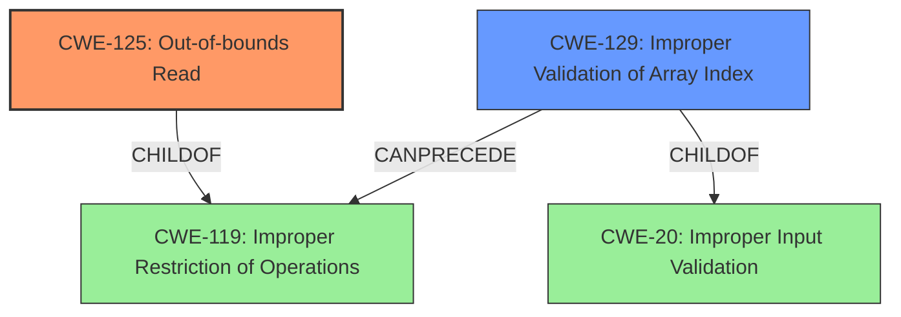

# Enhanced Analysis for CVE-2020-28617

# Summary
| CWE ID | CWE Name | Confidence | CWE Abstraction Level | CWE Vulnerability Mapping Label | CWE-Vulnerability Mapping Notes |
|---|---|---|---|---|---|
| CWE-125 | Out-of-bounds Read | 1.0 | Base | Allowed | Primary CWE |
| CWE-129 | Improper Validation of Array Index | 0.7 | Variant | Allowed | Secondary Candidate |

## Evidence and Confidence

*   **Confidence Score:** 0.9
*   **Evidence Strength:** HIGH

## Relationship Analysis
The primary CWE is CWE-125 **(Out-of-bounds Read)**, which is a **Base** level CWE. This is caused by **Improper Validation of Array Index** CWE-129, which is a **Variant** level CWE, and a more specific cause of the out-of-bounds read. CWE-125 is a child of CWE-119 **(Improper Restriction of Operations within the Bounds of a Memory Buffer)**. CWE-129 is a child of CWE-20 **(Improper Input Validation)**.



## Vulnerability Chain
The vulnerability chain starts with the **improper validation of array index**, leading to an **out-of-bounds read**, which can then lead to code execution due to type confusion.

## Summary of Analysis
The initial analysis focused on identifying the root cause of the vulnerability and its potential impacts. The description clearly states that the **rootcause** is an **out-of-bounds read**. The "CVE Reference Links Content Summary" section reinforces this by explaining that the code reads indexes from the input file and uses them to access vector elements without proper bounds checking, resulting in an **out-of-bounds read**. The summary also mentions that this can lead to type confusion and, ultimately, code execution.

The graph relationships support the selection of CWE-125 as the primary CWE, as it directly represents the vulnerability. The relationship to CWE-129 highlights the importance of input validation in preventing such issues.

The selection of CWE-125 is at the optimal level of specificity because it directly describes the vulnerability, which is an **out-of-bounds read**. While the vulnerability description also mentions type confusion and code execution, these are consequences of the **out-of-bounds read** and not the root cause itself. The "Vulnerability Description Key Phrases" section also identifies the **out-of-bounds read** as the **rootcause**.

Relevant CWE Information:

# Enhanced Context (25 CWEs)

## CWE-1289: Improper Validation of Unsafe Equivalence in Input
**Abstraction Level**: Base
**Similarity Score**: 0.80
**Source**: dense

**Description**:
The product receives an input value that is used as a resource identifier or other type of reference, but it does not validate or incorrectly validates that the input is equivalent to a potentially-unsafe value.
## CWE-1288: Improper Validation of Consistency within Input
**Abstraction Level**: Base
**Similarity Score**: 0.77
**Source**: dense

**Description**:
The product receives a complex input with multiple elements or fields that must be consistent with each other, but it does not validate or incorrectly validates that the input is actually consistent.
## CWE-197: Numeric Truncation Error
**Abstraction Level**: Base
**Similarity Score**: 0.76
**Source**: dense

**Description**:
Truncation errors occur when a primitive is cast to a primitive of a smaller size and data is lost in the conversion.
## CWE-129: Improper Validation of Array Index
**Abstraction Level**: Variant
**Similarity Score**: 0.75
**Source**: dense

**Description**:
The product uses untrusted input when calculating or using an array index, but the product does not validate or incorrectly validates the index to ensure the index references a valid position within the array.
## CWE-183: Permissive List of Allowed Inputs
**Abstraction Level**: Base
**Similarity Score**: 0.75
**Source**: dense

**Description**:
The product implements a protection mechanism that relies on a list of inputs (or properties of inputs) that are explicitly allowed by policy because the inputs are assumed to be safe, but the list is too permissive - that is, it allows an input that is unsafe, leading to resultant weaknesses.
## CWE-681: Incorrect Conversion between Numeric Types
**Abstraction Level**: Base
**Similarity Score**: 0.75
**Source**: dense

**Description**:
When converting from one data type to another, such as long to integer, data can be omitted or translated in a way that produces unexpected values. If the resulting values are used in a sensitive context, then dangerous behaviors may occur.
## CWE-606: Unchecked Input for Loop Condition
**Abstraction Level**: Base
**Similarity Score**: 0.75
**Source**: dense

**Description**:
The product does not properly check inputs that are used for loop conditions, potentially leading to a denial of service or other consequences because of excessive looping.
## CWE-179: Incorrect Behavior Order: Early Validation
**Abstraction Level**: Base
**Similarity Score**: 0.75
**Source**: dense

**Description**:
The product validates input before applying protection mechanisms that modify the input, which could allow an attacker to bypass the validation via dangerous inputs that only arise after the modification.
## CWE-115: Misinterpretation of Input
**Abstraction Level**: Base
**Similarity Score**: 0.75
**Source**: dense

**Description**:
The product misinterprets an input, whether from an attacker or another product, in a security-relevant fashion.
## CWE-807: Reliance on Untrusted Inputs in a Security Decision
**Abstraction Level**: Base
**Similarity Score**: 0.74
**Source**: dense

**Description**:
The product uses a protection mechanism that relies on the existence or values of an input, but the input can be modified by an untrusted actor in a way that bypasses the protection mechanism.
## CWE-190: Integer Overflow or Wraparound
**Abstraction Level**: Base
**Similarity Score**: 7671.78
**Source**: sparse

**Description**:
The product performs a calculation that can
         produce an integer overflow or wraparound when the logic
         assumes that the resulting value will always be larger than
         the original value. This occurs when an integer value is
         incremented to a value that is too large to store in the
         associated representation. When this occurs, the value may
         become a very small or negative number.
## CWE-125: Out-of-bounds Read
**Abstraction Level**: Base
**Similarity Score**: 7485.81
**Source**: sparse

**Description**:
The product reads data past the end, or before the beginning, of the intended buffer.
## CWE-197: Numeric Truncation Error
**Abstraction Level**: Base
**Similarity Score**: 7374.92
**Source**: sparse

**Description**:
Truncation errors occur when a primitive is cast to a primitive of a smaller size and data is lost in the conversion.
## CWE-1284: Improper Validation of Specified Quantity in Input
**Abstraction Level**: Base
**Similarity Score**: 7160.31
**Source**: sparse

**Description**:
The product receives input that is expected to specify a quantity (such as size or length), but it does not validate or incorrectly validates that the quantity has the required properties.
## CWE-193: Off-by-one Error
**Abstraction Level**: Base
**Similarity Score**: 7041.80
**Source**: sparse

**Description**:
A product calculates or uses an incorrect maximum or minimum value that is 1 more, or 1 less, than the correct value.
## CWE-128: Wrap-around Error
**Abstraction Level**: base
**Similarity Score**: 5.03
**Source**: graph

**Description**:
CWE-128: Wrap-around Error
## CWE-190: Integer Overflow or Wraparound
**Abstraction Level**: base
**Similarity Score**: 5.03
**Source**: graph

**Description**:
CWE-190: Integer Overflow or Wraparound
## CWE-41: Improper Resolution of Path Equivalence
**Abstraction


## CWE Relationship Analysis

Current CWEs represent these abstraction levels: .


### Vulnerability Chain Analysis

**Chain starting from CWE-1284:**
- 1284 (Improper Validation of Specified Quantity in Input) - ROOT


**Chain starting from CWE-1288:**
- 1288 (Improper Validation of Consistency within Input) - ROOT


### CWE Relationship Diagram

```mermaid
graph TD
    classDef primary fill:#f96,stroke:#333,stroke-width:2px
    classDef secondary fill:#69f,stroke:#333
    classDef tertiary fill:#9e9,stroke:#333
```