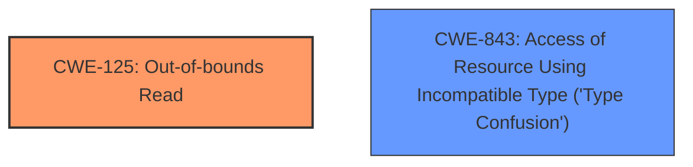

# Analysis for CVE-2020-28618

```markdown
# Summary
| CWE ID  | CWE Name                                                        | Confidence | CWE Abstraction Level | CWE Vulnerability Mapping Label | CWE-Vulnerability Mapping Notes |
| ------- | --------------------------------------------------------------- | ---------- | --------------------- | ------------------------------- | ------------------------------- |
| CWE-125 | Out-of-bounds Read                                            | 0.95       | Base                  | Primary                         | Allowed                        |
| CWE-843 | Access of Resource Using Incompatible Type ('Type Confusion') | 0.8        | Base                  | Secondary                       | Allowed                        |

## Evidence and Confidence

*   **Confidence Score:** 0.9
*   **Evidence Strength:** HIGH

## Relationship Analysis
The primary weakness identified is CWE-125 **(Out-of-bounds Read)**, which is a Base level CWE. The secondary weakness is CWE-843 **(Access of Resource Using Incompatible Type ('Type Confusion'))**, also a Base level CWE. There is no direct hierarchical relationship between these two, but they can exist together in a vulnerability chain. The analysis focused on identifying the root causes described in the vulnerability description.



## Vulnerability Chain
The vulnerability chain appears to start with a specially crafted malformed file, leading to an **out-of-bounds read** and **type confusion**, which ultimately results in potential code execution. The chain is as follows:

1.  Malformed File (Input)
2.  **CWE-125: Out-of-bounds Read**
3.  **CWE-843: Access of Resource Using Incompatible Type ('Type Confusion')**
4.  Code Execution (Impact)

## Summary of Analysis
The initial analysis focused on the **out-of-bounds read** and **type confusion** weaknesses described in the vulnerability.

The vulnerability description states: "Multiple code execution vulnerabilities exists in the Nef polygon-parsing functionality of CGAL libcgal CGAL-5.1.1. A specially crafted malformed file can lead to an **out-of-bounds read** and **type confusion**, which could lead to code execution. An attacker can provide malicious input to trigger any of these vulnerabilities. An oob read vulnerability exists in Nef_S2/SNC_io_parser.h SNC_io_parserread_vertex() vh->shalfloop()."

Based on the vulnerability description, the primary root cause is **CWE-125 (Out-of-bounds Read)**, because the product reads data past the end or before the beginning of the intended buffer.

The secondary root cause is **CWE-843 (Access of Resource Using Incompatible Type ('Type Confusion'))**, because the product allocates or initializes a resource using one type, but later accesses that resource using a type that is incompatible with the original type.

Both CWEs are at the Base level of abstraction, which is the preferred level. The evidence supports these classifications, and the relationship analysis confirms that these weaknesses can coexist.

Relevant CWE Information:

# Enhanced Context (25 CWEs)
The following CWEs were identified as potentially relevant to this vulnerability:

## CWE-129: Improper Validation of Array Index
**Abstraction Level**: Variant
**Similarity Score**: 0.78
**Source**: dense

**Description**:
The product uses untrusted input when calculating or using an array index, but the product does not validate or incorrectly validates the index to ensure the index references a valid position within the array.

**Mapping Guidance**:
- Usage: Allowed
- Rationale: This CWE entry is at the Variant level of abstraction, which is a preferred level of abstraction for mapping to the root causes of vulnerabilities.


## CWE-131: Incorrect Calculation of Buffer Size
**Abstraction Level**: Base
**Similarity Score**: 0.73
**Source**: dense

**Description**:
The product does not correctly calculate the size to be used when allocating a buffer, which could lead to a buffer overflow.

**Mapping Guidance**:
- Usage: Allowed
- Rationale: This CWE entry is at the Base level of abstraction, which is a preferred level of abstraction for mapping to the root causes of vulnerabilities.


## CWE-703: Improper Check or Handling of Exceptional Conditions
**Abstraction Level**: Pillar
**Similarity Score**: 0.73
**Source**: dense

**Description**:
The product does not properly anticipate or handle exceptional conditions that rarely occur during normal operation of the product.

**Mapping Guidance**:
- Usage: Discouraged
- Rationale: This CWE entry is extremely high-level, a Pillar.


## CWE-824: Access of Uninitialized Pointer
**Abstraction Level**: Base
**Similarity Score**: 0.72
**Source**: dense

**Description**:
The product accesses or uses a pointer that has not been initialized.

**Mapping Guidance**:
- Usage: Allowed
- Rationale: This CWE entry is at the Base level of abstraction, which is a preferred level of abstraction for mapping to the root causes of vulnerabilities.


## CWE-125: Out-of-bounds Read
**Abstraction Level**: Base
**Similarity Score**: 0.72
**Source**: dense

**Description**:
The product reads data past the end, or before the beginning, of the intended buffer.

**Mapping Guidance**:
- Usage: Allowed
- Rationale: This CWE entry is at the Base level of abstraction, which is a preferred level of abstraction for mapping to the root causes of vulnerabilities.


## CWE-193: Off-by-one Error
**Abstraction Level**: Base
**Similarity Score**: 0.72
**Source**: dense

**Description**:
A product calculates or uses an incorrect maximum or minimum value that is 1 more, or 1 less, than the correct value.

**Mapping Guidance**:
- Usage: Allowed
- Rationale: This CWE entry is at the Base level of abstraction, which is a preferred level of abstraction for mapping to the root causes of vulnerabilities.


## CWE-252: Unchecked Return Value
**Abstraction Level**: Base
**Similarity Score**: 0.71
**Source**: dense

**Description**:
The product does not check the return value from a method or function, which can prevent it from detecting unexpected states and conditions.

**Mapping Guidance**:
- Usage: Allowed
- Rationale: This CWE entry is at the Base level of abstraction, which is a preferred level of abstraction for mapping to the root causes of vulnerabilities.


## CWE-704: Incorrect Type Conversion or Cast
**Abstraction Level**: Class
**Similarity Score**: 0.71
**Source**: dense

**Description**:
The product does not correctly convert an object, resource, or structure from one type to a different type.

**Mapping Guidance**:
- Usage: Allowed-with-Review
- Rationale: This CWE entry is a Class and might have Base-level children that would be more appropriate


## CWE-681: Incorrect Conversion between Numeric Types
**Abstraction Level**: Base
**Similarity Score**: 0.71
**Source**: dense

**Description**:
When converting from one data type to another, such as long to integer, data can be omitted or translated in a way that produces unexpected values. If the resulting values are used in a sensitive context, then dangerous behaviors may occur.

**Mapping Guidance**:
- Usage: Allowed
- Rationale: This CWE entry is at the Base level of abstraction, which is a preferred level of abstraction for mapping to the root causes of vulnerabilities.


## CWE-407: Inefficient Algorithmic Complexity
**Abstraction Level**: Class
**Similarity Score**: 0.70
**Source**: dense

**Description**:
An algorithm in a product has an inefficient worst-case computational complexity that may be detrimental to system performance and can be triggered by an attacker, typically using crafted manipulations that ensure that the worst case is being reached.

**Mapping Guidance**:
- Usage: Allowed-with-Review
- Rationale: This CWE entry is a Class and might have Base-level children that would be more appropriate


## CWE-190: Integer Overflow or Wraparound
**Abstraction Level**: Base
**Similarity Score**: 3160.44
**Source**: sparse

**Description**:
The product performs a calculation that can
         produce an integer overflow or wraparound when the logic
         assumes that the resulting value will always be larger than
         the original value. This occurs when an integer value is
         incremented to a value that is too large to store in the
         associated representation. When this occurs, the value may
         become a very small or negative number.

**Mapping Guidance**:
- Usage: Allowed
- Rationale: This CWE entry is at the Base level of abstraction, which is a preferred level of abstraction for mapping to the root causes of vulnerabilities.


## CWE-129: Improper Validation of Array Index
**Abstraction Level**: Variant
**Similarity Score**: 3059.10
**Source**: sparse

**

# Enhanced Query for CVE-2020-28618

# Vulnerability Description

    Multiple code execution vulnerabilities exists in the Nef polygon-parsing functionality of CGAL libcgal CGAL-5.1.1. A specially crafted malformed file can lead to an **out-of-bounds read** and **type confusion**, which could lead to code execution. An attacker can provide malicious input to trigger any of these vulnerabilities. An oob read vulnerability exists in Nef_S2/SNC_io_parser.h SNC_io_parserread_vertex() vh->shalfloop().

    # Keyphrase-Specific CWE Analysis
    This vulnerability contains multiple keyphrases that may map to different CWEs. 
    Please analyze each keyphrase separately and determine the most appropriate CWE(s) for each.

    ## WEAKNESS: 'out-of-bounds read'

Relevant CWEs for this WEAKNESS:

### 1. CWE-129: Improper Validation of Array Index (Score: 880.29)

The product uses untrusted input when calculating or using an array index, but the product does not validate or incorrectly validates the index to ensure the index references a valid position within the array....

### 2. CWE-125: Out-of-bounds Read (Score: 576.82)

The product reads data past the end, or before the beginning, of the intended buffer....

### 3. CWE-190: Integer Overflow or Wraparound (Score: 412.23)

The product performs a calculation that can
         produce an integer overflow or wraparound when the logic
         assumes that the resulting value will always be larger than
         the original value. This occurs when an integer value is
         incremented to a value that is too large to st...

### 4. CWE-193: Off-by-one Error (Score: 391.93)

A product calculates or uses an incorrect maximum or minimum value that is 1 more, or 1 less, than the correct value....

### 5. CWE-787: Out-of-bounds Write (Score: 391.31)

The product writes data past the end, or before the beginning, of the intended buffer....

## WEAKNESS: 'type confusion'

Relevant CWEs for this WEAKNESS:

### 1. CWE-129: Improper Validation of Array Index (Score: 880.29)

The product uses untrusted input when calculating or using an array index, but the product does not validate or incorrectly validates the index to ensure the index references a valid position within the array....

### 2. CWE-125: Out-of-bounds Read (Score: 576.82)

The product reads data past the end, or before the beginning, of the intended buffer....

### 3. CWE-190: Integer Overflow or Wraparound (Score: 412.23)

The product performs a calculation that can
         produce an integer overflow or wraparound when the logic
         assumes that the resulting value will always be larger than
         the original value. This occurs when an integer value is
         incremented to a value that is too large to st...

### 4. CWE-843: Access of Resource Using Incompatible Type ('Type Confusion') (Score: 362.79)

The product allocates or initializes a resource such as a pointer, object, or variable using one type, but it later accesses that resource using a type that is incompatible with the original type....

### 5. CWE-197: Numeric Truncation Error (Score: 347.60)

Truncation errors occur when a primitive is cast to a primitive of a smaller size and data is lost in the conversion....

## IMPACT: 'code execution'

Relevant CWEs for this IMPACT:

### 1. CWE-129: Improper Validation of Array Index (Score: 880.29)

The product uses untrusted input when calculating or using an array index, but the product does not validate or incorrectly validates the index to ensure the index references a valid position within the array....

### 2. CWE-125: Out-of-bounds Read (Score: 576.82)

The product reads data past the end, or before the beginning, of the intended buffer....

### 3. CWE-190: Integer Overflow or Wraparound (Score: 412.23)

The product performs a calculation that can
         produce an integer overflow or wraparound when the logic
         assumes that the resulting value will always be larger than
         the original value. This occurs when an integer value is
         incremented to a value that is too large to st...

### 4. CWE-787: Out-of-bounds Write (Score: 391.31)

The product writes data past the end, or before the beginning, of the intended buffer....

### 5. CWE-1284: Improper Validation of Specified Quantity in Input (Score: 120.77)

The product receives input that is expected to specify a quantity (such as size or length), but it does not validate or incorrectly validates that the quantity has the required properties....

## VECTOR: 'specially crafted malformed file'

Relevant CWEs for this VECTOR:

### 1. CWE-129: Improper Validation of Array Index (Score: 880.29)

The product uses untrusted input when calculating or using an array index, but the product does not validate or incorrectly validates the index to ensure the index references a valid position within the array....

### 2. CWE-125: Out-of-bounds Read (Score: 576.82)

The product reads data past the end, or before the beginning, of the intended buffer....

### 3. CWE-190: Integer Overflow or Wraparound (Score: 412.23)

The product performs a calculation that can
         produce an integer overflow or wraparound when the logic
         assumes that the resulting value will always be larger than
         the original value. This occurs when an integer value is
         incremented to a value that is too large to st...

### 4. CWE-787: Out-of-bounds Write (Score: 391.31)

The product writes data past the end, or before the beginning, of the intended buffer....

### 5. CWE-1284: Improper Validation of Specified Quantity in Input (Score: 120.77)

The product receives input that is expected to specify a quantity (such as size or length), but it does not validate or incorrectly validates that the quantity has the required properties....

## PRODUCT: 'CGAL libcgal'

Relevant CWEs for this PRODUCT:

### 1. CWE-129: Improper Validation of Array Index (Score: 880.29)

The product uses untrusted input when calculating or using an array index, but the product does not validate or incorrectly validates the index to ensure the index references a valid position within the array....

### 2. CWE-125: Out-of-bounds Read (Score: 576.82)

The product reads data past the end, or before the beginning, of the intended buffer....

### 3. CWE-190: Integer Overflow or Wraparound (Score: 412.23)

The product performs a calculation that can
         produce an integer overflow or wraparound when the logic
         assumes that the resulting value will always be larger than
         the original value. This occurs when an integer value is
         incremented to a value that is too large to st...

### 4. CWE-787: Out-of-bounds Write (Score: 391.31)

The product writes data past the end, or before the beginning, of the intended buffer....

### 5. CWE-1284: Improper Validation of Specified Quantity in Input (Score: 120.77)

The product receives input that is expected to specify a quantity (such as size or length), but it does not validate or incorrectly validates that the quantity has the required properties....

## VERSION: 'CGAL-5.1.1'

Relevant CWEs for this VERSION:

### 1. CWE-129: Improper Validation of Array Index (Score: 880.29)

The product uses untrusted input when calculating or using an array index, but the product does not validate or incorrectly validates the index to ensure the index references a valid position within the array....

### 2. CWE-125: Out-of-bounds Read (Score: 576.82)

The product reads data past the end, or before the beginning, of the intended buffer....

### 3. CWE-190: Integer Overflow or Wraparound (Score: 412.23)

The product performs a calculation that can
         produce an integer overflow or wraparound when the logic
         assumes that the resulting value will always be larger than
         the original value. This occurs when an integer value is
         incremented to a value that is too large to st...

### 4. CWE-787: Out-of-bounds Write (Score: 391.31)

The product writes data past the end, or before the beginning, of the intended buffer....

### 5. CWE-1284: Improper Validation of Specified Quantity in Input (Score: 120.77)

The product receives input that is expected to specify a quantity (such as size or length), but it does not validate or incorrectly validates that the quantity has the required properties....

## COMPONENT: 'Nef_S2/SNC_io_parser.h SNC_io_parserread_vertex() vh->shalfloop()'

Relevant CWEs for this COMPONENT:

### 1. CWE-129: Improper Validation of Array Index (Score: 880.29)

The product uses untrusted input when calculating or using an array index, but the product does not validate or incorrectly validates the index to ensure the index references a valid position within the array....

### 2. CWE-125: Out-of-bounds Read (Score: 576.82)

The product reads data past the end, or before the beginning, of the intended buffer....

### 3. CWE-190: Integer Overflow or Wraparound (Score: 412.23)

The product performs a calculation that can
         produce an integer overflow or wraparound when the logic
         assumes that the resulting value will always be larger than
         the original value. This occurs when an integer value is
         incremented to a value that is too large to st...

### 4. CWE-193: Off-by-one Error (Score: 391.93)

A product calculates or uses an incorrect maximum or minimum value that is 1 more, or 1 less, than the correct value....

### 5. CWE-122: Heap-based Buffer Overflow (Score: 116.64)

A heap overflow condition is a buffer overflow, where the buffer that can be overwritten is allocated in the heap portion of memory, generally meaning that the buffer was allocated using a routine such as malloc()....


    # Analysis Instructions
    1. For each keyphrase, identify the most appropriate CWE(s) that represent the weakness.
    2. Consider how the different keyphrases might relate to each other in the vulnerability chain.
    3. Provide a final determination of primary CWE(s) and any secondary CWEs.
    4. Format your response using the standard analysis template.

    Please analyze how these different weaknesses interact and provide a comprehensive CWE classification.
    