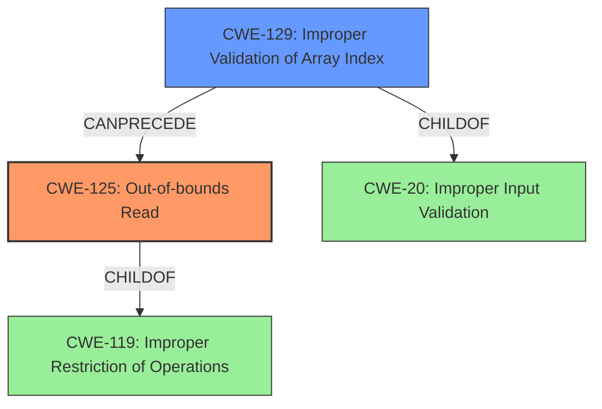

# Raw Analyzer Response for CVE-2020-28620

# Summary
| CWE ID | CWE Name | Confidence | CWE Abstraction Level | CWE Vulnerability Mapping Label | CWE-Vulnerability Mapping Notes |
|---|---|---|---|---|---|
| CWE-125 | Out-of-bounds Read | 1.0 | Base | Allowed | Primary CWE |
| CWE-129 | Improper Validation of Array Index | 0.9 | Variant | Allowed | Secondary CWE |

## Evidence and Confidence

*   **Confidence Score:** 0.95
*   **Evidence Strength:** HIGH

## Relationship Analysis
The primary CWE is CWE-125 **Out-of-bounds Read**, which is a base CWE and a child of CWE-119 **Improper Restriction of Operations within the Bounds of a Memory Buffer**. The secondary CWE is CWE-129 **Improper Validation of Array Index**, which is a variant CWE and a child of CWE-20 **Improper Input Validation**. CWE-129 can precede CWE-125. The analysis focuses on CWE-125 as the primary issue, with CWE-129 contributing to the root cause by not validating the array index, leading to the out-of-bounds read.

## Vulnerability Chain
The vulnerability chain starts with the lack of bounds checking or **Improper Validation of Array Index** (CWE-129) when parsing a .nef3 file. This leads to an **Out-of-bounds Read** (CWE-125), which results in memory corruption and type confusion, ultimately enabling arbitrary code execution.

## Summary of Analysis
The initial analysis identified an **out-of-bounds read** vulnerability in the CGAL library. The vulnerability stems from a lack of bounds checking when parsing a .nef3 file, allowing out-of-bounds access, leading to memory corruption and type confusion.

The evidence for this assessment is derived from the "CVE Reference Links Content Summary" section, which states: "The vulnerability stems from a lack of bounds checking when parsing a .nef3 file. The code reads indexes from the file and uses them directly to access vectors (e.g., `Edge_of`, `Vertex_of`, `SFace_of`, etc.) without validating if the indexes are within the bounds of the respective vectors. This allows out-of-bounds access, leading to memory corruption and type confusion."

Based on the analysis, CWE-125 **Out-of-bounds Read** is the primary CWE because the vulnerability description explicitly mentions an **out-of-bounds read**. The "CVE Reference Links Content Summary" supports this by stating that the code reads data past the end or before the beginning of the intended buffer.

CWE-129 **Improper Validation of Array Index** is a secondary CWE because the root cause is a lack of bounds checking when parsing the .nef3 file. The code uses indexes directly to access vectors without validating if the indexes are within the bounds. The "CVE Reference Links Content Summary" supports this by mentioning "CWE-129 - Improper Validation of Array Index" in the weaknesses section.

Other CWEs considered but not used:
- CWE-190 **Integer Overflow or Wraparound**: While integer issues might be related, the core problem is the lack of validation leading to out-of-bounds access.
- CWE-787 **Out-of-bounds Write**: The description focuses on reading out of bounds, not writing.

The selected CWEs are at the optimal level of specificity. CWE-125 is a base CWE that accurately describes the out-of-bounds read, and CWE-129 is a variant CWE that describes the improper validation of the array index that leads to the vulnerability.

Relevant CWE Information:

# Enhanced Context (25 CWEs)

## CWE-1289: Improper Validation of Unsafe Equivalence in Input
**Abstraction Level**: Base
**Similarity Score**: 0.80
**Source**: dense

**Description**:
The product receives an input value that is used as a resource identifier or other type of reference, but it does not validate or incorrectly validates that the input is equivalent to a potentially-unsafe value.

**Mapping Guidance**:
- Usage: Allowed
- Rationale: This CWE entry is at the Base level of abstraction, which is a preferred level of abstraction for mapping to the root causes of vulnerabilities.

## CWE-1288: Improper Validation of Consistency within Input
**Abstraction Level**: Base
**Similarity Score**: 0.78
**Source**: dense

**Description**:
The product receives a complex input with multiple elements or fields that must be consistent with each other, but it does not validate or incorrectly validates that the input is actually consistent.

**Mapping Guidance**:
- Usage: Allowed
- Rationale: This CWE entry is at the Base level of abstraction, which is a preferred level of abstraction for mapping to the root causes of vulnerabilities.

## CWE-197: Numeric Truncation Error
**Abstraction Level**: Base
**Similarity Score**: 0.76
**Source**: dense

**Description**:
Truncation errors occur when a primitive is cast to a primitive of a smaller size and data is lost in the conversion.

**Mapping Guidance**:
- Usage: Allowed
- Rationale: This CWE entry is at the Base level of abstraction, which is a preferred level of abstraction for mapping to the root causes of vulnerabilities.

## CWE-129: Improper Validation of Array Index
**Abstraction Level**: Variant
**Similarity Score**: 0.76
**Source**: dense

**Description**:
The product uses untrusted input when calculating or using an array index, but the product does not validate or incorrectly validates the index to ensure the index references a valid position within the array.

**Mapping Guidance**:
- Usage: Allowed
- Rationale: This CWE entry is at the Variant level of abstraction, which is a preferred level of abstraction for mapping to the root causes of vulnerabilities.

## CWE-183: Permissive List of Allowed Inputs
**Abstraction Level**: Base
**Similarity Score**: 0.76
**Source**: dense

**Description**:
The product implements a protection mechanism that relies on a list of inputs (or properties of inputs) that are explicitly allowed by policy because the inputs are assumed to be safe, but the list is too permissive - that is, it allows an input that is unsafe, leading to resultant weaknesses.

**Mapping Guidance**:
- Usage: Allowed
- Rationale: This CWE entry is at the Base level of abstraction, which is a preferred level of abstraction for mapping to the root causes of vulnerabilities.

## CWE-606: Unchecked Input for Loop Condition
**Abstraction Level**: Base
**Similarity Score**: 0.76
**Source**: dense

**Description**:
The product does not properly check inputs that are used for loop conditions, potentially leading to a denial of service or other consequences because of excessive looping.

**Mapping Guidance**:
- Usage: Allowed
- Rationale: This CWE entry is at the Base level of abstraction, which is a preferred level of abstraction for mapping to the root causes of vulnerabilities.

## CWE-681: Incorrect Conversion between Numeric Types
**Abstraction Level**: Base
**Similarity Score**: 0.76
**Source**: dense

**Description**:
When converting from one data type to another, such as long to integer, data can be omitted or translated in a way that produces unexpected values. If the resulting values are used in a sensitive context, then dangerous behaviors may occur.

**Mapping Guidance**:
- Usage: Allowed
- Rationale: This CWE entry is at the Base level of abstraction, which is a preferred level of abstraction for mapping to the root causes of vulnerabilities.

## CWE-179: Incorrect Behavior Order: Early Validation
**Abstraction Level**: Base
**Similarity Score**: 0.75
**Source**: dense

**Description**:
The product validates input before applying protection mechanisms that modify the input, which could allow an attacker to bypass the validation via dangerous inputs that only arise after the modification.

**Mapping Guidance**:
- Usage: Allowed
- Rationale: This CWE entry is at the Base level of abstraction, which is a preferred level of abstraction for mapping to the root causes of vulnerabilities.

## CWE-184: Incomplete List of Disallowed Inputs
**Abstraction Level**: Base
**Similarity Score**: 0.75
**Source**: dense

**Description**:
The product implements a protection mechanism that relies on a list of inputs (or properties of