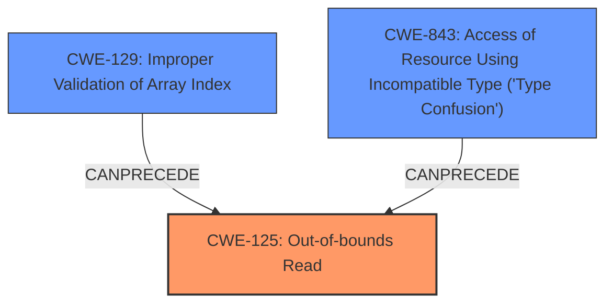

# Raw Analyzer Response for CVE-2020-28621

# Summary
| CWE ID | CWE Name | Confidence | CWE Abstraction Level | CWE Vulnerability Mapping Label | CWE-Vulnerability Mapping Notes |
|---|---|---|---|---|---|
| CWE-125 | Out-of-bounds Read | 0.9 | Base | Allowed | Primary CWE |
| CWE-843 | Access of Resource Using Incompatible Type ('Type Confusion') | 0.8 | Base | Allowed | Secondary Candidate |
| CWE-129 | Improper Validation of Array Index | 0.7 | Variant | Allowed | Secondary Candidate |

## Evidence and Confidence

*   **Confidence Score:** 0.8
*   **Evidence Strength:** HIGH

## Relationship Analysis
The primary weakness is **CWE-125** (Out-of-bounds Read), which directly aligns with the vulnerability description and the CVE reference summary. This CWE is a base level weakness, providing a good balance of specificity and generality. **CWE-843** (Type Confusion) and **CWE-129** (Improper Validation of Array Index) are also relevant and can be considered contributing factors or preconditions. CWE-129 can precede CWE-125, as improper validation can lead to out-of-bounds access. CWE-843 can also precede CWE-125, as accessing memory with the wrong type can lead to reading beyond the intended boundaries.

## Vulnerability Chain
The vulnerability chain starts with a malformed file, leading to **improper validation of array indices (CWE-129)**. This results in an **out-of-bounds read (CWE-125)**, which in turn can cause **type confusion (CWE-843)**. The combined effect of these weaknesses can lead to arbitrary code execution.

## Summary of Analysis
The initial assessment correctly identifies the **out-of-bounds read** as a primary issue, supported by the vulnerability description and CVE reference summary. The provided evidence strongly supports the selection of **CWE-125**.

The selection of **CWE-125** as the primary CWE is based on the explicit mention of "**out-of-bounds read**" in the vulnerability description and the repeated mention of "Out-of-bounds read" within the CVE Reference Links Content Summary. The CVE Reference also indicates "**Improper validation of array index when parsing Nef polygon data from a file, leading to out-of-bounds reads and type confusion.**" The **CWE-125** is at the Base level, which is appropriate given the evidence.

**CWE-843** (Access of Resource Using Incompatible Type ('Type Confusion')) is added as a secondary CWE because the vulnerability description also mentions "**type confusion**". The CVE Reference also mentions "**Improper validation of array index when parsing Nef polygon data from a file, leading to out-of-bounds reads and type confusion.**"

**CWE-129** (Improper Validation of Array Index) is included as a secondary CWE because the CVE reference summary states: "Improper validation of array index when parsing Nef polygon data from a file, leading to out-of-bounds reads and type confusion.".

The other CWEs were not selected because while they might be indirectly related (e.g., integer overflow leading to out-of-bounds read), the primary evidence points to out-of-bounds read and type confusion stemming from the parsing process.

Relevant CWE Information:

# Enhanced Context (25 CWEs)
The following CWEs were identified as potentially relevant to this vulnerability:

## CWE-197: Numeric Truncation Error
**Abstraction Level**: Base
**Similarity Score**: 0.79
**Source**: dense

**Description**:
Truncation errors occur when a primitive is cast to a primitive of a smaller size and data is lost in the conversion.

**Mapping Guidance**:
- Usage: Allowed
- Rationale: This CWE entry is at the Base level of abstraction, which is a preferred level of abstraction for mapping to the root causes of vulnerabilities.

## CWE-129: Improper Validation of Array Index
**Abstraction Level**: Variant
**Similarity Score**: 0.78
**Source**: dense

**Description**:
The product uses untrusted input when calculating or using an array index, but the product does not validate or incorrectly validates the index to ensure the index references a valid position within the array.

**Mapping Guidance**:
- Usage: Allowed
- Rationale: This CWE entry is at the Variant level of abstraction, which is a preferred level of abstraction for mapping to the root causes of vulnerabilities.

## CWE-191: Integer Underflow (Wrap or Wraparound)
**Abstraction Level**: Base
**Similarity Score**: 0.78
**Source**: dense

**Description**:
The product subtracts one value from another, such that the result is less than the minimum allowable integer value, which produces a value that is not equal to the correct result.

**Mapping Guidance**:
- Usage: Allowed
- Rationale: This CWE entry is at the Base level of abstraction, which is a preferred level of abstraction for mapping to the root causes of vulnerabilities.

## CWE-681: Incorrect Conversion between Numeric Types
**Abstraction Level**: Base
**Similarity Score**: 0.78
**Source**: dense

**Description**:
When converting from one data type to another, such as long to integer, data can be omitted or translated in a way that produces unexpected values. If the resulting values are used in a sensitive context, then dangerous behaviors may occur.

**Mapping Guidance**:
- Usage: Allowed
- Rationale: This CWE entry is at the Base level of abstraction, which is a preferred level of abstraction for mapping to the root causes of vulnerabilities.

## CWE-131: Incorrect Calculation of Buffer Size
**Abstraction Level**: Base
**Similarity Score**: 0.77
**Source**: dense

**Description**:
The product does not correctly calculate the size to be used when allocating a buffer, which could lead to a buffer overflow.

**Mapping Guidance**:
- Usage: Allowed
- Rationale: This CWE entry is at the Base level of abstraction, which is a preferred level of abstraction for mapping to the root causes of vulnerabilities.

## CWE-190: Integer Overflow or Wraparound
**Abstraction Level**: Base
**Similarity Score**: 0.76
**Source**: dense

**Description**:
The product performs a calculation that can
         produce an integer overflow or wraparound when the logic
         assumes that the resulting value will always be larger than
         the original value. This occurs when an integer value is
         incremented to a value that is too large to store in the
         associated representation. When this occurs, the value may
         become a very small or negative number.

**Mapping Guidance**:
- Usage: Allowed
- Rationale: This CWE entry is at the Base level of abstraction, which is a preferred level of abstraction for mapping to the root causes of vulnerabilities.

## CWE-125: Out-of-bounds Read
**Abstraction Level**: Base
**Similarity Score**: 0.76
**Source**: dense

**Description**:
The product reads data past the end, or before the beginning, of the intended buffer.

**Mapping Guidance**:
- Usage: Allowed
- Rationale: This CWE entry is at the Base level of abstraction, which is a preferred level of abstraction for mapping to the root causes of vulnerabilities.

## CWE-193: Off-by-one Error
**Abstraction Level**: Base
**Similarity Score**: 0.75
**Source**: dense

**Description**:
A product calculates or uses an incorrect maximum or minimum value that is 1 more, or 1 less, than the correct value.

**Mapping Guidance**:
- Usage: Allowed
- Rationale: This CWE entry is at the Base level of abstraction, which is a preferred level of abstraction for mapping to the root causes of vulnerabilities.

## CWE-126: Buffer Over-read
**Abstraction Level**: Variant
**Similarity Score**: 0.75
**Source**: dense

**Description**:
The product reads from a buffer using buffer access mechanisms such as indexes or pointers that reference memory locations after the targeted buffer.

**Mapping Guidance**:
- Usage: Allowed
- Rationale: This CWE entry is at the Variant level of abstraction, which is a preferred level of abstraction for mapping to the root causes of vulnerabilities.

## CWE-805: Buffer Access with Incorrect Length Value
**Abstraction Level**: Base
**Similarity Score**: 0.75
**Source**: dense

**Description**:
The product uses a sequential operation to read or write a buffer, but it uses an incorrect length value that causes it