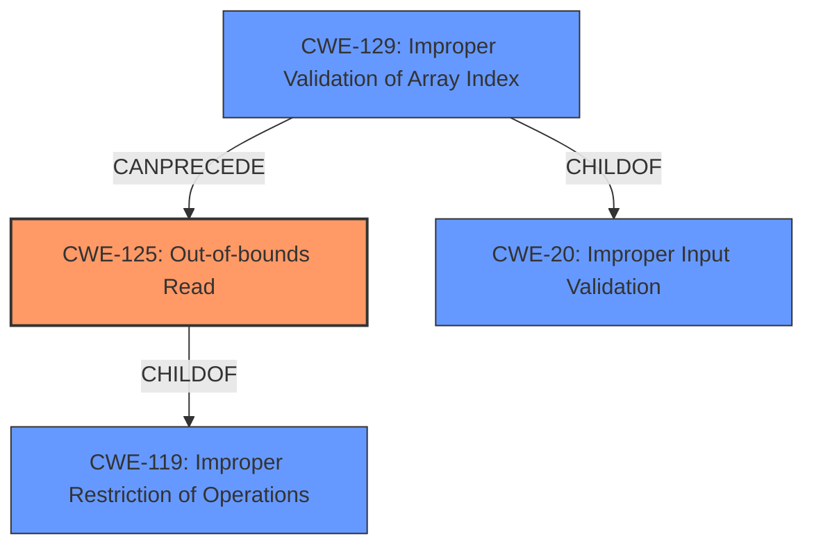

# Raw Analyzer Response for CVE-2020-28623

# Summary
| CWE ID | CWE Name | Confidence | CWE Abstraction Level | CWE Vulnerability Mapping Label | CWE-Vulnerability Mapping Notes |
|---|---|---|---|---|---|
| CWE-125 | Out-of-bounds Read | 1.0 | Base | Allowed | Primary CWE |
| CWE-129 | Improper Validation of Array Index | 0.7 | Variant | Allowed | Secondary Candidate |

## Evidence and Confidence

*   **Confidence Score:** 0.9
*   **Evidence Strength:** HIGH

## Relationship Analysis
The primary weakness is CWE-125, which is a base level CWE. It is related to CWE-119 (Improper Restriction of Operations Within the Bounds of a Memory Buffer) as a ChildOf. CWE-129 (Improper Validation of Array Index) is a variant-level CWE and a child of CWE-20 (Improper Input Validation), and CANPRECEDE CWE-119 and CWE-125. This relationship suggests that the **improper validation** of an array index could lead to an **out-of-bounds read**.

## Vulnerability Chain
The vulnerability chain starts with a malformed file that leads to an **improper validation** of an array index (CWE-129), which results in an **out-of-bounds read** (CWE-125), and ultimately leads to code execution.

## Summary of Analysis
The primary weakness is an **out-of-bounds read** (CWE-125) in the Nef polygon-parsing functionality of CGAL. The vulnerability description states: "A specially crafted malformed file can lead to an **out-of-bounds read** and type confusion, which could lead to code execution." This aligns perfectly with the description of CWE-125, which states: "The product reads data past the end, or before the beginning, of the intended buffer." The CVE Reference Links Content Summary confirms this, stating that the root cause is a "lack of proper bounds checking when reading indices from a file and using them to access vectors, leading to out-of-bounds reads."

CWE-129 is considered as a secondary candidate because the **lack of proper bounds checking** during the array index validation leads to the **out-of-bounds read** condition. The description for CWE-129 states, "The product uses untrusted input when calculating or using an array index, but the product does not validate or incorrectly validates the index to ensure the index references a valid position within the array."

Other CWEs considered but not selected:
*   CWE-190 (Integer Overflow or Wraparound): While integer overflows can sometimes lead to out-of-bounds reads, there is no direct evidence of an integer overflow in this case.
*   CWE-1284 (Improper Validation of Specified Quantity in Input): While related to input validation, it's less specific than CWE-129 given the context of array indices.
*   CWE-787 (Out-of-bounds Write): The vulnerability is described as an **out-of-bounds read**, not a write.
*   CWE-193 (Off-by-one Error): There is no direct evidence to suggest an off-by-one error.
*   CWE-476 (NULL Pointer Dereference): There is no evidence to suggest a NULL pointer dereference.
*   CWE-197 (Numeric Truncation Error): No evidence of numeric truncation error is found.
*   CWE-122 (Heap-based Buffer Overflow): While the buffer may be heap-allocated, the core issue is an **out-of-bounds read**, not necessarily a heap overflow.
*   CWE-20 (Improper Input Validation): This is a high level Class CWE, and CWE-129 is a more specific variant.

The selected CWEs are at the optimal level of specificity because CWE-125 directly describes the **out-of-bounds read** condition, and CWE-129 highlights the cause of **improper validation** of the array index.