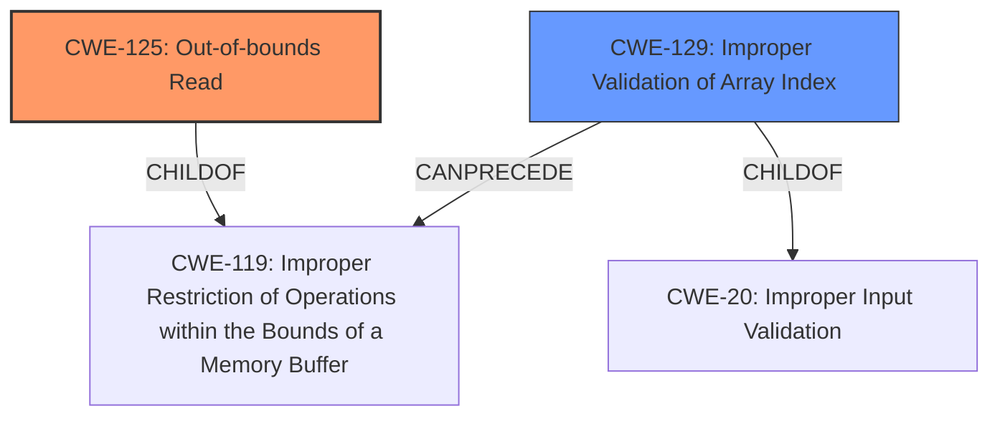

# Raw Analyzer Response for CVE-2020-28626

# Summary
| CWE ID | CWE Name | Confidence | CWE Abstraction Level | CWE Vulnerability Mapping Label | CWE-Vulnerability Mapping Notes |
|---|---|---|---|---|---|
| CWE-125 | Out-of-bounds Read | 1.0 | Base | Allowed | Primary CWE.  The vulnerability is explicitly described as an out-of-bounds read. |
| CWE-129 | Improper Validation of Array Index | 0.9 | Variant | Allowed | Secondary CWE. The root cause is the lack of validation of the array index. |

## Evidence and Confidence

*   **Confidence Score:** 0.95
*   **Evidence Strength:** HIGH

## Relationship Analysis
The primary CWE is CWE-125 **Out-of-bounds Read**, which is a child of CWE-119 **Improper Restriction of Operations within the Bounds of a Memory Buffer**. The secondary CWE is CWE-129 **Improper Validation of Array Index**, which is a child of CWE-20 **Improper Input Validation**. CWE-129 can precede CWE-119, as the improper validation of the array index leads to the out-of-bounds read.

## Vulnerability Chain
The vulnerability chain starts with **improper input validation** (CWE-20) of the array index. This leads to **improper validation of the array index** (CWE-129), which ultimately results in an **out-of-bounds read** (CWE-125) and can lead to code execution.

## Summary of Analysis
The initial analysis identified the **out-of-bounds read** as the primary vulnerability based on the description. The description states, "A specially crafted malformed file can lead to an **out-of-bounds read** and type confusion, which could lead to code execution." The CVE Reference Links Content Summary confirms that the **root cause** is the lack of proper bounds checking when parsing Nef polygon data, leading to an out-of-bounds read in the `SNC_io_parser::read_facet()` function. The content states that "The primary vulnerability is an out-of-bounds read in the `SNC_io_parser::read_facet()` function, where the `fh->incident_volume()` member is set using an unchecked index from the input file (`Volume_of[index+addInfiBox]`). This allows an attacker to read arbitrary memory locations."

The retriever results also support this, with CWE-125 **Out-of-bounds Read** being a top match. The relationship analysis shows how the **improper validation of the array index** (CWE-129) leads to the out-of-bounds read. CWE-129 is included as it is the root cause that leads to the out-of-bounds read and is at a variant level of abstraction, which is preferred.

The final selection of CWEs is based on the evidence provided in the vulnerability description and the CVE Reference Links Content Summary. CWE-125 **Out-of-bounds Read** accurately reflects the vulnerability, and CWE-129 **Improper Validation of Array Index** captures the **root cause**. The chosen CWEs are at the optimal level of specificity, with CWE-125 being a Base CWE and CWE-129 being a Variant CWE.

Relevant CWE Information:

# Enhanced Context (25 CWEs)
The following CWEs were identified as potentially relevant to this vulnerability:

## CWE-1289: Improper Validation of Unsafe Equivalence in Input
**Abstraction Level**: Base
**Similarity Score**: 0.80
**Source**: dense

**Description**:
The product receives an input value that is used as a resource identifier or other type of reference, but it does not validate or incorrectly validates that the input is equivalent to a potentially-unsafe value.

**Mapping Guidance**:
- Usage: Allowed
- Rationale: This CWE entry is at the Base level of abstraction, which is a preferred level of abstraction for mapping to the root causes of vulnerabilities.

## CWE-1288: Improper Validation of Consistency within Input
**Abstraction Level**: Base
**Similarity Score**: 0.77
**Source**: dense

**Description**:
The product receives a complex input with multiple elements or fields that must be consistent with each other, but it does not validate or incorrectly validates that the input is actually consistent.

**Mapping Guidance**:
- Usage: Allowed
- Rationale: This CWE entry is at the Base level of abstraction, which is a preferred level of abstraction for mapping to the root causes of vulnerabilities.

## CWE-129: Improper Validation of Array Index
**Abstraction Level**: Variant
**Similarity Score**: 0.76
**Source**: dense

**Description**:
The product uses untrusted input when calculating or using an array index, but the product does not validate or incorrectly validates the index to ensure the index references a valid position within the array.

**Mapping Guidance**:
- Usage: Allowed
- Rationale: This CWE entry is at the Variant level of abstraction, which is a preferred level of abstraction for mapping to the root causes of vulnerabilities.

## CWE-183: Permissive List of Allowed Inputs
**Abstraction Level**: Base
**Similarity Score**: 0.76
**Source**: dense

**Description**:
The product implements a protection mechanism that relies on a list of inputs (or properties of inputs) that are explicitly allowed by policy because the inputs are assumed to be safe, but the list is too permissive - that is, it allows an input that is unsafe, leading to resultant weaknesses.

**Mapping Guidance**:
- Usage: Allowed
- Rationale: This CWE entry is at the Base level of abstraction, which is a preferred level of abstraction for mapping to the root causes of vulnerabilities.

## CWE-197: Numeric Truncation Error
**Abstraction Level**: Base
**Similarity Score**: 0.76
**Source**: dense

**Description**:
Truncation errors occur when a primitive is cast to a primitive of a smaller size and data is lost in the conversion.

**Mapping Guidance**:
- Usage: Allowed
- Rationale: This CWE entry is at the Base level of abstraction, which is a preferred level of abstraction for mapping to the root causes of vulnerabilities.

## CWE-681: Incorrect Conversion between Numeric Types
**Abstraction Level**: Base
**Similarity Score**: 0.76
**Source**: dense

**Description**:
When converting from one data type to another, such as long to integer, data can be omitted or translated in a way that produces unexpected values. If the resulting values are used in a sensitive context, then dangerous behaviors may occur.

**Mapping Guidance**:
- Usage: Allowed
- Rationale: This CWE entry is at the Base level of abstraction, which is a preferred level of abstraction for mapping to the root causes of vulnerabilities.

## CWE-184: Incomplete List of Disallowed Inputs
**Abstraction Level**: Base
**Similarity Score**: 0.75
**Source**: dense

**Description**:
The product implements a protection mechanism that relies on a list of inputs (or properties of inputs) that are not allowed by policy or otherwise require other action to neutralize before additional processing takes place, but the list is incomplete.

**Mapping Guidance**:
- Usage: Allowed
- Rationale: This CWE entry is at the Base level of abstraction, which is a preferred level of abstraction for mapping to the root causes of vulnerabilities.

## CWE-125: Out-of-bounds Read
**Abstraction Level**: Base
**Similarity Score**: 0.75
**Source**: dense

**Description**:
The product reads data past the end, or before the beginning, of the intended buffer.

**Mapping Guidance**:
- Usage: Allowed
- Rationale: This CWE entry is at the Base level of abstraction, which is a preferred level of abstraction for mapping to the root causes of vulnerabilities.

## CWE-606: Unchecked Input for Loop Condition
**Abstraction Level**: Base
**Similarity Score**: 0.75
**Source**: dense

**Description**:
The product does not properly check inputs that are used for loop conditions, potentially leading to a denial of service or other consequences because of excessive looping.

**Mapping Guidance**:
- Usage: Allowed
- Rationale: This CWE entry is at the Base level of abstraction, which is a preferred level of abstraction for mapping to the root causes of vulnerabilities.

## CWE-179: Incorrect Behavior Order: Early