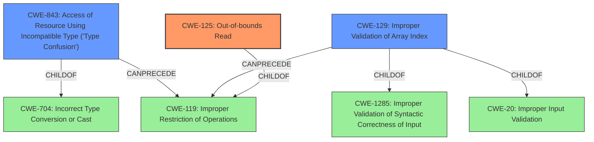

# Analysis Report for CVE-2020-28627

# Vulnerability Analysis Report: CVE-2020-28627

## Description


## Analysis (with Relationship Data)

# Summary
| CWE ID | CWE Name | Confidence | CWE Abstraction Level | CWE Vulnerability Mapping Label | CWE-Vulnerability Mapping Notes |
|---|---|---|---|---|---|
| CWE-125 | Out-of-bounds Read | 1.0 | Base | Allowed | Primary CWE |
| CWE-843 | Access of Resource Using Incompatible Type ('Type Confusion') | 0.8 | Base | Allowed | Secondary Candidate |
| CWE-129 | Improper Validation of Array Index | 0.7 | Variant | Allowed | Secondary Candidate |

## Evidence and Confidence

*   **Confidence Score:** 0.9
*   **Evidence Strength:** HIGH

## Relationship Analysis
The primary weakness is an **out-of-bounds read** (CWE-125), which is a base weakness and a child of CWE-119. The secondary weakness is a type confusion (CWE-843), which is also a base weakness and a child of CWE-704. There is also a weakness due to an improper validation of an array index (CWE-129), which is a variant and a child of both CWE-1285 and CWE-20. The relationships show that the improper validation can lead to an **out-of-bounds read**. Type confusion can lead to out-of-bounds memory access.



## Vulnerability Chain
The vulnerability chain starts with the lack of bounds checking on array indices when parsing Nef polygon data. This leads to an **out-of-bounds read** (CWE-125) and type confusion (CWE-843). The type confusion is due to the ability to assign arbitrary memory addresses instead of the correct object type to object members. The chain ends with arbitrary code execution.

## Summary of Analysis
The initial assessment identified the primary weakness as CWE-125 **out-of-bounds read**, supported by the key phrase "**out-of-bounds read**" in the vulnerability description and "**Out-of-bounds read** vulnerabilities in various functions responsible for parsing Nef polygon data." in the CVE reference. The vulnerability description also mentions "type confusion", which aligns with CWE-843.
The CVE Reference Links Content Summary states: "The vulnerability stems from a **lack of bounds checking on array indices** when parsing Nef polygon data. The code reads indices from the input file and uses them directly to access vectors of objects, without verifying if the index is within the valid bounds of the vector." This quote directly supports the selection of CWE-129, Improper Validation of Array Index. The fact that the code reads indices from the input file without validating them is the weakness.

The graph relationships show that CWE-125 is a child of CWE-119, which means that CWE-119 is a more general case of the weakness. Similarly, CWE-843 is a child of CWE-704. CWE-129 is a child of CWE-20 and CWE-1285.

The selected CWEs are at the optimal level of specificity because they directly describe the weaknesses present in the vulnerability. CWE-125 accurately represents the **out-of-bounds read** vulnerability. CWE-843 accurately describes the type confusion vulnerability. CWE-129 describes the lack of bounds checking on array indices.

Relevant CWE Information:

# Enhanced Context (25 CWEs)
The following CWEs were identified as potentially relevant to this vulnerability:

## CWE-197: Numeric Truncation Error
**Abstraction Level**: Base
**Similarity Score**: 0.80
**Source**: dense

**Description**:
Truncation errors occur when a primitive is cast to a primitive of a smaller size and data is lost in the conversion.

**Mapping Guidance**:
- Usage: Allowed
- Rationale: This CWE entry is at the Base level of abstraction, which is a preferred level of abstraction for mapping to the root causes of vulnerabilities.

## CWE-191: Integer Underflow (Wrap or Wraparound)
**Abstraction Level**: Base
**Similarity Score**: 0.79
**Source**: dense

**Description**:
The product subtracts one value from another, such that the result is less than the minimum allowable integer value, which produces a value that is not equal to the correct result.

**Mapping Guidance**:
- Usage: Allowed
- Rationale: This CWE entry is at the Base level of abstraction, which is a preferred level of abstraction for mapping to the root causes of vulnerabilities.

## CWE-681: Incorrect Conversion between Numeric Types
**Abstraction Level**: Base
**Similarity Score**: 0.79
**Source**: dense

**Description**:
When converting from one data type to another, such as long to integer, data can be omitted or translated in a way that produces unexpected values. If the resulting values are used in a sensitive context, then dangerous behaviors may occur.

**Mapping Guidance**:
- Usage: Allowed
- Rationale: This CWE entry is at the Base level of abstraction, which is a preferred level of abstraction for mapping to the root causes of vulnerabilities.

## CWE-129: Improper Validation of Array Index
**Abstraction Level**: Variant
**Similarity Score**: 0.78
**Source**: dense

**Description**:
The product uses untrusted input when calculating or using an array index, but the product does not validate or incorrectly validates the index to ensure the index references a valid position within the array.

**Mapping Guidance**:
- Usage: Allowed
- Rationale: This CWE entry is at the Variant level of abstraction, which is a preferred level of abstraction for mapping to the root causes of vulnerabilities.

## CWE-131: Incorrect Calculation of Buffer Size
**Abstraction Level**: Base
**Similarity Score**: 0.78
**Source**: dense

**Description**:
The product does not correctly calculate the size to be used when allocating a buffer, which could lead to a buffer overflow.

**Mapping Guidance**:
- Usage: Allowed
- Rationale: This CWE entry is at the Base level of abstraction, which is a preferred level of abstraction for mapping to the root causes of vulnerabilities.

## CWE-190: Integer Overflow or Wraparound
**Abstraction Level**: Base
**Similarity Score**: 0.77
**Source**: dense

**Description**:
The product performs a calculation that can
         produce an integer overflow or wraparound when the logic
         assumes that the resulting value will always be larger than
         the original value. This occurs when an integer value is
         incremented to a value that is too large to store in the
         associated representation. When this occurs, the value may
         become a very small or negative number.

**Mapping Guidance**:
- Usage: Allowed
- Rationale: This CWE entry is at the Base level of abstraction, which is a preferred level of abstraction for mapping to the root causes of vulnerabilities.

## CWE-125: Out-of-bounds Read
**Abstraction Level**: Base
**Similarity Score**: 0.76
**Source**: dense

**Description**:
The product reads data past the end, or before the beginning, of the intended buffer.

**Mapping Guidance**:
- Usage: Allowed
- Rationale: This CWE entry is at the Base level of abstraction, which is a preferred level of abstraction for mapping to the root causes of vulnerabilities.

## CWE-193: Off-by-one Error
**Abstraction Level**: Base
**Similarity Score**: 0.76
**Source**: dense

**Description**:
A product calculates or uses an incorrect maximum or minimum value that is 1 more, or 1 less, than the correct value.

**Mapping Guidance**:
- Usage: Allowed
- Rationale: This CWE entry is at the


## CWE Relationship Analysis

Current CWEs represent these abstraction levels: .


### Vulnerability Chain Analysis

**Chain starting from CWE-843:**
- 843 (Access of Resource Using Incompatible Type ('Type Confusion')) - ROOT


**Chain starting from CWE-193:**
- 193 (Off-by-one Error) - ROOT


### CWE Relationship Diagram

```mermaid
graph TD
    classDef primary fill:#f96,stroke:#333,stroke-width:2px
    classDef secondary fill:#69f,stroke:#333
    classDef tertiary fill:#9e9,stroke:#333
```


*Report generated on 2025-04-02 01:15:35*
