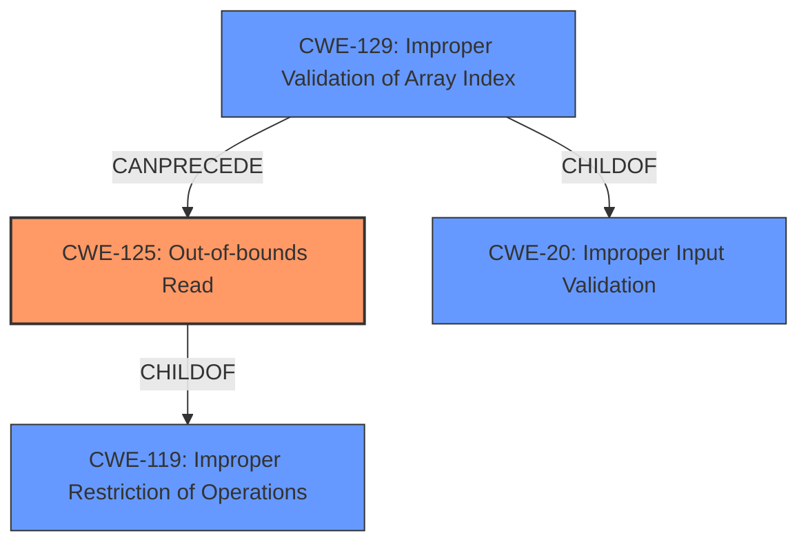

# Analysis for CVE-2020-28629

# Summary
| CWE ID | CWE Name | Confidence | CWE Abstraction Level | CWE Vulnerability Mapping Label | CWE-Vulnerability Mapping Notes |
|---|---|---|---|---|---|
| CWE-125 | Out-of-bounds Read | 1.0 | Base | Allowed | Primary CWE |
| CWE-129 | Improper Validation of Array Index | 0.7 | Variant | Allowed | Secondary CWE |

## Evidence and Confidence

*   **Confidence Score:** 0.9
*   **Evidence Strength:** HIGH

## Relationship Analysis
The primary CWE is CWE-125, which is a Base level CWE, and accurately captures the **out-of-bounds read** vulnerability. CWE-125 is a child of CWE-119 (Improper Restriction of Operations within the Bounds of a Memory Buffer). CWE-129 is a Variant of CWE-20 (Improper Input Validation), and can precede CWE-125, as a missing array index validation can lead to an out-of-bounds read.

## Vulnerability Chain
The vulnerability chain starts with the lack of proper input validation (CWE-20) of the array index, leading to an **improper validation of the array index** (CWE-129), and finally resulting in an **out-of-bounds read** (CWE-125) which leads to code execution.

## Summary of Analysis
The primary weakness is the **out-of-bounds read**, where the software reads data past the end or before the beginning of the intended buffer. This is directly stated in the vulnerability description: "A specially crafted malformed file can lead to an **out-of-bounds read** and type confusion, which could lead to code execution." The CVE Reference Links Content Summary confirms this: "The vulnerability stems from a lack of proper bounds checking when reading indices from a file and using them to access vectors of various object types. This allows for **out-of-bounds reads** and type confusion."

CWE-125 (Out-of-bounds Read) is a Base level CWE and its description perfectly matches the vulnerability description. The CVE Reference Links Content Summary also mentions **Improper Validation of Array Index (CWE-129)** as a weakness. CWE-129 is a Variant level CWE that describes the scenario where the product does not validate or incorrectly validates the array index, leading to accessing invalid memory locations. Therefore, CWE-129 is considered as a secondary CWE, contributing to the root cause of the vulnerability.

CWE-190, CWE-1284, CWE-787, CWE-193, CWE-476, CWE-197, CWE-122 and CWE-20 were considered but not used.
- CWE-190 (Integer Overflow or Wraparound): While integer overflows can lead to buffer overflows, there is no direct evidence in the description to suggest that an integer overflow is occurring.
- CWE-1284 (Improper Validation of Specified Quantity in Input): Similar to integer overflows, there is no direct evidence to suggest a quantity is improperly validated. The issue is primarily with the array index.
- CWE-787 (Out-of-bounds Write): The vulnerability description explicitly mentions an **out-of-bounds read**, not a write.
- CWE-193 (Off-by-one Error): While an off-by-one error could potentially lead to an out-of-bounds read, the description does not specifically mention this.
- CWE-476 (NULL Pointer Dereference): The description does not mention any null pointer dereferences.
- CWE-197 (Numeric Truncation Error): No evidence to suggest a numeric truncation error.
- CWE-122 (Heap-based Buffer Overflow): While code execution is the impact, the direct cause is an **out-of-bounds read**, not a heap-based buffer overflow.
- CWE-20 (Improper Input Validation): This is a class-level CWE and is too general. CWE-129 is a more specific child of CWE-20 that accurately describes the **improper validation of array index**.

The selected CWEs are at the optimal level of specificity because they directly address the **out-of-bounds read** and the contributing factor of **improper array index validation**.