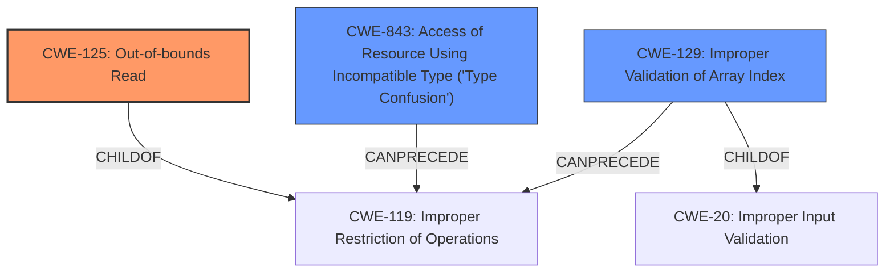

# Analysis for CVE-2020-28630

# Summary
| CWE ID | CWE Name | Confidence | CWE Abstraction Level | CWE Vulnerability Mapping Label | CWE-Vulnerability Mapping Notes |
|---|---|---|---|---|---|
| CWE-125 | Out-of-bounds Read | 1.0 | Base | Allowed | Primary CWE |
| CWE-843 | Access of Resource Using Incompatible Type ('Type Confusion') | 0.9 | Base | Allowed | Secondary CWE |
| CWE-129 | Improper Validation of Array Index | 0.8 | Variant | Allowed | Secondary CWE |

## Evidence and Confidence

*   **Confidence Score:** 0.9
*   **Evidence Strength:** HIGH

## Relationship Analysis
The primary CWE, CWE-125 (Out-of-bounds Read), is a base-level CWE. It's part of the broader CWE-119 (Improper Restriction of Operations Within the Bounds of a Memory Buffer). The secondary CWE, CWE-843 (Access of Resource Using Incompatible Type ('Type Confusion')), is also a base-level CWE and can precede CWE-119. CWE-129 (Improper Validation of Array Index) is a variant of CWE-20 (Improper Input Validation) and can also precede CWE-119. The relationships indicate a chain where improper input leads to type confusion and out-of-bounds access.

## Vulnerability Chain
The vulnerability chain starts with a malformed file, leading to **improper validation of array index (CWE-129)**. This then results in **type confusion (CWE-843)** and, ultimately, an **out-of-bounds read (CWE-125)**, potentially leading to code execution.

## Summary of Analysis
The initial analysis identified **out-of-bounds read** and **type confusion** as key weaknesses. The retriever results and CVE details confirm this, highlighting CWE-125 and CWE-843 as strong candidates. The "CVE Reference Links Content Summary" explicitly mentions "Out-of-bounds read" and "Type confusion" as weaknesses, supporting their inclusion. The summary also states "Improper validation of array index (CWE-129)".

The vulnerability description states: "Multiple code execution vulnerabilities exists in the Nef polygon-parsing functionality of CGAL libcgal CGAL-5.1.1. A specially crafted malformed file can lead to an **out-of-bounds read** and **type confusion**, which could lead to code execution."

The graph relationships further support the selection of CWE-125 as the primary issue, with CWE-843 and CWE-129 contributing to the vulnerability's root cause. The selected CWEs are at the base and variant level, offering the optimal level of specificity for this vulnerability.

Relevant CWE Information:

# Enhanced Context (25 CWEs)

## CWE-197: Numeric Truncation Error
**Abstraction Level**: Base
**Similarity Score**: 0.80
**Source**: dense
This CWE was considered because numeric truncation errors could lead to incorrect array indices, however, the description specifically mentions improper validation and out-of-bounds read, making CWE-125 and CWE-129 more appropriate.

## CWE-191: Integer Underflow (Wrap or Wraparound)
**Abstraction Level**: Base
**Similarity Score**: 0.80
**Source**: dense
This CWE was considered because integer underflow could lead to out-of-bounds access, but the provided information points more directly to improper validation and an out-of-bounds read rather than an arithmetic error.

## CWE-681: Incorrect Conversion between Numeric Types
**Abstraction Level**: Base
**Similarity Score**: 0.79
**Source**: dense
This CWE was considered because type confusion might involve incorrect numeric type conversions, but CWE-843 is a better fit for describing the broader issue of accessing a resource using an incompatible type.

## CWE-129: Improper Validation of Array Index
**Abstraction Level**: Variant
**Similarity Score**: 0.78
**Source**: dense
This CWE is strongly supported by the "CVE Reference Links Content Summary" which explicitly mentions "Improper validation of array index (CWE-129)". The vulnerability occurs because the input is used as an array index without proper validation.

## CWE-131: Incorrect Calculation of Buffer Size
**Abstraction Level**: Base
**Similarity Score**: 0.78
**Source**: dense
This CWE was considered but is less relevant as the issue is not with the calculation of the buffer size but with accessing the buffer using an out-of-bounds index.

## CWE-190: Integer Overflow or Wraparound
**Abstraction Level**: Base
**Similarity Score**: 0.77
**Source**: dense
This CWE was considered as a possible cause of the incorrect index, but the description indicates the index is read directly from the input without validation rather than being the result of a calculation that overflows.

## CWE-125: Out-of-bounds Read
**Abstraction Level**: Base
**Similarity Score**: 0.77
**Source**: dense
This CWE is a primary candidate because the vulnerability description explicitly mentions an "out-of-bounds read". The "CVE Reference Links Content Summary" confirms this.

## CWE-193: Off-by-one Error
**Abstraction Level**: Base
**Similarity Score**: 0.77
**Source**: dense
This CWE was considered as a possible cause of the out-of-bounds read, but the description doesn't specifically point to an off-by-one error, making CWE-125 and CWE-129 more accurate.

## CWE-805: Buffer Access with Incorrect Length Value
**Abstraction Level**: Base
**Similarity Score**: 0.76
**Source**: dense
This CWE was considered, but the core issue is not an incorrect length value, but the out-of-bounds access due to improper validation.

## CWE-680: Integer Overflow to Buffer Overflow
**Abstraction Level**: Compound
**Similarity Score**: 0.76
**Source**: dense
This CWE is a compound weakness and discouraged. The individual components, CWE-190 and CWE-125, are more appropriate.

## CWE-823: Use of Out-of-range Pointer Offset
**Abstraction Level**: base
**Similarity Score**: 4.33
**Source**: graph
This CWE was considered, but the description focuses on pointer offsets, which is not the primary issue. The vulnerability is more related to an array index.

## CWE-787: Out-of-bounds Write
**Abstraction Level**: base
**Similarity Score**: 4.33
**Source**: graph
This CWE was considered, but the vulnerability description specifies an "out-of-bounds read," making CWE-125 more relevant.

## CWE-843: Access of Resource Using Incompatible Type ('Type Confusion')
**Abstraction Level**: Base
**Similarity Score**: 0.70
**Source**: alternate_terms
This CWE is selected because the vulnerability description explicitly mentions "type confusion". The "CVE Reference Links Content Summary" confirms this.