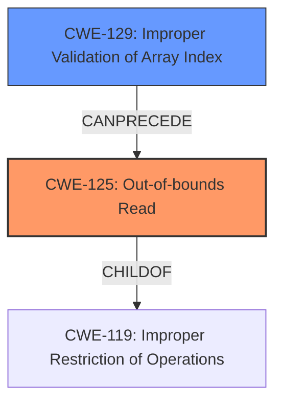

# Enhanced Analysis for CVE-2020-28631

# Summary
| CWE ID  | CWE Name | Confidence | CWE Abstraction Level | CWE Vulnerability Mapping Label | CWE-Vulnerability Mapping Notes |
|-----------------|-------------------------------------------------------|-------------------|--------------------------|------------------------------------|---------------------------------------------------------------------|
| CWE-125 | Out-of-bounds Read | 1.0 | Base | Allowed | Primary CWE |
| CWE-129 | Improper Validation of Array Index | 0.9 | Variant | Allowed | Secondary Candidate |

## Evidence and Confidence

*   **Confidence Score:** 0.95
*   **Evidence Strength:** HIGH

## Relationship Analysis
The primary relationship is that **CWE-125 (Out-of-bounds Read)** is a child of **CWE-119 (Improper Restriction of Operations Within the Bounds of a Memory Buffer)**. **CWE-129 (Improper Validation of Array Index)** can precede **CWE-125** when the array index is not validated, leading to an out-of-bounds read.



## Vulnerability Chain
The vulnerability chain starts with **improper input validation** (lack of validation of array indices from the input file). This leads to an **out-of-bounds read**, potentially resulting in **type confusion** and ultimately **code execution**.

## Summary of Analysis
The initial analysis correctly identifies the **out-of-bounds read** as a primary issue. The provided information details a vulnerability where the CGAL library **fails to validate** array indices read from a `.nef3` file. This **lack of validation** allows an attacker to supply arbitrary indices, causing the program to read from unintended memory locations.

The evidence strongly supports **CWE-125 (Out-of-bounds Read)** as the primary CWE. The vulnerability description explicitly mentions an "**out-of-bounds read**" in the `Nef_S2/SNC_io_parser.h` file. The "CVE Reference Links Content Summary" further clarifies that this is due to a **lack of index validation** when accessing vectors, which directly leads to the out-of-bounds read. The confidence in this mapping is high (1.0) because the vulnerability description explicitly uses the term "out-of-bounds read" and the root cause analysis confirms this.

**CWE-129 (Improper Validation of Array Index)** is considered as a secondary CWE because the **lack of validation** of the array index is the direct cause for the **out-of-bounds read**. The "CVE Reference Links Content Summary" states "There are no checks to validate if these indexes are within the bounds of the corresponding vectors before dereferencing, which can lead to out-of-bounds reads." The confidence is high at 0.9.

Several other CWEs were considered but deemed less appropriate:

*   **CWE-190 (Integer Overflow or Wraparound)**, **CWE-193 (Off-by-one Error)**, **CWE-197 (Numeric Truncation Error)**, and **CWE-128 (Wrap-around Error)**: These relate to integer manipulation errors, but the core issue isn't an error in calculation but the **lack of validation** of the index value itself before it is used to access memory. Therefore, these are less relevant.
*   **CWE-1284 (Improper Validation of Specified Quantity in Input)**: While the index can be seen as a quantity, the focus here is specifically on it being used as an array index. Therefore, **CWE-129** is a better fit.
*   **CWE-476 (NULL Pointer Dereference)**: While type confusion can occur, the initial and primary issue is the **out-of-bounds read**, not dereferencing a null pointer.
*   **CWE-787 (Out-of-bounds Write)** and **CWE-122 (Heap-based Buffer Overflow)**: The primary vulnerability is an **out-of-bounds read**, not a write or overflow. The description focuses on reading from arbitrary memory locations, not writing.

The selected CWEs are at the optimal level of specificity because **CWE-125** directly describes the **out-of-bounds read** vulnerability, and **CWE-129** indicates that it's caused by the **lack of proper validation** of the array index.

Relevant CWE Information:

# Enhanced Context (25 CWEs)
The following CWEs were identified as potentially relevant to this vulnerability:

## CWE-197: Numeric Truncation Error
**Abstraction Level**: Base
**Similarity Score**: 0.80
**Source**: dense

**Description**:
Truncation errors occur when a primitive is cast to a primitive of a smaller size and data is lost in the conversion.

**Mapping Guidance**:
- Usage: Allowed
- Rationale: This CWE entry is at the Base level of abstraction, which is a preferred level of abstraction for mapping to the root causes of vulnerabilities.


## CWE-191: Integer Underflow (Wrap or Wraparound)
**Abstraction Level**: Base
**Similarity Score**: 0.80
**Source**: dense

**Description**:
The product subtracts one value from another, such that the result is less than the minimum allowable integer value, which produces a value that is not equal to the correct result.

**Mapping Guidance**:
- Usage: Allowed
- Rationale: This CWE entry is at the Base level of abstraction, which is a preferred level of abstraction for mapping to the root causes of vulnerabilities.


## CWE-681: Incorrect Conversion between Numeric Types
**Abstraction Level**: Base
**Similarity Score**: 0.79
**Source**: dense

**Description**:
When converting from one data type to another, such as long to integer, data can be omitted or translated in a way that produces unexpected values. If the resulting values are used in a sensitive context, then dangerous behaviors may occur.

**Mapping Guidance**:
- Usage: Allowed
- Rationale: This CWE entry is at the Base level of abstraction, which is a preferred level of abstraction for mapping to the root causes of vulnerabilities.


## CWE-129: Improper Validation of Array Index
**Abstraction Level**: Variant
**Similarity Score**: 0.79
**Source**: dense

**Description**:
The product uses untrusted input when calculating or using an array index, but the product does not validate or incorrectly validates the index to ensure the index references a valid position within the array.

**Mapping Guidance**:
- Usage: Allowed
- Rationale: This CWE entry is at the Variant level of abstraction, which is a preferred level of abstraction for mapping to the root causes of vulnerabilities.


## CWE-131: Incorrect Calculation of Buffer Size
**Abstraction Level**: Base
**Similarity Score**: 0.78
**Source**: dense

**Description**:
The product does not correctly calculate the size to be used when allocating a buffer, which could lead to a buffer overflow.

**Mapping Guidance**:
- Usage: Allowed
- Rationale: This CWE entry is at the Base level of abstraction, which is a preferred level of abstraction for mapping to the root causes of vulnerabilities.


## CWE-125: Out-of-bounds Read
**Abstraction Level**: Base
**Similarity Score**: 0.77
**Source**: dense

**Description**:
The product reads data past the end, or before the beginning, of the intended buffer.

**Mapping Guidance**:
- Usage: Allowed
- Rationale: This CWE entry is at the Base level of abstraction, which is a preferred level of abstraction for mapping to the root causes of vulnerabilities.


## CWE-190: Integer Overflow or Wraparound
**Abstraction Level**: Base
**Similarity Score**: 0.77
**Source**: dense

**Description**:
The product performs a calculation that can
         produce an integer overflow or wraparound when the logic
         assumes that the resulting value will always be larger than
         the original value. This occurs when an integer value is
         incremented to a value that is too large to store in the
         associated representation. When this occurs, the value may
         become a very small or negative number.

**Mapping Guidance**:
- Usage: Allowed
- Rationale: This CWE entry is at the Base level of abstraction, which is a preferred level of abstraction for mapping to the root causes of vulnerabilities.


## CWE-193: Off-by-one Error
**Abstraction Level**: Base
**Similarity Score**: 0.77
**Source**: dense

**Description**:
A product calculates or uses an incorrect maximum or


## CWE Relationship Analysis

Current CWEs represent these abstraction levels: .


### Vulnerability Chain Analysis

**Chain starting from CWE-1284:**
- 1284 (Improper Validation of Specified Quantity in Input) - ROOT


**Chain starting from CWE-476:**
- 476 (NULL Pointer Dereference) - ROOT


### CWE Relationship Diagram

```mermaid
graph TD
    classDef primary fill:#f96,stroke:#333,stroke-width:2px
    classDef secondary fill:#69f,stroke:#333
    classDef tertiary fill:#9e9,stroke:#333
```