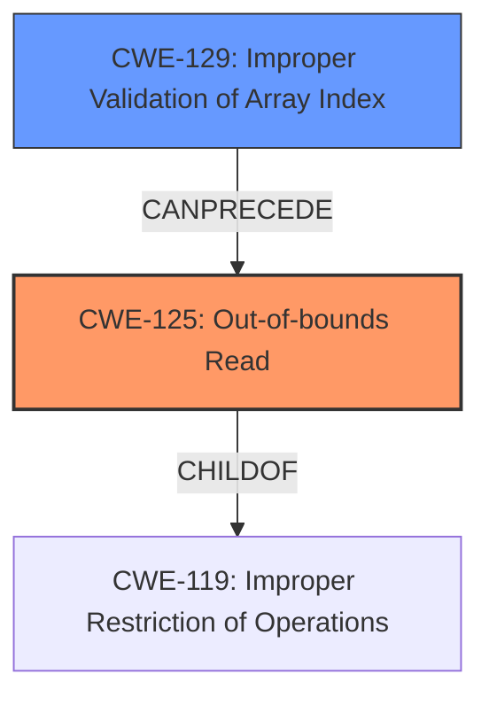

# Analysis for CVE-2020-28631

# Summary
| CWE ID  | CWE Name | Confidence | CWE Abstraction Level | CWE Vulnerability Mapping Label | CWE-Vulnerability Mapping Notes |
|-----------------|-------------------------------------------------------|-------------------|--------------------------|------------------------------------|---------------------------------------------------------------------|
| CWE-125 | Out-of-bounds Read | 1.0 | Base | Allowed | Primary CWE |
| CWE-129 | Improper Validation of Array Index | 0.9 | Variant | Allowed | Secondary Candidate |

## Evidence and Confidence

*   **Confidence Score:** 0.95
*   **Evidence Strength:** HIGH

## Relationship Analysis
The primary relationship is that **CWE-125 (Out-of-bounds Read)** is a child of **CWE-119 (Improper Restriction of Operations Within the Bounds of a Memory Buffer)**. **CWE-129 (Improper Validation of Array Index)** can precede **CWE-125** when the array index is not validated, leading to an out-of-bounds read.

## Vulnerability Chain
The vulnerability chain starts with **improper input validation** (lack of validation of array indices from the input file). This leads to an **out-of-bounds read**, potentially resulting in **type confusion** and ultimately **code execution**.

## Summary of Analysis
The initial analysis correctly identifies the **out-of-bounds read** as a primary issue. The provided information details a vulnerability where the CGAL library **fails to validate** array indices read from a `.nef3` file. This **lack of validation** allows an attacker to supply arbitrary indices, causing the program to read from unintended memory locations.

The evidence strongly supports **CWE-125 (Out-of-bounds Read)** as the primary CWE. The vulnerability description explicitly mentions an "**out-of-bounds read**" in the `Nef_S2/SNC_io_parser.h` file. The "CVE Reference Links Content Summary" further clarifies that this is due to a **lack of index validation** when accessing vectors, which directly leads to the out-of-bounds read. The confidence in this mapping is high (1.0) because the vulnerability description explicitly uses the term "out-of-bounds read" and the root cause analysis confirms this.

**CWE-129 (Improper Validation of Array Index)** is considered as a secondary CWE because the **lack of validation** of the array index is the direct cause for the **out-of-bounds read**. The "CVE Reference Links Content Summary" states "There are no checks to validate if these indexes are within the bounds of the corresponding vectors before dereferencing, which can lead to out-of-bounds reads." The confidence is high at 0.9.

Several other CWEs were considered but deemed less appropriate:

*   **CWE-190 (Integer Overflow or Wraparound)**, **CWE-193 (Off-by-one Error)**, **CWE-197 (Numeric Truncation Error)**, and **CWE-128 (Wrap-around Error)**: These relate to integer manipulation errors, but the core issue isn't an error in calculation but the **lack of validation** of the index value itself before it is used to access memory. Therefore, these are less relevant.
*   **CWE-1284 (Improper Validation of Specified Quantity in Input)**: While the index can be seen as a quantity, the focus here is specifically on it being used as an array index. Therefore, **CWE-129** is a better fit.
*   **CWE-476 (NULL Pointer Dereference)**: While type confusion can occur, the initial and primary issue is the **out-of-bounds read**, not dereferencing a null pointer.
*   **CWE-787 (Out-of-bounds Write)** and **CWE-122 (Heap-based Buffer Overflow)**: The primary vulnerability is an **out-of-bounds read**, not a write or overflow. The description focuses on reading from arbitrary memory locations, not writing.

The selected CWEs are at the optimal level of specificity because **CWE-125** directly describes the **out-of-bounds read** vulnerability, and **CWE-129** indicates that it's caused by the **lack of proper validation** of the array index.

Relevant CWE Information:

# Enhanced Context (25 CWEs)
The following CWEs were identified as potentially relevant to this vulnerability:

## CWE-197: Numeric Truncation Error
**Abstraction Level**: Base
**Similarity Score**: 0.80
**Source**: dense

**Description**:
Truncation errors occur when a primitive is cast to a primitive of a smaller size and data is lost in the conversion.

**Mapping Guidance**:
- Usage: Allowed
- Rationale: This CWE entry is at the Base level of abstraction, which is a preferred level of abstraction for mapping to the root causes of vulnerabilities.

## CWE-191: Integer Underflow (Wrap or Wraparound)
**Abstraction Level**: Base
**Similarity Score**: 0.80
**Source**: dense

**Description**:
The product subtracts one value from another, such that the result is less than the minimum allowable integer value, which produces a value that is not equal to the correct result.

**Mapping Guidance**:
- Usage: Allowed
- Rationale: This CWE entry is at the Base level of abstraction, which is a preferred level of abstraction for mapping to the root causes of vulnerabilities.

## CWE-681: Incorrect Conversion between Numeric Types
**Abstraction Level**: Base
**Similarity Score**: 0.79
**Source**: dense

**Description**:
When converting from one data type to another, such as long to integer, data can be omitted or translated in a way that produces unexpected values. If the resulting values are used in a sensitive context, then dangerous behaviors may occur.

**Mapping Guidance**:
- Usage: Allowed
- Rationale: This CWE entry is at the Base level of abstraction, which is a preferred level of abstraction for mapping to the root causes of vulnerabilities.

## CWE-129: Improper Validation of Array Index
**Abstraction Level**: Variant
**Similarity Score**: 0.79
**Source**: dense

**Description**:
The product uses untrusted input when calculating or using an array index, but the product does not validate or incorrectly validates the index to ensure the index references a valid position within the array.

**Mapping Guidance**:
- Usage: Allowed
- Rationale: This CWE entry is at the Variant level of abstraction, which is a preferred level of abstraction for mapping to the root causes of vulnerabilities.

## CWE-131: Incorrect Calculation of Buffer Size
**Abstraction Level**: Base
**Similarity Score**: 0.78
**Source**: dense

**Description**:
The product does not correctly calculate the size to be used when allocating a buffer, which could lead to a buffer overflow.

**Mapping Guidance**:
- Usage: Allowed
- Rationale: This CWE entry is at the Base level of abstraction, which is a preferred level of abstraction for mapping to the root causes of vulnerabilities.

## CWE-125: Out-of-bounds Read
**Abstraction Level**: Base
**Similarity Score**: 0.77
**Source**: dense

**Description**:
The product reads data past the end, or before the beginning, of the intended buffer.

**Mapping Guidance**:
- Usage: Allowed
- Rationale: This CWE entry is at the Base level of abstraction, which is a preferred level of abstraction for mapping to the root causes of vulnerabilities.

## CWE-190: Integer Overflow or Wraparound
**Abstraction Level**: Base
**Similarity Score**: 0.77
**Source**: dense

**Description**:
The product performs a calculation that can
         produce an integer overflow or wraparound when the logic
         assumes that the resulting value will always be larger than
         the original value. This occurs when an integer value is
         incremented to a value that is too large to store in the
         associated representation. When this occurs, the value may
         become a very small or negative number.

**Mapping Guidance**:
- Usage: Allowed
- Rationale: This CWE entry is at the Base level of abstraction, which is a preferred level of abstraction for mapping to the root causes of vulnerabilities.

## CWE-193: Off-by-one Error
**Abstraction Level**: Base
**Similarity Score**: 0.77
**Source**: dense

**Description**:
A product calculates or uses an incorrect maximum or

# Enhanced Query for CVE-2020-28631

## Vulnerability Description
Multiple code execution vulnerabilities exists in the Nef polygon-parsing functionality of CGAL libcgal CGAL-5.1.1. A specially crafted malformed file can lead to an **out-of-bounds read** and type confusion, which could lead to code execution. An attacker can provide malicious input to trigger any of these vulnerabilities. An oob read vulnerability exists in Nef_S2/SNC_io_parser.h SNC_io_parserread_sedge() seh->source().

### Vulnerability Description Key Phrases
- **weakness:** **out-of-bounds read**
- **impact:** code execution
- **product:** CGAL libcgal
- **version:** CGAL-5.1.1
- **component:** Nef polygon-parsing functionality

## CVE Reference Links Content Summary
Based on the provided content, here's a breakdown of the vulnerability:

**Root Cause:**

The root cause is a lack of bounds checking in the CGAL library's Nef polygon parsing code. Specifically, when parsing a `.nef3` file, the code reads integer indexes from the file and uses them to access vectors storing various object handles (e.g., vertices, edges, faces). There are no checks to validate if these indexes are within the bounds of the corresponding vectors before dereferencing, which can lead to out-of-bounds reads.

**Weaknesses/Vulnerabilities:**

- **Out-of-Bounds Read:** The primary vulnerability is an out-of-bounds read due to the lack of index validation when accessing vectors. Specifically, the code reads an index value from the input file, and without checking if this value is within the allocated size of the vector, it directly accesses the vector via this index. This is observed in various functions like `read_vertex`, `read_edge`, `read_facet`, etc.
- **Type Confusion:** By writing an out of bounds memory address, it's possible to cause type confusion, as the code could interpret arbitrary memory as an object of an unexpected type which, when dereferenced later on, can lead to arbitrary code execution.
- **Lack of Input Validation:** The parsing code directly uses the provided indexes from the input file without any validation, making it vulnerable to malicious input.

**Impact of Exploitation:**

- **Code Execution:** The primary impact is the potential for arbitrary code execution. By controlling the indexes read from the file, an attacker can force the program to read from arbitrary memory locations. This can lead to unexpected program behavior, including crashes or the ability to overwrite critical parts of memory which could eventually lead to code execution.
- **Denial of Service:** The out-of-bounds read vulnerabilities can lead to crashes, resulting in a denial-of-service condition.

**Attack Vectors:**

- **Malicious Input File:** The attack vector is a specially crafted `.nef3` file or similar format that contains manipulated indexes designed to cause out-of-bounds accesses.

**Required Attacker Capabilities/Position:**

- **Ability to Provide Input:** An attacker needs to be able to supply the crafted input file to an application or service that uses the vulnerable CGAL library to parse Nef polygons. This could involve sending the file over a network, uploading it to a web service, or having a local application open the malicious file.

**CVE IDs:**

The report lists the following CVEs as being related to this vulnerability:

- CVE-2020-28601, CVE-2020-28602, CVE-2020-28603, CVE-2020-28604, CVE-2020-28605, CVE-2020-28606, CVE-2020-28607, CVE-2020-28608, CVE-2020-28609, CVE-2020-28610, CVE-2020-28611, CVE-2020-28612, CVE-2020-28613, CVE-2020-28614, CVE-2020-28615, CVE-2020-28616, CVE-2020-28617, CVE-2020-28618, CVE-2020-28619, CVE-2020-28620, CVE-2020-28621, CVE-2020-28622, CVE-2020-28623, CVE-2020-28624, CVE-2020-28625, CVE-2020-28626, CVE-2020-28627, CVE-2020-28628, CVE-2020-28629, CVE-2020-28630, CVE-2020-28631, CVE-2020-28632, CVE-2020-28633, CVE-2020-28634, CVE-2020-28635, CVE-2020-28636, CVE-2020-35628, CVE-2020-35629, CVE-2020-35630, CVE-2020-35631, CVE-2020-35632, CVE-2020-35633, CVE-2020-35634, CVE-2020-35635, CVE-2020-35636.

**CVE-2020-28631 Specifics:**

Specifically, the content identifies CVE-2020-28631 as an out-of-bounds read vulnerability in the `Nef_S2/SNC_io_parser.h` file, within the `SNC_io_parser::read_sedge()` function, specifically when handling the `seh->source()` member. This is where an attacker-controlled index is used to dereference the `Edge_of` vector, causing a potential out of bounds read and type confusion.

**Additional Notes:**

- The Talos report provides a detailed explanation of the vulnerable code patterns and the structure of the `.nef3` input file.
- The Gentoo and Debian advisories confirm the widespread nature of the vulnerability and its potential for code execution.
- The vulnerability is present in versions prior to CGAL 5.4.1.
- The provided information offers more detail than a typical CVE description.

In summary, CVE-2020-28631 is one of many related vulnerabilities caused by improper index validation in the CGAL library's Nef polygon parsing code which allows for out-of-bounds reads, type confusion and potentially arbitrary code execution via a specially crafted input file.

## Retriever Results

### Top Combined Results

| Rank | CWE ID | Name | Abstraction | Usage  | Retrievers | Individual Scores |
|------|--------|------|-------------|-------|------------|-------------------|
| 1 | 129 | Improper Validation of Array Index | Variant | Allowed | sparse | 0.830 |
| 2 | 125 | Out-of-bounds Read | Base | Allowed | sparse | 0.535 |
| 3 | 190 | Integer Overflow or Wraparound | Base | Allowed | sparse | 0.380 |
| 4 | 1284 | Improper Validation of Specified Quantity in Input | Base | Allowed | sparse | 0.361 |
| 5 | 193 | Off-by-one Error | Base | Allowed | sparse | 0.357 |
| 6 | 476 | NULL Pointer Dereference | Base | Allowed | dense | 0.564 |
| 7 | 128 | Wrap-around Error | Base | Allowed | graph | 0.002 |
| 8 | 787 | Out-of-bounds Write | Base | Allowed | sparse | 0.357 |
| 9 | 197 | Numeric Truncation Error | Base | Allowed | sparse | 0.355 |
| 10 | 122 | Heap-based Buffer Overflow | Variant | Allowed | sparse | 0.354 |

# Complete CWE Specifications

## CWE-129: Improper Validation of Array Index
**Abstraction:** Variant
**Status:** Draft

### Description
The product uses untrusted input when calculating or using an array index, but the product does not validate or incorrectly validates the index to ensure the index references a valid position within the array.

### Extended Description
Not provided

### Alternative Terms
out-of-bounds array index
index-out-of-range
array index underflow

### Relationships
ChildOf -> CWE-1285
ChildOf -> CWE-20
CanPrecede -> CWE-119
CanPrecede -> CWE-823
CanPrecede -> CWE-789

### Mapping Guidance
**Usage:** Allowed
**Rationale:** This CWE entry is at the Variant level of abstraction, which is a preferred level of abstraction for mapping to the root causes of vulnerabilities.
**Comments:** Carefully read both the name and description to ensure that this mapping is an appropriate fit. Do not try to 'force' a mapping to a lower-level Base/Variant simply to comply with this preferred level of abstraction.
**Reasons:**
- Acceptable-Use

### Additional Notes
**[Relationship]** This weakness can precede uncontrolled memory allocation (CWE-789) in languages that automatically expand an array when an index is used that is larger than the size of the array, such as JavaScript.

**[Theoretical]** An improperly validated array index might lead directly to the always-incorrect behavior of "access of array using out-of-bounds index."

### Observed Examples
- **CVE-2005-0369:** large ID in packet used as array index
- **CVE-2001-1009:** negative array index as argument to POP LIST command
- **CVE-2003-0721:** Integer signedness error leads to negative array index

## CWE-125: Out-of-bounds Read
**Abstraction:** Base
**Status:** Draft

### Description
The product reads data past the end, or before the beginning, of the intended buffer.

### Extended Description
Not provided

### Alternative Terms
OOB read: Shorthand for "Out of bounds" read

### Relationships
ChildOf -> CWE-119
ChildOf -> CWE-119
ChildOf -> CWE-119
ChildOf -> CWE-119

### Mapping Guidance
**Usage:** Allowed
**Rationale:** This CWE entry is at the Base level of abstraction, which is a preferred level of abstraction for mapping to the root causes of vulnerabilities.
**Comments:** Carefully read both the name and description to ensure that this mapping is an appropriate fit. Do not try to 'force' a mapping to a lower-level Base/Variant simply to comply with this preferred level of abstraction.
**Reasons:**
- Acceptable-Use

### Observed Examples
- **CVE-2023-1018:** The reference implementation code for a Trusted Platform Module does not implement length checks on data, allowing for an attacker to read 2 bytes past the end of a buffer.
- **CVE-2020-11899:** Out-of-bounds read in IP stack used in embedded systems, as exploited in the wild per CISA KEV.
- **CVE-2014-0160:** Chain: "Heartbleed" bug receives an inconsistent length parameter (CWE-130) enabling an out-of-bounds read (CWE-126), returning memory that could include private cryptographic keys and other sensitive data.

## CWE-190: Integer Overflow or Wraparound
**Abstraction:** Base
**Status:** Stable

### Description
The product performs a calculation that can
         produce an integer overflow or wraparound when the logic
         assumes that the resulting value will always be larger than
         the original value. This occurs when an integer value is
         incremented to a value that is too large to store in the
         associated representation. When this occurs, the value may
         become a very small or negative number.

### Extended Description
Not provided

### Alternative Terms
Overflow: The terms "overflow" and "wraparound" are used interchangeably by some people, but they can have more precise distinctions by others. See Terminology Notes.
Wraparound: The terms "overflow" and "wraparound" are used interchangeably by some people, but they can have more precise distinctions by others. See Terminology Notes.
wrap, wrap-around, wrap around: Alternate spellings of "wraparound"

### Relationships
ChildOf -> CWE-682
ChildOf -> CWE-682
ChildOf -> CWE-20
CanPrecede -> CWE-119

### Mapping Guidance
**Usage:** Allowed
**Rationale:** This CWE entry is at the Base level of abstraction, which is a preferred level of abstraction for mapping to the root causes of vulnerabilities.
**Comments:** Be careful of terminology problems with "overflow," "underflow," and "wraparound" - see Terminology Notes. Carefully read both the name and description to ensure that this mapping is an appropriate fit. Do not try to 'force' a mapping to a lower-level Base/Variant simply to comply with this preferred level of abstraction.
**Reasons:**
- Acceptable-Use
**Suggested Alternatives:**
- CWE-191: Integer Underflow (Wrap or Wraparound). Consider CWE-191 when the result is less than the minimum value that can be represented (sometimes called "underflows").

### Additional Notes
**[Relationship]** Integer overflows can be primary to buffer overflows when they cause less memory to be allocated than expected.

**[Terminology]** 

"Integer overflow" is sometimes used to cover several types of errors, including signedness errors, or buffer overflows that involve manipulation of integer data types instead of characters. Part of the confusion results from the fact that 0xffffffff is -1 in a signed context. Other confusion also arises because of the role that integer overflows have in chains.

A "wraparound" is a well-defined, standard behavior that follows specific rules for how to handle situations when the intended numeric value is too large or too small to be represented, as specified in standards such as C11.

"Overflow" is sometimes conflated with "wraparound" but typically indicates a non-standard or undefined behavior.

The "overflow" term is sometimes used to indicate cases where either the maximum or the minimum is exceeded, but others might only use "overflow" to indicate exceeding the maximum while using "underflow" for exceeding the minimum.

Some people use "overflow" to mean any value outside the representable range - whether greater than the maximum, or less than the minimum - but CWE uses "underflow" for cases in which the intended result is less than the minimum.

See [REF-1440] for additional explanation of the ambiguity of terminology.

**[Other]** While there may be circumstances in which the logic intentionally relies on wrapping - such as with modular arithmetic in timers or counters - it can have security consequences if the wrap is unexpected. This is especially the case if the integer overflow can be triggered using user-supplied inputs.

### Observed Examples
- **CVE-2021-43537:** Chain: in a web browser, an unsigned 64-bit integer is forcibly cast to a 32-bit integer (CWE-681) and potentially leading to an integer overflow (CWE-190). If an integer overflow occurs, this can cause heap memory corruption (CWE-122)
- **CVE-2022-21668:** Chain: Python library does not limit the resources used to process images that specify a very large number of bands (CWE-1284), leading to excessive memory consumption (CWE-789) or an integer overflow (CWE-190).
- **CVE-2022-0545:** Chain: 3D renderer has an integer overflow (CWE-190) leading to write-what-where condition (CWE-123) using a crafted image.

## CWE-1284: Improper Validation of Specified Quantity in Input
**Abstraction:** Base
**Status:** Incomplete

### Description
The product receives input that is expected to specify a quantity (such as size or length), but it does not validate or incorrectly validates that the quantity has the required properties.

### Extended Description

Specified quantities include size, length, frequency, price, rate, number of operations, time, and others. Code may rely on specified quantities to allocate resources, perform calculations, control iteration, etc. When the quantity is not properly validated, then attackers can specify malicious quantities to cause excessive resource allocation, trigger unexpected failures, enable buffer overflows, etc.

### Alternative Terms
None

### Relationships
ChildOf -> CWE-20
ChildOf -> CWE-20
CanPrecede -> CWE-789

### Mapping Guidance
**Usage:** Allowed
**Rationale:** This CWE entry is at the Base level of abstraction, which is a preferred level of abstraction for mapping to the root causes of vulnerabilities.
**Comments:** Carefully read both the name and description to ensure that this mapping is an appropriate fit. Do not try to 'force' a mapping to a lower-level Base/Variant simply to comply with this preferred level of abstraction.
**Reasons:**
- Acceptable-Use

### Additional Notes
**[Maintenance]** This entry is still under development and will continue to see updates and content improvements.

### Observed Examples
- **CVE-2022-21668:** Chain: Python library does not limit the resources used to process images that specify a very large number of bands (CWE-1284), leading to excessive memory consumption (CWE-789) or an integer overflow (CWE-190).
- **CVE-2008-1440:** lack of validation of length field leads to infinite loop
- **CVE-2008-2374:** lack of validation of string length fields allows memory consumption or buffer over-read

## CWE-193: Off-by-one Error
**Abstraction:** Base
**Status:** Draft

### Description
A product calculates or uses an incorrect maximum or minimum value that is 1 more, or 1 less, than the correct value.

### Extended Description
Not provided

### Alternative Terms
off-by-five: An "off-by-five" error was reported for sudo in 2002 (CVE-2002-0184), but that is more like a "length calculation" error.

### Relationships
ChildOf -> CWE-682
ChildOf -> CWE-682
CanPrecede -> CWE-617
CanPrecede -> CWE-170
CanPrecede -> CWE-119

### Mapping Guidance
**Usage:** Allowed
**Rationale:** This CWE entry is at the Base level of abstraction, which is a preferred level of abstraction for mapping to the root causes of vulnerabilities.
**Comments:** Carefully read both the name and description to ensure that this mapping is an appropriate fit. Do not try to 'force' a mapping to a lower-level Base/Variant simply to comply with this preferred level of abstraction.
**Reasons:**
- Acceptable-Use

### Additional Notes
**[Relationship]** This is not always a buffer overflow. For example, an off-by-one error could be a factor in a partial comparison, a read from the wrong memory location, an incorrect conditional, etc.

### Observed Examples
- **CVE-2003-0252:** Off-by-one error allows remote attackers to cause a denial of service and possibly execute arbitrary code via requests that do not contain newlines.
- **CVE-2001-1391:** Off-by-one vulnerability in driver allows users to modify kernel memory.
- **CVE-2002-0083:** Off-by-one error allows local users or remote malicious servers to gain privileges.

## CWE-476: NULL Pointer Dereference
**Abstraction:** Base
**Status:** Stable

### Description
The product dereferences a pointer that it expects to be valid but is NULL.

### Extended Description
Not provided

### Alternative Terms
NPD: Common abbreviation for Null Pointer Dereference
null deref: Common abbreviation for Null Pointer Dereference
NPE: Common abbreviation for Null Pointer Exception
nil pointer dereference: used for access of nil in Go programs

### Relationships
ChildOf -> CWE-710
ChildOf -> CWE-754
ChildOf -> CWE-754

### Mapping Guidance
**Usage:** Allowed
**Rationale:** This CWE entry is at the Base level of abstraction, which is a preferred level of abstraction for mapping to the root causes of vulnerabilities.
**Comments:** Carefully read both the name and description to ensure that this mapping is an appropriate fit. Do not try to 'force' a mapping to a lower-level Base/Variant simply to comply with this preferred level of abstraction.
**Reasons:**
- Acceptable-Use

### Observed Examples
- **CVE-2005-3274:** race condition causes a table to be corrupted if a timer activates while it is being modified, leading to resultant NULL dereference; also involves locking.
- **CVE-2002-1912:** large number of packets leads to NULL dereference
- **CVE-2005-0772:** packet with invalid error status value triggers NULL dereference

## CWE-128: Wrap-around Error
**Abstraction:** Base
**Status:** Incomplete

### Description
Wrap around errors occur whenever a value is incremented past the maximum value for its type and therefore "wraps around" to a very small, negative, or undefined value.

### Extended Description
Not provided

### Alternative Terms
None

### Relationships
ChildOf -> CWE-682
CanPrecede -> CWE-119
PeerOf -> CWE-190

### Mapping Guidance
**Usage:** Allowed
**Rationale:** This CWE entry is at the Base level of abstraction, which is a preferred level of abstraction for mapping to the root causes of vulnerabilities.
**Comments:** Carefully read both the name and description to ensure that this mapping is an appropriate fit. Do not try to 'force' a mapping to a lower-level Base/Variant simply to comply with this preferred level of abstraction.
**Reasons:**
- Acceptable-Use

### Additional Notes
**[Relationship]** The relationship between overflow and wrap-around needs to be examined more closely, since several entries (including CWE-190) are closely related.

## CWE-787: Out-of-bounds Write
**Abstraction:** Base
**Status:** Draft

### Description
The product writes data past the end, or before the beginning, of the intended buffer.

### Extended Description
Not provided

### Alternative Terms
Memory Corruption: Often used to describe the consequences of writing to memory outside the bounds of a buffer, or to memory that is otherwise invalid.

### Relationships
ChildOf -> CWE-119
ChildOf -> CWE-119
ChildOf -> CWE-119
ChildOf -> CWE-119

### Mapping Guidance
**Usage:** Allowed
**Rationale:** This CWE entry is at the Base level of abstraction, which is a preferred level of abstraction for mapping to the root causes of vulnerabilities.
**Comments:** Carefully read both the name and description to ensure that this mapping is an appropriate fit. Do not try to 'force' a mapping to a lower-level Base/Variant simply to comply with this preferred level of abstraction.
**Reasons:**
- Acceptable-Use

### Observed Examples
- **CVE-2023-1017:** The reference implementation code for a Trusted Platform Module does not implement length checks on data, allowing for an attacker to write 2 bytes past the end of a buffer.
- **CVE-2021-21220:** Chain: insufficient input validation (CWE-20) in browser allows heap corruption (CWE-787), as exploited in the wild per CISA KEV.
- **CVE-2021-28664:** GPU kernel driver allows memory corruption because a user can obtain read/write access to read-only pages, as exploited in the wild per CISA KEV.

## CWE-197: Numeric Truncation Error
**Abstraction:** Base
**Status:** Incomplete

### Description
Truncation errors occur when a primitive is cast to a primitive of a smaller size and data is lost in the conversion.

### Extended Description
When a primitive is cast to a smaller primitive, the high order bits of the large value are lost in the conversion, potentially resulting in an unexpected value that is not equal to the original value. This value may be required as an index into a buffer, a loop iterator, or simply necessary state data. In any case, the value cannot be trusted and the system will be in an undefined state. While this method may be employed viably to isolate the low bits of a value, this usage is rare, and truncation usually implies that an implementation error has occurred.

### Alternative Terms
None

### Relationships
ChildOf -> CWE-681
ChildOf -> CWE-681
ChildOf -> CWE-681
CanAlsoBe -> CWE-195
CanAlsoBe -> CWE-196
CanAlsoBe -> CWE-192
CanAlsoBe -> CWE-194

### Mapping Guidance
**Usage:** Allowed
**Rationale:** This CWE entry is at the Base level of abstraction, which is a preferred level of abstraction for mapping to the root causes of vulnerabilities.
**Comments:** Carefully read both the name and description to ensure that this mapping is an appropriate fit. Do not try to 'force' a mapping to a lower-level Base/Variant simply to comply with this preferred level of abstraction.
**Reasons:**
- Acceptable-Use

### Additional Notes
**[Research Gap]** This weakness has traditionally been under-studied and under-reported, although vulnerabilities in popular software have been published in 2008 and 2009.

### Observed Examples
- **CVE-2020-17087:** Chain: integer truncation (CWE-197) causes small buffer allocation (CWE-131) leading to out-of-bounds write (CWE-787) in kernel pool, as exploited in the wild per CISA KEV.
- **CVE-2009-0231:** Integer truncation of length value leads to heap-based buffer overflow.
- **CVE-2008-3282:** Size of a particular type changes for 64-bit platforms, leading to an integer truncation in document processor causes incorrect index to be generated.

## CWE-122: Heap-based Buffer Overflow
**Abstraction:** Variant
**Status:** Draft

### Description
A heap overflow condition is a buffer overflow, where the buffer that can be overwritten is allocated in the heap portion of memory, generally meaning that the buffer was allocated using a routine such as malloc().

### Extended Description
Not provided

### Alternative Terms
None

### Relationships
ChildOf -> CWE-788
ChildOf -> CWE-787

### Mapping Guidance
**Usage:** Allowed
**Rationale:** This CWE entry is at the Variant level of abstraction, which is a preferred level of abstraction for mapping to the root causes of vulnerabilities.
**Comments:** Carefully read both the name and description to ensure that this mapping is an appropriate fit. Do not try to 'force' a mapping to a lower-level Base/Variant simply to comply with this preferred level of abstraction.
**Reasons:**
- Acceptable-Use

### Additional Notes
**[Relationship]** Heap-based buffer overflows are usually just as dangerous as stack-based buffer overflows.

### Observed Examples
- **CVE-2021-43537:** Chain: in a web browser, an unsigned 64-bit integer is forcibly cast to a 32-bit integer (CWE-681) and potentially leading to an integer overflow (CWE-190). If an integer overflow occurs, this can cause heap memory corruption (CWE-122)
- **CVE-2007-4268:** Chain: integer signedness error (CWE-195) passes signed comparison, leading to heap overflow (CWE-122)
- **CVE-2009-2523:** Chain: product does not handle when an input string is not NULL terminated (CWE-170), leading to buffer over-read (CWE-125) or heap-based buffer overflow (CWE-122).

