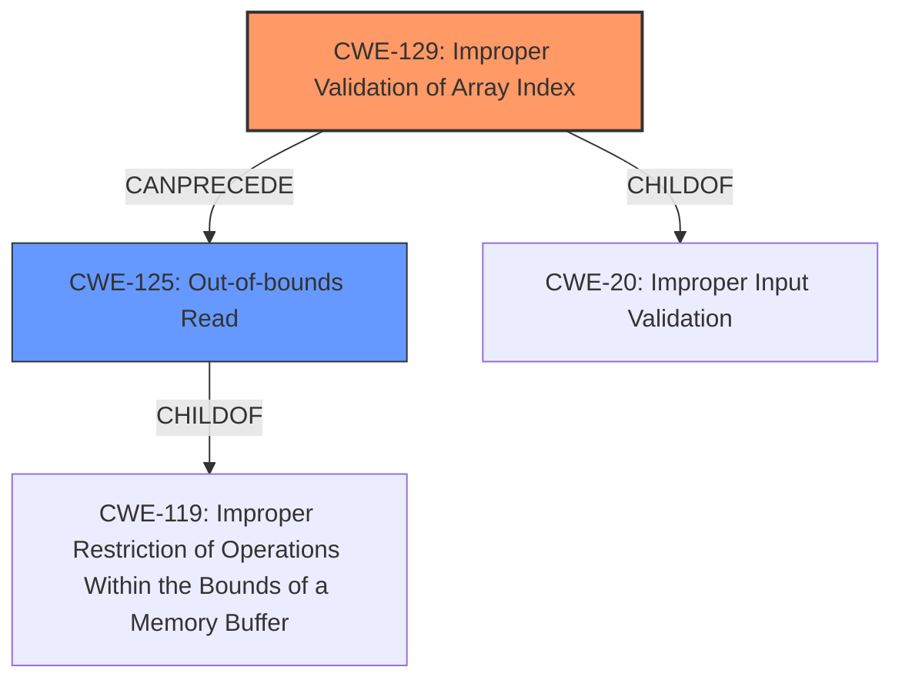

# Raw Analyzer Response for CVE-2020-28632

# Summary
| CWE ID | CWE Name | Confidence | CWE Abstraction Level | CWE Vulnerability Mapping Label | CWE-Vulnerability Mapping Notes |
|---|---|---|---|---|---|
| CWE-129 | Improper Validation of Array Index | 1.0 | Variant | Primary | Allowed |
| CWE-125 | Out-of-bounds Read | 0.7 | Base | Secondary | Allowed |

## Evidence and Confidence

*   **Confidence Score:** 0.9
*   **Evidence Strength:** HIGH

## Relationship Analysis
The primary relationship is that **CWE-129 (Improper Validation of Array Index)** can precede **CWE-125 (Out-of-bounds Read)**. The vulnerability arises because of the **lack of proper validation**, leading directly to the **out-of-bounds read**. The other suggested CWEs, such as **CWE-190 (Integer Overflow or Wraparound)** and **CWE-787 (Out-of-bounds Write)**, are not directly supported by the evidence, although an out-of-bounds write or integer overflow might be a secondary effect in some scenarios.

## Vulnerability Chain
The chain of events for this vulnerability is:
1.  **Improper Input Validation (CWE-20)**: The application **fails to validate** the array index received as input.
2.  **Improper Validation of Array Index (CWE-129)**: Specifically, the array index is not checked to ensure it's within the bounds of the array.
3.  **Out-of-bounds Read (CWE-125)**: The application attempts to read data from a memory location outside the allocated buffer, based on the invalid index.
4.  **Code Execution**: The **out-of-bounds read** can lead to type confusion and, ultimately, code execution.

## Summary of Analysis
The initial analysis correctly identifies the **out-of-bounds read** as a key weakness. The evidence clearly shows that the root cause is the **lack of proper validation** of the array index before it is used to access memory. The retriever results strongly suggest **CWE-129 (Improper Validation of Array Index)** and **CWE-125 (Out-of-bounds Read)**.

The final decision is to classify the vulnerability as primarily **CWE-129 (Improper Validation of Array Index)**, a Variant-level CWE, because the root cause is directly related to the **failure to validate the array index**. The **out-of-bounds read (CWE-125)** is a consequence of this **lack of validation**, making it a secondary weakness.

The evidence from the CVE Reference Links Content Summary is crucial: "The root cause of the vulnerability is the lack of proper bounds checking when parsing a .nef3 file format within the CGAL library. Specifically, when reading the file, integer values are directly used as indices into various vectors without verifying if they are within the valid range for those vectors."

The graph relationships confirm that **CWE-129** can directly lead to **CWE-125**, solidifying the classification. **CWE-129** is at the optimal level of specificity, as it clearly describes the **improper validation** of the array index, which is the root cause of the **out-of-bounds read**.

Relevant CWE Information:
*   **CWE-129 (Improper Validation of Array Index)**: The product uses untrusted input when calculating or using an array index, but the product does not validate or incorrectly validates the index to ensure the index references a valid position within the array.
*   **CWE-125 (Out-of-bounds Read)**: The product reads data past the end, or before the beginning, of the intended buffer.

CWEs considered but not used:
*   **CWE-190 (Integer Overflow or Wraparound)**, **CWE-197 (Numeric Truncation Error)**: Although these might occur in some scenarios, there's no direct evidence to support these. The primary weakness is the **lack of validation**, not necessarily an overflow or truncation, even though those issues could lead to an invalid index value.
*   **CWE-787 (Out-of-bounds Write)**: The description mentions code execution as a possible outcome, but the immediate vulnerability is the **out-of-bounds read**. An out-of-bounds write might occur as a consequence of the code execution, but it is not the primary weakness described in the initial vulnerability.