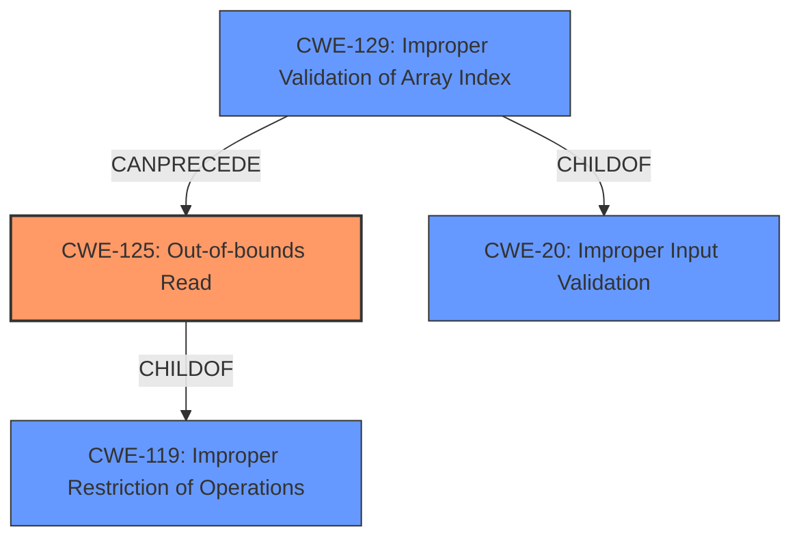

# Raw Analyzer Response for CVE-2020-28633

# Summary
| CWE ID | CWE Name | Confidence | CWE Abstraction Level | CWE Vulnerability Mapping Label | CWE-Vulnerability Mapping Notes |
|---|---|---|---|---|---|
| CWE-125 | Out-of-bounds Read | 1.0 | Base | Allowed | Primary CWE |
| CWE-129 | Improper Validation of Array Index | 0.8 | Variant | Allowed | Secondary Candidate |

## Evidence and Confidence

*   **Confidence Score:** 0.9
*   **Evidence Strength:** HIGH

## Relationship Analysis
The primary CWE is CWE-125 (**Out-of-bounds Read**). CWE-125 is a base level CWE, and a child of CWE-119 (**Improper Restriction of Operations Within the Bounds of a Memory Buffer**). The secondary CWE is CWE-129 (**Improper Validation of Array Index**), which can precede CWE-125. This means that the **improper validation** of an array index may lead to an **out-of-bounds read**. Both CWEs are at their preferred levels of abstraction.

## Vulnerability Chain
The vulnerability chain starts with the **improper validation** of array indices (CWE-129), which allows an attacker to specify arbitrary memory locations. This leads to an **out-of-bounds read** (CWE-125) and type confusion, potentially resulting in code execution.

## Summary of Analysis
The analysis indicates that the primary weakness is CWE-125 (**Out-of-bounds Read**), because the vulnerability description explicitly states an "**out-of-bounds read**" vulnerability exists.
> A specially crafted malformed file can lead to an **out-of-bounds read** and type confusion, which could lead to code execution.
> An oob read vulnerability exists in Nef_S2/SNC_io_parser.h SNC_io_parserread_sedge() seh->prev().
The "CVE Reference Links Content Summary" also lists "**Out-of-bounds read**" as a weakness.
> "weaknesses": [
      "Improper validation of array index (CWE-129)",
      "Out-of-bounds read",
      "Type confusion"
    ],
This is further supported by the "vulnerability_details" section:
> The vulnerability lies in the parsing of Nef polygon data where the code reads integer indexes from the input file without proper bounds checking, before using them to access vectors of various data structures. This allows an attacker to specify arbitrary memory locations, leading to out-of-bounds reads/writes and type confusion.

The secondary weakness is CWE-129 (**Improper Validation of Array Index**) because the code reads integer indexes from the input file without proper bounds checking before using them to access vectors of various data structures. This allows an attacker to specify arbitrary memory locations.

The selected CWEs are at the optimal level of specificity (Base and Variant, respectively) and are supported by the evidence provided.

Other CWEs considered but not used:

*   CWE-190 (**Integer Overflow or Wraparound**): While integer overflows can lead to memory corruption, there is no direct evidence in the description to suggest an integer overflow is occurring.
*   CWE-1284 (**Improper Validation of Specified Quantity in Input**): Although the vulnerability involves input quantities, CWE-129 is a more specific match as it relates to array indices.
*   CWE-787 (**Out-of-bounds Write**): Although the "CVE Reference Links Content Summary" mentions out-of-bounds writes, the vulnerability description emphasizes an out-of-bounds read. Also, reads can lead to type confusion which leads to code execution as per the vulnerability description.
*   CWE-193 (**Off-by-one Error**): There's no direct mention of calculations being off by one.
*   CWE-476 (**NULL Pointer Dereference**): There is no mention of null pointers.
*   CWE-197 (**Numeric Truncation Error**): There is no mention of truncation.
*   CWE-122 (**Heap-based Buffer Overflow**): Although memory corruption is mentioned, a heap-based buffer overflow is not specifically identified.
*   CWE-20 (**Improper Input Validation**): This is a class-level CWE and is too general. CWE-129 is a more specific variant.