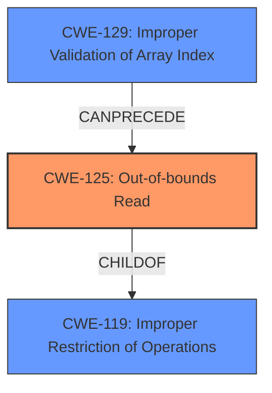

# Analysis Report for CVE-2020-28634

# Vulnerability Analysis Report: CVE-2020-28634

## Description


## Analysis (with Relationship Data)

# Summary
| CWE ID | CWE Name | Confidence | CWE Abstraction Level | CWE Vulnerability Mapping Label | CWE-Vulnerability Mapping Notes |
|---|---|---|---|---|---|
| CWE-125 | Out-of-bounds Read | 1.0 | Base | Allowed | Primary CWE |
| CWE-129 | Improper Validation of Array Index | 0.9 | Variant | Allowed | Secondary Candidate |

## Evidence and Confidence

*   **Confidence Score:** 0.95
*   **Evidence Strength:** HIGH

## Relationship Analysis
The primary weakness is **CWE-125** [Out-of-bounds Read], which occurs when the code reads data outside the intended buffer. **CWE-129** [Improper Validation of Array Index] can precede **CWE-125** [Out-of-bounds Read] when an array index is not validated before being used to access the array, resulting in a read outside the array bounds. **CWE-125** [Out-of-bounds Read] is a child of **CWE-119** [Improper Restriction of Operations within the Bounds of a Memory Buffer], which is a more general class of buffer-related errors.



## Vulnerability Chain
The vulnerability chain starts with the **improper validation of input data** (specifically, array indices), which leads to an **out-of-bounds read**. This **out-of-bounds read** can then lead to type confusion and ultimately code execution.

## Summary of Analysis
The primary **weakness** is an **out-of-bounds read**, caused by a lack of index validation. The vulnerability description states: "Multiple code execution vulnerabilities exists in the Nef polygon-parsing functionality of CGAL libcgal CGAL-5.1.1. A specially crafted malformed file can lead to an **out-of-bounds read** and type confusion, which could lead to code execution." The CVE Reference Links Content Summary further elaborates: "The vulnerability stems from a lack of index validation in the CGAL library's Nef polygon parsing functionality. When parsing a specially crafted malformed file, the code reads integer values from the input file and uses them directly as indices into various vectors without proper bounds checking."

Based on this evidence, **CWE-125** [Out-of-bounds Read] is the most appropriate primary CWE. The Retriever Results also list **CWE-125** [Out-of-bounds Read] and **CWE-129** [Improper Validation of Array Index] as highly relevant.

**CWE-129** [Improper Validation of Array Index] is considered a secondary CWE because the root cause analysis in the CVE summary describes how the code reads integer values and uses them directly as indices into vectors "without proper bounds checking." This maps directly to the description of **CWE-129** [Improper Validation of Array Index]: "The product uses untrusted input when calculating or using an array index, but the product does not validate or incorrectly validates the index to ensure the index references a valid position within the array."

Other CWEs were considered but not used:

*   **CWE-190** [Integer Overflow or Wraparound] and **CWE-197** [Numeric Truncation Error]: These were considered due to the parsing of integer values from the file. However, the core issue is the lack of validation of these integers as array indices, making **CWE-129** [Improper Validation of Array Index] more relevant as a secondary CWE.
*   **CWE-787** [Out-of-bounds Write]: While the initial description mentions code execution, the root cause is the read, not the write. The type confusion leading to code execution is a consequence of the **out-of-bounds read**.

The selected CWEs are at the optimal level of specificity because they directly address the root cause (**CWE-129** [Improper Validation of Array Index]) and the immediate consequence (**CWE-125** [Out-of-bounds Read]) of the vulnerability.


## CWE Relationship Analysis

Current CWEs represent these abstraction levels: .


### Vulnerability Chain Analysis

**Chain starting from CWE-787:**
- 787 (Out-of-bounds Write) - ROOT


**Chain starting from CWE-197:**
- 197 (Numeric Truncation Error) - ROOT


### CWE Relationship Diagram

```mermaid
graph TD
    classDef primary fill:#f96,stroke:#333,stroke-width:2px
    classDef secondary fill:#69f,stroke:#333
    classDef tertiary fill:#9e9,stroke:#333
```


*Report generated on 2025-04-02 13:25:24*
