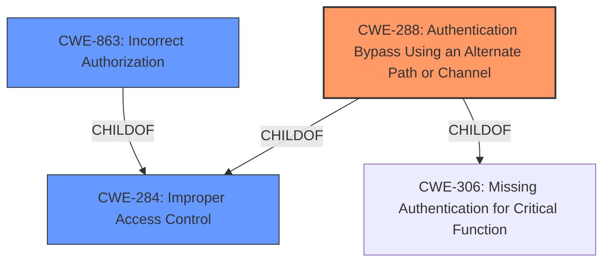

# Analysis Report for CVE-2020-28872

# Vulnerability Analysis Report: CVE-2020-28872

## Description


## Analysis (with Relationship Data)

# Summary
| CWE ID | CWE Name | Confidence | CWE Abstraction Level | CWE Vulnerability Mapping Label | CWE-Vulnerability Mapping Notes |
|---|---|---|---|---|---|
| CWE-288 | Authentication Bypass Using an Alternate Path or Channel | 0.8 | Base | Allowed | Primary CWE |
| CWE-284 | Improper Access Control | 0.6 | Pillar | Discouraged | Secondary Candidate |
| CWE-863 | Incorrect Authorization | 0.5 | Class | Allowed-with-Review | Secondary Candidate |

## Evidence and Confidence

*   **Confidence Score:** 0.8
*   **Evidence Strength:** MEDIUM

## Relationship Analysis
The primary relationship that impacted my decision was the parent-child relationship.
  - CWE-288 is a child of CWE-284.
  - CWE-863 is a child of CWE-284.
  - The abstraction levels influenced my selection by preferring Base level CWEs.



## Vulnerability Chain
The chain of root cause and weaknesses that followed for the Vulnerability Description:
  - **ROOT CAUSE:** An **authorization bypass** vulnerability exists because an alternate path in `_register.php` allows credential creation without proper authentication.
  - **WEAKNESS:** This leads to an unauthorized person being able to create valid credentials.

## Summary of Analysis
My analysis is primarily based on the provided vulnerability description, which explicitly mentions an **authorization bypass** vulnerability. The key phrase "allows an unauthorized person to create valid credentials" points towards a flaw in the authentication or authorization mechanism.

The evidence from the vulnerability description: "An **authorization bypass** vulnerability in Monitorr v1.7.6m in Monitorr/assets/config/_installation/_register.php allows an unauthorized person to create valid credentials."

The graph relationships influenced my selection as follows:
  - CWE-288 is a child of CWE-284.
  - CWE-863 is a child of CWE-284.

I selected CWE-288 as the primary CWE because it directly addresses the scenario described in the vulnerability: an alternate path that bypasses authentication. While CWE-284 and CWE-863 are related to access control and authorization, they are more general and less specific than CWE-288. CWE-288 accurately captures the essence of the vulnerability, which is the existence of an alternate path that circumvents the intended authentication process. The selection of the Base level CWE is consistent with the guidance of selecting the most specific CWE.

**CWE-288: Authentication Bypass Using an Alternate Path or Channel**
*   **How the vulnerability's details match the CWE's characteristics:** The vulnerability description states that an **authorization bypass** exists in `_register.php`, allowing an unauthorized person to create valid credentials. This directly aligns with CWE-288, which describes a scenario where a product requires authentication but has an alternate path or channel that does not. In this case, the `_register.php` script acts as the alternate path, bypassing the intended authentication process.
*   **The security implications and potential impact:** The security implication is that an attacker can create valid credentials without proper authorization, potentially gaining unauthorized access to the system.
*   **Any parent-child relationships or chain patterns that influenced your mapping:** CWE-288 is a child of CWE-306 (Missing Authentication for Critical Function) and CWE-284 (Improper Access Control). The relationship with CWE-284 is relevant as the bypass leads to improper access control.
*   **Whether the weakness is primary or secondary in the vulnerability:** This is the primary weakness as it directly leads to the **authorization bypass**.
*   **How the official MITRE mapping guidance influenced your decision:** The MITRE mapping guidance recommends using Base-level CWEs when possible. CWE-288 is a Base-level CWE and accurately describes the vulnerability.

**CWE-284: Improper Access Control**
*   **How the vulnerability's details match the CWE's characteristics:** While CWE-288 is more specific, CWE-284 is relevant as the **authorization bypass** ultimately leads to improper access control. An unauthorized person is able to create valid credentials, which violates access control principles.
*   **The security implications and potential impact:** The security implication is that unauthorized users can gain access to the system and perform actions they are not intended to perform.
*   **Any parent-child relationships or chain patterns that influenced your mapping:** CWE-284 is a parent of CWE-288.
*   **Whether the weakness is primary or secondary in the vulnerability:** This is a secondary weakness, as the primary issue is the **authentication bypass**.
*   **How the official MITRE mapping guidance influenced your decision:** The MITRE mapping guidance discourages the use of CWE-284 due to its high-level nature, recommending more specific descendants.

**CWE-863: Incorrect Authorization**
*   **How the vulnerability's details match the CWE's characteristics:** The vulnerability involves an **authorization bypass** because the _register.php script does not correctly perform the **authorization** check, allowing anyone to create valid credentials.
*   **The security implications and potential impact:** The security implication is that unauthorized users can create accounts and access resources they are not allowed to access.
*   **Any parent-child relationships or chain patterns that influenced your mapping:** CWE-863 is a ChildOf CWE-285 and CWE-284
*   **Whether the weakness is primary or secondary in the vulnerability:** This is a secondary weakness. The root cause is the alternate channel.
*   **How the official MITRE mapping guidance influenced your decision:** The MITRE mapping guidance recommends examining children of this entry to see if there is a better fit.

**CWEs Considered but Not Used:**

*   CWE-639: Authorization Bypass Through User-Controlled Key: This CWE was considered but not chosen because the vulnerability doesn't involve a user-controlled key. The bypass occurs due to an alternate path, not manipulation of a key value.
*   CWE-306: Missing Authentication for Critical Function: This CWE was considered, but CWE-288 is a more specific child of CWE-306 and better describes the vulnerability, which involves an alternate path that bypasses authentication.
*   CWE-425: Direct Request ('Forced Browsing'): This CWE was considered but is not as accurate as CWE-288. While the vulnerability involves accessing a resource directly, the core issue is the **authentication bypass**, not simply the direct access.


## CWE Relationship Analysis

Current CWEs represent these abstraction levels: .


### Vulnerability Chain Analysis

**Chain starting from CWE-288:**
- 288 (Authentication Bypass Using an Alternate Path or Channel) - ROOT


**Chain starting from CWE-306:**
- 306 (Missing Authentication for Critical Function) - ROOT


### CWE Relationship Diagram

```mermaid
graph TD
    classDef primary fill:#f96,stroke:#333,stroke-width:2px
    classDef secondary fill:#69f,stroke:#333
    classDef tertiary fill:#9e9,stroke:#333
```


*Report generated on 2025-04-02 02:11:49*
