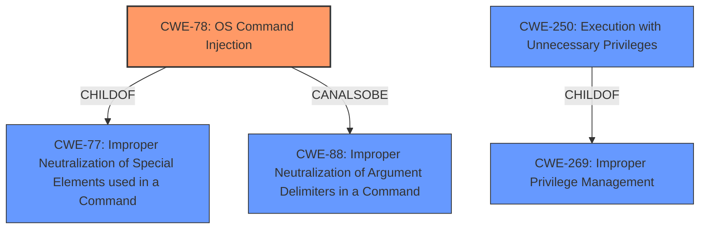

# Raw Analyzer Response for CVE-2020-28901

# Summary
| CWE ID | CWE Name | Confidence | CWE Abstraction Level | CWE Vulnerability Mapping Label | CWE-Vulnerability Mapping Notes |
|---|---|---|---|---|---|
| CWE-78 | Improper Neutralization of Special Elements used in an OS Command ('OS Command Injection') | 1.0 | Base | Allowed | Primary CWE |
| CWE-250 | Execution with Unnecessary Privileges | 0.6 | Base | Allowed | Secondary CWE |

## Evidence and Confidence

*   **Confidence Score:** 0.8
*   **Evidence Strength:** HIGH

## Relationship Analysis
The primary CWE is CWE-78, which is a Base level weakness, accurately representing the root cause of the vulnerability: the improper neutralization of special elements used in an OS command. CWE-78 is a child of the Class-level CWE-77 (Improper Neutralization of Special Elements used in a Command), indicating a more general form of command injection. It can also be related to CWE-88 (Improper Neutralization of Argument Delimiters in a Command).

CWE-250 (Execution with Unnecessary Privileges) is a Base level weakness that is a ChildOf CWE-269 (Improper Privilege Management).

## Vulnerability Chain
The vulnerability chain starts with the **Command Injection** vulnerability (CWE-78) in `cmd_subsys.php` due to the lack of proper sanitization of the `component_dir` parameter. This allows an attacker to inject arbitrary shell commands, leading to privilege escalation and code execution as root.

## Summary of Analysis
The initial analysis correctly identifies **Command Injection** as the primary issue. The evidence from the "CVE Reference Links Content Summary" strongly supports this, highlighting the lack of proper sanitization of the `component_dir` parameter in `cmd_subsys.php`, which enables attackers to inject arbitrary shell commands.

The graph relationships and retriever results reinforce the selection of CWE-78. It is a Base level CWE and a child of the more general CWE-77.

The selection of CWE-78 is at the optimal level of specificity because it directly reflects the **weakness** described in the vulnerability: the ability to inject OS commands due to **improper neutralization**.

CWE-250 is included as a secondary weakness, because the injection allows escalation to root, implying that the vulnerable component was running with unnecessary privileges.

Relevant CWE Information:

# Enhanced Context (25 CWEs)

## CWE-1336: Improper Neutralization of Special Elements Used in a Template Engine
**Abstraction Level**: Base
**Similarity Score**: 0.76
**Source**: dense
This CWE was considered but is not applicable because the vulnerability is not related to the usage of a template engine.

## CWE-74: Improper Neutralization of Special Elements in Output Used by a Downstream Component ('Injection')
**Abstraction Level**: Class
**Similarity Score**: 0.75
**Source**: dense
This CWE was considered, but CWE-78 (OS Command Injection) is a more specific and appropriate choice. CWE-74 is a more general class of injection vulnerabilities.

## CWE-917: Improper Neutralization of Special Elements used in an Expression Language Statement ('Expression Language Injection')
**Abstraction Level**: Base
**Similarity Score**: 0.75
**Source**: dense
This CWE was considered but is not applicable because the vulnerability does not involve an expression language.

## CWE-80: Improper Neutralization of Script-Related HTML Tags in a Web Page (Basic XSS)
**Abstraction Level**: Variant
**Similarity Score**: 0.74
**Source**: dense
This CWE was considered but is not applicable because the vulnerability is not related to cross-site scripting.

## CWE-138: Improper Neutralization of Special Elements
**Abstraction Level**: Class
**Similarity Score**: 0.73
**Source**: dense
This CWE was considered but is too generic. CWE-78 is a more specific type of improper neutralization.

## CWE-184: Incomplete List of Disallowed Inputs
**Abstraction Level**: Base
**Similarity Score**: 0.73
**Source**: dense
This CWE could be related but it's not the primary issue. The core problem is the **improper neutralization**, not necessarily an incomplete list of disallowed inputs.

## CWE-88: Improper Neutralization of Argument Delimiters in a Command ('Argument Injection')
**Abstraction Level**: Base
**Similarity Score**: 0.72
**Source**: dense
This CWE was considered as a related weakness but not the primary one. While argument injection could be a contributing factor, the main issue is the overall command injection vulnerability.

## CWE-96: Improper Neutralization of Directives in Statically Saved Code ('Static Code Injection')
**Abstraction Level**: Base
**Similarity Score**: 0.72
**Source**: dense
This CWE was considered but is not applicable, as the injection doesn't involve statically saved code.

## CWE-943: Improper Neutralization of Special Elements in Data Query Logic
**Abstraction Level**: Class
**Similarity Score**: 0.72
**Source**: dense
This CWE was considered but is not applicable, as the vulnerability does not involve data query logic.

## CWE-1289: Improper Validation of Unsafe Equivalence in Input
**Abstraction Level**: Base
**Similarity Score**: 0.72
**Source**: dense
This CWE was considered, but it is not directly related to the vulnerability, which is primarily about command injection.

## CWE-116: Improper Encoding or Escaping of Output
**Abstraction Level**: Class
**Similarity Score**: 7086.08
**Source**: sparse
This CWE was considered but is not the primary issue, as the core problem is the **improper neutralization** leading to command injection, not the encoding or escaping of output.

## CWE-95: Improper Neutralization of Directives in Dynamically Evaluated Code ('Eval Injection')
**Abstraction Level**: Variant
**Similarity Score**: 7013.02
**Source**: sparse
This CWE was considered but does not accurately describe the vulnerability because it doesn't involve dynamic evaluation of code.

## CWE-89: Improper Neutralization of Special Elements used in an SQL Command ('SQL Injection')
**Abstraction Level**: base
**Similarity Score**: 4.33
**Source**: graph
This CWE was considered but is not applicable because the vulnerability does not involve SQL commands.

## CWE-120: Buffer Copy without Checking Size of Input ('Classic Buffer Overflow')
**Abstraction Level**: base
**Similarity Score**: 4.33
**Source**: graph
This CWE was considered but is not related to buffer overflows.

## CWE-476: NULL Pointer Dereference
**Abstraction Level**: base
**Similarity Score**: 4.33
**Source**: graph
This CWE was considered, but it is not related to null pointer dereferences.

## CWE-252: Unchecked Return Value
**Abstraction Level**: base
**Similarity Score**: 4.33
**Source**: graph
This CWE was considered, but it is not related to unchecked return values.

## CWE-98: Improper Control of Filename for Include/Require Statement in PHP Program ('PHP Remote File Inclusion')
**Abstraction Level**: variant
**Similarity Score**: 3.89
**Source**: graph
This CWE was considered but is not related to file inclusion vulnerabilities.

## CWE-79: Improper Neutralization of Input During Web Page Generation ('Cross-site Scripting')
**Abstraction Level**: base
**Similarity Score**: 3.89
**Source**: graph
This CWE was considered but is not applicable, as the vulnerability does not involve cross-site scripting.

## CWE-456: Missing Initialization of a Variable
**Abstraction Level**: variant
**Similarity Score**: 3.88
**Source**: graph
This CWE was considered, but the vulnerability isn't directly related to missing variable initialization.

The final assessment, based on provided evidence and relationships, validates the selection of CWE-78 as the primary CWE and CWE-250 as a secondary CWE because the **weakness** allows **privilege escalation** to root.