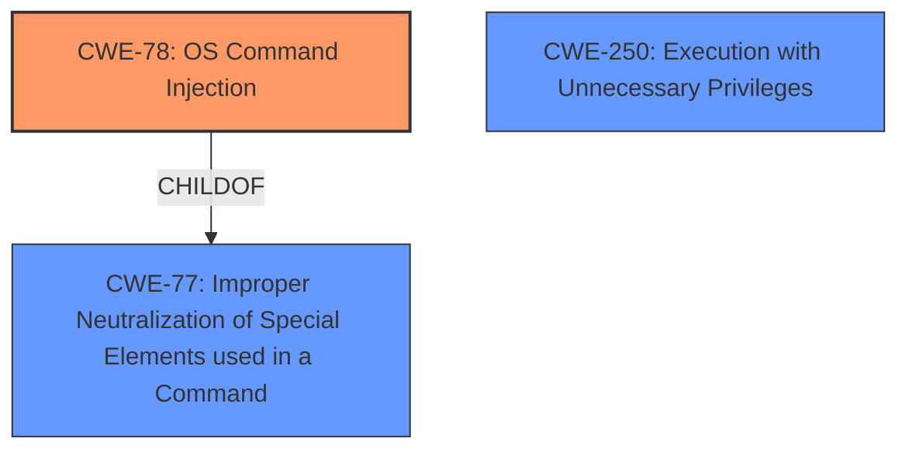

# Raw Analyzer Response for CVE-2020-28902

# Summary
| CWE ID | CWE Name | Confidence | CWE Abstraction Level | CWE Vulnerability Mapping Label | CWE-Vulnerability Mapping Notes |
|---|---|---|---|---|---|
| CWE-78 | Improper Neutralization of Special Elements used in an OS Command ('OS Command Injection') | 1.0 | Base | Allowed | Primary CWE |
| CWE-250 | Execution with Unnecessary Privileges | 0.6 | Base | Allowed | Secondary CWE |

## Evidence and Confidence

*   **Confidence Score:** 0.8
*   **Evidence Strength:** HIGH

## Relationship Analysis
The primary relationship influencing the CWE selection is the hierarchical relationship. CWE-78 is a base-level CWE and a child of CWE-77. The evidence clearly points to OS command injection, making CWE-78 the most specific and appropriate choice. CWE-250 is related to the privilege escalation aspect of the vulnerability. The mermaid diagram visualizes these relationships.

## Vulnerability Chain
The vulnerability chain starts with the **improper neutralization** of input, leading to **OS command injection**, which then results in **privilege escalation**.

## Summary of Analysis
Initially, the vulnerability description highlights a **Command Injection** in Nagios Fusion, which strongly suggested CWE-77. However, after reviewing the CVE Reference Links Content Summary, it became evident that the injection specifically targets OS commands. The root cause identified is the **unsanitized command** line argument used in the `exec()` function. The `tmpfile` argument, constructed from a user-controlled `$id`, is used verbatim, enabling shell command injection. This detailed information solidified the selection of CWE-78 (Improper Neutralization of Special Elements used in an OS Command ('OS Command Injection')) as the primary CWE. Additionally, the vulnerability leads to Privilege Escalation, suggesting CWE-250 (Execution with Unnecessary Privileges) as a secondary concern. The evidence strongly supports this classification, with a confidence score of 0.8. The analysis is based on the detailed information provided in the CVE Reference Links Content Summary, particularly the identified root cause and attack vectors. The selected CWEs are at the optimal level of specificity, with CWE-78 being a Base level and CWE-250 is relevant due to the privilege escalation impact.

Relevant CWE Information:

# Enhanced Context (25 CWEs)
The following CWEs were identified as potentially relevant to this vulnerability:

## CWE-943: Improper Neutralization of Special Elements in Data Query Logic
**Abstraction Level**: Class
**Similarity Score**: 0.72
**Source**: dense

**Description**:
The product generates a query intended to access or manipulate data in a data store such as a database, but it does not neutralize or incorrectly neutralizes special elements that can modify the intended logic of the query.

**Mapping Guidance**:
- Usage: Allowed-with-Review
- Rationale: This CWE entry is a Class and might have Base-level children that would be more appropriate

*Not Selected:* This CWE is not relevant because the vulnerability is related to OS command injection, not data query logic.

## CWE-74: Improper Neutralization of Special Elements in Output Used by a Downstream Component ('Injection')
**Abstraction Level**: Class
**Similarity Score**: 0.70
**Source**: dense

**Description**:
The product constructs all or part of a command, data structure, or record using externally-influenced input from an upstream component, but it does not neutralize or incorrectly neutralizes special elements that could modify how it is parsed or interpreted when it is sent to a downstream component.

**Mapping Guidance**:
- Usage: Discouraged
- Rationale: CWE-74 is high-level and often misused when lower-level weaknesses are more appropriate.

*Not Selected:* This CWE is too general and discouraged. CWE-78 is a more specific and appropriate choice.

## CWE-80: Improper Neutralization of Script-Related HTML Tags in a Web Page (Basic XSS)
**Abstraction Level**: Variant
**Similarity Score**: 0.68
**Source**: dense

**Description**:
The product receives input from an upstream component, but it does not neutralize or incorrectly neutralizes special characters such as "<", ">", and "&" that could be interpreted as web-scripting elements when they are sent to a downstream component that processes web pages.

**Mapping Guidance**:
- Usage: Allowed
- Rationale: This CWE entry is at the Variant level of abstraction, which is a preferred level of abstraction for mapping to the root causes of vulnerabilities.

*Not Selected:* This CWE is not relevant as the vulnerability is not related to cross-site scripting (XSS).

## CWE-917: Improper Neutralization of Special Elements used in an Expression Language Statement ('Expression Language Injection')
**Abstraction Level**: Base
**Similarity Score**: 0.68
**Source**: dense

**Description**:
The product constructs all or part of an expression language (EL) statement in a framework such as a Java Server Page (JSP) using externally-influenced input from an upstream component, but it does not neutralize or incorrectly neutralizes special elements that could modify the intended EL statement before it is executed.

**Mapping Guidance**:
- Usage: Allowed
- Rationale: This CWE entry is at the Base level of abstraction, which is a preferred level of abstraction for mapping to the root causes of vulnerabilities.

*Not Selected:* This CWE is not relevant as the vulnerability is not related to expression language injection.

## CWE-1289: Improper Validation of Unsafe Equivalence in Input
**Abstraction Level**: Base
**Similarity Score**: 0.68
**Source**: dense

**Description**:
The product receives an input value that is used as a resource identifier or other type of reference, but it does not validate or incorrectly validates that the input is equivalent to a potentially-unsafe value.

**Mapping Guidance**:
- Usage: Allowed
- Rationale: This CWE entry is at the Base level of abstraction, which is a preferred level of abstraction for mapping to the root causes of vulnerabilities.

*Not Selected:* This CWE doesn't closely align, as the core issue is not about validating equivalence but rather neutralizing special elements.

## CWE-184: Incomplete List of Disallowed Inputs
**Abstraction Level**: Base
**Similarity Score**: 0.68
**Source**: dense

**Description**:
The product implements a protection mechanism that relies on a list of inputs (or properties of inputs) that are not allowed by policy or otherwise require other action to neutralize before additional processing takes place, but the list is incomplete.

**Mapping Guidance**:
- Usage: Allowed
- Rationale: This CWE entry is at the Base level of abstraction, which is a preferred level of abstraction for mapping to the root causes of vulnerabilities.

*Not Selected:* While an incomplete list of disallowed inputs could contribute, the primary weakness is the lack of any effective neutralization.

## CWE-1236: Improper Neutralization of Formula Elements in a CSV File
**Abstraction Level**: Base
**Similarity Score**: 0.67
**Source**: dense

**Description**:
The product saves user-provided information into a Comma-Separated Value (CSV) file, but it does not neutralize or incorrectly neutralizes special elements that could be interpreted as a command when the file is opened by a spreadsheet product.

**Mapping Guidance**:
- Usage: Allowed
- Rationale: This CWE entry is at the Base level of abstraction, which is a preferred level of abstraction for mapping to the root causes of vulnerabilities.

*Not Selected:* This CWE is specific to CSV files and is not relevant to the described vulnerability.

## CWE-653: Improper Isolation or Compartmentalization
**Abstraction Level**: Class
**Similarity Score**: 0.67
**Source**: dense

**Description**:
The product does not properly compartmentalize or isolate functionality, processes, or resources that require different privilege levels, rights, or permissions.

**Mapping Guidance**:
- Usage: Allowed
- Rationale: This CWE entry is at the Base level of abstraction, which is a preferred level of abstraction for mapping to the root causes of vulnerabilities.

*Not Selected:* While privilege escalation is an outcome, the root cause is command injection, not improper compartmentalization.

## CWE-99: Improper Control of Resource Identifiers ('Resource Injection')
**Abstraction Level**: Class
**Similarity Score**: 0.67
**Source**: dense

**Description**:
The product receives input from an upstream component, but it does not restrict or incorrectly restricts the input before it is used as an identifier for a resource that may be outside the intended sphere of control.

**Mapping Guidance**:
- Usage: Allowed-with-Review
- Rationale: This CWE entry is a Class and might have Base-level children that would be more appropriate

*Not Selected:* This CWE doesn'