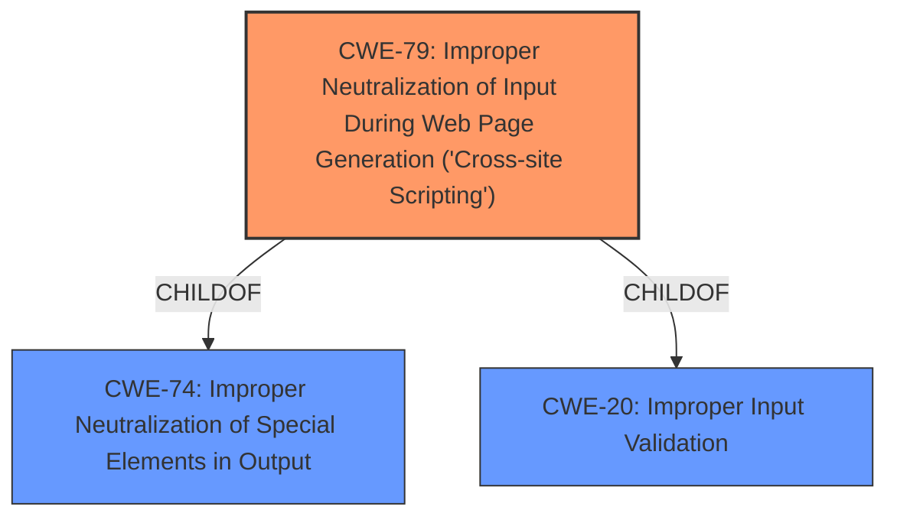

# Raw Analyzer Response for CVE-2020-28903

# Summary
| CWE ID | CWE Name | Confidence | CWE Abstraction Level | CWE Vulnerability Mapping Label | CWE-Vulnerability Mapping Notes |
|---|---|---|---|---|---|
| CWE-79 | Improper Neutralization of Input During Web Page Generation ('Cross-site Scripting') | 1.0 | Base | Allowed | Primary CWE |
| CWE-20 | Improper Input Validation | 0.7 | Class | Discouraged | Secondary Candidate |

## Evidence and Confidence

*   **Confidence Score:** 0.9
*   **Evidence Strength:** HIGH

## Relationship Analysis
The primary relationship is that CWE-79 is a specific type of injection vulnerability, where the **improper input validation** (or lack thereof) directly leads to the ability to inject malicious script into a web page. CWE-79 is a child of CWE-74 (Improper Neutralization of Special Elements in Output) and CWE-20 (Improper Input Validation). While CWE-20 is a broader category, CWE-79 accurately describes the specific vulnerability.

## Vulnerability Chain
The vulnerability chain starts with **improper input validation**. This leads to the injection of arbitrary HTML, which results in Cross-Site Scripting (XSS).

## Summary of Analysis
The initial assessment identifies **improper input validation** as the root cause, aligning with CWE-20. However, the description explicitly states that this leads to the injection of arbitrary HTML, thus leading to XSS. The provided "CVE Reference Links Content Summary" confirms the XSS vulnerability due to lack of sanitization.

The evidence from the "Vulnerability Description" includes the key phrase "**Improper input validation** in Nagios Fusion 4.1.8 and earlier allows a remote attacker with control over a fused server to inject arbitrary HTML, aka XSS."

The "CVE Reference Links Content Summary" section states: "The root cause of the vulnerability is that Nagios Fusion trusts and displays the data returned from Nagios XI servers without sanitization, allowing the attacker to inject malicious JavaScript."

The retriever results list CWE-79, CWE-20, and CWE-80. CWE-79 and CWE-80 are children of CWE-74, which is a more general injection vulnerability. CWE-80 is a Variant of CWE-79 and is also related to basic XSS, but CWE-79 is the more appropriate base class.

CWE-20 is a very general class that is often misused, so I will select CWE-79 as the primary CWE and CWE-20 as a secondary candidate.

Relevant CWE Information:

# Enhanced Context (25 CWEs)
The following CWEs were identified as potentially relevant to this vulnerability:

## CWE-113: Improper Neutralization of CRLF Sequences in HTTP Headers ('HTTP Request/Response Splitting')
**Abstraction Level**: Variant
**Similarity Score**: 0.80
**Source**: dense

**Description**:
The product receives data from an HTTP agent/component (e.g., web server, proxy, browser, etc.), but it does not neutralize or incorrectly neutralizes CR and LF characters before the data is included in outgoing HTTP headers.

**Mapping Guidance**:
- Usage: Allowed
- Rationale: This CWE entry is at the Variant level of abstraction, which is a preferred level of abstraction for mapping to the root causes of vulnerabilities.

## CWE-444: Inconsistent Interpretation of HTTP Requests ('HTTP Request/Response Smuggling')
**Abstraction Level**: Base
**Similarity Score**: 0.75
**Source**: dense

**Description**:
The product acts as an intermediary HTTP agent
         (such as a proxy or firewall) in the data flow between two
         entities such as a client and server, but it does not
         interpret malformed HTTP requests or responses in ways that
         are consistent with how the messages will be processed by
         those entities that are at the ultimate destination.

**Mapping Guidance**:
- Usage: Allowed
- Rationale: This CWE entry is at the Base level of abstraction, which is a preferred level of abstraction for mapping to the root causes of vulnerabilities.

## CWE-644: Improper Neutralization of HTTP Headers for Scripting Syntax
**Abstraction Level**: Variant
**Similarity Score**: 0.73
**Source**: dense

**Description**:
The product does not neutralize or incorrectly neutralizes web scripting syntax in HTTP headers that can be used by web browser components that can process raw headers, such as Flash.

**Mapping Guidance**:
- Usage: Allowed
- Rationale: This CWE entry is at the Variant level of abstraction, which is a preferred level of abstraction for mapping to the root causes of vulnerabilities.

## CWE-162: Improper Neutralization of Trailing Special Elements
**Abstraction Level**: Variant
**Similarity Score**: 0.72
**Source**: dense

**Description**:
The product receives input from an upstream component, but it does not neutralize or incorrectly neutralizes trailing special elements that could be interpreted in unexpected ways when they are sent to a downstream component.

**Mapping Guidance**:
- Usage: Allowed
- Rationale: This CWE entry is at the Variant level of abstraction, which is a preferred level of abstraction for mapping to the root causes of vulnerabilities.

## CWE-1289: Improper Validation of Unsafe Equivalence in Input
**Abstraction Level**: Base
**Similarity Score**: 0.71
**Source**: dense

**Description**:
The product receives an input value that is used as a resource identifier or other type of reference, but it does not validate or incorrectly validates that the input is equivalent to a potentially-unsafe value.

**Mapping Guidance**:
- Usage: Allowed
- Rationale: This CWE entry is at the Base level of abstraction, which is a preferred level of abstraction for mapping to the root causes of vulnerabilities.

## CWE-150: Improper Neutralization of Escape, Meta, or Control Sequences
**Abstraction Level**: Variant
**Similarity Score**: 0.71
**Source**: dense

**Description**:
The product receives input from an upstream component, but it does not neutralize or incorrectly neutralizes special elements that could be interpreted as escape, meta, or control character sequences when they are sent to a downstream component.

**Mapping Guidance**:
- Usage: Allowed
- Rationale: This CWE entry is at the Variant level of abstraction, which is a preferred level of abstraction for mapping to the root causes of vulnerabilities.

## CWE-80: Improper Neutralization of Script-Related HTML Tags in a Web Page (Basic XSS)
**Abstraction Level**: Variant
**Similarity Score**: 0.71
**Source**: dense

**Description**:
The product receives input from an upstream component, but it does not neutralize or incorrectly neutralizes special characters such as "<", ">", and "&" that could be interpreted as web-scripting elements when they are sent to a downstream component that processes web pages.

**Mapping Guidance**:
- Usage: Allowed
- Rationale: This CWE entry is at the Variant level of abstraction, which is a preferred level of abstraction for mapping to the root causes of vulnerabilities.

## CWE-838: Inappropriate Encoding for Output Context
**Abstraction Level**: Base
**Similarity Score**: 0.70
**Source**: dense

**Description**:
The product uses or specifies an encoding when generating output to a downstream component, but the specified encoding is not the same as the encoding that is expected by the downstream component.

**Mapping Guidance**:
- Usage: Allowed
- Rationale: This CWE entry is at the Base level of abstraction, which is a preferred level of abstraction for mapping to the root causes of vulnerabilities.

## CWE-84: Improper Neutralization of Encoded URI Schemes in a Web Page
**Abstraction Level**: Variant
**Similarity Score**: 0.70
**Source**: dense

**Description**:
The web application improperly neutralizes user-controlled input for executable script disguised with URI encodings.

**Mapping Guidance**:
- Usage: Allowed
- Rationale: This CWE entry is at the Variant level of abstraction, which is a preferred level of abstraction for mapping to the root causes of vulnerabilities.

## CWE-156: Improper Neutralization of Whitespace
**Abstraction Level**: Variant
**Similarity Score**: 0.69
**Source**: dense

**Description**:
The product receives input from an upstream component, but it does not neutralize or incorrectly neutralizes special elements that could be interpreted as whitespace when they are sent to a downstream component.

**Mapping Guidance**:
- Usage: Allowed
- Rationale: This CWE entry is at the Variant level of abstraction, which is a preferred level of abstraction for mapping to the root causes of