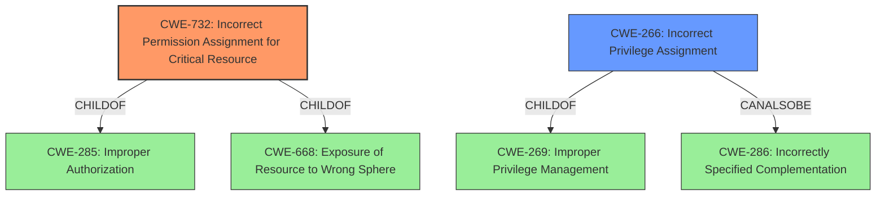

# Enhanced Analysis for CVE-2020-28909

# Summary
| CWE ID | CWE Name | Confidence | CWE Abstraction Level | CWE Vulnerability Mapping Label | CWE-Vulnerability Mapping Notes |
|---|---|---|---|---|---|
| CWE-732 | Incorrect Permission Assignment for Critical Resource | 1.0 | Class | Allowed-with-Review | Primary CWE |
| CWE-266 | Incorrect Privilege Assignment | 0.75 | Base | Allowed | Secondary Candidate |

## Evidence and Confidence

*   **Confidence Score:** 0.9
*   **Evidence Strength:** HIGH

## Relationship Analysis
The primary CWE is CWE-732, which is a Class-level weakness, which has child-of relationships with CWE-285 (Improper Authorization) and CWE-668 (Exposure of Resource to Wrong Sphere). CWE-266 is a Base-level weakness and is a child of CWE-269 (Improper Privilege Management). CWE-266 can also be related to CWE-286 (Incorrectly Specified Complementation). The high-level relationship is that **incorrect file permissions** (CWE-732) lead to **incorrect privilege assignments** (CWE-266).



## Vulnerability Chain
The vulnerability chain starts with **incorrect file permissions** (CWE-732), which allows low-privileged users to modify scripts. This leads to **incorrect privilege assignment** (CWE-266), which enables privilege escalation to root. The ability to modify scripts is the root cause, and the privilege escalation is the impact.

## Summary of Analysis
The initial assessment considered CWE-732 as the primary weakness due to the **incorrect file permissions** allowing low-privileged users to modify scripts. The vulnerability description clearly states "**Incorrect File Permissions** in Nagios Fusion 4.1.8 and earlier allows for Privilege Escalation to root via modification of scripts." The **CVE Reference Links Content Summary** section also supports this, stating that the `getprofile.sh` script can be executed with `sudo` by both `nagios` and `apache` users and that a malicious actor can redirect the file write to arbitrary locations.

CWE-732 (Incorrect Permission Assignment for Critical Resource) is a Class-level CWE. The mapping guidance notes that while the name itself indicates an assignment of permissions for resources, this is often misused for vulnerabilities in which "permissions" are not checked, which is an "authorization" weakness (CWE-285 or descendants) within CWE's model. The description matches the scenario where permissions for security-critical resources (scripts) are incorrectly specified, allowing unauthorized modification.

CWE-266 (Incorrect Privilege Assignment) is considered as a secondary CWE because the **incorrect file permissions** ultimately lead to an **incorrect privilege assignment**, allowing privilege escalation.

The selected CWEs are at the optimal level of specificity because CWE-732 captures the **incorrect permission assignment** for critical resources (scripts), and CWE-266 captures the resulting **incorrect privilege assignment** that leads to privilege escalation.

**CWEs Considered But Not Used:**

*   CWE-285 (Improper Authorization): While related, CWE-732 is more specific to the **incorrect permission assignment**, which is the root cause.
*   CWE-269 (Improper Privilege Management): This is a higher-level class, and CWE-266 is a more specific child.
*   CWE-250 (Execution with Unnecessary Privileges): This is not directly relevant, as the issue is not about executing with unnecessary privileges but about **incorrect file permissions**.
*   CWE-276 (Incorrect Default Permissions): This is related, but the vulnerability description doesn't explicitly mention default permissions set during installation, making CWE-732 a better fit.
*   CWE-863 (Incorrect Authorization): This is a class-level CWE and is less specific than CWE-732.


## CWE Relationship Analysis

Current CWEs represent these abstraction levels: .


### Vulnerability Chain Analysis

**Chain starting from CWE-732:**
- 732 (Incorrect Permission Assignment for Critical Resource) - ROOT


**Chain starting from CWE-286:**
- 286 (Incorrect User Management) - ROOT


### CWE Relationship Diagram

```mermaid
graph TD
    classDef primary fill:#f96,stroke:#333,stroke-width:2px
    classDef secondary fill:#69f,stroke:#333
    classDef tertiary fill:#9e9,stroke:#333
```