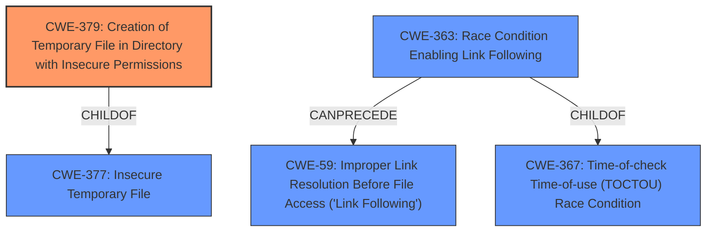

# Enhanced Analysis for CVE-2020-28910

# Summary
| CWE ID | CWE Name | Confidence | CWE Abstraction Level | CWE Vulnerability Mapping Label | CWE-Vulnerability Mapping Notes |
|---|---|---|---|---|---|
| CWE-379 | Creation of Temporary File in Directory with Insecure Permissions | 0.9 | Base | Allowed | Primary CWE |
| CWE-59 | Improper Link Resolution Before File Access ('Link Following') | 0.8 | Base | Allowed | Secondary Candidate |

## Evidence and Confidence

*   **Confidence Score:** 0.85
*   **Evidence Strength:** HIGH

## Relationship Analysis
The primary CWE, CWE-379, is a base-level weakness that directly addresses the **creation of a temporary directory with insecure permissions**. It is a child of CWE-377 (Insecure Temporary File), indicating a more general class of weakness. The secondary CWE, CWE-59, deals with **improper link resolution**, which is the mechanism exploited in this vulnerability for privilege escalation. CWE-59 is related to CWE-363 (Race Condition Enabling Link Following) and CWE-367 (Time-of-check Time-of-use Race Condition), suggesting a potential race condition element in exploiting the symlink.



## Vulnerability Chain
The vulnerability chain starts with the **creation of a temporary directory with insecure permissions** (CWE-379). This allows an attacker to create a symlink within the directory. The `getprofile.sh` script then mishandles this symlink (CWE-59), leading to the overwriting of another sudoers script (`repair_databases.sh`) with attacker-controlled content, ultimately resulting in privilege escalation.

## Summary of Analysis
The initial assessment focused on the **creation of a temporary directory with insecure permissions** which seemed to be the primary **rootcause**. The analysis was then broadened to include the **improper handling of symlinks**, as that was how the vulnerability led to privilege escalation.

The evidence provided in the vulnerability description and CVE reference summary strongly supports CWE-379 as the primary weakness. The description explicitly states "**Creation of a Temporary Directory with Insecure Permissions** in Nagios XI 5.7.5 and earlier allows for Privilege Escalation via creation of symlinks". The CVE reference provides more context: "The vulnerability is present in `getprofile.sh` script... a symlink can be used to overwrite another sudoers script".

The graph relationships highlight how the insecure permissions (CWE-379) enable the symlink attack (CWE-59), which in turn leads to privilege escalation. The choice of CWE-379 is at the optimal level of specificity because it directly addresses the **rootcause**, whereas CWE-377 is a more general classification of insecure temporary files.

Relevant CWE Information:

# Enhanced Context (25 CWEs)
The following CWEs were identified as potentially relevant to this vulnerability:

## CWE-379: Creation of Temporary File in Directory with Insecure Permissions
**Abstraction Level**: Base
**Similarity Score**: 0.77
**Source**: dense

**Description**:
The product creates a temporary file in a directory whose permissions allow unintended actors to determine the file's existence or otherwise access that file.

**Mapping Guidance**:
- Usage: Allowed
- Rationale: This CWE entry is at the Base level of abstraction, which is a preferred level of abstraction for mapping to the root causes of vulnerabilities.

## CWE-59: Improper Link Resolution Before File Access ('Link Following')
**Abstraction Level**: Base
**Similarity Score**: 0.77
**Source**: dense

**Description**:
The product attempts to access a file based on the filename, but it does not properly prevent that filename from identifying a link or shortcut that resolves to an unintended resource.

**Mapping Guidance**:
- Usage: Allowed
- Rationale: This CWE entry is at the Base level of abstraction, which is a preferred level of abstraction for mapping to the root causes of vulnerabilities.

## CWE-732: Incorrect Permission Assignment for Critical Resource
**Abstraction Level**: Class
**Similarity Score**: 0.77
**Source**: dense

**Description**:
The product specifies permissions for a security-critical resource in a way that allows that resource to be read or modified by unintended actors.

**Mapping Guidance**:
- Usage: Allowed
- Rationale: This CWE entry is at the Base level of abstraction, which is a preferred level of abstraction for mapping to the root causes of vulnerabilities.

## CWE-367: Time-of-check Time-of-use (TOCTOU) Race Condition
**Abstraction Level**: Base
**Similarity Score**: 0.76
**Source**: dense

**Description**:
The product checks the state of a resource before using that resource, but the resource's state can change between the check and the use in a way that invalidates the results of the check. This can cause the product to perform invalid actions when the resource is in an unexpected state.

**Mapping Guidance**:
- Usage: Discouraged
- Rationale: This CWE entry could be deprecated in a future version of CWE.

## CWE-363: Race Condition Enabling Link Following
**Abstraction Level**: base
**Similarity Score**: 4.33
**Source**: graph

**Description**:
CWE-363: Race Condition Enabling Link Following

**Mapping Guidance**:
- Usage: Allowed
- Rationale: This CWE entry is at the Base level of abstraction, which is a preferred level of abstraction for mapping to the root causes of vulnerabilities.


## CWE Relationship Analysis

Current CWEs represent these abstraction levels: .


### Vulnerability Chain Analysis

**Chain starting from CWE-732:**
- 732 (Incorrect Permission Assignment for Critical Resource) - ROOT


**Chain starting from CWE-377:**
- 377 (Insecure Temporary File) - ROOT


### CWE Relationship Diagram

```mermaid
graph TD
    classDef primary fill:#f96,stroke:#333,stroke-width:2px
    classDef secondary fill:#69f,stroke:#333
    classDef tertiary fill:#9e9,stroke:#333
```