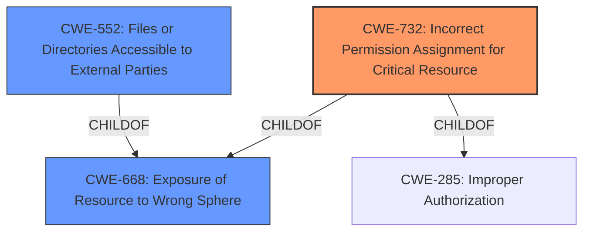

# Analysis for CVE-2020-28914

# Summary
| CWE ID | CWE Name | Confidence | CWE Abstraction Level | CWE Vulnerability Mapping Label | CWE-Vulnerability Mapping Notes |
|---|---|---|---|---|---|
| CWE-732 | Incorrect Permission Assignment for Critical Resource | 0.9 | Class | Allowed-with-Review | Primary CWE |
| CWE-668 | Exposure of Resource to Wrong Sphere | 0.7 | Class | Discouraged | Secondary Candidate |
| CWE-552 | Files or Directories Accessible to External Parties | 0.6 | Base | Allowed | Secondary Candidate |

## Evidence and Confidence

*   **Confidence Score:** 0.8
*   **Evidence Strength:** HIGH

## Relationship Analysis
The primary CWE identified is CWE-732, which is a Class-level CWE. It's related to CWE-285 (Improper Authorization) and CWE-668 (Exposure of Resource to Wrong Sphere) through ChildOf relationships. CWE-668 is also considered but is discouraged as it's too high-level and a class. CWE-552 is another child of CWE-668 and is considered at base level as the container makes files or directories accessible to unauthorized actors. The hierarchical relationships and abstraction levels were considered to select the most appropriate CWE, with a preference for lower-level classifications when sufficient evidence is available.



## Vulnerability Chain
The vulnerability chain starts with the **improper file permissions** which leads to the ability to modify or delete files/directories expected to be read-only.
- The root cause is the **inadequate enforcement of read-only permissions** on bind mounts at the host level.
- This leads to a potential container escape allowing write access to read-only mounted directories.
- Finally, if a container escape occurs, an attacker could potentially write to a directory or file that was intended to be read-only.

## Summary of Analysis
The initial analysis focused on identifying the root cause of the vulnerability, which is the **improper file permissions** that allow unauthorized modification of read-only files/directories.

The vulnerability description states: "When using a Kubernetes hostPath volume and mounting either a file or directory into a container as readonly, the file/directory is mounted as readOnly inside the container, but is still writable inside the guest." This directly indicates an issue with how permissions are assigned or enforced for the resource. The CVE reference links content summary confirms this, stating: "The vulnerability stems from the fact that read-only bind mounts were not being enforced as read-only on the host system, only within the guest kernel."

Given this evidence, CWE-732 (Incorrect Permission Assignment for Critical Resource) is selected as the primary CWE. The description of CWE-732, "The product specifies permissions for a security-critical resource in a way that allows that resource to be read or modified by unintended actors," aligns directly with the vulnerability description. The MITRE mapping guidance for CWE-732 suggests review due to potential misuse, but in this case, the **root cause** is directly related to incorrect permission assignment, making it an appropriate fit.

CWE-668 (Exposure of Resource to Wrong Sphere) was considered but is discouraged as it is too high-level. While the vulnerability does expose resources to the wrong sphere, CWE-732 provides a more specific classification of the underlying weakness.

CWE-552 (Files or Directories Accessible to External Parties) was also considered as a secondary candidate, as the vulnerability makes files accessible that should not be. However, the more specific issue is the incorrect permission assignment, so CWE-732 is a better primary classification.

The final decision is based on the evidence of **improper permission assignment** and the alignment of the vulnerability description with the characteristics of CWE-732. The selection is at the optimal level of specificity, as it directly addresses the **root cause** of the vulnerability.

# Enhanced Query for CVE-2020-28914

## Vulnerability Description
An **improper file permissions** vulnerability affects Kata Containers prior to 1.11.5. When using a Kubernetes hostPath volume and mounting either a file or directory into a container as readonly, the file/directory is mounted as readOnly inside the container, but is still writable inside the guest. For a container breakout situation, a malicious guest can potentially modify or delete files/directories expected to be read-only.

### Vulnerability Description Key Phrases
- **rootcause:** **improper file permissions**
- **impact:** modify or delete files/directories expected to be read-only
- **attacker:** malicious guest
- **product:** Kata Containers
- **version:** prior to 1.11.5

## CVE Reference Links Content Summary
```
{
  "vulnerability": {
    "root_cause": "The vulnerability stems from the fact that read-only bind mounts were not being enforced as read-only on the host system, only within the guest kernel.",
    "weaknesses": [
      "Inadequate enforcement of read-only permissions on bind mounts at the host level.",
      "Potential for container escape to gain write access to read-only mounted directories."
    ],
    "impact": "If a container escape occurred, an attacker could potentially write to a directory or file that was intended to be read-only.",
     "attack_vectors": [
        "Container escape"
      ],
    "required_capabilities": "Successful container escape exploit."
  },
  "vulnerability": {
        "root_cause": "Certain annotations in Kata Containers could be used to execute pre-existing binaries without proper validation of file system paths, potentially allowing execution of arbitrary binaries.",
        "weaknesses": [
           "Lack of validation of file system paths specified in annotations.",
           "Potential for execution of arbitrary binaries through manipulated annotations."
         ],
        "impact": "An attacker could potentially execute arbitrary binaries by leveraging vulnerable annotations if path validation was not configured or properly implemented",
        "attack_vectors": [
            "Exploitation of vulnerable annotations"
          ],
        "required_capabilities": "Ability to manipulate container annotations to include malicious paths."
    }
}
```

## Retriever Results

### Top Combined Results

| Rank | CWE ID | Name | Abstraction | Usage  | Retrievers | Individual Scores |
|------|--------|------|-------------|-------|------------|-------------------|
| 1 | 732 | Incorrect Permission Assignment for Critical Resource | Class | Allowed-with-Review | sparse | 0.467 |
| 2 | 277 | Insecure Inherited Permissions | Variant | Allowed | sparse | 0.443 |
| 3 | 668 | Exposure of Resource to Wrong Sphere | Class | Discouraged | sparse | 0.405 |
| 4 | 59 | Improper Link Resolution Before File Access ('Link Following') | Base | Allowed | sparse | 0.381 |
| 5 | 61 | UNIX Symbolic Link (Symlink) Following | Compound | Allowed | sparse | 0.368 |
| 6 | 281 | Improper Preservation of Permissions | Base | Allowed | dense | 0.491 |
| 7 | 363 | Race Condition Enabling Link Following | Base | Allowed | graph | 0.002 |
| 8 | 863 | Incorrect Authorization | Class | Allowed-with-Review | sparse | 0.365 |
| 9 | 552 | Files or Directories Accessible to External Parties | Base | Allowed | sparse | 0.361 |
| 10 | 22 | Improper Limitation of a Pathname to a Restricted Directory ('Path Traversal') | Base | Allowed | sparse | 0.359 |


# Complete CWE Specifications


## CWE-732: Incorrect Permission Assignment for Critical Resource
**Abstraction:** Class
**Status:** Draft

### Description
The product specifies permissions for a security-critical resource in a way that allows that resource to be read or modified by unintended actors.

### Extended Description
When a resource is given a permission setting that provides access to a wider range of actors than required, it could lead to the exposure of sensitive information, or the modification of that resource by unintended parties. This is especially dangerous when the resource is related to program configuration, execution, or sensitive user data. For example, consider a misconfigured storage account for the cloud that can be read or written by a public or anonymous user.

### Alternative Terms
None

### Relationships
ChildOf -> CWE-285
ChildOf -> CWE-668

### Mapping Guidance
**Usage:** Allowed-with-Review
**Rationale:** While the name itself indicates an assignment of permissions for resources, this is often misused for vulnerabilities in which "permissions" are not checked, which is an "authorization" weakness (CWE-285 or descendants) within CWE's model [REF-1287].
**Comments:** Closely analyze the specific mistake that is allowing the resource to be exposed, and perform a CWE mapping for that mistake.
**Reasons:**
- Frequent Misuse


### Additional Notes
**[Maintenance]** The relationships between privileges, permissions, and actors (e.g. users and groups) need further refinement within the Research view. One complication is that these concepts apply to two different pillars, related to control of resources (CWE-664) and protection mechanism failures (CWE-693).


### Observed Examples
- **CVE-2022-29527:** Go application for cloud management creates a world-writable sudoers file that allows local attackers to inject sudo rules and escalate privileges to root by winning a race condition.
- **CVE-2009-3482:** Anti-virus product sets insecure "Everyone: Full Control" permissions for files under the "Program Files" folder, allowing attackers to replace executables with Trojan horses.
- **CVE-2009-3897:** Product creates directories with 0777 permissions at installation, allowing users to gain privileges and access a socket used for authentication.


## CWE-277: Insecure Inherited Permissions
**Abstraction:** Variant
**Status:** Draft

### Description
A product defines a set of insecure permissions that are inherited by objects that are created by the program.

### Extended Description
Not provided

### Alternative Terms
None

### Relationships
ChildOf -> CWE-732

### Mapping Guidance
**Usage:** Allowed
**Rationale:** This CWE entry is at the Variant level of abstraction, which is a preferred level of abstraction for mapping to the root causes of vulnerabilities.
**Comments:** Carefully read both the name and description to ensure that this mapping is an appropriate fit. Do not try to 'force' a mapping to a lower-level Base/Variant simply to comply with this preferred level of abstraction.
**Reasons:**
- Acceptable-Use


### Observed Examples
- **CVE-2005-1841:** User's umask is used when creating temp files.
- **CVE-2002-1786:** Insecure umask for core dumps [is the umask preserved or assigned?].


## CWE-668: Exposure of Resource to Wrong Sphere
**Abstraction:** Class
**Status:** Draft

### Description
The product exposes a resource to the wrong control sphere, providing unintended actors with inappropriate access to the resource.

### Extended Description


Resources such as files and directories may be inadvertently exposed through mechanisms such as insecure permissions, or when a program accidentally operates on the wrong object. For example, a program may intend that private files can only be provided to a specific user. This effectively defines a control sphere that is intended to prevent attackers from accessing these private files. If the file permissions are insecure, then parties other than the user will be able to access those files.


A separate control sphere might effectively require that the user can only access the private files, but not any other files on the system. If the program does not ensure that the user is only requesting private files, then the user might be able to access other files on the system.


In either case, the end result is that a resource has been exposed to the wrong party.


### Alternative Terms
None

### Relationships
ChildOf -> CWE-664

### Mapping Guidance
**Usage:** Discouraged
**Rationale:** CWE-668 is high-level and is often misused as a catch-all when lower-level CWE IDs might be applicable. It is sometimes used for low-information vulnerability reports [REF-1287]. It is a level-1 Class (i.e., a child of a Pillar). It is not useful for trend analysis.
**Comments:** Closely analyze the specific mistake that is allowing the resource to be exposed, and perform a CWE mapping for that mistake.
**Reasons:**
- Frequent Misuse
- Abstraction


### Additional Notes
**[Theoretical]** A "control sphere" is a set of resources and behaviors that are accessible to a single actor, or a group of actors. A product's security model will typically define multiple spheres, possibly implicitly. For example, a server might define one sphere for "administrators" who can create new user accounts with subdirectories under /home/server/, and a second sphere might cover the set of users who can create or delete files within their own subdirectories. A third sphere might be "users who are authenticated to the operating system on which the product is installed." Each sphere has different sets of actors and allowable behaviors.


## CWE-59: Improper Link Resolution Before File Access ('Link Following')
**Abstraction:** Base
**Status:** Draft

### Description
The product attempts to access a file based on the filename, but it does not properly prevent that filename from identifying a link or shortcut that resolves to an unintended resource.

### Extended Description
Not provided

### Alternative Terms
insecure temporary file: Some people use the phrase "insecure temporary file" when referring to a link following weakness, but other weaknesses can produce insecure temporary files without any symlink involvement at all.
Zip Slip: "Zip slip" is an attack that uses file archives (e.g., ZIP, tar, rar, etc.) that contain filenames with path traversal sequences that cause the files to be written outside of the directory under which the archive is expected to be extracted [REF-1282]. It is most commonly used for relative path traversal (CWE-23) and link following (CWE-59).

### Relationships
ChildOf -> CWE-706
ChildOf -> CWE-706

### Mapping Guidance
**Usage:** Allowed
**Rationale:** This CWE entry is at the Base level of abstraction, which is a preferred level of abstraction for mapping to the root causes of vulnerabilities.
**Comments:** Carefully read both the name and description to ensure that this mapping is an appropriate fit. Do not try to 'force' a mapping to a lower-level Base/Variant simply to comply with this preferred level of abstraction.
**Reasons:**
- Acceptable-Use


### Additional Notes
**[Theoretical]** 

Link following vulnerabilities are Multi-factor Vulnerabilities (MFV). They are the combination of multiple elements: file or directory permissions, filename predictability, race conditions, and in some cases, a design limitation in which there is no mechanism for performing atomic file creation operations.


Some potential factors are race conditions, permissions, and predictability.


### Observed Examples
- **CVE-1999-1386:** Some versions of Perl follow symbolic links when running with the -e option, which allows local users to overwrite arbitrary files via a symlink attack.
- **CVE-2000-1178:** Text editor follows symbolic links when creating a rescue copy during an abnormal exit, which allows local users to overwrite the files of other users.
- **CVE-2004-0217:** Antivirus update allows local users to create or append to arbitrary files via a symlink attack on a logfile.


## CWE-61: UNIX Symbolic Link (Symlink) Following
**Abstraction:** Compound
**Status:** Incomplete

### Description
The product, when opening a file or directory, does not sufficiently account for when the file is a symbolic link that resolves to a target outside of the intended control sphere. This could allow an attacker to cause the product to operate on unauthorized files.

### Extended Description
A product that allows UNIX symbolic links (symlink) as part of paths whether in internal code or through user input can allow an attacker to spoof the symbolic link and traverse the file system to unintended locations or access arbitrary files. The symbolic link can permit an attacker to read/write/corrupt a file that they originally did not have permissions to access.

### Alternative Terms
Symlink following
symlink vulnerability

### Relationships
ChildOf -> CWE-59
Requires -> CWE-362
Requires -> CWE-340
Requires -> CWE-386
Requires -> CWE-732

### Mapping Guidance
**Usage:** Allowed
**Rationale:** This is a well-known Composite of multiple weaknesses that must all occur simultaneously, although it is attack-oriented in nature.
**Comments:** While attack-oriented composites are supported in CWE, they have not been a focus of research. There is a chance that future research or CWE scope clarifications will change or deprecate them. Perform root-cause analysis to determine which weaknesses allow symlink following to occur, and map to those weaknesses. For example, predictable file names might be intended functionality, but creation in a directory with insecure permissions might not.
**Reasons:**
- Other


### Additional Notes
**[Research Gap]** 

Symlink vulnerabilities are regularly found in C and shell programs, but all programming languages can have this problem. Even shell programs are probably under-reported.


"Second-order symlink vulnerabilities" may exist in programs that invoke other programs that follow symlinks. They are rarely reported but are likely to be fairly common when process invocation is used [REF-493].


### Observed Examples
- **CVE-1999-1386:** Some versions of Perl follow symbolic links when running with the -e option, which allows local users to overwrite arbitrary files via a symlink attack.
- **CVE-2000-1178:** Text editor follows symbolic links when creating a rescue copy during an abnormal exit, which allows local users to overwrite the files of other users.
- **CVE-2004-0217:** Antivirus update allows local users to create or append to arbitrary files via a symlink attack on a logfile.


## CWE-281: Improper Preservation of Permissions
**Abstraction:** Base
**Status:** Draft

### Description
The product does not preserve permissions or incorrectly preserves permissions when copying, restoring, or sharing objects, which can cause them to have less restrictive permissions than intended.

### Extended Description
Not provided

### Alternative Terms
None

### Relationships
ChildOf -> CWE-732
ChildOf -> CWE-732

### Mapping Guidance
**Usage:** Allowed
**Rationale:** This CWE entry is at the Base level of abstraction, which is a preferred level of abstraction for mapping to the root causes of vulnerabilities.
**Comments:** Carefully read both the name and description to ensure that this mapping is an appropriate fit. Do not try to 'force' a mapping to a lower-level Base/Variant simply to comply with this preferred level of abstraction.
**Reasons:**
- Acceptable-Use


### Observed Examples
- **CVE-2002-2323:** Incorrect ACLs used when restoring backups from directories that use symbolic links.
- **CVE-2001-1515:** Automatic modification of permissions inherited from another file system.
- **CVE-2005-1920:** Permissions on backup file are created with defaults, possibly less secure than original file.


## CWE-363: Race Condition Enabling Link Following
**Abstraction:** Base
**Status:** Draft

### Description
The product checks the status of a file or directory before accessing it, which produces a race condition in which the file can be replaced with a link before the access is performed, causing the product to access the wrong file.

### Extended Description
While developers might expect that there is a very narrow time window between the time of check and time of use, there is still a race condition. An attacker could cause the product to slow down (e.g. with memory consumption), causing the time window to become larger. Alternately, in some situations, the attacker could win the race by performing a large number of attacks.

### Alternative Terms
None

### Relationships
ChildOf -> CWE-367
CanPrecede -> CWE-59

### Mapping Guidance
**Usage:** Allowed
**Rationale:** This CWE entry is at the Base level of abstraction, which is a preferred level of abstraction for mapping to the root causes of vulnerabilities.
**Comments:** Carefully read both the name and description to ensure that this mapping is an appropriate fit. Do not try to 'force' a mapping to a lower-level Base/Variant simply to comply with this preferred level of abstraction.
**Reasons:**
- Acceptable-Use


### Additional Notes
**[Relationship]** This is already covered by the "Link Following" weakness (CWE-59). It is included here because so many people associate race conditions with link problems; however, not all link following issues involve race conditions.


## CWE-863: Incorrect Authorization
**Abstraction:** Class
**Status:** Incomplete

### Description
The product performs an authorization check when an actor attempts to access a resource or perform an action, but it does not correctly perform the check.

### Extended Description
Not provided

### Alternative Terms
AuthZ: "AuthZ" is typically used as an abbreviation of "authorization" within the web application security community. It is distinct from "AuthN" (or, sometimes, "AuthC") which is an abbreviation of "authentication." The use of "Auth" as an abbreviation is discouraged, since it could be used for either authentication or authorization.

### Relationships
ChildOf -> CWE-285
ChildOf -> CWE-284

### Mapping Guidance
**Usage:** Allowed-with-Review
**Rationale:** This CWE entry is a Class and might have Base-level children that would be more appropriate
**Comments:** Examine children of this entry to see if there is a better fit
**Reasons:**
- Abstraction


### Additional Notes
**[Terminology]** 

Assuming a user with a given identity, authorization is the process of determining whether that user can access a given resource, based on the user's privileges and any permissions or other access-control specifications that apply to the resource.


### Observed Examples
- **CVE-2021-39155:** Chain: A microservice integration and management platform compares the hostname in the HTTP Host header in a case-sensitive way (CWE-178, CWE-1289), allowing bypass of the authorization policy (CWE-863) using a hostname with mixed case or other variations.
- **CVE-2019-15900:** Chain: sscanf() call is used to check if a username and group exists, but the return value of sscanf() call is not checked (CWE-252), causing an uninitialized variable to be checked (CWE-457), returning success to allow authorization bypass for executing a privileged (CWE-863).
- **CVE-2009-2213:** Gateway uses default "Allow" configuration for its authorization settings.


## CWE-552: Files or Directories Accessible to External Parties
**Abstraction:** Base
**Status:** Draft

### Description
The product makes files or directories accessible to unauthorized actors, even though they should not be.

### Extended Description


Web servers, FTP servers, and similar servers may store a set of files underneath a "root" directory that is accessible to the server's users. Applications may store sensitive files underneath this root without also using access control to limit which users may request those files, if any. Alternately, an application might package multiple files or directories into an archive file (e.g., ZIP or tar), but the application might not exclude sensitive files that are underneath those directories.


In cloud technologies and containers, this weakness might present itself in the form of misconfigured storage accounts that can be read or written by a public or anonymous user.


### Alternative Terms
None

### Relationships
ChildOf -> CWE-668
ChildOf -> CWE-668
ChildOf -> CWE-285

### Mapping Guidance
**Usage:** Allowed
**Rationale:** This CWE entry is at the Base level of abstraction, which is a preferred level of abstraction for mapping to the root causes of vulnerabilities.
**Comments:** Carefully read both the name and description to ensure that this mapping is an appropriate fit. Do not try to 'force' a mapping to a lower-level Base/Variant simply to comply with this preferred level of abstraction.
**Reasons:**
- Acceptable-Use


### Observed Examples
- **CVE-2005-1835:** Data file under web root.


## CWE-22: Improper Limitation of a Pathname to a Restricted Directory ('Path Traversal')
**Abstraction:** Base
**Status:** Stable

### Description
The product uses external input to construct a pathname that is intended to identify a file or directory that is located underneath a restricted parent directory, but the product does not properly neutralize special elements within the pathname that can cause the pathname to resolve to a location that is outside of the restricted directory.

### Extended Description


Many file operations are intended to take place within a restricted directory. By using special elements such as ".." and "/" separators, attackers can escape outside of the restricted location to access files or directories that are elsewhere on the system. One of the most common special elements is the "../" sequence, which in most modern operating systems is interpreted as the parent directory of the current location. This is referred to as relative path traversal. Path traversal also covers the use of absolute pathnames such as "/usr/local/bin" to access unexpected files. This is referred to as absolute path traversal.


### Alternative Terms
Directory traversal
Path traversal: "Path traversal" is preferred over "directory traversal," but both terms are attack-focused.

### Relationships
ChildOf -> CWE-706
ChildOf -> CWE-706
ChildOf -> CWE-668

### Mapping Guidance
**Usage:** Allowed
**Rationale:** This CWE entry is at the Base level of abstraction, which is a preferred level of abstraction for mapping to the root causes of vulnerabilities.
**Comments:** Carefully read both the name and description to ensure that this mapping is an appropriate fit. Do not try to 'force' a mapping to a lower-level Base/Variant simply to comply with this preferred level of abstraction.
**Reasons:**
- Acceptable-Use


### Additional Notes
**[Other]** In many programming languages, the injection of a null byte (the 0 or NUL) may allow an attacker to truncate a generated filename to apply to a wider range of files. For example, the product may add ".txt" to any pathname, thus limiting the attacker to text files, but a null injection may effectively remove this restriction.

**[Relationship]** Pathname equivalence can be regarded as a type of canonicalization error.

**[Relationship]** Some pathname equivalence issues are not directly related to directory traversal, rather are used to bypass security-relevant checks for whether a file/directory can be accessed by the attacker (e.g. a trailing "/" on a filename could bypass access rules that don't expect a trailing /, causing a server to provide the file when it normally would not).

**[Terminology]** 

Like other weaknesses, terminology is often based on the types of manipulations used, instead of the underlying weaknesses. Some people use "directory traversal" only to refer to the injection of ".." and equivalent sequences whose specific meaning is to traverse directories.


Other variants like "absolute pathname" and "drive letter" have the *effect* of directory traversal, but some people may not call it such, since it doesn't involve ".." or equivalent.


**[Research Gap]** Many variants of path traversal attacks are probably under-studied with respect to root cause. CWE-790 and CWE-182 begin to cover part of this gap.

**[Research Gap]** 

Incomplete diagnosis or reporting of vulnerabilities can make it difficult to know which variant is affected. For example, a researcher might say that "..\" is vulnerable, but not test "../" which may also be vulnerable.


Any combination of directory separators ("/", "\", etc.) and numbers of "." (e.g. "....") can produce unique variants; for example, the "//../" variant is not listed (CVE-2004-0325). See this entry's children and lower-level descendants.


### Observed Examples
- **CVE-2024-37032:** Large language model (LLM) management tool does not validate the format of a digest value (CWE-1287) from a private, untrusted model registry, enabling relative path traversal (CWE-23), a.k.a. Probllama
- **CVE-2024-4315:** Chain: API for text generation using Large Language Models (LLMs) does not include the "\" Windows folder separator in its denylist (CWE-184) when attempting to prevent Local File Inclusion via path traversal (CWE-22), allowing deletion of arbitrary files on Windows systems.
- **CVE-2022-45918:** Chain: a learning management tool debugger uses external input to locate previous session logs (CWE-73) and does not properly validate the given path (CWE-20), allowing for filesystem path traversal using "../" sequences (CWE-24)

