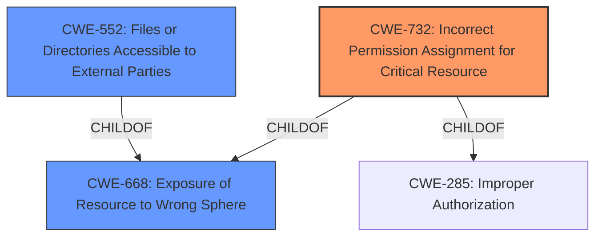

# Analysis Report for CVE-2020-28914

# Vulnerability Analysis Report: CVE-2020-28914

## Description


## Analysis (with Relationship Data)

# Summary
| CWE ID | CWE Name | Confidence | CWE Abstraction Level | CWE Vulnerability Mapping Label | CWE-Vulnerability Mapping Notes |
|---|---|---|---|---|---|
| CWE-732 | Incorrect Permission Assignment for Critical Resource | 0.9 | Class | Allowed-with-Review | Primary CWE |
| CWE-668 | Exposure of Resource to Wrong Sphere | 0.7 | Class | Discouraged | Secondary Candidate |
| CWE-552 | Files or Directories Accessible to External Parties | 0.6 | Base | Allowed | Secondary Candidate |

## Evidence and Confidence

*   **Confidence Score:** 0.8
*   **Evidence Strength:** HIGH

## Relationship Analysis
The primary CWE identified is CWE-732, which is a Class-level CWE. It's related to CWE-285 (Improper Authorization) and CWE-668 (Exposure of Resource to Wrong Sphere) through ChildOf relationships. CWE-668 is also considered but is discouraged as it's too high-level and a class. CWE-552 is another child of CWE-668 and is considered at base level as the container makes files or directories accessible to unauthorized actors. The hierarchical relationships and abstraction levels were considered to select the most appropriate CWE, with a preference for lower-level classifications when sufficient evidence is available.



## Vulnerability Chain
The vulnerability chain starts with the **improper file permissions** which leads to the ability to modify or delete files/directories expected to be read-only.
- The root cause is the **inadequate enforcement of read-only permissions** on bind mounts at the host level.
- This leads to a potential container escape allowing write access to read-only mounted directories.
- Finally, if a container escape occurs, an attacker could potentially write to a directory or file that was intended to be read-only.

## Summary of Analysis
The initial analysis focused on identifying the root cause of the vulnerability, which is the **improper file permissions** that allow unauthorized modification of read-only files/directories.

The vulnerability description states: "When using a Kubernetes hostPath volume and mounting either a file or directory into a container as readonly, the file/directory is mounted as readOnly inside the container, but is still writable inside the guest." This directly indicates an issue with how permissions are assigned or enforced for the resource. The CVE reference links content summary confirms this, stating: "The vulnerability stems from the fact that read-only bind mounts were not being enforced as read-only on the host system, only within the guest kernel."

Given this evidence, CWE-732 (Incorrect Permission Assignment for Critical Resource) is selected as the primary CWE. The description of CWE-732, "The product specifies permissions for a security-critical resource in a way that allows that resource to be read or modified by unintended actors," aligns directly with the vulnerability description. The MITRE mapping guidance for CWE-732 suggests review due to potential misuse, but in this case, the **root cause** is directly related to incorrect permission assignment, making it an appropriate fit.

CWE-668 (Exposure of Resource to Wrong Sphere) was considered but is discouraged as it is too high-level. While the vulnerability does expose resources to the wrong sphere, CWE-732 provides a more specific classification of the underlying weakness.

CWE-552 (Files or Directories Accessible to External Parties) was also considered as a secondary candidate, as the vulnerability makes files accessible that should not be. However, the more specific issue is the incorrect permission assignment, so CWE-732 is a better primary classification.

The final decision is based on the evidence of **improper permission assignment** and the alignment of the vulnerability description with the characteristics of CWE-732. The selection is at the optimal level of specificity, as it directly addresses the **root cause** of the vulnerability.


## CWE Relationship Analysis

Current CWEs represent these abstraction levels: .


### Vulnerability Chain Analysis

**Chain starting from CWE-732:**
- 732 (Incorrect Permission Assignment for Critical Resource) - ROOT


**Chain starting from CWE-285:**
- 285 (Improper Authorization) - ROOT


### CWE Relationship Diagram

```mermaid
graph TD
    classDef primary fill:#f96,stroke:#333,stroke-width:2px
    classDef secondary fill:#69f,stroke:#333
    classDef tertiary fill:#9e9,stroke:#333
```


*Report generated on 2025-04-02 01:03:44*
