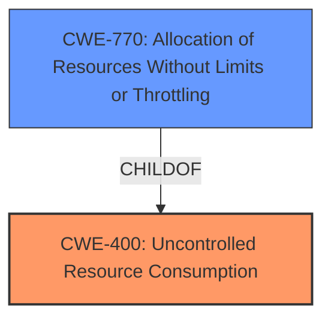

# Analysis for CVE-2020-28944

# Summary
| CWE ID | CWE Name | Confidence | CWE Abstraction Level | CWE Vulnerability Mapping Label | CWE-Vulnerability Mapping Notes |
|---|---|---|---|---|---|
| CWE-400 | Uncontrolled Resource Consumption | 0.8 | Class | Primary | Allowed-with-Review |
| CWE-770 | Allocation of Resources Without Limits or Throttling | 0.7 | Base | Secondary | Allowed |

## Evidence and Confidence

*   **Confidence Score:** 0.75
*   **Evidence Strength:** LOW

## Relationship Analysis
The primary relationship impacting the decision is that CWE-770 is a ChildOf CWE-400. CWE-400 describes the general case of uncontrolled resource consumption, while CWE-770 specifies allocation of resources without limits as a cause. Because the vulnerability description mentions a WKS server responding with a large amount of data, this suggests the server is allocating resources without proper limits.

## Vulnerability Chain
The vulnerability chain involves the WKS server responding slowly or with a large amount of data, leading to uncontrolled resource consumption.
  - Root Cause: **WKS server responding slowly or with a large amount of data**
  - Weakness: **Uncontrolled Resource Consumption (CWE-400)**, **Allocation of Resources Without Limits or Throttling (CWE-770)**
  - Impact: Denial of Service

## Summary of Analysis
The initial analysis considered CWE-400 due to the Denial of Service **impact** mentioned in the description. The retriever results and the description of the vulnerability pointed to a resource consumption issue. However, the evidence is weak due to the lack of information in the CVE Reference Links Content Summary.

The relationship between CWE-400 and CWE-770 influenced the decision. CWE-770 is more specific than CWE-400, but because the evidence is not strong enough to confirm that resources are being allocated without limits, CWE-400 is chosen as the primary CWE.
The CWEs selected are at the optimal level of specificity given the available evidence. More detailed information would be needed to select a more specific variant.

Relevant CWE Information:

# Enhanced Context (25 CWEs)
The following CWEs were identified as potentially relevant to this vulnerability:

## CWE-226: Sensitive Information in Resource Not Removed Before Reuse
**Abstraction Level**: Base
**Similarity Score**: 0.77
**Source**: dense

**Description**:
The product releases a resource such as memory or a file so that it can be made available for reuse, but it does not clear or "zeroize" the information contained in the resource before the product performs a critical state transition or makes the resource available for reuse by other entities.

**Mapping Guidance**:
- Usage: Allowed
- Rationale: This CWE entry is at the Base level of abstraction, which is a preferred level of abstraction for mapping to the root causes of vulnerabilities.

## CWE-1325: Improperly Controlled Sequential Memory Allocation
**Abstraction Level**: Base
**Similarity Score**: 0.77
**Source**: dense

**Description**:
The product manages a group of objects or resources and performs a separate memory allocation for each object, but it does not properly limit the total amount of memory that is consumed by all of the combined objects.

**Mapping Guidance**:
- Usage: Allowed
- Rationale: This CWE entry is at the Base level of abstraction, which is a preferred level of abstraction for mapping to the root causes of vulnerabilities.

## CWE-664: Improper Control of a Resource Through its Lifetime
**Abstraction Level**: Pillar
**Similarity Score**: 0.77
**Source**: dense

**Description**:
The product does not maintain or incorrectly maintains control over a resource throughout its lifetime of creation, use, and release.

**Mapping Guidance**:
- Usage: Discouraged
- Rationale: This CWE entry is high-level when lower-level children are available.

## CWE-404: Improper Resource Shutdown or Release
**Abstraction Level**: Class
**Similarity Score**: 0.77
**Source**: dense

**Description**:
The product does not release or incorrectly releases a resource before it is made available for re-use.

**Mapping Guidance**:
- Usage: Allowed-with-Review
- Rationale: This CWE entry is a Class and might have Base-level children that would be more appropriate

## CWE-405: Asymmetric Resource Consumption (Amplification)
**Abstraction Level**: Class
**Similarity Score**: 0.76
**Source**: dense

**Description**:
The product does not properly control situations in which an adversary can cause the product to consume or produce excessive resources without requiring the adversary to invest equivalent work or otherwise prove authorization, i.e., the adversary's influence is "asymmetric."

**Mapping Guidance**:
- Usage: Allowed-with-Review
- Rationale: This CWE entry is a Class and might have Base-level children that would be more appropriate

## CWE-789: Memory Allocation with Excessive Size Value
**Abstraction Level**: Variant
**Similarity Score**: 0.75
**Source**: dense

**Description**:
The product allocates memory based on an untrusted, large size value, but it does not ensure that the size is within expected limits, allowing arbitrary amounts of memory to be allocated.

**Mapping Guidance**:
- Usage: Allowed
- Rationale: This CWE entry is at the Variant level of abstraction, which is a preferred level of abstraction for mapping to the root causes of vulnerabilities.

## CWE-668: Exposure of Resource to Wrong Sphere
**Abstraction Level**: Class
**Similarity Score**: 0.74
**Source**: dense

**Description**:
The product exposes a resource to the wrong control sphere, providing unintended actors with inappropriate access to the resource.

**Mapping Guidance**:
- Usage: Discouraged
- Rationale: CWE-668 is high-level and is often misused as a catch-all when lower-level CWE IDs might be applicable. It is sometimes used for low-information vulnerability reports [REF-1287]. It is a level-1 Class (i.e., a child of a Pillar). It is not useful for trend analysis.

## CWE-667: Improper Locking
**Abstraction Level**: Class
**Similarity Score**: 0.73
**Source**: dense

**Description**:
The product does not properly acquire or release a lock on a resource, leading to unexpected resource state changes and behaviors.

**Mapping Guidance**:
- Usage: Allowed-with-Review
- Rationale: This CWE entry is a Class and might have Base-level children that would be more appropriate

## CWE-674: Uncontrolled Recursion
**Abstraction Level**: Class
**Similarity Score**: 0.73
**Source**: dense

**Description**:
The product does not properly control the amount of recursion that takes place,  consuming excessive resources, such as allocated memory or the program stack.

**Mapping Guidance**:
- Usage: Allowed-with-Review
- Rationale: This CWE entry is a Class and might have Base-level children that would be more appropriate

## CWE-799: Improper Control of Interaction Frequency
**Abstraction Level**: Class
**Similarity Score**: 0.73
**Source**: dense

**Description**:
The product does not properly limit the number or frequency of interactions that it has with an actor, such as the number of incoming requests.

**Mapping Guidance**:
- Usage: Allowed-with-Review
- Rationale: This CWE entry is a Class and might have Base-level children that would be more appropriate

## CWE-789: Memory Allocation with Excessive Size Value
**Abstraction Level**: Variant
**Similarity Score**: 6618.40
**Source**: sparse

**Description**:
The product allocates memory based on an untrusted, large size value, but it does not ensure that the size is within expected limits, allowing arbitrary amounts of memory to be allocated.

**Mapping Guidance**:
- Usage: Allowed
- Rationale: This CWE entry is at the Variant level of abstraction, which is a preferred level of abstraction for mapping to the root causes of vulnerabilities.

## CWE-770: Allocation of Resources Without Limits or Throttling
**Abstraction Level**: Base
**Similarity Score**: 6456.86
**Source**: sparse

**Description**:
The product allocates a reusable resource or group of resources on behalf of an actor without imposing any restrictions on the size or number of resources that can be allocated, in violation of the intended security policy for that actor.

**Mapping Guidance**:
- Usage: Allowed
- Rationale: This CWE entry is at the Base level of abstraction, which is a preferred level of abstraction for mapping to the root causes of vulnerabilities.

## CWE-1325: Improperly Controlled Sequential Memory Allocation
**Abstraction Level**: Base

# Enhanced Query for CVE-2020-28944

## Vulnerability Description
OX Guard 2.10.4 and earlier allows a Denial of Service via a WKS server that responds slowly or with a large amount of data.

### Vulnerability Description Key Phrases
- **impact:** Denial of Service
- **vector:** WKS server that responds slowly or with a large amount of data
- **product:** OX Guard
- **version:** 2.10.4 and earlier

## CVE Reference Links Content Summary
The provided content does not contain any information related to CVE-2020-28944. It includes information about Open-Xchange products, services, and contact information, as well as a generic lockout message from packetstormsecurity.com.

Therefore, the response is:

UNRELATED

## Retriever Results

### Top Combined Results

| Rank | CWE ID | Name | Abstraction | Usage  | Retrievers | Individual Scores |
|------|--------|------|-------------|-------|------------|-------------------|
| 1 | 1176 | Inefficient CPU Computation | Class | Allowed-with-Review | sparse | 0.054 |
| 2 | 400 | Uncontrolled Resource Consumption | Class | Discouraged | sparse | 0.053 |
| 3 | 770 | Allocation of Resources Without Limits or Throttling | Base | Allowed | sparse | 0.049 |
| 4 | 789 | Memory Allocation with Excessive Size Value | Variant | Allowed | sparse | 0.048 |
| 5 | 328 | Use of Weak Hash | Base | Allowed | sparse | 0.048 |
| 6 | 410 | Insufficient Resource Pool | Base | Allowed | dense | 0.502 |
| 7 | 1325 | Improperly Controlled Sequential Memory Allocation | Base | Allowed | graph | 0.003 |
| 8 | 834 | Excessive Iteration | Class | Discouraged | sparse | 0.048 |
| 9 | 212 | Improper Removal of Sensitive Information Before Storage or Transfer | Base | Allowed | sparse | 0.048 |
| 10 | 674 | Uncontrolled Recursion | Class | Allowed-with-Review | sparse | 0.047 |

# Complete CWE Specifications

## CWE-1176: Inefficient CPU Computation
**Abstraction:** Class
**Status:** Incomplete

### Description
The product performs CPU computations using
         algorithms that are not as efficient as they could be for the
         needs of the developer, i.e., the computations can be
         optimized further.

### Extended Description

This issue can make the product perform more slowly, possibly in ways that are noticeable to the users. If an attacker can influence the amount of computation that must be performed, e.g. by triggering worst-case complexity, then this performance problem might introduce a vulnerability.

### Alternative Terms
None

### Relationships
ChildOf -> CWE-405

### Mapping Guidance
**Usage:** Allowed-with-Review
**Rationale:** This CWE entry is a Class and might have Base-level children that would be more appropriate
**Comments:** Examine children of this entry to see if there is a better fit
**Reasons:**
- Abstraction

### Observed Examples
- **CVE-2022-37734:** Chain: lexer in Java-based GraphQL server does not enforce maximum of tokens early enough (CWE-696), allowing excessive CPU consumption (CWE-1176)

## CWE-400: Uncontrolled Resource Consumption
**Abstraction:** Class
**Status:** Draft

### Description
The product does not properly control the allocation and maintenance of a limited resource, thereby enabling an actor to influence the amount of resources consumed, eventually leading to the exhaustion of available resources.

### Extended Description

Limited resources include memory, file system storage, database connection pool entries, and CPU. If an attacker can trigger the allocation of these limited resources, but the number or size of the resources is not controlled, then the attacker could cause a denial of service that consumes all available resources. This would prevent valid users from accessing the product, and it could potentially have an impact on the surrounding environment. For example, a memory exhaustion attack against an application could slow down the application as well as its host operating system.

There are at least three distinct scenarios which can commonly lead to resource exhaustion:

  - Lack of throttling for the number of allocated resources

  - Losing all references to a resource before reaching the shutdown stage

  - Not closing/returning a resource after processing

Resource exhaustion problems are often result due to an incorrect implementation of the following situations:

  - Error conditions and other exceptional circumstances.

  - Confusion over which part of the program is responsible for releasing the resource.

### Alternative Terms
Resource Exhaustion

### Relationships
ChildOf -> CWE-664

### Mapping Guidance
**Usage:** Discouraged
**Rationale:** CWE-400 is intended for incorrect behaviors in which the product is expected to track and restrict how many resources it consumes, but CWE-400 is often misused because it is conflated with the "technical impact" of vulnerabilities in which resource consumption occurs. It is sometimes used for low-information vulnerability reports. It is a level-1 Class (i.e., a child of a Pillar).
**Comments:** Closely analyze the specific mistake that is causing resource consumption, and perform a CWE mapping for that mistake. Consider children/descendants such as CWE-770: Allocation of Resources Without Limits or Throttling, CWE-771: Missing Reference to Active Allocated Resource, CWE-410: Insufficient Resource Pool, CWE-772: Missing Release of Resource after Effective Lifetime, CWE-834: Excessive Iteration, CWE-405: Asymmetric Resource Consumption (Amplification), and others.
**Reasons:**
- Frequent Misuse

### Additional Notes
**[Maintenance]** "Resource consumption" could be interpreted as a consequence instead of an insecure behavior, so this entry is being considered for modification. It appears to be referenced too frequently when more precise mappings are available. Some of its children, such as CWE-771, might be better considered as a chain.

**[Theoretical]** Vulnerability theory is largely about how behaviors and resources interact. "Resource exhaustion" can be regarded as either a consequence or an attack, depending on the perspective. This entry is an attempt to reflect the underlying weaknesses that enable these attacks (or consequences) to take place.

**[Other]** 

Database queries that take a long time to process are good DoS targets. An attacker would have to write a few lines of Perl code to generate enough traffic to exceed the site's ability to keep up. This would effectively prevent authorized users from using the site at all. Resources can be exploited simply by ensuring that the target machine must do much more work and consume more resources in order to service a request than the attacker must do to initiate a request.

A prime example of this can be found in old switches that were vulnerable to "macof" attacks (so named for a tool developed by Dugsong). These attacks flooded a switch with random IP and MAC address combinations, therefore exhausting the switch's cache, which held the information of which port corresponded to which MAC addresses. Once this cache was exhausted, the switch would fail in an insecure way and would begin to act simply as a hub, broadcasting all traffic on all ports and allowing for basic sniffing attacks.

**[Maintenance]** The Taxonomy_Mappings to ISA/IEC 62443 were added in CWE 4.10, but they are still under review and might change in future CWE versions. These draft mappings were performed by members of the "Mapping CWE to 62443" subgroup of the CWE-CAPEC ICS/OT Special Interest Group (SIG), and their work is incomplete as of CWE 4.10. The mappings are included to facilitate discussion and review by the broader ICS/OT community, and they are likely to change in future CWE versions.

### Observed Examples
- **CVE-2022-21668:** Chain: Python library does not limit the resources used to process images that specify a very large number of bands (CWE-1284), leading to excessive memory consumption (CWE-789) or an integer overflow (CWE-190).
- **CVE-2020-7218:** Go-based workload orchestrator does not limit resource usage with unauthenticated connections, allowing a DoS by flooding the service
- **CVE-2020-3566:** Resource exhaustion in distributed OS because of "insufficient" IGMP queue management, as exploited in the wild per CISA KEV.

## CWE-770: Allocation of Resources Without Limits or Throttling
**Abstraction:** Base
**Status:** Incomplete

### Description
The product allocates a reusable resource or group of resources on behalf of an actor without imposing any restrictions on the size or number of resources that can be allocated, in violation of the intended security policy for that actor.

### Extended Description

Code frequently has to work with limited resources, so programmers must be careful to ensure that resources are not consumed too quickly, or too easily. Without use of quotas, resource limits, or other protection mechanisms, it can be easy for an attacker to consume many resources by rapidly making many requests, or causing larger resources to be used than is needed. When too many resources are allocated, or if a single resource is too large, then it can prevent the code from working correctly, possibly leading to a denial of service.

### Alternative Terms
None

### Relationships
ChildOf -> CWE-400
ChildOf -> CWE-665
ChildOf -> CWE-400

### Mapping Guidance
**Usage:** Allowed
**Rationale:** This CWE entry is at the Base level of abstraction, which is a preferred level of abstraction for mapping to the root causes of vulnerabilities.
**Comments:** Carefully read both the name and description to ensure that this mapping is an appropriate fit. Do not try to 'force' a mapping to a lower-level Base/Variant simply to comply with this preferred level of abstraction.
**Reasons:**
- Acceptable-Use

### Additional Notes
**[Relationship]** This entry is different from uncontrolled resource consumption (CWE-400) in that there are other weaknesses that are related to inability to control resource consumption, such as holding on to a resource too long after use, or not correctly keeping track of active resources so that they can be managed and released when they are finished (CWE-771).

**[Theoretical]** Vulnerability theory is largely about how behaviors and resources interact. "Resource exhaustion" can be regarded as either a consequence or an attack, depending on the perspective. This entry is an attempt to reflect one of the underlying weaknesses that enable these attacks (or consequences) to take place.

### Observed Examples
- **CVE-2022-21668:** Chain: Python library does not limit the resources used to process images that specify a very large number of bands (CWE-1284), leading to excessive memory consumption (CWE-789) or an integer overflow (CWE-190).
- **CVE-2009-4017:** Language interpreter does not restrict the number of temporary files being created when handling a MIME request with a large number of parts..
- **CVE-2009-2726:** Driver does not use a maximum width when invoking sscanf style functions, causing stack consumption.

## CWE-789: Memory Allocation with Excessive Size Value
**Abstraction:** Variant
**Status:** Draft

### Description
The product allocates memory based on an untrusted, large size value, but it does not ensure that the size is within expected limits, allowing arbitrary amounts of memory to be allocated.

### Extended Description
Not provided

### Alternative Terms
Stack Exhaustion: When a weakness allocates excessive memory on the stack, it is often described as "stack exhaustion," which is a technical impact of the weakness. This technical impact is often encountered as a consequence of CWE-789 and/or CWE-1325.

### Relationships
ChildOf -> CWE-770
CanPrecede -> CWE-476

### Mapping Guidance
**Usage:** Allowed
**Rationale:** This CWE entry is at the Variant level of abstraction, which is a preferred level of abstraction for mapping to the root causes of vulnerabilities.
**Comments:** Carefully read both the name and description to ensure that this mapping is an appropriate fit. Do not try to 'force' a mapping to a lower-level Base/Variant simply to comply with this preferred level of abstraction.
**Reasons:**
- Acceptable-Use

### Additional Notes
**[Relationship]** This weakness can be closely associated with integer overflows (CWE-190). Integer overflow attacks would concentrate on providing an extremely large number that triggers an overflow that causes less memory to be allocated than expected. By providing a large value that does not trigger an integer overflow, the attacker could still cause excessive amounts of memory to be allocated.

**[Applicable Platform]** 

Uncontrolled memory allocation is possible in many languages, such as dynamic array allocation in perl or initial size parameters in Collections in Java. However, languages like C and C++ where programmers have the power to more directly control memory management will be more susceptible.

### Observed Examples
- **CVE-2022-21668:** Chain: Python library does not limit the resources used to process images that specify a very large number of bands (CWE-1284), leading to excessive memory consumption (CWE-789) or an integer overflow (CWE-190).
- **CVE-2010-3701:** program uses ::alloca() for encoding messages, but large messages trigger segfault
- **CVE-2008-1708:** memory consumption and daemon exit by specifying a large value in a length field

## CWE-328: Use of Weak Hash
**Abstraction:** Base
**Status:** Draft

### Description
The product uses an algorithm that produces a digest (output value) that does not meet security expectations for a hash function that allows an adversary to reasonably determine the original input (preimage attack), find another input that can produce the same hash (2nd preimage attack), or find multiple inputs that evaluate to the same hash (birthday attack).

### Extended Description

A hash function is defined as an algorithm that maps arbitrarily sized data into a fixed-sized digest (output) such that the following properties hold:

  1. The algorithm is not invertible (also called "one-way" or "not reversible")

  1. The algorithm is deterministic; the same input produces the same digest every time

 Building on this definition, a cryptographic hash function must also ensure that a malicious actor cannot leverage the hash function to have a reasonable chance of success at determining any of the following:

  1. the original input (preimage attack), given only the digest

  1. another input that can produce the same digest (2nd preimage attack), given the original input

  1. a set of two or more inputs that evaluate to the same digest (birthday attack), given the actor can arbitrarily choose the inputs to be hashed and can do so a reasonable amount of times

What is regarded as "reasonable" varies by context and threat model, but in general, "reasonable" could cover any attack that is more efficient than brute force (i.e., on average, attempting half of all possible combinations). Note that some attacks might be more efficient than brute force but are still not regarded as achievable in the real world.

Any algorithm that does not meet the above conditions will generally be considered weak for general use in hashing.

In addition to algorithmic weaknesses, a hash function can be made weak by using the hash in a security context that breaks its security guarantees. For example, using a hash function without a salt for storing passwords (that are sufficiently short) could enable an adversary to create a "rainbow table" [REF-637] to recover the password under certain conditions; this attack works against such hash functions as MD5, SHA-1, and SHA-2.

### Alternative Terms
None

### Relationships
ChildOf -> CWE-326
ChildOf -> CWE-327

### Mapping Guidance
**Usage:** Allowed
**Rationale:** This CWE entry is at the Base level of abstraction, which is a preferred level of abstraction for mapping to the root causes of vulnerabilities.
**Comments:** Carefully read both the name and description to ensure that this mapping is an appropriate fit. Do not try to 'force' a mapping to a lower-level Base/Variant simply to comply with this preferred level of abstraction.
**Reasons:**
- Acceptable-Use

### Additional Notes
**[Maintenance]** Since CWE 4.4, various cryptography-related entries including CWE-328 have been slated for extensive research, analysis, and community consultation to define consistent terminology, improve relationships, and reduce overlap or duplication. As of CWE 4.6, this work is still ongoing.

### Observed Examples
- **CVE-2022-30320:** Programmable Logic Controller (PLC) uses a protocol with a cryptographically insecure hashing algorithm for passwords.
- **CVE-2005-4900:** SHA-1 algorithm is not collision-resistant.
- **CVE-2020-25685:** DNS product uses a weak hash (CRC32 or SHA-1) of the query name, allowing attacker to forge responses by computing domain names with the same hash.

## CWE-410: Insufficient Resource Pool
**Abstraction:** Base
**Status:** Incomplete

### Description
The product's resource pool is not large enough to handle peak demand, which allows an attacker to prevent others from accessing the resource by using a (relatively) large number of requests for resources.

### Extended Description
Frequently the consequence is a "flood" of connection or sessions.

### Alternative Terms
None

### Relationships
ChildOf -> CWE-664
CanPrecede -> CWE-400

### Mapping Guidance
**Usage:** Allowed
**Rationale:** This CWE entry is at the Base level of abstraction, which is a preferred level of abstraction for mapping to the root causes of vulnerabilities.
**Comments:** Carefully read both the name and description to ensure that this mapping is an appropriate fit. Do not try to 'force' a mapping to a lower-level Base/Variant simply to comply with this preferred level of abstraction.
**Reasons:**
- Acceptable-Use

### Observed Examples
- **CVE-1999-1363:** Large number of locks on file exhausts the pool and causes crash.
- **CVE-2001-1340:** Product supports only one connection and does not disconnect a user who does not provide credentials.
- **CVE-2002-0406:** Large number of connections without providing credentials allows connection exhaustion.

## CWE-1325: Improperly Controlled Sequential Memory Allocation
**Abstraction:** Base
**Status:** Incomplete

### Description
The product manages a group of objects or resources and performs a separate memory allocation for each object, but it does not properly limit the total amount of memory that is consumed by all of the combined objects.

### Extended Description

While the product might limit the amount of memory that is allocated in a single operation for a single object (such as a malloc of an array), if an attacker can cause multiple objects to be allocated in separate operations, then this might cause higher total memory consumption than the developer intended, leading to a denial of service.

### Alternative Terms
Stack Exhaustion: When a weakness allocates excessive memory on the stack, it is often described as "stack exhaustion," which is a technical impact of the weakness. This technical impact is often encountered as a consequence of CWE-789 and/or CWE-1325.

### Relationships
ChildOf -> CWE-770
PeerOf -> CWE-789
CanPrecede -> CWE-476

### Mapping Guidance
**Usage:** Allowed
**Rationale:** This CWE entry is at the Base level of abstraction, which is a preferred level of abstraction for mapping to the root causes of vulnerabilities.
**Comments:** Carefully read both the name and description to ensure that this mapping is an appropriate fit. Do not try to 'force' a mapping to a lower-level Base/Variant simply to comply with this preferred level of abstraction.
**Reasons:**
- Acceptable-Use

### Observed Examples
- **CVE-2020-36049:** JavaScript-based packet decoder uses concatenation of many small strings, causing out-of-memory (OOM) condition
- **CVE-2019-20176:** Product allocates a new buffer on the stack for each file in a directory, allowing stack exhaustion
- **CVE-2013-1591:** Chain: an integer overflow (CWE-190) in the image size calculation causes an infinite loop (CWE-835) which sequentially allocates buffers without limits (CWE-1325) until the stack is full.

## CWE-834: Excessive Iteration
**Abstraction:** Class
**Status:** Incomplete

### Description
The product performs an iteration or loop without sufficiently limiting the number of times that the loop is executed.

### Extended Description
If the iteration can be influenced by an attacker, this weakness could allow attackers to consume excessive resources such as CPU or memory. In many cases, a loop does not need to be infinite in order to cause enough resource consumption to adversely affect the product or its host system; it depends on the amount of resources consumed per iteration.

### Alternative Terms
None

### Relationships
ChildOf -> CWE-691

### Mapping Guidance
**Usage:** Discouraged
**Rationale:** This CWE entry is a level-1 Class (i.e., a child of a Pillar). It might have lower-level children that would be more appropriate
**Comments:** Examine children of this entry to see if there is a better fit
**Reasons:**
- Abstraction

### Observed Examples
- **CVE-2011-1027:** Chain: off-by-one error (CWE-193) leads to infinite loop (CWE-835) using invalid hex-encoded characters.
- **CVE-2006-6499:** Chain: web browser crashes due to infinite loop - "bad looping logic [that relies on] floating point math [CWE-1339] to exit the loop [CWE-835]"

## CWE-212: Improper Removal of Sensitive Information Before Storage or Transfer
**Abstraction:** Base
**Status:** Incomplete

### Description
The product stores, transfers, or shares a resource that contains sensitive information, but it does not properly remove that information before the product makes the resource available to unauthorized actors.

### Extended Description

Resources that may contain sensitive data include documents, packets, messages, databases, etc. While this data may be useful to an individual user or small set of users who share the resource, it may need to be removed before the resource can be shared outside of the trusted group. The process of removal is sometimes called cleansing or scrubbing.

For example, a product for editing documents might not remove sensitive data such as reviewer comments or the local pathname where the document is stored. Or, a proxy might not remove an internal IP address from headers before making an outgoing request to an Internet site.

### Alternative Terms
None

### Relationships
ChildOf -> CWE-669
ChildOf -> CWE-669
CanPrecede -> CWE-201

### Mapping Guidance
**Usage:** Allowed
**Rationale:** This CWE entry is at the Base level of abstraction, which is a preferred level of abstraction for mapping to the root causes of vulnerabilities.
**Comments:** Carefully read both the name and description to ensure that this mapping is an appropriate fit. Do not try to 'force' a mapping to a lower-level Base/Variant simply to comply with this preferred level of abstraction.
**Reasons:**
- Acceptable-Use

### Additional Notes
**[Relationship]** This entry is intended to be different from resultant information leaks, including those that occur from improper buffer initialization and reuse, improper encryption, interaction errors, and multiple interpretation errors. This entry could be regarded as a privacy leak, depending on the type of information that is leaked.

**[Relationship]** There is a close association between CWE-226 and CWE-212. The difference is partially that of perspective. CWE-226 is geared towards the final stage of the resource lifecycle, in which the resource is deleted, eliminated, expired, or otherwise released for reuse. Technically, this involves a transfer to a different control sphere, in which the original contents of the resource are no longer relevant. CWE-212, however, is intended for sensitive data in resources that are intentionally shared with others, so they are still active. This distinction is useful from the perspective of the CWE research view (CWE-1000).

**[Terminology]** The terms "cleansing" and "scrubbing" have multiple uses within computing. In information security, these are used for the removal of sensitive data, but they are also used for the modification of incoming/outgoing data so that it conforms to specifications.

### Observed Examples
- **CVE-2019-3733:** Cryptography library does not clear heap memory before release
- **CVE-2005-0406:** Some image editors modify a JPEG image, but the original EXIF thumbnail image is left intact within the JPEG. (Also an interaction error).
- **CVE-2002-0704:** NAT feature in firewall leaks internal IP addresses in ICMP error messages.

## CWE-674: Uncontrolled Recursion
**Abstraction:** Class
**Status:** Draft

### Description
The product does not properly control the amount of recursion that takes place,  consuming excessive resources, such as allocated memory or the program stack.

### Extended Description
Not provided

### Alternative Terms
Stack Exhaustion

### Relationships
ChildOf -> CWE-834

### Mapping Guidance
**Usage:** Allowed-with-Review
**Rationale:** This CWE entry is a Class and might have Base-level children that would be more appropriate
**Comments:** Examine children of this entry to see if there is a better fit
**Reasons:**
- Abstraction

### Observed Examples
- **CVE-2007-1285:** Deeply nested arrays trigger stack exhaustion.
- **CVE-2007-3409:** Self-referencing pointers create infinite loop and resultant stack exhaustion.
- **CVE-2016-10707:** Javascript application accidentally changes input in a way that prevents a recursive call from detecting an exit condition.

