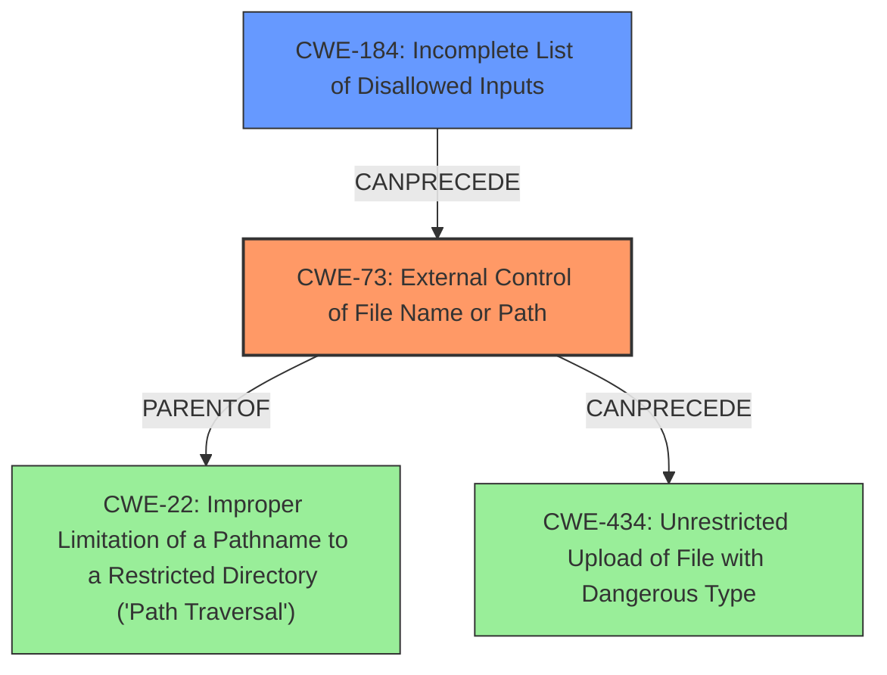

# Analysis for CVE-2020-28949

# Summary

| CWE ID | CWE Name | Confidence | CWE Abstraction Level | CWE Vulnerability Mapping Label | CWE-Vulnerability Mapping Notes |
|---|---|---|---|---|---|
| CWE-73 | External Control of File Name or Path | 0.9 | Base | Allowed | Primary CWE |
| CWE-184 | Incomplete List of Disallowed Inputs | 0.7 | Base | Allowed | Secondary CWE |

## Evidence and Confidence

*   **Confidence Score:** 0.8
*   **Evidence Strength:** HIGH

## Relationship Analysis

The primary relationship influencing the CWE selection is the chain relationship where **improper control** of a filename or path (CWE-73) can be caused by an **incomplete list of disallowed inputs** (CWE-184). This means that a program may be trying to restrict certain file names but fails to include all potentially dangerous inputs. CWE-73 can also lead to path traversal (CWE-22) or file upload vulnerabilities (CWE-434) but the provided context doesn't directly point to them.

## Vulnerability Chain

The vulnerability chain begins with an **incomplete list of disallowed inputs** (CWE-184), which allows for **external control of file name or path** (CWE-73), potentially leading to vulnerabilities like path traversal or file overwrite.

## Summary of Analysis

Initially, I considered several CWEs based on the "Retriever Results" and the vulnerability description. The vulnerability is that Archive_Tar through 1.4.10 has :// filename sanitization only to address phar attacks, and thus any other stream-wrapper attack (such as file:// to overwrite files) can still succeed.

The **rootcause** is **improper sanitization** and the impact is phar attacks. The CVE Reference Links Content Summary indicates "insufficient sanitization of filenames within tar archives" with weaknesses like "Improper input sanitization", "Path traversal vulnerability", and "Object injection through Phar unserialization".

The primary CWE is CWE-73, External Control of File Name or Path, because the vulnerability arises from the application's failure to adequately control the file names used in the tar archive. An attacker can manipulate these file names to perform actions outside the intended scope. This directly aligns with the description of CWE-73, which focuses on the product's use of external input to construct a pathname without proper neutralization of special elements.

I considered CWE-22 (Improper Limitation of a Pathname to a Restricted Directory ('Path Traversal')) because path traversal is listed as a weakness in the CVE summary. However, CWE-73 is a better fit because the initial issue is the external control of the filename itself, which *can* lead to path traversal but doesn't necessarily have to.

I also considered CWE-184 (Incomplete List of Disallowed Inputs) because the vulnerability description notes that only phar attacks are addressed, indicating an incomplete sanitization list. This CWE is included as a secondary weakness because the root cause of the vulnerability lies in the incomplete list of sanitized inputs.

CWE-78 (Improper Neutralization of Special Elements used in an OS Command ('OS Command Injection')) and CWE-79 (Improper Neutralization of Input During Web Page Generation ('Cross-site Scripting')) were considered, but they are not applicable because the vulnerability does not involve OS command injection or cross-site scripting.

CWE-94 (Improper Control of Generation of Code ('Code Injection')) was considered because the CVE summary mentions "Object injection through Phar unserialization". However, the primary issue is not the generation of code, but the lack of control over the filename. Object injection is a potential consequence of the filename vulnerability, but not the root cause.

Ultimately, the selection of CWE-73 and CWE-184 provides the most accurate and specific representation of the vulnerability based on the available evidence.

Relevant CWE Information:

*   **CWE-73:** External Control of File Name or Path
    *   **Description:** The product allows external input to control the filename or path used in file operations.
    *   **Relevance:** The vulnerability is due to insufficient sanitization of filenames, which allows for external control.
*   **CWE-184:** Incomplete List of Disallowed Inputs
    *   **Description:** The product implements a protection mechanism that relies on a list of inputs that are not allowed, but the list is incomplete.
    *   **Relevance:** The vulnerability description states that only phar attacks are addressed, indicating an incomplete list of disallowed inputs.