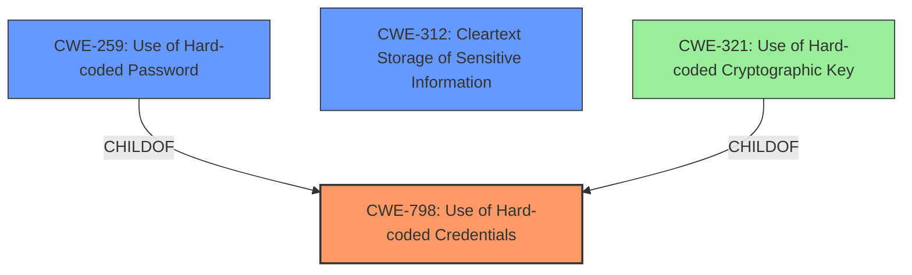

# Analysis Report for CVE-2020-29322

# Vulnerability Analysis Report: CVE-2020-29322

## Description


## Analysis (with Relationship Data)

# Summary
| CWE ID | CWE Name | Confidence | CWE Abstraction Level | CWE Vulnerability Mapping Label | CWE-Vulnerability Mapping Notes |
|---|---|---|---|---|---|
| CWE-798 | Use of Hard-coded Credentials | 1.0 | Base | Primary | Allowed |
| CWE-259 | Use of Hard-coded Password | 0.8 | Variant | Secondary | Allowed |
| CWE-312 | Cleartext Storage of Sensitive Information | 0.7 | Base | Secondary | Allowed |

## Evidence and Confidence

*   **Confidence Score:** 0.9
*   **Evidence Strength:** HIGH

## Relationship Analysis
The primary relationship influencing the CWE selection is the hierarchical relationship. CWE-259 (Use of Hard-coded Password) and CWE-321 (Use of Hard-coded Cryptographic Key) are both children of CWE-798 (Use of Hard-coded Credentials). Given that the vulnerability description explicitly mentions credentials disclosure, CWE-798 is the most appropriate base-level CWE. Since the credentials in question are for telnet, a password-based service, CWE-259 is a secondary, more specific consideration, although the evidence doesn't definitively confirm that the hardcoded value is exclusively a password. CWE-312 (Cleartext Storage of Sensitive Information) is also a plausible weakness, since the hardcoded credentials must be stored somewhere in the firmware in order to be retrieved.



## Vulnerability Chain
The vulnerability chain starts with the **hardcoded credentials** being present in the firmware. This leads to the **cleartext storage** of those credentials. The ability to decompile the firmware provides the attacker with access to these credentials, ultimately leading to credentials disclosure and unauthorized access to the telnet service.

## Summary of Analysis
The analysis is primarily based on the "CVE Reference Links Content Summary" section, which states: "Hardcoded default credentials for telnet service are present in the firmware." This statement directly supports the selection of CWE-798 (Use of Hard-coded Credentials) as the primary CWE. The vulnerability description further reinforces this by stating that the vulnerability leads to "credentials disclosure in telnet service."

The hierarchical relationships between CWEs, specifically the parent-child relationship between CWE-798 and CWE-259, influenced the decision to include CWE-259 as a secondary CWE. While CWE-798 is the broader category, CWE-259 is more specific to passwords, aligning with the "credentials disclosure in telnet service" aspect.

The selection of CWE-798 is at the optimal level of specificity, as it directly addresses the root cause of the vulnerability: the presence of **hard-coded credentials**. While more specific variants exist (e.g., CWE-259), the provided evidence doesn't explicitly confirm that the credentials are *only* passwords, so the broader base CWE is more appropriate as the primary mapping. CWE-312 is also included since the hardcoded credentials have to be stored in the firmware, presumably in cleartext, in order to be extracted via decompilation.

Relevant CWE Information:

# Enhanced Context (25 CWEs)
The following CWEs were identified as potentially relevant to this vulnerability:

## CWE-798: Use of Hard-coded Credentials
**Abstraction Level**: Base
**Similarity Score**: 0.78
**Source**: dense

**Description**:
The product contains **hard-coded credentials**, such as a password or cryptographic key.

**Mapping Guidance**:
- Usage: Allowed
- Rationale: This CWE entry is at the Base level of abstraction, which is a preferred level of abstraction for mapping to the root causes of vulnerabilities.

## CWE-259: Use of Hard-coded Password
**Abstraction:** Variant
**Status:** Draft

### Description
The product contains a **hard-coded password**, which it uses for its own inbound authentication or for outbound communication to external components.

**Mapping Guidance:**
- Usage: Allowed
- Rationale: This CWE entry is at the Variant level of abstraction, which is a preferred level of abstraction for mapping to the root causes of vulnerabilities.

## CWE-312: Cleartext Storage of Sensitive Information
**Abstraction Level**: Base
**Similarity Score**: 0.76
**Source**: dense

**Description**:
The product stores **sensitive information in cleartext** within a resource that might be accessible to another control sphere.

**Mapping Guidance**:
- Usage: Allowed
- Rationale: This CWE entry is at the Base level of abstraction, which is a preferred level of abstraction for mapping to the root causes of vulnerabilities.

### Other CWEs Considered But Not Used:

*   **CWE-321: Use of Hard-coded Cryptographic Key**: Although related to hard-coded credentials, the description focuses specifically on cryptographic keys. The vulnerability description refers to credentials for telnet access, making CWE-259 a better fit as a secondary consideration.
*   **CWE-522: Insufficiently Protected Credentials**: This CWE is about the insecure transmission or storage of credentials. While the credentials are ultimately disclosed, the root cause is the hard-coding, not necessarily the method of storage (although cleartext storage is implied, motivating the use of CWE-312). The hard-coding is the primary weakness.
*   **CWE-912: Hidden Functionality**: While hard-coded credentials *could* be considered hidden functionality, the primary issue is the presence of the credentials themselves, not the fact that they're hidden.
*   **CWE-1188: Initialization of a Resource with an Insecure Default**: This is related, but not as directly applicable as CWE-798. The **hard-coded credentials** are not necessarily an insecure *default* that's intended to be changed. They might be intended to be permanent, even if that's insecure.
*   **CWE-78: Improper Neutralization of Special Elements used in an OS Command ('OS Command Injection')**: This is completely unrelated to the vulnerability.
*   **CWE-184: Incomplete List of Disallowed Inputs**: This is also unrelated to the vulnerability.
*   **CWE-121: Stack-based Buffer Overflow**: This is also unrelated to the vulnerability.
*   **CWE-306: Missing Authentication for Critical Function**: This could be a consequence of using the hardcoded credentials, but is not the root cause.


## CWE Relationship Analysis

Current CWEs represent these abstraction levels: .


### Vulnerability Chain Analysis

**Chain starting from CWE-912:**
- 912 (Hidden Functionality) - ROOT


**Chain starting from CWE-1188:**
- 1188 (Initialization of a Resource with an Insecure Default) - ROOT


### CWE Relationship Diagram

```mermaid
graph TD
    classDef primary fill:#f96,stroke:#333,stroke-width:2px
    classDef secondary fill:#69f,stroke:#333
    classDef tertiary fill:#9e9,stroke:#333
```


*Report generated on 2025-04-02 06:17:22*
