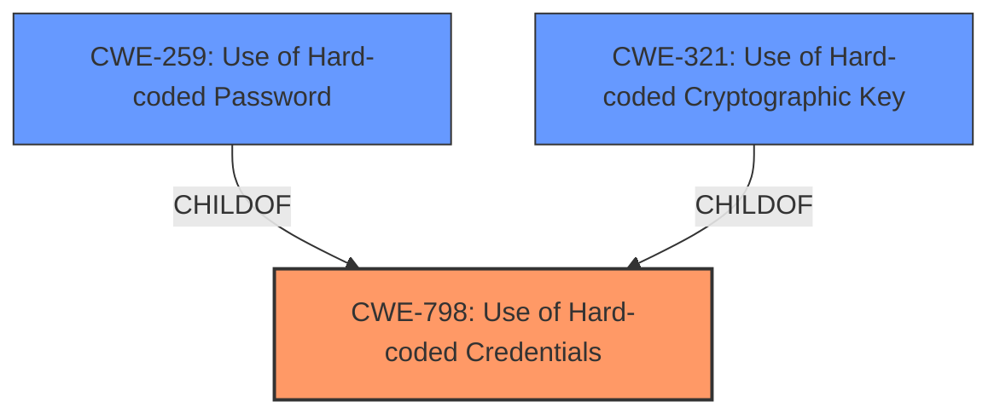

# Enhanced Analysis for CVE-2020-29323

# Summary
| CWE ID | CWE Name | Confidence | CWE Abstraction Level | CWE Vulnerability Mapping Label | CWE-Vulnerability Mapping Notes |
|---|---|---|---|---|---|
| CWE-798 | Use of Hard-coded Credentials | 1 | Base | Allowed | Primary CWE |
| CWE-259 | Use of Hard-coded Password | 0.9 | Variant | Allowed | Secondary Candidate |
| CWE-321 | Use of Hard-coded Cryptographic Key | 0.7 | Variant | Allowed | Secondary Candidate |

## Evidence and Confidence

*   **Confidence Score:** 0.9
*   **Evidence Strength:** HIGH

## Relationship Analysis
The primary CWE is CWE-798, which is a base-level CWE indicating the presence of hard-coded credentials. CWE-259 (Use of Hard-coded Password) and CWE-321 (Use of Hard-coded Cryptographic Key) are variants of CWE-798, representing specific types of hard-coded credentials. Given the vulnerability description explicitly mentions credentials (telnet username/password), CWE-798 is most appropriate as the root cause. While CWE-259 and CWE-321 are more specific, the description doesn't exclusively specify a password or cryptographic key, making CWE-798 a better initial fit.



## Vulnerability Chain
The vulnerability chain starts with the **hard-coded credentials** (CWE-798) within the firmware. An unauthenticated attacker can then **decompile the firmware** to extract these credentials. This leads to **credentials disclosure** and unauthorized access to the telnet service.

## Summary of Analysis
The initial analysis and the provided evidence strongly suggest the presence of hard-coded credentials in the D-Link router's firmware. The "CVE Reference Links Content Summary" explicitly states: "**Root Cause of Vulnerability:** Hardcoded Telnet credentials within the firmware of the D-Link DIR-885L-MFC router." The primary match from similar CVE descriptions is also CWE-798.

The retriever results further support this, listing CWE-259 and CWE-798 as top candidates. The graph relationships show that CWE-259 and CWE-321 are children of CWE-798, indicating a hierarchical relationship. Since the description refers to credentials in general (username and password), and not specifically a password or a cryptographic key, selecting CWE-798 (Use of Hard-coded Credentials) is the most accurate and least presumptive. While CWE-259 is a strong secondary candidate as it relates directly to passwords, the broader term of credentials is more appropriate initially.

The selected CWEs are at the optimal level of specificity. CWE-798 is a base-level CWE, providing a general description of the vulnerability without being overly specific. If more information was provided specifically about the credential type, a more specific variant, such as CWE-259 or CWE-321, could be considered.

Relevant CWE Information:

# Enhanced Context (25 CWEs)
The following CWEs were identified as potentially relevant to this vulnerability:

## CWE-41: Improper Resolution of Path Equivalence
**Abstraction Level**: Base
**Similarity Score**: 0.77
**Source**: dense

**Description**:
The product is vulnerable to file system contents disclosure through path equivalence. Path equivalence involves the use of special characters in file and directory names. The associated manipulations are intended to generate multiple names for the same object.

**Mapping Guidance**:
- Usage: Allowed
- Rationale: This CWE entry is at the Base level of abstraction, which is a preferred level of abstraction for mapping to the root causes of vulnerabilities.

**Why Not Used:** This CWE is not relevant because the vulnerability is about hardcoded credentials, not path equivalence.

## CWE-184: Incomplete List of Disallowed Inputs
**Abstraction Level**: Base
**Similarity Score**: 0.77
**Source**: dense

**Description**:
The product implements a protection mechanism that relies on a list of inputs (or properties of inputs) that are not allowed by policy or otherwise require other action to neutralize before additional processing takes place, but the list is incomplete.

**Mapping Guidance**:
- Usage: Allowed
- Rationale: This CWE entry is at the Base level of abstraction, which is a preferred level of abstraction for mapping to the root causes of vulnerabilities.

**Why Not Used:** This CWE is not relevant because the vulnerability is not about an incomplete list of disallowed inputs.

## CWE-807: Reliance on Untrusted Inputs in a Security Decision
**Abstraction Level**: Base
**Similarity Score**: 0.76
**Source**: dense

**Description**:
The product uses a protection mechanism that relies on the existence or values of an input, but the input can be modified by an untrusted actor in a way that bypasses the protection mechanism.

**Mapping Guidance**:
- Usage: Allowed
- Rationale: This CWE entry is at the Base level of abstraction, which is a preferred level of abstraction for mapping to the root causes of vulnerabilities.

**Why Not Used:** This CWE is not relevant because the vulnerability is not about relying on untrusted inputs in a security decision.

## CWE-425: Direct Request ('Forced Browsing')
**Abstraction Level**: Base
**Similarity Score**: 0.76
**Source**: dense

**Description**:
The web application does not adequately enforce appropriate authorization on all restricted URLs, scripts, or files.

**Mapping Guidance**:
- Usage: Allowed
- Rationale: This CWE entry is at the Base level of abstraction, which is a preferred level of abstraction for mapping to the root causes of vulnerabilities.

**Why Not Used:** This CWE is not relevant because the vulnerability is not about direct request or forced browsing.

## CWE-74: Improper Neutralization of Special Elements in Output Used by a Downstream Component ('Injection')
**Abstraction Level**: Class
**Similarity Score**: 0.76
**Source**: dense

**Description**:
The product constructs all or part of a command, data structure, or record using externally-influenced input from an upstream component, but it does not neutralize or incorrectly neutralizes special elements that could modify how it is parsed or interpreted when it is sent to a downstream component.

**Mapping Guidance**:
- Usage: Discouraged
- Rationale: CWE-74 is high-level and often misused when lower-level weaknesses are more appropriate.

**Why Not Used:** This CWE is not relevant because the vulnerability is not related to injection.

## CWE-668: Exposure of Resource to Wrong Sphere
**Abstraction Level**: Class
**Similarity Score**: 0.76
**Source**: dense

**Description**:
The product exposes a resource to the wrong control sphere, providing unintended actors with inappropriate access to the resource.

**Mapping Guidance**:
- Usage: Discouraged
- Rationale: CWE-668 is high-level and is often misused as a catch-all when lower-level CWE IDs might be applicable. It is sometimes used for low-information vulnerability reports [REF-1287]. It is a level-1 Class (i.e., a child of a Pillar). It is not useful for trend analysis.

**Why Not Used:** This CWE is too general and doesn't accurately describe the root cause.

## CWE-472: External Control of Assumed-Immutable Web Parameter
**Abstraction Level**: Base
**Similarity Score**: 0.76
**Source**: dense

**Description**:
The web application does not sufficiently verify inputs that are assumed to be immutable but are actually externally controllable, such as hidden form fields.

**Mapping Guidance**:
- Usage: Allowed
- Rationale: This CWE entry is at the Base level of abstraction, which is a preferred level of abstraction for mapping to the root causes of vulnerabilities.

**Why Not Used:** This CWE is not relevant because the vulnerability is not about external control of assumed-immutable web parameters.

## CWE-799: Improper Control of Interaction Frequency
**Abstraction Level**: Class
**Similarity Score**: 0.75
**Source**: dense

**Description**:
The product does not properly limit the number or frequency of interactions that it has with an actor, such as the number of incoming requests.

**Mapping Guidance**:
- Usage: Allowed-with-Review
- Rationale: This CWE entry is a Class and might have Base-level children that would be more appropriate

**Why Not Used:** This CWE is not relevant because the vulnerability is not about interaction frequency.

## CWE-552: Files or Directories Accessible to External Parties
**Abstraction Level**: Base
**Similarity Score**: 0.75
**Source**: dense

**Description**:


## CWE Relationship Analysis

Current CWEs represent these abstraction levels: .


### Vulnerability Chain Analysis

**Chain starting from CWE-41:**
- 41 (Improper Resolution of Path Equivalence) - ROOT


**Chain starting from CWE-807:**
- 807 (Reliance on Untrusted Inputs in a Security Decision) - ROOT


### CWE Relationship Diagram

```mermaid
graph TD
    classDef primary fill:#f96,stroke:#333,stroke-width:2px
    classDef secondary fill:#69f,stroke:#333
    classDef tertiary fill:#9e9,stroke:#333
```