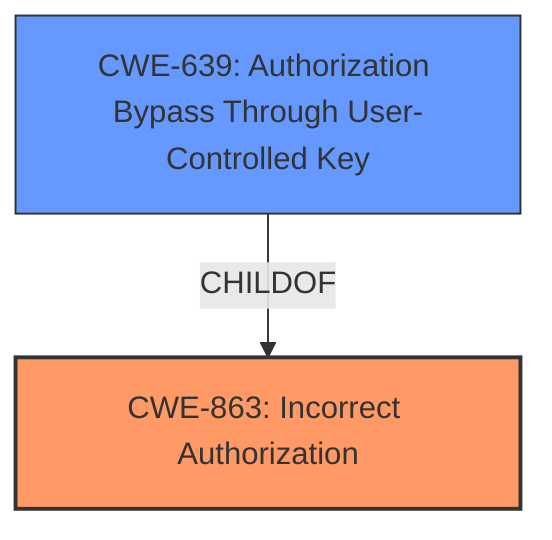

# Raw Analyzer Response for CVE-2020-29605

# Summary
| CWE ID | CWE Name | Confidence | CWE Abstraction Level | CWE Vulnerability Mapping Label | CWE-Vulnerability Mapping Notes |
|---|---|---|---|---|---|
| CWE-863 | Incorrect Authorization | 1 | Class | Primary | Allowed-with-Review |
| CWE-639 | Authorization Bypass Through User-Controlled Key | 0.7 | Base | Secondary Candidate | Allowed |

## Evidence and Confidence

*   **Confidence Score:** 0.8
*   **Evidence Strength:** HIGH

## Relationship Analysis
The primary CWE is CWE-863 (Incorrect Authorization), which is a Class-level CWE. CWE-639 (Authorization Bypass Through User-Controlled Key) is a child of CWE-863 and provides more specific detail about how the authorization bypass occurs. The vulnerability involves **insufficient access-level checks**, which directly relates to incorrect authorization. The attacker crafts a URL to access private issues, indicating the use of a user-controlled key. The relationship shows that the more general CWE-863 is realized through the specific mechanism described in CWE-639.

## Vulnerability Chain
The vulnerability chain starts with **insufficient access-level checks** (CWE-863), leading to a logged-in user gaining unauthorized access to summary fields of private issues. The user crafts a specific URL (using `bug_arr[]`) to bypass the intended access restrictions. This can be viewed as an instance of Authorization Bypass Through User-Controlled Key (CWE-639), as the user manipulates the URL to access data they shouldn't have access to. The final impact is the exposure of sensitive information contained in the private issue summaries.

## Summary of Analysis
The initial assessment, based on the **Vulnerability Description Key Phrases**, points to **insufficient access-level checks** as the root cause. The **CVE Reference Links Content Summary** confirms this by highlighting that the application **does not properly verify if the user has the required permission to access the summary of private issues**.

The Retriever Results list several candidate CWEs, with CWE-863 (Incorrect Authorization) and CWE-639 (Authorization Bypass Through User-Controlled Key) being the most relevant. Given the detailed information about the attack vector (crafted URL with `bug_arr[]`), CWE-639 offers a more precise characterization of the vulnerability.

However, the evidence shows only **insufficient access-level checks** and not that the user is modifying the key value to perform the authorization bypass.

The hierarchical relationship between CWE-863 and CWE-639, with CWE-639 being a child of CWE-863, supports selecting the higher-level CWE-863 as the primary weakness. This decision aligns with the MITRE mapping guidance, which suggests considering more specific Base-level children but not forcing a mapping.

Therefore, the final decision is to map the vulnerability to CWE-863 (Incorrect Authorization) as the primary CWE. I am adding CWE-639 as a secondary candidate because the attacker is using a crafted URL.

Relevant CWE Information:

# Enhanced Context (25 CWEs)

## CWE-538: Insertion of Sensitive Information into Externally-Accessible File or Directory
This CWE is not selected because the vulnerability is about authorization, not about placing sensitive information into externally accessible files.

## CWE-639: Authorization Bypass Through User-Controlled Key
CWE-639 is considered as a secondary candidate because the attacker is crafting a URL, indicating a modification to the key value.
**Justification:** Though listed as a top result, the **Vulnerability Description Key Phrases** and the **CVE Reference Links Content Summary** point to an **insufficient access-level checks** and do not necessarily state that the user is modifying the key value, but they are manipulating the URL. It's a possibility.

## CWE-359: Exposure of Private Personal Information to an Unauthorized Actor
This CWE describes the impact of the vulnerability but not the root cause, so it is not selected.

## CWE-668: Exposure of Resource to Wrong Sphere
This CWE is too high-level and not specific enough.

## CWE-74: Improper Neutralization of Special Elements in Output Used by a Downstream Component ('Injection')
This CWE is not relevant to the vulnerability.

## CWE-212: Improper Removal of Sensitive Information Before Storage or Transfer
This CWE is not related to the vulnerability description.

## CWE-41: Improper Resolution of Path Equivalence
This CWE is not relevant to the vulnerability.

## CWE-472: External Control of Assumed-Immutable Web Parameter
This CWE is about web parameters, which is not the primary concern.

## CWE-807: Reliance on Untrusted Inputs in a Security Decision
This CWE is not directly related to the vulnerability.

## CWE-552: Files or Directories Accessible to External Parties
This CWE is about file/directory access and is not the main issue.

## CWE-863: Incorrect Authorization
**Justification:** This CWE is selected as the primary CWE due to the **insufficient access-level checks**, which directly align with the definition of incorrect authorization.

## CWE-285: Improper Authorization
This CWE is a parent of CWE-863, so CWE-863 is more specific.

## CWE-116: Improper Encoding or Escaping of Output
This CWE is not relevant to the vulnerability.

## CWE-425: Direct Request ('Forced Browsing')
This CWE is not directly related to the vulnerability.

## CWE-22: Improper Limitation of a Pathname to a Restricted Directory ('Path Traversal')
This CWE is not related to the vulnerability.

## CWE-471: Modification of Assumed-Immutable Data (MAID)
This CWE is not relevant to the vulnerability.

## CWE-613: Insufficient Session Expiration
This CWE is not related to the vulnerability.

## CWE-98: Improper Control of Filename for Include/Require Statement in PHP Program ('PHP Remote File Inclusion')
This CWE is not relevant to the vulnerability.

## CWE-266: Incorrect Privilege Assignment
This CWE is related to privilege assignment, which is not the primary issue.

## CWE-202: Exposure of Sensitive Information Through Data Queries
This CWE describes the impact and not the root cause.

## CWE-178: Improper Handling of Case Sensitivity
This CWE is not relevant to the vulnerability.

## CWE-1289: Improper Validation of Unsafe Equivalence in Input
This CWE is not relevant to the vulnerability.

## CWE-209: Generation of Error Message Containing Sensitive Information
This CWE is not relevant to the vulnerability.

## CWE-73: External Control of File Name or Path
This CWE is not relevant to the vulnerability.