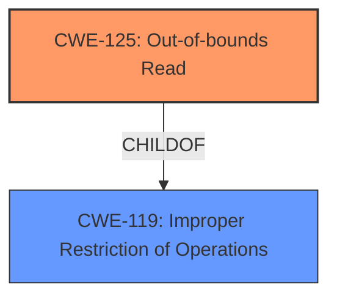

# Analysis for CVE-2020-29608

# Summary
| CWE ID  | CWE Name | Confidence | CWE Abstraction Level | CWE Vulnerability Mapping Label | CWE-Vulnerability Mapping Notes |
| ------------- | ------------- | ------------- | ------------- | ------------- | ------------- |
| CWE-125 | Out-of-bounds Read | 1.0 | Base | Allowed | Primary CWE |
| CWE-119 | Improper Restriction of Operations within the Bounds of a Memory Buffer | 0.7 | Class | Discouraged | Secondary Candidate |

## Evidence and Confidence

*   **Confidence Score:** 0.9
*   **Evidence Strength:** HIGH

## Relationship Analysis
The primary relationship influencing the CWE selection is the ChildOf relationship between CWE-125 and CWE-119. CWE-125 is a more specific case of CWE-119, which deals with out-of-bounds access in general. Since the vulnerability description specifically mentions an **out-of-bounds read**, CWE-125 is the more appropriate choice. The graph also shows that CWE-125 can be preceded by other weaknesses like CWE-130 (Inconsistent Interpretation of Data).

## Vulnerability Chain
The vulnerability chain is quite simple:
1.  **Root Cause:** **Out-of-bounds read** in the FontParser component.
2.  **Impact:** Potential memory leak, exploitable by a remote attacker.

## Summary of Analysis
The initial analysis strongly suggests CWE-125 as the primary CWE due to the explicit mention of an **out-of-bounds read**. The retriever results also list CWE-125 as a candidate.

The vulnerability description clearly states: "An **out-of-bounds read** was addressed with improved bounds checking." The "CVE Reference Links Content Summary" confirms this by stating, "Root Cause: An **out-of-bounds read** vulnerability."

CWE-125 is at the Base level of abstraction, which is preferred. The mapping guidance for CWE-125 states: "This CWE entry is at the Base level of abstraction, which is a preferred level of abstraction for mapping to the root causes of vulnerabilities."

CWE-119 was considered but is a more general class. While technically correct, CWE-125 provides more specific information about the nature of the vulnerability, and the description of CWE-119 says it's commonly misused and to consider its children for mapping.

The final decision to use CWE-125 is based on the explicit evidence in the vulnerability description, the retriever results, and the CWE specifications, which all point to **out-of-bounds read** as the root cause.

Relevant CWE Information:

# Enhanced Context (25 CWEs)
The following CWEs were identified as potentially relevant to this vulnerability:

## CWE-404: Improper Resource Shutdown or Release
**Abstraction Level**: Class
**Similarity Score**: 0.76
**Source**: dense

**Description**:
The product does not release or incorrectly releases a resource before it is made available for re-use.

**Mapping Guidance**:
- Usage: Allowed-with-Review
- Rationale: This CWE entry is a Class and might have Base-level children that would be more appropriate

## CWE-125: Out-of-bounds Read
**Abstraction Level**: Base
**Similarity Score**: 6406.70
**Source**: sparse

**Description**:
The product reads data past the end, or before the beginning, of the intended buffer.

**Mapping Guidance**:
- Usage: Allowed
- Rationale: This CWE entry is at the Base level of abstraction, which is a preferred level of abstraction for mapping to the root causes of vulnerabilities.

## CWE-119: Improper Restriction of Operations within the Bounds of a Memory Buffer
**Abstraction Level**: Class
**Similarity Score**: 6183.50
**Source**: sparse

**Description**:
The product performs operations on a memory buffer, but it reads from or writes to a memory location outside the buffer's intended boundary. This may result in read or write operations on unexpected memory locations that could be linked to other variables, data structures, or internal program data.

**Mapping Guidance**:
- Usage: Discouraged
- Rationale: CWE-119 is commonly misused in low-information vulnerability reports when lower-level CWEs could be used instead, or when more details about the vulnerability are available.

## CWE-787: Out-of-bounds Write
**Abstraction Level**: base
**Similarity Score**: 4.33
**Source**: graph

**Description**:
CWE-787: Out-of-bounds Write

**Mapping Guidance**:
- Usage: Allowed
- Rationale: This CWE entry is at the Base level of abstraction, which is a preferred level of abstraction for mapping to the root causes of vulnerabilities.

## CWE-125: Out-of-bounds Read (Primary CWE)

*   **Technical Explanation:** The vulnerability occurs when the software reads data beyond the allocated buffer. In this case, the **out-of-bounds read** is in the `FontParser` component and can be triggered by a maliciously crafted font file.
*   **Security Implications:** This can lead to information disclosure, as the attacker can potentially read sensitive data from memory.
*   **Relationship:** CWE-125 is a child of CWE-119 (Improper Restriction of Operations within the Bounds of a Memory Buffer), making it a more specific instance of a memory bounds issue.
*   **Mapping Guidance:** The MITRE mapping guidance allows the use of CWE-125 as it is a Base level CWE.
*   **Confidence:** 1.0

## CWE-119: Improper Restriction of Operations within the Bounds of a Memory Buffer (Secondary Candidate)

*   **Technical Explanation:** This CWE describes a general class of vulnerabilities where operations are performed outside the intended boundaries of a memory buffer. While the specific vulnerability is an **out-of-bounds read**, CWE-119 represents the broader issue of improper memory boundary handling.
*   **Security Implications:** This can lead to various issues, including information disclosure, denial of service, or arbitrary code execution.
*   **Relationship:** CWE-119 is a parent of CWE-125.
*   **Mapping Guidance:** The MITRE mapping guidance discourages the use of CWE-119 when more specific CWEs are available.
*   **Confidence:** 0.7

## Considered but not Used

*   **CWE-787 (Out-of-bounds Write):** This was not selected because the vulnerability description explicitly mentions an **out-of-bounds read**, not a write.
*   **CWE-843 (Access of Resource Using Incompatible Type):** This was not selected as the vulnerability is related to reading memory out of the bounds, not the type confusion.
*   **CWE-665 (Improper Initialization):** This was not selected because the vulnerability is not about improper initialization of resources but about reading memory out of bounds.
*   **CWE-667 (Improper Locking):** This was not selected because there's no indication of locking issues in the vulnerability description.
*   **CWE-415 (Double Free):** This was not selected because the vulnerability is not about freeing the same memory twice.
*   **CWE-20 (Improper Input Validation):** This was not selected because the description focuses on the out-of-bounds read itself, rather than a failure to validate input. Though crafted input causes the condition, the vulnerability itself is the read.