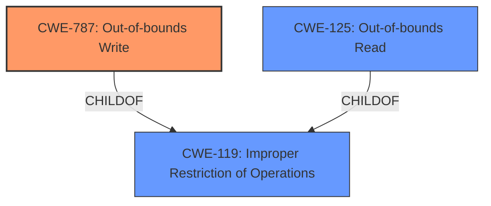

# Analysis for CVE-2020-29616

# Summary
| CWE ID  | CWE Name                                                     | Confidence | CWE Abstraction Level | CWE Vulnerability Mapping Label | CWE-Vulnerability Mapping Notes |
| :-------- | :----------------------------------------------------------- | :--------- | :-------------------- | :------------------------------ | :------------------------------ |
| CWE-787   | Out-of-bounds Write                                          | 0.9        | Base                  | Primary                         | Allowed                       |
| CWE-125   | Out-of-bounds Read                                           | 0.7        | Base                  | Secondary                       | Allowed                       |
| CWE-119   | Improper Restriction of Operations within the Bounds of a Memory Buffer | 0.6        | Class                  | Secondary                       | Allowed                       |

## Evidence and Confidence

*   **Confidence Score:** 0.8
*   **Evidence Strength:** MEDIUM

## Relationship Analysis
The primary weakness is CWE-787 (Out-of-bounds Write), which is a base-level CWE. It is a child of CWE-119 (Improper Restriction of Operations within the Bounds of a Memory Buffer), indicating a more general class of memory safety issues. CWE-125 (Out-of-bounds Read) is also considered as a related weakness, as memory corruption often involves both reading and writing beyond the intended buffer boundaries. The relationships influenced the decision to include CWE-119 and CWE-125 as secondary CWEs providing a broader context of memory safety issues.

## Vulnerability Chain
The vulnerability chain starts with a **maliciously crafted image** leading to **memory corruption**, specifically an **out-of-bounds write**. This **out-of-bounds write** can then lead to arbitrary code execution.
  - Maliciously crafted image -> Memory Corruption (Out-of-bounds Write) -> Arbitrary Code Execution

## Summary of Analysis
The initial assessment identified **memory corruption** due to a **maliciously crafted image** as the root cause, which led to the selection of CWE-787 (Out-of-bounds Write) as the primary CWE. The retriever results also supported this choice. Further analysis of the vulnerability description and the relationships between CWEs indicated that CWE-125 (Out-of-bounds Read) and CWE-119 (Improper Restriction of Operations within the Bounds of a Memory Buffer) were also relevant, providing additional context to the **memory corruption** issue.

The decision to select CWE-787 as the primary CWE is based on the following evidence:
- **Vulnerability Description Key Phrases:** "**weakness:** **memory corruption**"
- **CVE Reference Links Content Summary:** "**Root cause of vulnerability:** A memory corruption issue."
- **Retriever Results:** CWE-787 had the highest score.

The selection of CWE-787, CWE-125, and CWE-119 offers an optimal level of specificity, accurately reflecting the nature of the vulnerability.

Relevant CWE Information:

# Enhanced Context (25 CWEs)

## CWE-787: Out-of-bounds Write
**CWE-787 (Out-of-bounds Write)** is selected because the vulnerability description explicitly mentions **memory corruption**, and the fix involved improved input validation. An out-of-bounds write is a direct cause of memory corruption, where data is written past the end or before the beginning of the intended buffer. This can lead to arbitrary code execution, as stated in the vulnerability description. The Alternative Terms section of CWE-787 even states: "Memory Corruption: Often used to describe the consequences of writing to memory outside the bounds of a buffer, or to memory that is otherwise invalid."
- **How the vulnerability's details match the CWE's characteristics:** The vulnerability involves writing data outside the intended buffer boundaries, leading to memory corruption.
- **The security implications and potential impact:** The impact is arbitrary code execution.
- **Any parent-child relationships or chain patterns that influenced your mapping:** CWE-787 is a child of CWE-119, providing a broader context.
- **Whether the weakness is primary or secondary in the vulnerability:** CWE-787 is the primary weakness.
- **How the official MITRE mapping guidance influenced your decision:** The MITRE mapping guidance allows the use of CWE-787.

## CWE-125: Out-of-bounds Read
**CWE-125 (Out-of-bounds Read)** is selected as a secondary CWE because memory corruption often involves both reading and writing outside of the intended buffer boundaries. Although the vulnerability description primarily focuses on the "write" aspect, the possibility of an out-of-bounds read contributing to the vulnerability cannot be ruled out.
- **How the vulnerability's details match the CWE's characteristics:** It's possible that reading outside buffer boundaries is involved.
- **The security implications and potential impact:** Information disclosure or unexpected behavior.
- **Any parent-child relationships or chain patterns that influenced your mapping:** CWE-125 is a child of CWE-119.
- **Whether the weakness is primary or secondary in the vulnerability:** CWE-125 is a secondary weakness.
- **How the official MITRE mapping guidance influenced your decision:** The MITRE mapping guidance allows the use of CWE-125.

## CWE-119: Improper Restriction of Operations within the Bounds of a Memory Buffer
**CWE-119 (Improper Restriction of Operations within the Bounds of a Memory Buffer)** is selected as a secondary CWE because it is a parent of CWE-787 and CWE-125. It represents a broader class of memory safety issues, where operations are not properly restricted within the bounds of a memory buffer. The **memory corruption** issue can be seen as a specific instance of this more general weakness.
- **How the vulnerability's details match the CWE's characteristics:** Operations are not properly restricted within memory buffer boundaries.
- **The security implications and potential impact:** Memory corruption, arbitrary code execution.
- **Any parent-child relationships or chain patterns that influenced your mapping:** CWE-119 is the parent of CWE-787 and CWE-125.
- **Whether the weakness is primary or secondary in the vulnerability:** CWE-119 is a secondary weakness.
- **How the official MITRE mapping guidance influenced your decision:** The MITRE mapping guidance allows the use of CWE-119.

## CWEs Considered But Not Used:

- CWE-20 (Improper Input Validation): While the fix mentions improved input validation, the root cause is memory corruption, making CWE-787 a more specific and appropriate choice. Also, CWE-20 is discouraged.
- CWE-415 (Double Free): There is no evidence of a double free in the description.
- CWE-843 (Access of Resource Using Incompatible Type ('Type Confusion')): There is no explicit mention of type confusion in the description.
- CWE-665 (Improper Initialization): There is no evidence of improper initialization.
- CWE-123 (Write-what-where Condition): This is similar to CWE-787, but less direct.
- CWE-122 (Heap-based Buffer Overflow): The description does not specify the location of the buffer (heap or stack).
- CWE-1263 (Improper Physical Access Control): This is irrelevant to the vulnerability.