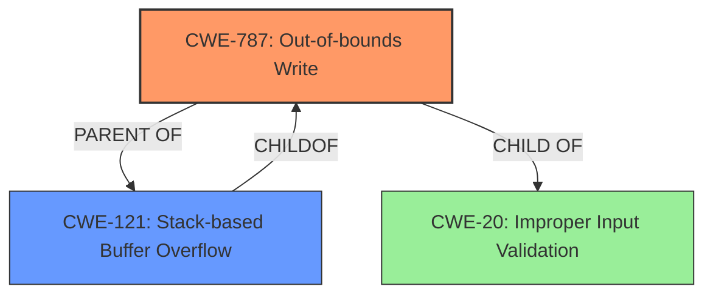

# Enhanced Analysis for CVE-2020-3118

# Summary
| CWE ID  | CWE Name  | Confidence | CWE Abstraction Level | CWE Vulnerability Mapping Label | CWE-Vulnerability Mapping Notes |
|---|---|---|---|---|---|
| CWE-787 | Out-of-bounds Write | 1.0 | Base | Allowed | Primary CWE |
| CWE-121 | Stack-based Buffer Overflow | 0.8 | Variant | Allowed | Secondary Candidate |
| CWE-20 | Improper Input Validation | 0.6 | Class | Discouraged | Secondary Candidate |

## Evidence and Confidence

*   **Confidence Score:** 0.9
*   **Evidence Strength:** HIGH

## Relationship Analysis
The primary CWE, CWE-787 (**Out-of-bounds Write**), is the base weakness. CWE-121 (**Stack-based Buffer Overflow**) is a variant of both CWE-787 and CWE-788. CWE-20 (**Improper Input Validation**) is a class-level weakness, and a parent of many input validation related weaknesses. Choosing CWE-787 provides the best balance of specificity and accuracy.



## Vulnerability Chain
The vulnerability chain starts with **improper validation of string input**, leading to a **stack overflow**, and ultimately resulting in arbitrary code execution.

## Summary of Analysis
The initial analysis correctly identified CWE-787 as the primary weakness, due to the **stack overflow** caused by **improper validation of string input**. The evidence provided supports this assessment. The graph relationships further clarify the connection between CWE-787 and its variant CWE-121. CWE-787 offers the optimal level of specificity.

The vulnerability description states: "The vulnerability is due to **improper validation of string input** from certain fields in Cisco Discovery Protocol messages... A successful exploit could allow the attacker to cause a **stack overflow**, which could allow the attacker to execute arbitrary code with administrative privileges on an affected device." This statement clearly indicates that the root cause is **improper input validation** which leads to a **stack overflow** and code execution.

The CVE Reference Links Content Summary also supports this analysis: "The vulnerability stems from the **improper validation of string input** within certain fields of Cisco Discovery Protocol (CDP) messages." and "A successful exploit can lead to a **stack overflow**, enabling the attacker to execute arbitrary code with administrative privileges on the affected device."

*   **CWE-787: Out-of-bounds Write**
    *   The vulnerability involves writing data beyond the intended buffer boundary due to **improper validation of string input**. This aligns with the description of CWE-787, which focuses on writing data outside the intended buffer.
    *   Security Implications: An attacker can overwrite adjacent memory regions, potentially corrupting program data, injecting malicious code, or causing a denial-of-service condition.
    *   Relationship: CWE-787 is a base level CWE, which is the preferred level of abstraction, and also a parent of CWE-121 (**Stack-based Buffer Overflow**).
    *   Mapping Guidance: The usage is ALLOWED.
    *   Confidence: 1.0
*   **CWE-121: Stack-based Buffer Overflow**
    *   The vulnerability results in a stack overflow, which is a specific type of buffer overflow where the buffer is located on the stack. This aligns with the description of CWE-121.
    *   Security Implications: An attacker can overwrite the return address on the stack, hijacking control flow and executing arbitrary code.
    *   Relationship: CWE-121 is a variant of both CWE-787 (**Out-of-bounds Write**) and CWE-788 (**Access of Memory Location After the End of Buffer**).
    *   Mapping Guidance: The usage is ALLOWED.
    *   Confidence: 0.8
*   **CWE-20: Improper Input Validation**
    *   The vulnerability stems from the **improper validation of string input**. While this is true, it's a high-level class CWE. The more specific CWE-787 captures the nature of the vulnerability better.
    *   Security Implications: An attacker can provide unexpected or malicious input that is not properly handled, leading to various vulnerabilities.
    *   Relationship: CWE-20 is a class-level CWE, and a parent of many input validation related weaknesses.
    *   Mapping Guidance: The usage is DISCOURAGED.
    *   Confidence: 0.6

Other CWEs Considered but Not Used:

*   CWE-190 (**Integer Overflow or Wraparound**): While integer overflows can sometimes lead to buffer overflows, there's no explicit mention of integer manipulation in the provided vulnerability description. Thus, it is not appropriate.
*   CWE-1284 (**Improper Validation of Specified Quantity in Input**): While there's **improper input validation**, it's not specifically related to a quantity or size. This CWE is too specific and doesn't accurately represent the vulnerability.
*   CWE-401 (**Missing Release of Memory after Effective Lifetime**): This is a memory leak issue, which is not mentioned in the description, so this is not appropriate.
*   CWE-119 (**Improper Restriction of Operations within the Bounds of a Memory Buffer**): This is a more general class-level CWE that's discouraged for use when more specific CWEs like CWE-787 are available.
*   CWE-78 (**Improper Neutralization of Special Elements used in an OS Command ('OS Command Injection')**): There's no indication of OS command injection in the description.
*   CWE-129 (**Improper Validation of Array Index**): There's no mention of an array index being improperly validated.
*   CWE-400 (**Uncontrolled Resource Consumption**): This is a resource exhaustion issue, which is not mentioned in the description, so this is not appropriate.
*   CWE-346 (**Origin Validation Error**): Not relevant to the vulnerability description.


## CWE Relationship Analysis

Current CWEs represent these abstraction levels: .


### Vulnerability Chain Analysis

**Chain starting from CWE-787:**
- 787 (Out-of-bounds Write) - ROOT


**Chain starting from CWE-121:**
- 121 (Stack-based Buffer Overflow) - ROOT


### CWE Relationship Diagram

```mermaid
graph TD
    classDef primary fill:#f96,stroke:#333,stroke-width:2px
    classDef secondary fill:#69f,stroke:#333
    classDef tertiary fill:#9e9,stroke:#333
```