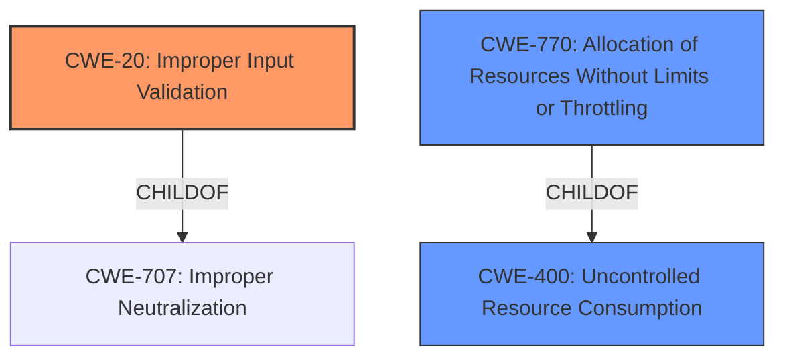

# Analysis Report for CVE-2020-3161

# Vulnerability Analysis Report: CVE-2020-3161

## Description


## Analysis (with Relationship Data)

# Summary
| CWE ID | CWE Name | Confidence | CWE Abstraction Level | CWE Vulnerability Mapping Label | CWE-Vulnerability Mapping Notes |
|---|---|---|---|---|---|
| CWE-20 | Improper Input Validation | 1.0 | Class | Primary | Discouraged |
| CWE-770 | Allocation of Resources Without Limits or Throttling | 0.7 | Base | Secondary | Allowed |

## Evidence and Confidence

*   **Confidence Score:** 0.9
*   **Evidence Strength:** HIGH

## Relationship Analysis
The primary CWE is CWE-20, which is a Class-level CWE. While the retriever suggests more specific Base or Variant level CWEs, the description of the vulnerability aligns directly with **improper input validation** as the root cause. CWE-20 is a child of CWE-707 (Improper Neutralization) and has child CWEs like CWE-1284 (Improper Validation of Specified Quantity in Input). While CWE-1284 is more specific, the provided information doesn't indicate the specific type of input that lacks validation; therefore, the general CWE-20 is more appropriate.

CWE-770 (Allocation of Resources Without Limits or Throttling) is considered because the impact of the **lack of input validation** leads to a denial of service, which could be related to uncontrolled resource consumption. CWE-770 is a child of CWE-400 (Uncontrolled Resource Consumption).



## Vulnerability Chain
The vulnerability chain starts with **improper input validation** (CWE-20), which allows an attacker to send a crafted HTTP request. This can lead to two potential impacts: remote code execution with root privileges or a denial of service (DoS) condition. If the DoS condition is triggered due to resource exhaustion, CWE-770 might be applicable.

## Summary of Analysis
The initial assessment points to CWE-20 (Improper Input Validation) as the primary weakness. The vulnerability description explicitly states: "The vulnerability is due to a **lack of proper input validation** of HTTP requests." This statement provides direct evidence supporting the selection of CWE-20. The CVSS details in "CVE Reference Links Content Summary" also lists CWE-20 (Improper Input Validation) as the cause.

The retriever results also list CWE-20 as the top candidate. However, the mapping guidance discourages using CWE-20 because it is often misused and suggests considering more specific children. While the retriever lists CWE-1284 (Improper Validation of Specified Quantity in Input), there's no specific information about the "quantity" aspect. Therefore, sticking with the general CWE-20 is more appropriate given the available evidence, overriding the general mapping guidance.

CWE-770 (Allocation of Resources Without Limits or Throttling) is considered as a secondary CWE because the lack of input validation can lead to a denial-of-service (DoS) condition, potentially due to resource exhaustion. However, this is an impact rather than a direct root cause, so it's a secondary consideration.

The selected CWEs are at the optimal level of specificity because the provided evidence clearly points to a general **lack of input validation** (CWE-20) without specifying the type of input. And the potential DoS condition from **lack of input validation** may cause resource exhaustion (CWE-770).

Relevant CWE Information:
# Enhanced Context (25 CWEs)
The following CWEs were identified as potentially relevant to this vulnerability:

## CWE-404: Improper Resource Shutdown or Release
**Abstraction Level**: Class
**Similarity Score**: 0.76
**Source**: dense
NOT USED: No evidence of improper resource shutdown.

## CWE-131: Incorrect Calculation of Buffer Size
**Abstraction Level**: Base
**Similarity Score**: 0.76
**Source**: dense
NOT USED: No evidence of buffer size calculations.

## CWE-789: Memory Allocation with Excessive Size Value
**Abstraction Level**: Variant
**Similarity Score**: 0.76
**Source**: dense
NOT USED: No direct evidence of excessive memory allocation.

## CWE-191: Integer Underflow (Wrap or Wraparound)
**Abstraction Level**: Base
**Similarity Score**: 0.76
**Source**: dense
NOT USED: No evidence of integer underflow.

## CWE-226: Sensitive Information in Resource Not Removed Before Reuse
**Abstraction Level**: Base
**Similarity Score**: 0.75
**Source**: dense
NOT USED: No evidence of sensitive information reuse.

## CWE-667: Improper Locking
**Abstraction Level**: Class
**Similarity Score**: 0.75
**Source**: dense
NOT USED: No evidence of locking issues.

## CWE-1325: Improperly Controlled Sequential Memory Allocation
**Abstraction Level**: Base
**Similarity Score**: 0.75
**Source**: dense
NOT USED: No evidence of sequential memory allocation issues.

## CWE-119: Improper Restriction of Operations within the Bounds of a Memory Buffer
**Abstraction Level**: Class
**Similarity Score**: 0.74
**Source**: dense
NOT USED: While possible, the description doesn't specify out-of-bounds operations.

## CWE-125: Out-of-bounds Read
**Abstraction Level**: Base
**Similarity Score**: 0.74
**Source**: dense
NOT USED: While possible, the description doesn't specify out-of-bounds reads.

## CWE-754: Improper Check for Unusual or Exceptional Conditions
**Abstraction Level**: Class
**Similarity Score**: 0.74
**Source**: dense
NOT USED: Too generic; doesn't fit the specific weakness.

## CWE-190: Integer Overflow or Wraparound
**Abstraction Level**: Base
**Similarity Score**: 8779.68
**Source**: sparse
NOT USED: No evidence of integer overflow.

## CWE-1284: Improper Validation of Specified Quantity in Input
**Abstraction Level**: Base
**Similarity Score**: 8638.08
**Source**: sparse
NOT USED: While a child of CWE-20, there is no evidence to show that a quantity was not validated.

## CWE-770: Allocation of Resources Without Limits or Throttling
**Abstraction Level**: Base
**Similarity Score**: 8487.49
**Source**: sparse
CONSIDERED: The DoS impact could be related to uncontrolled resource consumption, making this a possible secondary CWE.

## CWE-789: Memory Allocation with Excessive Size Value
**Abstraction Level**: Variant
**Similarity Score**: 8409.56
**Source**: sparse
NOT USED: No direct evidence of excessive memory allocation.

## CWE-119: Improper Restriction of Operations within the Bounds of a Memory Buffer
**Abstraction Level**: Class
**Similarity Score**: 8268.45
**Source**: sparse
NOT USED: While possible, the description doesn't specify out-of-bounds operations.

## CWE-41: Improper Resolution of Path Equivalence
**Abstraction Level**: base
**Similarity Score**: 5.03
**Source**: graph
NOT USED: No evidence of path equivalence issues.

## CWE-22: Improper Limitation of a Pathname to a Restricted Directory ('Path Traversal')
**Abstraction Level**: base
**Similarity Score**: 4.33
**Source**: graph
NOT USED: No evidence of path traversal issues.

## CWE-770: Allocation of Resources Without Limits or Throttling
**Abstraction Level**: base
**Similarity Score**: 4.33
**Source**: graph
CONSIDERED: The DoS impact could be related to uncontrolled resource consumption, making this a possible secondary CWE.

## CWE-73: External Control of File Name or Path
**Abstraction Level**: base
**Similarity Score**: 4.33
**Source**: graph
NOT USED: No evidence of external control of file names or paths.

## CWE-1284: Improper Validation of Specified Quantity in Input
**Abstraction Level**: base
**Similarity Score**: 4.33
**Source**: graph
NOT USED: While a child of CWE-20, there is no evidence to show that a quantity was not validated.

## CWE-681: Incorrect Conversion between Numeric Types
**Abstraction Level**: base
**Similarity Score**: 4.33
**Source**: graph
NOT USED: No evidence of incorrect numeric type conversion.

## CWE-410: Insufficient Resource Pool


## CWE Relationship Analysis

Current CWEs represent these abstraction levels: .


### Vulnerability Chain Analysis

**Chain starting from CWE-754:**
- 754 (Improper Check for Unusual or Exceptional Conditions) - ROOT


**Chain starting from CWE-404:**
- 404 (Improper Resource Shutdown or Release) - ROOT


### CWE Relationship Diagram

```mermaid
graph TD
    classDef primary fill:#f96,stroke:#333,stroke-width:2px
    classDef secondary fill:#69f,stroke:#333
    classDef tertiary fill:#9e9,stroke:#333
```


*Report generated on 2025-04-02 07:17:33*
