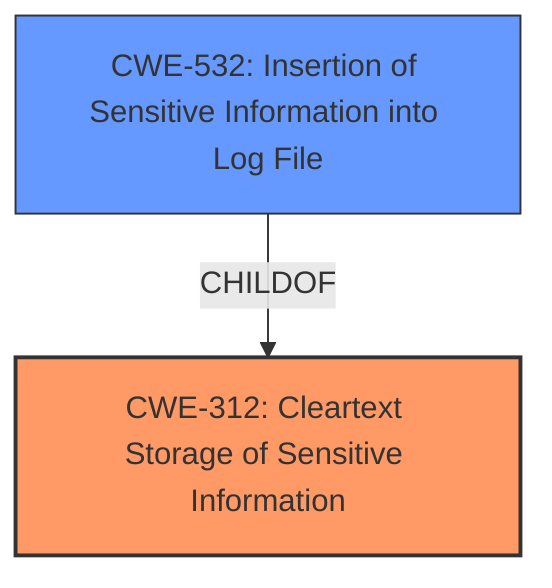

# Analysis for CVE-2020-3281

# Summary
| CWE ID | CWE Name | Confidence | CWE Abstraction Level | CWE Vulnerability Mapping Label | CWE-Vulnerability Mapping Notes |
|---|---|---|---|---|---|
| CWE-312 | Cleartext Storage of Sensitive Information | 1.0 | Base | Allowed | Primary CWE. **Storage of unencrypted credentials** is the root cause. |
| CWE-532 | Insertion of Sensitive Information into Log File | 0.8 | Base | Allowed | The **unencrypted credentials** are stored in the audit log. |

## Evidence and Confidence

*   **Confidence Score:** 0.9
*   **Evidence Strength:** HIGH

## Relationship Analysis
The primary weakness is CWE-312, which describes the root cause: **storage of unencrypted credentials**. CWE-532 is a related weakness, since the **unencrypted sensitive information** is specifically written to a log file.

## Vulnerability Chain
The vulnerability chain starts with the **storage of unencrypted credentials (CWE-312)** in the audit logs. This leads to the **insertion of sensitive information into a log file (CWE-532)**, which can be accessed by an authenticated remote attacker. The impact is that the attacker can view sensitive information in clear text and potentially use those credentials to discover and manage network devices.

## Summary of Analysis
The initial assessment correctly identifies the primary weakness as CWE-312, which is the **storage of unencrypted credentials**. The vulnerability description clearly states that the **root cause** is the **storage of certain unencrypted credentials**. The impact is that an attacker can view sensitive information in clear text by accessing the audit logs.

The retriever results also suggest CWE-532, which is the **insertion of sensitive information into a log file**. This is a relevant weakness because the **unencrypted credentials** are stored in the audit logs. CWE-532 is a child of CWE-200 (Information Exposure), and also a child of CWE-538 (Insertion of Sensitive Information into Externally-Accessible File or Directory) The weakness can be described as an authenticated remote attacker accessing the audit logs and obtaining credentials that they may not normally have access to.

The final decision is to map CWE-312 as the primary weakness and CWE-532 as a secondary weakness. This mapping accurately reflects the **root cause** and the specific context of the vulnerability. Both CWEs are at the Base level of abstraction, which is preferred for root cause analysis. The confidence in this mapping is high because it is based on clear evidence from the vulnerability description and the retriever results.

Relevant CWE Information:

# Enhanced Context (25 CWEs)

## CWE-312: Cleartext Storage of Sensitive Information
**Abstraction Level**: Base
**Similarity Score**: 0.80
**Source**: dense

**Description**:
The product stores sensitive information in cleartext within a resource that might be accessible to another control sphere.

**Mapping Guidance**:
- Usage: Allowed
- Rationale: This CWE entry is at the Base level of abstraction, which is a preferred level of abstraction for mapping to the root causes of vulnerabilities.

## CWE-1391: Use of Weak Credentials
**Abstraction Level**: Class
**Similarity Score**: 0.80
**Source**: dense

**Description**:
The product uses weak credentials (such as a default key or hard-coded password) that can be calculated, derived, reused, or guessed by an attacker.

**Mapping Guidance**:
- Usage: Allowed-with-Review
- Rationale: This CWE entry is a Class and might have Base-level children that would be more appropriate

## CWE-798: Use of Hard-coded Credentials
**Abstraction Level**: Base
**Similarity Score**: 0.79
**Source**: dense

**Description**:
The product contains hard-coded credentials, such as a password or cryptographic key.

**Mapping Guidance**:
- Usage: Allowed
- Rationale: This CWE entry is at the Base level of abstraction, which is a preferred level of abstraction for mapping to the root causes of vulnerabilities.

## CWE-257: Storing Passwords in a Recoverable Format
**Abstraction Level**: Base
**Similarity Score**: 0.79
**Source**: dense

**Description**:
The storage of passwords in a recoverable format makes them subject to password reuse attacks by malicious users. In fact, it should be noted that recoverable encrypted passwords provide no significant benefit over plaintext passwords since they are subject not only to reuse by malicious attackers but also by malicious insiders. If a system administrator can recover a password directly, or use a brute force search on the available information, the administrator can use the password on other accounts.

**Mapping Guidance**:
- Usage: Allowed
- Rationale: This CWE entry is at the Base level of abstraction, which is a preferred level of abstraction for mapping to the root causes of vulnerabilities.

## CWE-311: Missing Encryption of Sensitive Data
**Abstraction Level**: Class
**Similarity Score**: 0.77
**Source**: dense

**Description**:
The product does not encrypt sensitive or critical information before storage or transmission.

**Mapping Guidance**:
- Usage: Discouraged
- Rationale: CWE-311 is high-level with more precise children available. It is a level-1 Class (i.e., a child of a Pillar).

## CWE-319: Cleartext Transmission of Sensitive Information
**Abstraction Level**: Base
**Similarity Score**: 0.77
**Source**: dense

**Description**:
The product transmits sensitive or security-critical data in cleartext in a communication channel that can be sniffed by unauthorized actors.

**Mapping Guidance**:
- Usage: Allowed
- Rationale: This CWE entry is at the Base level of abstraction, which is a preferred level of abstraction for mapping to the root causes of vulnerabilities.

## CWE-321: Use of Hard-coded Cryptographic Key
**Abstraction Level**: Variant
**Similarity Score**: 0.77
**Source**: dense

**Description**:
The use of a hard-coded cryptographic key significantly increases the possibility that encrypted data may be recovered.

**Mapping Guidance**:
- Usage: Allowed
- Rationale: This CWE entry is at the Variant level of abstraction, which is a preferred level of abstraction for mapping to the root causes of vulnerabilities.

## CWE-345: Insufficient Verification of Data Authenticity
**Abstraction Level**: Class
**Similarity Score**: 0.77
**Source**: dense

**Description**:
The product does not sufficiently verify the origin or authenticity of data, in a way that causes it to accept invalid data.

**Mapping Guidance**:
- Usage: Discouraged
- Rationale: This CWE entry is a level-1 Class (i.e., a child of a Pillar). It might have lower-level children that would be more appropriate

## CWE-538: Insertion of Sensitive Information into Externally-Accessible File or Directory
**Abstraction Level**: Base
**Similarity Score**: 0.76
**Source**: dense

**Description**:
The product places sensitive information into files or directories that are accessible to actors who are allowed to have access to the files, but not to the sensitive information.

**Mapping Guidance**:
- Usage: Allowed
- Rationale: This CWE entry is at the Base level of abstraction, which is a preferred level of abstraction for mapping to the root causes of vulnerabilities.

## CWE-303: Incorrect Implementation of Authentication Algorithm
**Abstraction Level**: Base
**Similarity Score**: 0.76
**Source**: dense

**Description**:
The requirements for the product dictate the use of an established authentication algorithm, but the implementation of the algorithm is incorrect.

**Mapping Guidance**:
- Usage: Allowed
- Rationale: This CWE entry is at the Base level of abstraction, which is a preferred level of abstraction for mapping to the root causes of vulnerabilities.

## CWE-312: Cleartext Storage of Sensitive Information
**Abstraction Level**: Base
**Similarity Score**: 4438.33
**Source**: sparse

**Description**:
The product stores sensitive information in cleartext within a resource that might be accessible to another control sphere.

**Mapping Guidance**:
- Usage: Allowed
- Rationale: This CWE entry is at the Base level of abstraction, which is a preferred level of abstraction for mapping to the root causes of vulnerabilities.

## CWE-532: Insertion of Sensitive Information into Log File
**Abstraction Level**: Base
**Similarity Score**: 4340.97
**Source**: sparse

**Description**:
The product writes sensitive information to a log file.

**Mapping Guidance**:
- Usage: Allowed
- Rationale: This CWE entry is at the Base level of abstraction, which is a preferred level of abstraction for mapping to the root causes of vulnerabilities.

## CWE-321: Use of Hard-coded Cryptographic Key
**Abstraction Level**: Variant

# Enhanced Query for CVE-2020-3281

## Vulnerability Description
A vulnerability in the audit logging component of Cisco Digital Network Architecture (DNA) Center could allow an authenticated, remote attacker to view sensitive information in clear text. The vulnerability is due to the storage of certain unencrypted credentials. An attacker could exploit this vulnerability by accessing the audit logs and obtaining credentials that they may not normally have access to. A successful exploit could allow the attacker to use those credentials to discover and manage network devices.

### Vulnerability Description Key Phrases
- **rootcause:** **storage of unencrypted credentials**
- **impact:** view sensitive information in clear text
- **vector:** accessing the audit logs
- **attacker:** authenticated remote attacker
- **product:** Cisco Digital Network Architecture (DNA) Center
- **component:** audit logging component

## CVE Reference Links Content Summary
Based on the provided information, here's an analysis of CVE-2020-3281:

**Root Cause of Vulnerability:**
- The vulnerability stems from the storage of certain unencrypted credentials within the audit logging component of Cisco DNA Center.

**Weaknesses/Vulnerabilities Present:**
- **Cleartext Storage of Sensitive Information:** The primary weakness is the failure to encrypt sensitive credentials before logging them in the audit logs. This exposes these credentials to unauthorized access if the logs are compromised.
- **Information Disclosure:** The vulnerability allows an attacker to view sensitive information that they should not normally have access to.

**Impact of Exploitation:**
- **Credential Theft:** Successful exploitation allows an attacker to obtain credentials stored in the audit logs.
- **Lateral Movement:**  The stolen credentials can potentially allow an attacker to discover and manage network devices that they may not normally have access to.
- **Broader Network Access:** Exploiting the vulnerability can give an attacker unauthorized access to a wider range of the network.

**Attack Vectors:**
- **Remote Access:** The attack can be performed remotely by an attacker that has authenticated to the DNA center.
- **Access to Audit Logs:** The attacker needs access to the audit logs to exploit this vulnerability.

**Required Attacker Capabilities/Position:**
- **Authentication:** The attacker must be authenticated to the Cisco DNA Center.
- **Access to Logs:** The attacker needs some form of access to the system's audit logs.

## Retriever Results

### Top Combined Results

| Rank | CWE ID | Name | Abstraction | Usage  | Retrievers | Individual Scores |
|------|--------|------|-------------|-------|------------|-------------------|
| 1 | 532 | Insertion of Sensitive Information into Log File | Base | Allowed | sparse | 0.725 |
| 2 | 256 | Plaintext Storage of a Password | Base | Allowed | sparse | 0.568 |
| 3 | 522 | Insufficiently Protected Credentials | Class | Allowed-with-Review | sparse | 0.556 |
| 4 | 311 | Missing Encryption of Sensitive Data | Class | Discouraged | sparse | 0.481 |
| 5 | 312 | Cleartext Storage of Sensitive Information | Base | Allowed | sparse | 0.479 |
| 6 | 778 | Insufficient Logging | Base | Allowed | dense | 0.558 |
| 7 | 523 | Unprotected Transport of Credentials | Base | Allowed | graph | 0.002 |
| 8 | 306 | Missing Authentication for Critical Function | Base | Allowed | sparse | 0.473 |
| 9 | 257 | Storing Passwords in a Recoverable Format | Base | Allowed | sparse | 0.472 |
| 10 | 321 | Use of Hard-coded Cryptographic Key | Variant | Allowed | sparse | 0.470 |

# Complete CWE Specifications

## CWE-532: Insertion of Sensitive Information into Log File
**Abstraction:** Base
**Status:** Incomplete

### Description
The product writes sensitive information to a log file.

### Extended Description
Not provided

### Alternative Terms
None

### Relationships
ChildOf -> CWE-538
ChildOf -> CWE-200

### Mapping Guidance
**Usage:** Allowed
**Rationale:** This CWE entry is at the Base level of abstraction, which is a preferred level of abstraction for mapping to the root causes of vulnerabilities.
**Comments:** Carefully read both the name and description to ensure that this mapping is an appropriate fit. Do not try to 'force' a mapping to a lower-level Base/Variant simply to comply with this preferred level of abstraction.
**Reasons:**
- Acceptable-Use

### Observed Examples
- **CVE-2017-9615:** verbose logging stores admin credentials in a world-readable log file
- **CVE-2018-1999036:** SSH password for private key stored in build log

## CWE-256: Plaintext Storage of a Password
**Abstraction:** Base
**Status:** Incomplete

### Description
Storing a password in plaintext may result in a system compromise.

### Extended Description
Password management issues occur when a password is stored in plaintext in an application's properties, configuration file, or memory. Storing a plaintext password in a configuration file allows anyone who can read the file access to the password-protected resource. In some contexts, even storage of a plaintext password in memory is considered a security risk if the password is not cleared immediately after it is used.

### Alternative Terms
None

### Relationships
ChildOf -> CWE-522

### Mapping Guidance
**Usage:** Allowed
**Rationale:** This CWE entry is at the Base level of abstraction, which is a preferred level of abstraction for mapping to the root causes of vulnerabilities.
**Comments:** Carefully read both the name and description to ensure that this mapping is an appropriate fit. Do not try to 'force' a mapping to a lower-level Base/Variant simply to comply with this preferred level of abstraction.
**Reasons:**
- Acceptable-Use

### Observed Examples
- **CVE-2022-30275:** Remote Terminal Unit (RTU) uses a driver that relies on a password stored in plaintext.

## CWE-522: Insufficiently Protected Credentials
**Abstraction:** Class
**Status:** Incomplete

### Description
The product transmits or stores authentication credentials, but it uses an insecure method that is susceptible to unauthorized interception and/or retrieval.

### Extended Description
Not provided

### Alternative Terms
None

### Relationships
ChildOf -> CWE-1390
ChildOf -> CWE-287
ChildOf -> CWE-668

### Mapping Guidance
**Usage:** Allowed-with-Review
**Rationale:** This CWE entry is a Class and might have Base-level children that would be more appropriate
**Comments:** Examine children of this entry to see if there is a better fit
**Reasons:**
- Abstraction

### Observed Examples
- **CVE-2022-30018:** A messaging platform serializes all elements of User/Group objects, making private information available to adversaries
- **CVE-2022-29959:** Initialization file contains credentials that can be decoded using a "simple string transformation"
- **CVE-2022-35411:** Python-based RPC framework enables pickle functionality by default, allowing clients to unpickle untrusted data.

## CWE-311: Missing Encryption of Sensitive Data
**Abstraction:** Class
**Status:** Draft

### Description
The product does not encrypt sensitive or critical information before storage or transmission.

### Extended Description
The lack of proper data encryption passes up the guarantees of confidentiality, integrity, and accountability that properly implemented encryption conveys.

### Alternative Terms
None

### Relationships
ChildOf -> CWE-693

### Mapping Guidance
**Usage:** Discouraged
**Rationale:** CWE-311 is high-level with more precise children available. It is a level-1 Class (i.e., a child of a Pillar).
**Comments:** Consider children CWE-312: Cleartext Storage of Sensitive Information or CWE-319: Cleartext Transmission of Sensitive Information.
**Reasons:**
- Abstraction

### Additional Notes
**[Relationship]** There is an overlapping relationship between insecure storage of sensitive information (CWE-922) and missing encryption of sensitive information (CWE-311). Encryption is often used to prevent an attacker from reading the sensitive data. However, encryption does not prevent the attacker from erasing or overwriting the data.

### Observed Examples
- **CVE-2009-2272:** password and username stored in cleartext in a cookie
- **CVE-2009-1466:** password stored in cleartext in a file with insecure permissions
- **CVE-2009-0152:** chat program disables SSL in some circumstances even when the user says to use SSL.

## CWE-312: Cleartext Storage of Sensitive Information
**Abstraction:** Base
**Status:** Draft

### Description
The product stores sensitive information in cleartext within a resource that might be accessible to another control sphere.

### Extended Description

Because the information is stored in cleartext (i.e., unencrypted), attackers could potentially read it. Even if the information is encoded in a way that is not human-readable, certain techniques could determine which encoding is being used, then decode the information.

When organizations adopt cloud services, it can be easier for attackers to access the data from anywhere on the Internet.

In some systems/environments such as cloud, the use of "double encryption" (at both the software and hardware layer) might be required, and the developer might be solely responsible for both layers, instead of shared responsibility with the administrator of the broader system/environment.

### Alternative Terms
None

### Relationships
ChildOf -> CWE-311
ChildOf -> CWE-311
ChildOf -> CWE-922

### Mapping Guidance
**Usage:** Allowed
**Rationale:** This CWE entry is at the Base level of abstraction, which is a preferred level of abstraction for mapping to the root causes of vulnerabilities.
**Comments:** Carefully read both the name and description to ensure that this mapping is an appropriate fit. Do not try to 'force' a mapping to a lower-level Base/Variant simply to comply with this preferred level of abstraction.
**Reasons:**
- Acceptable-Use

### Additional Notes
**[Terminology]** Different people use "cleartext" and "plaintext" to mean the same thing: the lack of encryption. However, within cryptography, these have more precise meanings. Plaintext is the information just before it is fed into a cryptographic algorithm, including already-encrypted text. Cleartext is any information that is unencrypted, although it might be in an encoded form that is not easily human-readable (such as base64 encoding).

### Observed Examples
- **CVE-2022-30275:** Remote Terminal Unit (RTU) uses a driver that relies on a password stored in plaintext.
- **CVE-2009-2272:** password and username stored in cleartext in a cookie
- **CVE-2009-1466:** password stored in cleartext in a file with insecure permissions

## CWE-778: Insufficient Logging
**Abstraction:** Base
**Status:** Draft

### Description
When a security-critical event occurs, the product either does not record the event or omits important details about the event when logging it.

### Extended Description

When security-critical events are not logged properly, such as a failed login attempt, this can make malicious behavior more difficult to detect and may hinder forensic analysis after an attack succeeds.

As organizations adopt cloud storage resources, these technologies often require configuration changes to enable detailed logging information, since detailed logging can incur additional costs. This could lead to telemetry gaps in critical audit logs. For example, in Azure, the default value for logging is disabled. 

### Alternative Terms
None

### Relationships
ChildOf -> CWE-223
ChildOf -> CWE-693

### Mapping Guidance
**Usage:** Allowed
**Rationale:** This CWE entry is at the Base level of abstraction, which is a preferred level of abstraction for mapping to the root causes of vulnerabilities.
**Comments:** Carefully read both the name and description to ensure that this mapping is an appropriate fit. Do not try to 'force' a mapping to a lower-level Base/Variant simply to comply with this preferred level of abstraction.
**Reasons:**
- Acceptable-Use

### Observed Examples
- **CVE-2008-4315:** server does not log failed authentication attempts, making it easier for attackers to perform brute force password guessing without being detected
- **CVE-2008-1203:** admin interface does not log failed authentication attempts, making it easier for attackers to perform brute force password guessing without being detected
- **CVE-2007-3730:** default configuration for POP server does not log source IP or username for login attempts

## CWE-523: Unprotected Transport of Credentials
**Abstraction:** Base
**Status:** Incomplete

### Description
Login pages do not use adequate measures to protect the user name and password while they are in transit from the client to the server.

### Extended Description
Not provided

### Alternative Terms
None

### Relationships
ChildOf -> CWE-522
CanAlsoBe -> CWE-312

### Mapping Guidance
**Usage:** Allowed
**Rationale:** This CWE entry is at the Base level of abstraction, which is a preferred level of abstraction for mapping to the root causes of vulnerabilities.
**Comments:** Carefully read both the name and description to ensure that this mapping is an appropriate fit. Do not try to 'force' a mapping to a lower-level Base/Variant simply to comply with this preferred level of abstraction.
**Reasons:**
- Acceptable-Use

## CWE-306: Missing Authentication for Critical Function
**Abstraction:** Base
**Status:** Draft

### Description
The product does not perform any authentication for functionality that requires a provable user identity or consumes a significant amount of resources.

### Extended Description
Not provided

### Alternative Terms
None

### Relationships
ChildOf -> CWE-287
ChildOf -> CWE-287

### Mapping Guidance
**Usage:** Allowed
**Rationale:** This CWE entry is at the Base level of abstraction, which is a preferred level of abstraction for mapping to the root causes of vulnerabilities.
**Comments:** Carefully read both the name and description to ensure that this mapping is an appropriate fit. Do not try to 'force' a mapping to a lower-level Base/Variant simply to comply with this preferred level of abstraction.
**Reasons:**
- Acceptable-Use

### Observed Examples
- **CVE-2022-31260:** Chain: a digital asset management program has an undisclosed backdoor in the legacy version of a PHP script (CWE-912) that could allow an unauthenticated user to export metadata (CWE-306)
- **CVE-2022-29951:** TCP-based protocol in Programmable Logic Controller (PLC) has no authentication.
- **CVE-2022-29952:** Condition Monitor firmware uses a protocol that does not require authentication.

## CWE-257: Storing Passwords in a Recoverable Format
**Abstraction:** Base
**Status:** Incomplete

### Description
The storage of passwords in a recoverable format makes them subject to password reuse attacks by malicious users. In fact, it should be noted that recoverable encrypted passwords provide no significant benefit over plaintext passwords since they are subject not only to reuse by malicious attackers but also by malicious insiders. If a system administrator can recover a password directly, or use a brute force search on the available information, the administrator can use the password on other accounts.

### Extended Description
Not provided

### Alternative Terms
None

### Relationships
ChildOf -> CWE-522
PeerOf -> CWE-259

### Mapping Guidance
**Usage:** Allowed
**Rationale:** This CWE entry is at the Base level of abstraction, which is a preferred level of abstraction for mapping to the root causes of vulnerabilities.
**Comments:** Carefully read both the name and description to ensure that this mapping is an appropriate fit. Do not try to 'force' a mapping to a lower-level Base/Variant simply to comply with this preferred level of abstraction.
**Reasons:**
- Acceptable-Use

### Additional Notes
**[Maintenance]** The meaning of this entry needs to be investigated more closely, especially with respect to what is meant by "recoverable."

### Observed Examples
- **CVE-2022-30018:** A messaging platform serializes all elements of User/Group objects, making private information available to adversaries

## CWE-321: Use of Hard-coded Cryptographic Key
**Abstraction:** Variant
**Status:** Draft

### Description
The use of a hard-coded cryptographic key significantly increases the possibility that encrypted data may be recovered.

### Extended Description
Not provided

### Alternative Terms
None

### Relationships
ChildOf -> CWE-798
ChildOf -> CWE-798
ChildOf -> CWE-798

### Mapping Guidance
**Usage:** Allowed
**Rationale:** This CWE entry is at the Variant level of abstraction, which is a preferred level of abstraction for mapping to the root causes of vulnerabilities.
**Comments:** Carefully read both the name and description to ensure that this mapping is an appropriate fit. Do not try to 'force' a mapping to a lower-level Base/Variant simply to comply with this preferred level of abstraction.
**Reasons:**
- Acceptable-Use

### Additional Notes
**[Other]** The main difference between the use of hard-coded passwords and the use of hard-coded cryptographic keys is the false sense of security that the former conveys. Many people believe that simply hashing a hard-coded password before storage will protect the information from malicious users. However, many hashes are reversible (or at least vulnerable to brute force attacks) -- and further, many authentication protocols simply request the hash itself, making it no better than a password.

**[Maintenance]** The Taxonomy_Mappings to ISA/IEC 62443 were added in CWE 4.10, but they are still under review and might change in future CWE versions. These draft mappings were performed by members of the "Mapping CWE to 62443" subgroup of the CWE-CAPEC ICS/OT Special Interest Group (SIG), and their work is incomplete as of CWE 4.10. The mappings are included to facilitate discussion and review by the broader ICS/OT community, and they are likely to change in future CWE versions.

### Observed Examples
- **CVE-2022-29960:** Engineering Workstation uses hard-coded cryptographic keys that could allow for unathorized filesystem access and privilege escalation
- **CVE-2022-30271:** Remote Terminal Unit (RTU) uses a hard-coded SSH private key that is likely to be used by default.
- **CVE-2020-10884:** WiFi router service has a hard-coded encryption key, allowing root access

