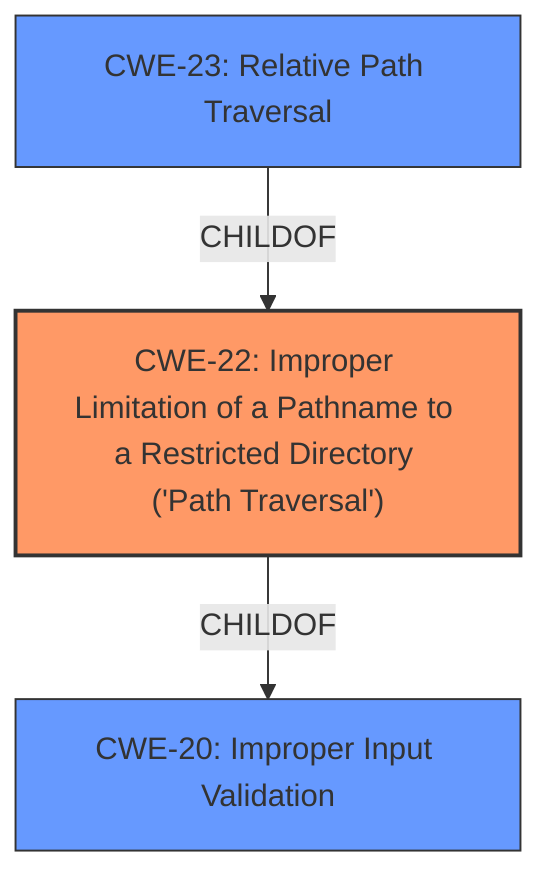

# Enhanced Analysis for CVE-2020-3452

# Summary
| CWE ID | CWE Name | Confidence | CWE Abstraction Level | CWE Vulnerability Mapping Label | CWE-Vulnerability Mapping Notes |
|---|---|---|---|---|---|
| CWE-22 | Improper Limitation of a Pathname to a Restricted Directory ('Path Traversal') | 1.0 | Base | Allowed | Primary CWE |
| CWE-20 | Improper Input Validation | 0.7 | Class | Discouraged | Secondary Candidate |

## Evidence and Confidence

*   **Confidence Score:** 0.9
*   **Evidence Strength:** HIGH

## Relationship Analysis
The primary relationship impacting the decision is that CWE-22 [Improper Limitation of a Pathname to a Restricted Directory ('Path Traversal')] is a base CWE, which is preferred, and it directly addresses the **directory traversal** issue described in the vulnerability. CWE-22 is also a child of CWE-668 [Exposure of Resource to Wrong Sphere] and CWE-706 [Incomplete Blacklist], but those are less descriptive of the actual vulnerability. CWE-20 [Improper Input Validation] is a class-level CWE and is a parent of CWE-22, but it's too general for this case. CWE-23 [Relative Path Traversal] is a child of CWE-22 and is a more specific variant; however, the description doesn't limit the traversal to relative paths, so CWE-22 is a better fit.



## Vulnerability Chain
The vulnerability chain starts with a **lack of proper input validation of URLs in HTTP requests** (CWE-20), which leads to a **directory traversal** vulnerability (CWE-22), allowing an attacker to **read sensitive files**.
  - Root Cause: **Lack of Proper Input Validation** (CWE-20)
  - Weakness: **Directory Traversal** (CWE-22)
  - Impact: Read Sensitive Files

## Summary of Analysis
Initially, the vulnerability description highlights a **lack of proper input validation of URLs** and a resulting **directory traversal** vulnerability, which allows attackers to **read sensitive files**. The key phrase is "lack of proper input validation of URLs in HTTP requests," indicating the root cause.

The "CVE Reference Links Content Summary" confirms this by stating: "The vulnerability stems from a lack of proper input validation of URLs within HTTP requests" and "The primary vulnerability is a directory traversal flaw."

The Retriever Results indicate that CWE-22 [Improper Limitation of a Pathname to a Restricted Directory ('Path Traversal')] is the top match. The analysis of the vulnerability description, combined with the retriever results, supports the selection of CWE-22 as the primary CWE. CWE-20 [Improper Input Validation] is considered as a contributing factor, but is too general.

The final decision is based on the clear evidence of a directory traversal vulnerability due to **insufficient input validation**.

The selected CWEs are at the optimal level of specificity because CWE-22 directly describes the directory traversal issue, while CWE-20 identifies the underlying cause of improper input validation.


## CWE Relationship Analysis

Current CWEs represent these abstraction levels: .


### Vulnerability Chain Analysis

**Chain starting from CWE-668:**
- 668 (Exposure of Resource to Wrong Sphere) - ROOT


**Chain starting from CWE-22:**
- 22 (Improper Limitation of a Pathname to a Restricted Directory ('Path Traversal')) - ROOT


### CWE Relationship Diagram

```mermaid
graph TD
    classDef primary fill:#f96,stroke:#333,stroke-width:2px
    classDef secondary fill:#69f,stroke:#333
    classDef tertiary fill:#9e9,stroke:#333
```