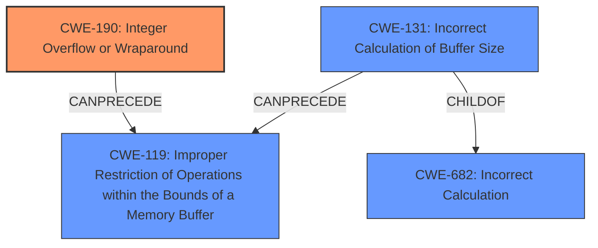

# Analysis for CVE-2020-35198

# Summary
| CWE ID | CWE Name | Confidence | CWE Abstraction Level | CWE Vulnerability Mapping Label | CWE-Vulnerability Mapping Notes |
|---|---|---|---|---|---|
| CWE-190 | Integer Overflow or Wraparound | 1.0 | Base | Primary | Allowed |
| CWE-131 | Incorrect Calculation of Buffer Size | 0.7 | Base | Secondary | Allowed |

## Evidence and Confidence

*   **Confidence Score:** 0.9
*   **Evidence Strength:** HIGH

## Relationship Analysis
The primary CWE is CWE-190 **Integer Overflow or Wraparound**, which is a Base level CWE. It can lead to CWE-119 **Improper Restriction of Operations within the Bounds of a Memory Buffer**. A secondary CWE is CWE-131 **Incorrect Calculation of Buffer Size** which is also a Base level CWE and a child of CWE-682 **Incorrect Calculation**. It can also lead to CWE-119.


## Vulnerability Chain
The vulnerability chain starts with an **integer overflow** (CWE-190) during memory block size calculation, leading to an **incorrect calculation of buffer size** (CWE-131). This results in a smaller memory allocation than required, ultimately causing memory corruption.

## Summary of Analysis
The primary weakness is CWE-190 **Integer Overflow or Wraparound**. This is based on the vulnerability description stating, "...memory allocator has a possible **integer overflow** in calculating a memory blocks size to be allocated by calloc()...". The "CVE Reference Links Content Summary" section also supports this, stating: "Root cause: **Integer overflow** in memory allocation size calculation" and listing "**Integer overflow**" as a weakness. This aligns with CWE-190's description: "The product performs a calculation that can produce an **integer overflow** or wraparound when the logic assumes that the resulting value will always be larger than the original value." Confidence is high (1.0).

CWE-131 **Incorrect Calculation of Buffer Size** is a secondary weakness. The vulnerability description notes that as a result of the overflow, "the actual memory allocated is smaller than the buffer size specified by the arguments." The "CVE Reference Links Content Summary" describes that "If the requested size is large enough to cause integer overflow by the alignment calculation, a valid pointer to a buffer that is smaller than the requested size is returned". This aligns with CWE-131, which states: "The product does not correctly calculate the size to be used when allocating a buffer, which could lead to a buffer overflow." Confidence is medium (0.7) since this is a consequence of the integer overflow.

Other CWEs Considered:
*   CWE-680 **Integer Overflow to Buffer Overflow**: This was considered but rejected because it is a Compound CWE and the individual weaknesses (CWE-190 and CWE-119) are more precise. The mapping guidance also discourages using named chains.
*   CWE-122 **Heap-based Buffer Overflow**: This was considered because the "CVE Reference Links Content Summary" mentions "Heap overflow". However, the root cause is the integer overflow, so CWE-190 is a more accurate primary mapping.
*   CWE-1284 **Improper Validation of Specified Quantity in Input**: While the input size contributes to the overflow, the core issue is the calculation itself, making CWE-190 a better fit.

Relevant CWE Information:

# Enhanced Context (25 CWEs)

## CWE-191: Integer Underflow (Wrap or Wraparound)
**Abstraction Level**: Base
**Similarity Score**: 0.80
**Source**: dense

**Description**:
The product subtracts one value from another, such that the result is less than the minimum allowable integer value, which produces a value that is not equal to the correct result.

**Mapping Guidance**:
- Usage: Allowed
- Rationale: This CWE entry is at the Base level of abstraction, which is a preferred level of abstraction for mapping to the root causes of vulnerabilities.


## CWE-197: Numeric Truncation Error
**Abstraction Level**: Base
**Similarity Score**: 0.79
**Source**: dense

**Description**:
Truncation errors occur when a primitive is cast to a primitive of a smaller size and data is lost in the conversion.

**Mapping Guidance**:
- Usage: Allowed
- Rationale: This CWE entry is at the Base level of abstraction, which is a preferred level of abstraction for mapping to the root causes of vulnerabilities.


## CWE-131: Incorrect Calculation of Buffer Size
**Abstraction Level**: Base
**Similarity Score**: 0.78
**Source**: dense

**Description**:
The product does not correctly calculate the size to be used when allocating a buffer, which could lead to a buffer overflow.

**Mapping Guidance**:
- Usage: Allowed
- Rationale: This CWE entry is at the Base level of abstraction, which is a preferred level of abstraction for mapping to the root causes of vulnerabilities.


## CWE-681: Incorrect Conversion between Numeric Types
**Abstraction Level**: Base
**Similarity Score**: 0.78
**Source**: dense

**Description**:
When converting from one data type to another, such as long to integer, data can be omitted or translated in a way that produces unexpected values. If the resulting values are used in a sensitive context, then dangerous behaviors may occur.

**Mapping Guidance**:
- Usage: Allowed
- Rationale: This CWE entry is at the Base level of abstraction, which is a preferred level of abstraction for mapping to the root causes of vulnerabilities.


## CWE-680: Integer Overflow to Buffer Overflow
**Abstraction Level**: Compound
**Similarity Score**: 0.77
**Source**: dense

**Description**:
The product performs a calculation to determine how much memory to allocate, but an integer overflow can occur that causes less memory to be allocated than expected, leading to a buffer overflow.

**Mapping Guidance**:
- Usage: Discouraged
- Rationale: This CWE entry is a named chain, which combines multiple weaknesses.


## CWE-193: Off-by-one Error
**Abstraction Level**: Base
**Similarity Score**: 0.76
**Source**: dense

**Description**:
A product calculates or uses an incorrect maximum or minimum value that is 1 more, or 1 less, than the correct value.

**Mapping Guidance**:
- Usage: Allowed
- Rationale: This CWE entry is at the Base level of abstraction, which is a preferred level of abstraction for mapping to the root causes of vulnerabilities.


## CWE-805: Buffer Access with Incorrect Length Value
**Abstraction Level**: Base
**Similarity Score**: 0.76
**Source**: dense

**Description**:
The product uses a sequential operation to read or write a buffer, but it uses an incorrect length value that causes it to access memory that is outside of the bounds of the buffer.

**Mapping Guidance**:
- Usage: Allowed
- Rationale: This CWE entry is at the Base level of abstraction, which is a preferred level of abstraction for mapping to the root causes of vulnerabilities.


## CWE-190: Integer Overflow or Wraparound
**Abstraction Level**: Base
**Similarity Score**: 0.75
**Source**: dense

**Description**:
The product performs a calculation that can
         produce an integer overflow or wraparound when the logic
         assumes that the resulting value will always be larger than
         the original value. This occurs when an integer value is
         incremented to a value that is too large to store in the
         associated representation. When this occurs, the value may
         become a very small or negative number.

**Mapping Guidance**:
- Usage: Allowed
- Rationale: This CWE entry is at the Base level of abstraction, which is a preferred level of abstraction for mapping to the root causes of vulnerabilities.


## CWE-124: Buffer Underwrite ('Buffer Underflow')
**Abstraction Level**: Base
**Similarity Score**: 0.75
**Source**: dense

**Description**:
The product writes to a buffer using an index or pointer that references a memory location prior to the beginning of the buffer.

**Mapping Guidance**:
- Usage: Allowed
- Rationale: This CWE entry is at the Base level of abstraction, which is a preferred level of abstraction for mapping to the root causes of vulnerabilities.


## CWE-823: Use of Out-of-range Pointer

# Enhanced Query for CVE-2020-35198

## Vulnerability Description
An issue was discovered in Wind River VxWorks 7. The memory allocator has a possible **integer overflow** in calculating a memory blocks size to be allocated by calloc(). As a result, the actual memory allocated is smaller than the buffer size specified by the arguments, leading to memory corruption.

### Vulnerability Description Key Phrases
- **rootcause:** **integer overflow**
- **impact:** memory corruption
- **product:** Wind River VxWorks
- **version:** 7
- **component:** memory allocator

## CVE Reference Links Content Summary
```
{
  "CVE-2020-35198": {
    "Description": "The APIs cacheDmaMalloc()/cacheArchDmaMalloc()/mmap64() align the size of the requested buffer with the memory page size of the target platform. If the requested size is large enough to cause integer overflow by the alignment calculation, a valid pointer to a buffer that is smaller than the requested size is returned, opening the door to use for heap overflow attacks.",
    "Root cause": "Integer overflow in memory allocation size calculation",
    "Weaknesses": [
      "Integer overflow",
      "Heap overflow"
    ],
    "Impact": "Heap overflow, leading to memory corruption and potential code execution",
    "Attack vectors": [
      "Network (if triggered by network data)",
      "Local (if triggered by local operation)"
    ],
    "Required attacker capabilities/position": "Ability to control or influence the size of the requested buffer, may require local or network access depending on the specific trigger"
  }
}
```

## Retriever Results

### Top Combined Results

| Rank | CWE ID | Name | Abstraction | Usage  | Retrievers | Individual Scores |
|------|--------|------|-------------|-------|------------|-------------------|
| 1 | 190 | Integer Overflow or Wraparound | Base | Allowed | alternate_terms | 0.800 |
| 2 | 131 | Incorrect Calculation of Buffer Size | Base | Allowed | sparse | 0.382 |
| 3 | 1284 | Improper Validation of Specified Quantity in Input | Base | Allowed | sparse | 0.366 |
| 4 | 194 | Unexpected Sign Extension | Variant | Allowed | sparse | 0.345 |
| 5 | 197 | Numeric Truncation Error | Base | Allowed | sparse | 0.345 |
| 6 | 680 | Integer Overflow to Buffer Overflow | Compound | Discouraged | dense | 0.583 |
| 7 | 1260 | Improper Handling of Overlap Between Protected Memory Ranges | Base | Allowed | graph | 0.002 |
| 8 | 122 | Heap-based Buffer Overflow | Variant | Allowed | sparse | 0.341 |
| 9 | 681 | Incorrect Conversion between Numeric Types | Base | Allowed | sparse | 0.339 |
| 10 | 193 | Off-by-one Error | Base | Allowed | sparse | 0.335 |


# Complete CWE Specifications


## CWE-190: Integer Overflow or Wraparound
**Abstraction:** Base
**Status:** Stable

### Description
The product performs a calculation that can
         produce an integer overflow or wraparound when the logic
         assumes that the resulting value will always be larger than
         the original value. This occurs when an integer value is
         incremented to a value that is too large to store in the
         associated representation. When this occurs, the value may
         become a very small or negative number.

### Extended Description
Not provided

### Alternative Terms
Overflow: The terms "overflow" and "wraparound" are used interchangeably by some people, but they can have more precise distinctions by others. See Terminology Notes.
Wraparound: The terms "overflow" and "wraparound" are used interchangeably by some people, but they can have more precise distinctions by others. See Terminology Notes.
wrap, wrap-around, wrap around: Alternate spellings of "wraparound"

### Relationships
ChildOf -> CWE-682
ChildOf -> CWE-682
ChildOf -> CWE-20
CanPrecede -> CWE-119

### Mapping Guidance
**Usage:** Allowed
**Rationale:** This CWE entry is at the Base level of abstraction, which is a preferred level of abstraction for mapping to the root causes of vulnerabilities.
**Comments:** Be careful of terminology problems with "overflow," "underflow," and "wraparound" - see Terminology Notes. Carefully read both the name and description to ensure that this mapping is an appropriate fit. Do not try to 'force' a mapping to a lower-level Base/Variant simply to comply with this preferred level of abstraction.
**Reasons:**
- Acceptable-Use
**Suggested Alternatives:**
- CWE-191: Integer Underflow (Wrap or Wraparound). Consider CWE-191 when the result is less than the minimum value that can be represented (sometimes called "underflows").


### Additional Notes
**[Relationship]** Integer overflows can be primary to buffer overflows when they cause less memory to be allocated than expected.

**[Terminology]** 

"Integer overflow" is sometimes used to cover several types of errors, including signedness errors, or buffer overflows that involve manipulation of integer data types instead of characters. Part of the confusion results from the fact that 0xffffffff is -1 in a signed context. Other confusion also arises because of the role that integer overflows have in chains.


A "wraparound" is a well-defined, standard behavior that follows specific rules for how to handle situations when the intended numeric value is too large or too small to be represented, as specified in standards such as C11.


"Overflow" is sometimes conflated with "wraparound" but typically indicates a non-standard or undefined behavior.


The "overflow" term is sometimes used to indicate cases where either the maximum or the minimum is exceeded, but others might only use "overflow" to indicate exceeding the maximum while using "underflow" for exceeding the minimum.


Some people use "overflow" to mean any value outside the representable range - whether greater than the maximum, or less than the minimum - but CWE uses "underflow" for cases in which the intended result is less than the minimum.


See [REF-1440] for additional explanation of the ambiguity of terminology.


**[Other]** While there may be circumstances in which the logic intentionally relies on wrapping - such as with modular arithmetic in timers or counters - it can have security consequences if the wrap is unexpected. This is especially the case if the integer overflow can be triggered using user-supplied inputs.


### Observed Examples
- **CVE-2021-43537:** Chain: in a web browser, an unsigned 64-bit integer is forcibly cast to a 32-bit integer (CWE-681) and potentially leading to an integer overflow (CWE-190). If an integer overflow occurs, this can cause heap memory corruption (CWE-122)
- **CVE-2022-21668:** Chain: Python library does not limit the resources used to process images that specify a very large number of bands (CWE-1284), leading to excessive memory consumption (CWE-789) or an integer overflow (CWE-190).
- **CVE-2022-0545:** Chain: 3D renderer has an integer overflow (CWE-190) leading to write-what-where condition (CWE-123) using a crafted image.


## CWE-131: Incorrect Calculation of Buffer Size
**Abstraction:** Base
**Status:** Draft

### Description
The product does not correctly calculate the size to be used when allocating a buffer, which could lead to a buffer overflow.

### Extended Description
Not provided

### Alternative Terms
None

### Relationships
ChildOf -> CWE-682
ChildOf -> CWE-682
ChildOf -> CWE-682
ChildOf -> CWE-682
CanPrecede -> CWE-119

### Mapping Guidance
**Usage:** Allowed
**Rationale:** This CWE entry is at the Base level of abstraction, which is a preferred level of abstraction for mapping to the root causes of vulnerabilities.
**Comments:** Carefully read both the name and description to ensure that this mapping is an appropriate fit. Do not try to 'force' a mapping to a lower-level Base/Variant simply to comply with this preferred level of abstraction.
**Reasons:**
- Acceptable-Use


### Additional Notes
**[Maintenance]** 

This is a broad category. Some examples include:


  - simple math errors,

  - incorrectly updating parallel counters,

  - not accounting for size differences when "transforming" one input to another format (e.g. URL canonicalization or other transformation that can generate a result that's larger than the original input, i.e. "expansion").

This level of detail is rarely available in public reports, so it is difficult to find good examples.

**[Maintenance]** 

This weakness may be a composite or a chain. It also may contain layering or perspective differences.


This issue may be associated with many different types of incorrect calculations (CWE-682), although the integer overflow (CWE-190) is probably the most prevalent. This can be primary to resource consumption problems (CWE-400), including uncontrolled memory allocation (CWE-789). However, its relationship with out-of-bounds buffer access (CWE-119) must also be considered.


### Observed Examples
- **CVE-2020-17087:** Chain: integer truncation (CWE-197) causes small buffer allocation (CWE-131) leading to out-of-bounds write (CWE-787) in kernel pool, as exploited in the wild per CISA KEV.
- **CVE-2004-1363:** substitution overflow: buffer overflow using environment variables that are expanded after the length check is performed
- **CVE-2004-0747:** substitution overflow: buffer overflow using expansion of environment variables


## CWE-1284: Improper Validation of Specified Quantity in Input
**Abstraction:** Base
**Status:** Incomplete

### Description
The product receives input that is expected to specify a quantity (such as size or length), but it does not validate or incorrectly validates that the quantity has the required properties.

### Extended Description


Specified quantities include size, length, frequency, price, rate, number of operations, time, and others. Code may rely on specified quantities to allocate resources, perform calculations, control iteration, etc. When the quantity is not properly validated, then attackers can specify malicious quantities to cause excessive resource allocation, trigger unexpected failures, enable buffer overflows, etc.


### Alternative Terms
None

### Relationships
ChildOf -> CWE-20
ChildOf -> CWE-20
CanPrecede -> CWE-789

### Mapping Guidance
**Usage:** Allowed
**Rationale:** This CWE entry is at the Base level of abstraction, which is a preferred level of abstraction for mapping to the root causes of vulnerabilities.
**Comments:** Carefully read both the name and description to ensure that this mapping is an appropriate fit. Do not try to 'force' a mapping to a lower-level Base/Variant simply to comply with this preferred level of abstraction.
**Reasons:**
- Acceptable-Use


### Additional Notes
**[Maintenance]** This entry is still under development and will continue to see updates and content improvements.


### Observed Examples
- **CVE-2022-21668:** Chain: Python library does not limit the resources used to process images that specify a very large number of bands (CWE-1284), leading to excessive memory consumption (CWE-789) or an integer overflow (CWE-190).
- **CVE-2008-1440:** lack of validation of length field leads to infinite loop
- **CVE-2008-2374:** lack of validation of string length fields allows memory consumption or buffer over-read


## CWE-194: Unexpected Sign Extension
**Abstraction:** Variant
**Status:** Incomplete

### Description
The product performs an operation on a number that causes it to be sign extended when it is transformed into a larger data type. When the original number is negative, this can produce unexpected values that lead to resultant weaknesses.

### Extended Description
Not provided

### Alternative Terms
None

### Relationships
ChildOf -> CWE-681
ChildOf -> CWE-681
ChildOf -> CWE-681

### Mapping Guidance
**Usage:** Allowed
**Rationale:** This CWE entry is at the Variant level of abstraction, which is a preferred level of abstraction for mapping to the root causes of vulnerabilities.
**Comments:** Carefully read both the name and description to ensure that this mapping is an appropriate fit. Do not try to 'force' a mapping to a lower-level Base/Variant simply to comply with this preferred level of abstraction.
**Reasons:**
- Acceptable-Use


### Additional Notes
**[Relationship]** Sign extension errors can lead to buffer overflows and other memory-based problems. They are also likely to be factors in other weaknesses that are not based on memory operations, but rely on numeric calculation.

**[Maintenance]** This entry is closely associated with signed-to-unsigned conversion errors (CWE-195) and other numeric errors. These relationships need to be more closely examined within CWE.


### Observed Examples
- **CVE-2018-10887:** Chain: unexpected sign extension (CWE-194) leads to integer overflow (CWE-190), causing an out-of-bounds read (CWE-125)
- **CVE-1999-0234:** Sign extension error produces -1 value that is treated as a command separator, enabling OS command injection.
- **CVE-2003-0161:** Product uses "char" type for input character. When char is implemented as a signed type, ASCII value 0xFF (255), a sign extension produces a -1 value that is treated as a program-specific separator value, effectively disabling a length check and leading to a buffer overflow. This is also a multiple interpretation error.


## CWE-197: Numeric Truncation Error
**Abstraction:** Base
**Status:** Incomplete

### Description
Truncation errors occur when a primitive is cast to a primitive of a smaller size and data is lost in the conversion.

### Extended Description
When a primitive is cast to a smaller primitive, the high order bits of the large value are lost in the conversion, potentially resulting in an unexpected value that is not equal to the original value. This value may be required as an index into a buffer, a loop iterator, or simply necessary state data. In any case, the value cannot be trusted and the system will be in an undefined state. While this method may be employed viably to isolate the low bits of a value, this usage is rare, and truncation usually implies that an implementation error has occurred.

### Alternative Terms
None

### Relationships
ChildOf -> CWE-681
ChildOf -> CWE-681
ChildOf -> CWE-681
CanAlsoBe -> CWE-195
CanAlsoBe -> CWE-196
CanAlsoBe -> CWE-192
CanAlsoBe -> CWE-194

### Mapping Guidance
**Usage:** Allowed
**Rationale:** This CWE entry is at the Base level of abstraction, which is a preferred level of abstraction for mapping to the root causes of vulnerabilities.
**Comments:** Carefully read both the name and description to ensure that this mapping is an appropriate fit. Do not try to 'force' a mapping to a lower-level Base/Variant simply to comply with this preferred level of abstraction.
**Reasons:**
- Acceptable-Use


### Additional Notes
**[Research Gap]** This weakness has traditionally been under-studied and under-reported, although vulnerabilities in popular software have been published in 2008 and 2009.


### Observed Examples
- **CVE-2020-17087:** Chain: integer truncation (CWE-197) causes small buffer allocation (CWE-131) leading to out-of-bounds write (CWE-787) in kernel pool, as exploited in the wild per CISA KEV.
- **CVE-2009-0231:** Integer truncation of length value leads to heap-based buffer overflow.
- **CVE-2008-3282:** Size of a particular type changes for 64-bit platforms, leading to an integer truncation in document processor causes incorrect index to be generated.


## CWE-680: Integer Overflow to Buffer Overflow
**Abstraction:** Compound
**Status:** Draft

### Description
The product performs a calculation to determine how much memory to allocate, but an integer overflow can occur that causes less memory to be allocated than expected, leading to a buffer overflow.

### Extended Description
Not provided

### Alternative Terms
None

### Relationships
StartsWith -> CWE-190
ChildOf -> CWE-190

### Mapping Guidance
**Usage:** Discouraged
**Rationale:** This CWE entry is a named chain, which combines multiple weaknesses.
**Comments:** Mapping to each separate weakness in the chain would be more precise.
**Reasons:**
- Other


### Observed Examples
- **CVE-2021-43537:** Chain: in a web browser, an unsigned 64-bit integer is forcibly cast to a 32-bit integer (CWE-681) and potentially leading to an integer overflow (CWE-190). If an integer overflow occurs, this can cause heap memory corruption (CWE-122)
- **CVE-2017-1000121:** chain: unchecked message size metadata allows integer overflow (CWE-190) leading to buffer overflow (CWE-119).


## CWE-1260: Improper Handling of Overlap Between Protected Memory Ranges
**Abstraction:** Base
**Status:** Stable

### Description
The product allows address regions to overlap, which can result in the bypassing of intended memory protection.

### Extended Description


Isolated memory regions and access control (read/write) policies are used by hardware to protect privileged software. Software components are often allowed to change or remap memory region definitions in order to enable flexible and dynamically changeable memory management by system software.


If a software component running at lower privilege can program a memory address region to overlap with other memory regions used by software running at higher privilege, privilege escalation may be available to attackers. The memory protection unit (MPU) logic can incorrectly handle such an address overlap and allow the lower-privilege software to read or write into the protected memory region, resulting in privilege escalation attack. An address overlap weakness can also be used to launch a denial of service attack on the higher-privilege software memory regions.


### Alternative Terms
None

### Relationships
ChildOf -> CWE-284
CanPrecede -> CWE-119

### Mapping Guidance
**Usage:** Allowed
**Rationale:** This CWE entry is at the Base level of abstraction, which is a preferred level of abstraction for mapping to the root causes of vulnerabilities.
**Comments:** Carefully read both the name and description to ensure that this mapping is an appropriate fit. Do not try to 'force' a mapping to a lower-level Base/Variant simply to comply with this preferred level of abstraction.
**Reasons:**
- Acceptable-Use


### Additional Notes
**[Maintenance]** As of CWE 4.6, CWE-1260 and CWE-1316 are siblings under view 1000, but CWE-1260 might be a parent of CWE-1316. More analysis is warranted.


### Observed Examples
- **CVE-2008-7096:** virtualization product allows compromise of hardware product by accessing certain remapping registers.
- **[REF-1100]:** processor design flaw allows ring 0 code to access more privileged rings by causing a register window to overlap a range of protected system RAM [REF-1100]


## CWE-122: Heap-based Buffer Overflow
**Abstraction:** Variant
**Status:** Draft

### Description
A heap overflow condition is a buffer overflow, where the buffer that can be overwritten is allocated in the heap portion of memory, generally meaning that the buffer was allocated using a routine such as malloc().

### Extended Description
Not provided

### Alternative Terms
None

### Relationships
ChildOf -> CWE-788
ChildOf -> CWE-787

### Mapping Guidance
**Usage:** Allowed
**Rationale:** This CWE entry is at the Variant level of abstraction, which is a preferred level of abstraction for mapping to the root causes of vulnerabilities.
**Comments:** Carefully read both the name and description to ensure that this mapping is an appropriate fit. Do not try to 'force' a mapping to a lower-level Base/Variant simply to comply with this preferred level of abstraction.
**Reasons:**
- Acceptable-Use


### Additional Notes
**[Relationship]** Heap-based buffer overflows are usually just as dangerous as stack-based buffer overflows.


### Observed Examples
- **CVE-2021-43537:** Chain: in a web browser, an unsigned 64-bit integer is forcibly cast to a 32-bit integer (CWE-681) and potentially leading to an integer overflow (CWE-190). If an integer overflow occurs, this can cause heap memory corruption (CWE-122)
- **CVE-2007-4268:** Chain: integer signedness error (CWE-195) passes signed comparison, leading to heap overflow (CWE-122)
- **CVE-2009-2523:** Chain: product does not handle when an input string is not NULL terminated (CWE-170), leading to buffer over-read (CWE-125) or heap-based buffer overflow (CWE-122).


## CWE-681: Incorrect Conversion between Numeric Types
**Abstraction:** Base
**Status:** Draft

### Description
When converting from one data type to another, such as long to integer, data can be omitted or translated in a way that produces unexpected values. If the resulting values are used in a sensitive context, then dangerous behaviors may occur.

### Extended Description
Not provided

### Alternative Terms
None

### Relationships
ChildOf -> CWE-704
ChildOf -> CWE-704
CanPrecede -> CWE-682

### Mapping Guidance
**Usage:** Allowed
**Rationale:** This CWE entry is at the Base level of abstraction, which is a preferred level of abstraction for mapping to the root causes of vulnerabilities.
**Comments:** Carefully read both the name and description to ensure that this mapping is an appropriate fit. Do not try to 'force' a mapping to a lower-level Base/Variant simply to comply with this preferred level of abstraction.
**Reasons:**
- Acceptable-Use


### Observed Examples
- **CVE-2022-2639:** Chain: integer coercion error (CWE-192) prevents a return value from indicating an error, leading to out-of-bounds write (CWE-787)
- **CVE-2021-43537:** Chain: in a web browser, an unsigned 64-bit integer is forcibly cast to a 32-bit integer (CWE-681) and potentially leading to an integer overflow (CWE-190). If an integer overflow occurs, this can cause heap memory corruption (CWE-122)
- **CVE-2007-4268:** Chain: integer signedness error (CWE-195) passes signed comparison, leading to heap overflow (CWE-122)


## CWE-193: Off-by-one Error
**Abstraction:** Base
**Status:** Draft

### Description
A product calculates or uses an incorrect maximum or minimum value that is 1 more, or 1 less, than the correct value.

### Extended Description
Not provided

### Alternative Terms
off-by-five: An "off-by-five" error was reported for sudo in 2002 (CVE-2002-0184), but that is more like a "length calculation" error.

### Relationships
ChildOf -> CWE-682
ChildOf -> CWE-682
CanPrecede -> CWE-617
CanPrecede -> CWE-170
CanPrecede -> CWE-119

### Mapping Guidance
**Usage:** Allowed
**Rationale:** This CWE entry is at the Base level of abstraction, which is a preferred level of abstraction for mapping to the root causes of vulnerabilities.
**Comments:** Carefully read both the name and description to ensure that this mapping is an appropriate fit. Do not try to 'force' a mapping to a lower-level Base/Variant simply to comply with this preferred level of abstraction.
**Reasons:**
- Acceptable-Use


### Additional Notes
**[Relationship]** This is not always a buffer overflow. For example, an off-by-one error could be a factor in a partial comparison, a read from the wrong memory location, an incorrect conditional, etc.


### Observed Examples
- **CVE-2003-0252:** Off-by-one error allows remote attackers to cause a denial of service and possibly execute arbitrary code via requests that do not contain newlines.
- **CVE-2001-1391:** Off-by-one vulnerability in driver allows users to modify kernel memory.
- **CVE-2002-0083:** Off-by-one error allows local users or remote malicious servers to gain privileges.

