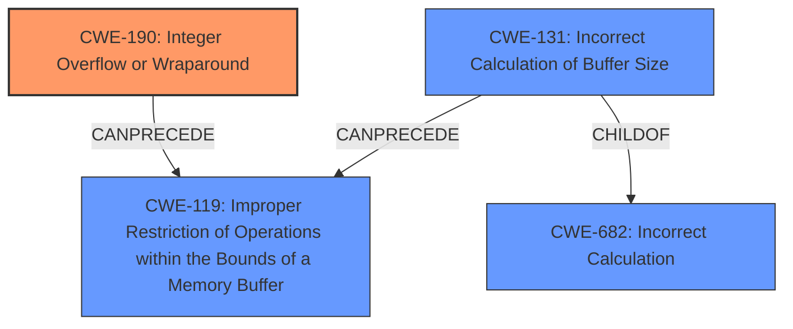

# Analysis Report for CVE-2020-35198

# Vulnerability Analysis Report: CVE-2020-35198

## Description


## Analysis (with Relationship Data)

# Summary
| CWE ID | CWE Name | Confidence | CWE Abstraction Level | CWE Vulnerability Mapping Label | CWE-Vulnerability Mapping Notes |
|---|---|---|---|---|---|
| CWE-190 | Integer Overflow or Wraparound | 1.0 | Base | Primary | Allowed |
| CWE-131 | Incorrect Calculation of Buffer Size | 0.7 | Base | Secondary | Allowed |

## Evidence and Confidence

*   **Confidence Score:** 0.9
*   **Evidence Strength:** HIGH

## Relationship Analysis
The primary CWE is CWE-190 **Integer Overflow or Wraparound**, which is a Base level CWE. It can lead to CWE-119 **Improper Restriction of Operations within the Bounds of a Memory Buffer**. A secondary CWE is CWE-131 **Incorrect Calculation of Buffer Size** which is also a Base level CWE and a child of CWE-682 **Incorrect Calculation**. It can also lead to CWE-119.


## Vulnerability Chain
The vulnerability chain starts with an **integer overflow** (CWE-190) during memory block size calculation, leading to an **incorrect calculation of buffer size** (CWE-131). This results in a smaller memory allocation than required, ultimately causing memory corruption.

## Summary of Analysis
The primary weakness is CWE-190 **Integer Overflow or Wraparound**. This is based on the vulnerability description stating, "...memory allocator has a possible **integer overflow** in calculating a memory blocks size to be allocated by calloc()...". The "CVE Reference Links Content Summary" section also supports this, stating: "Root cause: **Integer overflow** in memory allocation size calculation" and listing "**Integer overflow**" as a weakness. This aligns with CWE-190's description: "The product performs a calculation that can produce an **integer overflow** or wraparound when the logic assumes that the resulting value will always be larger than the original value." Confidence is high (1.0).

CWE-131 **Incorrect Calculation of Buffer Size** is a secondary weakness. The vulnerability description notes that as a result of the overflow, "the actual memory allocated is smaller than the buffer size specified by the arguments." The "CVE Reference Links Content Summary" describes that "If the requested size is large enough to cause integer overflow by the alignment calculation, a valid pointer to a buffer that is smaller than the requested size is returned". This aligns with CWE-131, which states: "The product does not correctly calculate the size to be used when allocating a buffer, which could lead to a buffer overflow." Confidence is medium (0.7) since this is a consequence of the integer overflow.

Other CWEs Considered:
*   CWE-680 **Integer Overflow to Buffer Overflow**: This was considered but rejected because it is a Compound CWE and the individual weaknesses (CWE-190 and CWE-119) are more precise. The mapping guidance also discourages using named chains.
*   CWE-122 **Heap-based Buffer Overflow**: This was considered because the "CVE Reference Links Content Summary" mentions "Heap overflow". However, the root cause is the integer overflow, so CWE-190 is a more accurate primary mapping.
*   CWE-1284 **Improper Validation of Specified Quantity in Input**: While the input size contributes to the overflow, the core issue is the calculation itself, making CWE-190 a better fit.

Relevant CWE Information:

# Enhanced Context (25 CWEs)

## CWE-191: Integer Underflow (Wrap or Wraparound)
**Abstraction Level**: Base
**Similarity Score**: 0.80
**Source**: dense

**Description**:
The product subtracts one value from another, such that the result is less than the minimum allowable integer value, which produces a value that is not equal to the correct result.

**Mapping Guidance**:
- Usage: Allowed
- Rationale: This CWE entry is at the Base level of abstraction, which is a preferred level of abstraction for mapping to the root causes of vulnerabilities.


## CWE-197: Numeric Truncation Error
**Abstraction Level**: Base
**Similarity Score**: 0.79
**Source**: dense

**Description**:
Truncation errors occur when a primitive is cast to a primitive of a smaller size and data is lost in the conversion.

**Mapping Guidance**:
- Usage: Allowed
- Rationale: This CWE entry is at the Base level of abstraction, which is a preferred level of abstraction for mapping to the root causes of vulnerabilities.


## CWE-131: Incorrect Calculation of Buffer Size
**Abstraction Level**: Base
**Similarity Score**: 0.78
**Source**: dense

**Description**:
The product does not correctly calculate the size to be used when allocating a buffer, which could lead to a buffer overflow.

**Mapping Guidance**:
- Usage: Allowed
- Rationale: This CWE entry is at the Base level of abstraction, which is a preferred level of abstraction for mapping to the root causes of vulnerabilities.


## CWE-681: Incorrect Conversion between Numeric Types
**Abstraction Level**: Base
**Similarity Score**: 0.78
**Source**: dense

**Description**:
When converting from one data type to another, such as long to integer, data can be omitted or translated in a way that produces unexpected values. If the resulting values are used in a sensitive context, then dangerous behaviors may occur.

**Mapping Guidance**:
- Usage: Allowed
- Rationale: This CWE entry is at the Base level of abstraction, which is a preferred level of abstraction for mapping to the root causes of vulnerabilities.


## CWE-680: Integer Overflow to Buffer Overflow
**Abstraction Level**: Compound
**Similarity Score**: 0.77
**Source**: dense

**Description**:
The product performs a calculation to determine how much memory to allocate, but an integer overflow can occur that causes less memory to be allocated than expected, leading to a buffer overflow.

**Mapping Guidance**:
- Usage: Discouraged
- Rationale: This CWE entry is a named chain, which combines multiple weaknesses.


## CWE-193: Off-by-one Error
**Abstraction Level**: Base
**Similarity Score**: 0.76
**Source**: dense

**Description**:
A product calculates or uses an incorrect maximum or minimum value that is 1 more, or 1 less, than the correct value.

**Mapping Guidance**:
- Usage: Allowed
- Rationale: This CWE entry is at the Base level of abstraction, which is a preferred level of abstraction for mapping to the root causes of vulnerabilities.


## CWE-805: Buffer Access with Incorrect Length Value
**Abstraction Level**: Base
**Similarity Score**: 0.76
**Source**: dense

**Description**:
The product uses a sequential operation to read or write a buffer, but it uses an incorrect length value that causes it to access memory that is outside of the bounds of the buffer.

**Mapping Guidance**:
- Usage: Allowed
- Rationale: This CWE entry is at the Base level of abstraction, which is a preferred level of abstraction for mapping to the root causes of vulnerabilities.


## CWE-190: Integer Overflow or Wraparound
**Abstraction Level**: Base
**Similarity Score**: 0.75
**Source**: dense

**Description**:
The product performs a calculation that can
         produce an integer overflow or wraparound when the logic
         assumes that the resulting value will always be larger than
         the original value. This occurs when an integer value is
         incremented to a value that is too large to store in the
         associated representation. When this occurs, the value may
         become a very small or negative number.

**Mapping Guidance**:
- Usage: Allowed
- Rationale: This CWE entry is at the Base level of abstraction, which is a preferred level of abstraction for mapping to the root causes of vulnerabilities.


## CWE-124: Buffer Underwrite ('Buffer Underflow')
**Abstraction Level**: Base
**Similarity Score**: 0.75
**Source**: dense

**Description**:
The product writes to a buffer using an index or pointer that references a memory location prior to the beginning of the buffer.

**Mapping Guidance**:
- Usage: Allowed
- Rationale: This CWE entry is at the Base level of abstraction, which is a preferred level of abstraction for mapping to the root causes of vulnerabilities.


## CWE-823: Use of Out-of-range Pointer


## CWE Relationship Analysis

Current CWEs represent these abstraction levels: .


### Vulnerability Chain Analysis

**Chain starting from CWE-823:**
- 823 (Use of Out-of-range Pointer Offset) - ROOT


**Chain starting from CWE-680:**
- 680 (Integer Overflow to Buffer Overflow) - ROOT


### CWE Relationship Diagram

```mermaid
graph TD
    classDef primary fill:#f96,stroke:#333,stroke-width:2px
    classDef secondary fill:#69f,stroke:#333
    classDef tertiary fill:#9e9,stroke:#333
```


*Report generated on 2025-04-01 16:14:11*
