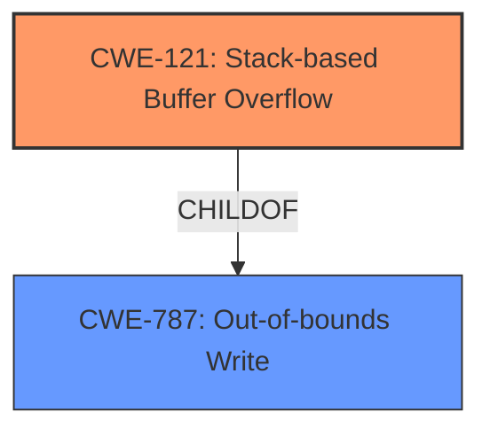

# Raw Analyzer Response for CVE-2020-35452

# Summary
| CWE ID | CWE Name | Confidence | CWE Abstraction Level | CWE Vulnerability Mapping Label | CWE-Vulnerability Mapping Notes |
|---|---|---|---|---|---|
| CWE-121 | Stack-based Buffer Overflow | 1.0 | Variant | Allowed | Primary CWE |

## Evidence and Confidence

*   **Confidence Score:** 1.0
*   **Evidence Strength:** HIGH

## Relationship Analysis
The primary relationship is that CWE-121 (Stack-based Buffer Overflow) is a variant of CWE-787 (Out-of-bounds Write). This means that CWE-121 is a more specific type of out-of-bounds write that occurs on the stack. The vulnerability description explicitly mentions a "**stack overflow**," making CWE-121 the most accurate choice.

## Vulnerability Chain
The chain consists of a specially crafted Digest nonce (input) leading to a **stack overflow**.
  - Crafted Digest nonce -> **Stack Overflow**
  - Root cause: specially crafted Digest nonce
  - Impact: Stack overflow

## Summary of Analysis
The analysis is based on the vulnerability description and the provided CVE reference links content summary. The vulnerability description states that "A specially crafted Digest nonce can cause a **stack overflow** in mod_auth_digest." The CVE reference links content summary confirms this, stating "A specially crafted Digest nonce can cause a stack overflow in the `mod_auth_digest` module of the Apache HTTP Server."

The selection of CWE-121 is at the optimal level of specificity because it directly addresses the type of buffer overflow (stack-based) mentioned in the description. The term "**stack overflow**" in the vulnerability description directly corresponds to CWE-121.

Relevant CWE Information:

# Enhanced Context (25 CWEs)

## CWE-121: Stack-based Buffer Overflow
**Abstraction:** Variant
**Status:** Draft

### Description
A stack-based buffer overflow condition is a condition where the buffer being overwritten is allocated on the stack (i.e., is a local variable or, rarely, a parameter to a function).

### Extended Description
Not provided

### Alternative Terms
Stack Overflow: "Stack Overflow" is often used to mean the same thing as stack-based buffer overflow, however it is also used on occasion to mean stack exhaustion, usually a result from an excessively recursive function call. Due to the ambiguity of the term, use of stack overflow to describe either circumstance is discouraged.

### Relationships
ChildOf -> CWE-788
ChildOf -> CWE-787

### Mapping Guidance
**Usage:** Allowed
**Rationale:** This CWE entry is at the Variant level of abstraction, which is a preferred level of abstraction for mapping to the root causes of vulnerabilities.
**Comments:** Carefully read both the name and description to ensure that this mapping is an appropriate fit. Do not try to 'force' a mapping to a lower-level Base/Variant simply to comply with this preferred level of abstraction.
**Reasons:**
- Acceptable-Use

### Additional Notes
**[Other]** Stack-based buffer overflows can instantiate in return address overwrites, stack pointer overwrites or frame pointer overwrites. They can also be considered function pointer overwrites, array indexer overwrites or write-what-where condition, etc.

### Observed Examples
- **CVE-2021-35395:** Stack-based buffer overflows in SFK for wifi chipset used for IoT/embedded devices, as exploited in the wild per CISA KEV.

## CWE-787: Out-of-bounds Write

CWE-787 was considered but not chosen as it is a more general case of out-of-bounds write. The description specifically mentions "**stack overflow**", so CWE-121 is a better, more specific fit.