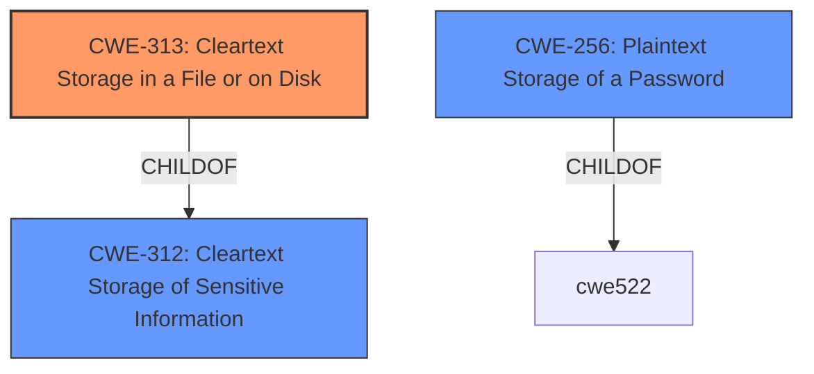

# Analysis for CVE-2020-35455

# Summary
| CWE ID | CWE Name | Confidence | CWE Abstraction Level | CWE Vulnerability Mapping Label | CWE-Vulnerability Mapping Notes |
|---|---|---|---|---|---|
| CWE-313 | Cleartext Storage in a File or on Disk | 1.0 | Variant | Allowed | Primary CWE |
| CWE-312 | Cleartext Storage of Sensitive Information | 0.8 | Base | Allowed | Secondary Candidate |
| CWE-256 | Plaintext Storage of a Password | 0.7 | Base | Allowed | Secondary Candidate |

## Evidence and Confidence

*   **Confidence Score:** 0.9
*   **Evidence Strength:** HIGH

## Relationship Analysis
The primary weakness identified is CWE-313 (Cleartext Storage in a File or on Disk), which is a variant of CWE-312 (Cleartext Storage of Sensitive Information). CWE-312 is a more general case, while CWE-313 is specific to files and disks. Since the vulnerability description explicitly mentions storage in Shared Preferences (files) and SQLite database (on disk), CWE-313 is more appropriate. CWE-256 (Plaintext Storage of a Password) is also relevant, as credentials are being stored insecurely.

## Vulnerability Chain
The vulnerability chain starts with the **insecure data storage** (**ROOTCAUSE**). This leads to the storage of user credentials and personal data in plaintext. An attacker with local access can then read this data, leading to full account compromise and exposure of sensitive personal information.

## Summary of Analysis
The initial assessment identified several potential CWEs, including CWE-313, CWE-312, and CWE-256. Based on the detailed vulnerability description and the provided CVE reference, the application **insecurely** stores sensitive data, including user credentials, in plaintext within Shared Preferences and the SQLite database. This aligns directly with CWE-313, which specifies **"Cleartext Storage in a File or on Disk."** While CWE-312 is a parent, CWE-313 is more specific and accurately reflects the described vulnerability. CWE-256 is considered since the description involves passwords.
The evidence from the "CVE Reference Links Content Summary" clearly supports this: "The vulnerability stems from **insecure data storage** practices within the Taidii Diibear Android application. Specifically, the application stores sensitive data in plaintext within two locations: Shared Preferences and SQLite Database."
The selection of CWE-313 is at the optimal level of specificity because it's a Variant, which is preferred and accurately describes the **weakness**.

Relevant CWE Information:

# Enhanced Context (25 CWEs)
The following CWEs were identified as potentially relevant to this vulnerability:

## CWE-312: Cleartext Storage of Sensitive Information
**Abstraction Level**: Base
**Similarity Score**: 0.82
**Source**: dense

**Description**:
The product stores sensitive information in cleartext within a resource that might be accessible to another control sphere.

**Mapping Guidance**:
- Usage: Allowed
- Rationale: This CWE entry is at the Base level of abstraction, which is a preferred level of abstraction for mapping to the root causes of vulnerabilities.

## CWE-313: Cleartext Storage in a File or on Disk
**Abstraction Level**: Variant
**Similarity Score**: 0.76
**Source**: dense

**Description**:
The product stores sensitive information in cleartext in a file, or on disk.

**Mapping Guidance**:
- Usage: Allowed
- Rationale: This CWE entry is at the Variant level of abstraction, which is a preferred level of abstraction for mapping to the root causes of vulnerabilities.

## CWE-256: Plaintext Storage of a Password
**Abstraction Level**: Base
**Similarity Score**: 0.73
**Source**: dense

**Description**:
Storing a password in plaintext may result in a system compromise.

**Mapping Guidance**:
- Usage: Allowed
- Rationale: This CWE entry is at the Base level of abstraction, which is a preferred level of abstraction for mapping to the root causes of vulnerabilities.

# Enhanced Query for CVE-2020-35455

## Vulnerability Description
The Taidii Diibear Android application 2.4.0 and all its derivatives allow attackers to obtain user credentials from Shared Preferences and the SQLite database because of **insecure data storage**.

### Vulnerability Description Key Phrases
- **rootcause:** **insecure data storage**
- **impact:** obtain user credentials
- **attacker:** attackers
- **product:** Taidii Diibear Android application
- **version:** 2.4.0

## CVE Reference Links Content Summary
Based on the provided content, here's an analysis of CVE-2020-35455:

**Root Cause of Vulnerability:**

The vulnerability stems from insecure data storage practices within the Taidii Diibear Android application. Specifically, the application stores sensitive data in plaintext within two locations:

1.  **Shared Preferences:** This storage mechanism is intended for simple key-value pairs, but the application inappropriately stores sensitive information here in plaintext.
2.  **SQLite Database:** Similar to the Shared Preferences issue, the application stores sensitive data directly in plaintext within its SQLite database.

**Weaknesses/Vulnerabilities Present:**

*   **Insecure Data Storage:** The core weakness is the storage of sensitive data (user credentials, authentication tokens, personal data, etc.) in plaintext. This violates fundamental security principles of data protection.
*   **Lack of Encryption:** Data stored in both Shared Preferences and the SQLite database are not encrypted, making them easily accessible to unauthorized parties with sufficient access.

**Impact of Exploitation:**

*   **Full Account Compromise:** An attacker who gains access to the plaintext credentials and tokens can use them to gain full access to the victim's account, allowing them to impersonate the user and perform any actions they could.
*   **Exposure of Sensitive Personal Information:** The plaintext personal data disclosed includes student profile pictures, birth regions, dates of birth, names, gender, and other personally identifiable information. This exposure could result in identity theft, privacy violations, and other malicious activities.

**Attack Vectors:**

*   **Local Access:** The primary attack vector is local read/write access to the device where the application is installed. This means that an attacker who has physical access to the phone or can otherwise gain access to the device's file system can exploit the vulnerability.

**Required Attacker Capabilities/Position:**

*   **Local Read/Write Access:** The attacker needs to be able to read from and write to the device's storage, meaning they either have physical access or have achieved a form of compromise that grants them access to the file system.
*   **No Prior App Access Required:** The attacker does not need to have an account or any prior access to the app. They can directly extract sensitive information from the device's storage.

**Summary of CVE-2020-35455**

The application stores sensitive user credentials and personal data in plaintext in both Shared Preferences and an SQLite database. An attacker with local access to the device can read this data and fully compromise user accounts.

## Retriever Results

### Top Combined Results

| Rank | CWE ID | Name | Abstraction | Usage  | Retrievers | Individual Scores |
|------|--------|------|-------------|-------|------------|-------------------|
| 1 | 313 | Cleartext Storage in a File or on Disk | Variant | Allowed | sparse | 0.353 |
| 2 | 732 | Incorrect Permission Assignment for Critical Resource | Class | Allowed-with-Review | sparse | 0.169 |
| 3 | 522 | Insufficiently Protected Credentials | Class | Allowed-with-Review | sparse | 0.168 |
| 4 | 312 | Cleartext Storage of Sensitive Information | Base | Allowed | sparse | 0.166 |
| 5 | 532 | Insertion of Sensitive Information into Log File | Base | Allowed | sparse | 0.157 |
| 6 | 927 | Use of Implicit Intent for Sensitive Communication | Variant | Allowed | dense | 0.545 |
| 7 | 523 | Unprotected Transport of Credentials | Base | Allowed | graph | 0.002 |
| 8 | 639 | Authorization Bypass Through User-Controlled Key | Base | Allowed | sparse | 0.156 |
| 9 | 256 | Plaintext Storage of a Password | Base | Allowed | sparse | 0.151 |
| 10 | 311 | Missing Encryption of Sensitive Data | Class | Discouraged | sparse | 0.151 |

# Complete CWE Specifications

## CWE-313: Cleartext Storage in a File or on Disk
**Abstraction:** Variant
**Status:** Draft

### Description
The product stores sensitive information in cleartext in a file, or on disk.

### Extended Description
The sensitive information could be read by attackers with access to the file, or with physical or administrator access to the raw disk. Even if the information is encoded in a way that is not human-readable, certain techniques could determine which encoding is being used, then decode the information.

### Alternative Terms
None

### Relationships
ChildOf -> CWE-312

### Mapping Guidance
**Usage:** Allowed
**Rationale:** This CWE entry is at the Variant level of abstraction, which is a preferred level of abstraction for mapping to the root causes of vulnerabilities.
**Comments:** Carefully read both the name and description to ensure that this mapping is an appropriate fit. Do not try to 'force' a mapping to a lower-level Base/Variant simply to comply with this preferred level of abstraction.
**Reasons:**
- Acceptable-Use

### Additional Notes
**[Terminology]** Different people use "cleartext" and "plaintext" to mean the same thing: the lack of encryption. However, within cryptography, these have more precise meanings. Plaintext is the information just before it is fed into a cryptographic algorithm, including already-encrypted text. Cleartext is any information that is unencrypted, although it might be in an encoded form that is not easily human-readable (such as base64 encoding).

### Observed Examples
- **CVE-2001-1481:** Cleartext credentials in world-readable file.
- **CVE-2005-1828:** Password in cleartext in config file.
- **CVE-2005-2209:** Password in cleartext in config file.

## CWE-732: Incorrect Permission Assignment for Critical Resource
**Abstraction:** Class
**Status:** Draft

### Description
The product specifies permissions for a security-critical resource in a way that allows that resource to be read or modified by unintended actors.

### Extended Description
When a resource is given a permission setting that provides access to a wider range of actors than required, it could lead to the exposure of sensitive information, or the modification of that resource by unintended parties. This is especially dangerous when the resource is related to program configuration, execution, or sensitive user data. For example, consider a misconfigured storage account for the cloud that can be read or written by a public or anonymous user.

### Alternative Terms
None

### Relationships
ChildOf -> CWE-285
ChildOf -> CWE-668

### Mapping Guidance
**Usage:** Allowed-with-Review
**Rationale:** While the name itself indicates an assignment of permissions for resources, this is often misused for vulnerabilities in which "permissions" are not checked, which is an "authorization" weakness (CWE-285 or descendants) within CWE's model [REF-1287].
**Comments:** Closely analyze the specific mistake that is allowing the resource to be exposed, and perform a CWE mapping for that mistake.
**Reasons:**
- Frequent Misuse

### Additional Notes
**[Maintenance]** The relationships between privileges, permissions, and actors (e.g. users and groups) need further refinement within the Research view. One complication is that these concepts apply to two different pillars, related to control of resources (CWE-664) and protection mechanism failures (CWE-693).

### Observed Examples
- **CVE-2022-29527:** Go application for cloud management creates a world-writable sudoers file that allows local attackers to inject sudo rules and escalate privileges to root by winning a race condition.
- **CVE-2009-3482:** Anti-virus product sets insecure "Everyone: Full Control" permissions for files under the "Program Files" folder, allowing attackers to replace executables with Trojan horses.
- **CVE-2009-3897:** Product creates directories with 0777 permissions at installation, allowing users to gain privileges and access a socket used for authentication.

## CWE-522: Insufficiently Protected Credentials
**Abstraction:** Class
**Status:** Incomplete

### Description
The product transmits or stores authentication credentials, but it uses an insecure method that is susceptible to unauthorized interception and/or retrieval.

### Extended Description
Not provided

### Alternative Terms
None

### Relationships
ChildOf -> CWE-1390
ChildOf -> CWE-287
ChildOf -> CWE-668

### Mapping Guidance
**Usage:** Allowed-with-Review
**Rationale:** This CWE entry is a Class and might have Base-level children that would be more appropriate
**Comments:** Examine children of this entry to see if there is a better fit
**Reasons:**
- Abstraction

### Observed Examples
- **CVE-2022-30018:** A messaging platform serializes all elements of User/Group objects, making private information available to adversaries
- **CVE-2022-29959:** Initialization file contains credentials that can be decoded using a "simple string transformation"
- **CVE-2022-35411:** Python-based RPC framework enables pickle functionality by default, allowing clients to unpickle untrusted data.

## CWE-312: Cleartext Storage of Sensitive Information
**Abstraction:** Base
**Status:** Draft

### Description
The product stores sensitive information in cleartext within a resource that might be accessible to another control sphere.

### Extended Description

Because the information is stored in cleartext (i.e., unencrypted), attackers could potentially read it. Even if the information is encoded in a way that is not human-readable, certain techniques could determine which encoding is being used, then decode the information.

When organizations adopt cloud services, it can be easier for attackers to access the data from anywhere on the Internet.

In some systems/environments such as cloud, the use of "double encryption" (at both the software and hardware layer) might be required, and the developer might be solely responsible for both layers, instead of shared responsibility with the administrator of the broader system/environment.

### Alternative Terms
None

### Relationships
ChildOf -> CWE-311
ChildOf -> CWE-311
ChildOf -> CWE-922

### Mapping Guidance
**Usage:** Allowed
**Rationale:** This CWE entry is at the Base level of abstraction, which is a preferred level of abstraction for mapping to the root causes of vulnerabilities.
**Comments:** Carefully read both the name and description to ensure that this mapping is an appropriate fit. Do not try to 'force' a mapping to a lower-level Base/Variant simply to comply with this preferred level of abstraction.
**Reasons:**
- Acceptable-Use

### Additional Notes
**[Terminology]** Different people use "cleartext" and "plaintext" to mean the same thing: the lack of encryption. However, within cryptography, these have more precise meanings. Plaintext is the information just before it is fed into a cryptographic algorithm, including already-encrypted text. Cleartext is any information that is unencrypted, although it might be in an encoded form that is not easily human-readable (such as base64 encoding).

### Observed Examples
- **CVE-2022-30275:** Remote Terminal Unit (RTU) uses a driver that relies on a password stored in plaintext.
- **CVE-2009-2272:** password and username stored in cleartext in a cookie
- **CVE-2009-1466:** password stored in cleartext in a file with insecure permissions

## CWE-532: Insertion of Sensitive Information into Log File
**Abstraction:** Base
**Status:** Incomplete

### Description
The product writes sensitive information to a log file.

### Extended Description
Not provided

### Alternative Terms
None

### Relationships
ChildOf -> CWE-538
ChildOf -> CWE-200

### Mapping Guidance
**Usage:** Allowed
**Rationale:** This CWE entry is at the Base level of abstraction, which is a preferred level of abstraction for mapping to the root causes of vulnerabilities.
**Comments:** Carefully read both the name and description to ensure that this mapping is an appropriate fit. Do not try to 'force' a mapping to a lower-level Base/Variant simply to comply with this preferred level of abstraction.
**Reasons:**
- Acceptable-Use

### Observed Examples
- **CVE-2017-9615:** verbose logging stores admin credentials in a world-readable log file
- **CVE-2018-1999036:** SSH password for private key stored in build log

## CWE-927: Use of Implicit Intent for Sensitive Communication
**Abstraction:** Variant
**Status:** Incomplete

### Description
The Android application uses an implicit intent for transmitting sensitive data to other applications.

### Extended Description

Since an implicit intent does not specify a particular application to receive the data, any application can process the intent by using an Intent Filter for that intent. This can allow untrusted applications to obtain sensitive data. There are two variations on the standard broadcast intent, ordered and sticky.

Ordered broadcast intents are delivered to a series of registered receivers in order of priority as declared by the Receivers. A malicious receiver can give itself a high priority and cause a denial of service by stopping the broadcast from propagating further down the chain. There is also the possibility of malicious data modification, as a receiver may also alter the data within the Intent before passing it on to the next receiver. The downstream components have no way of asserting that the data has not been altered earlier in the chain.

Sticky broadcast intents remain accessible after the initial broadcast. An old sticky intent will be broadcast again to any new receivers that register for it in the future, greatly increasing the chances of information exposure over time. Also, sticky broadcasts cannot be protected by permissions that may apply to other kinds of intents.

In addition, any broadcast intent may include a URI that references data that the receiving component does not normally have the privileges to access. The sender of the intent can include special privileges that grant the receiver read or write access to the specific URI included in the intent. A malicious receiver that intercepts this intent will also gain those privileges and be able to read or write the resource at the specified URI.

### Alternative Terms
None

### Relationships
ChildOf -> CWE-285
ChildOf -> CWE-668

### Mapping Guidance
**Usage:** Allowed
**Rationale:** This CWE entry is at the Variant level of abstraction, which is a preferred level of abstraction for mapping to the root causes of vulnerabilities.
**Comments:** Carefully read both the name and description to ensure that this mapping is an appropriate fit. Do not try to 'force' a mapping to a lower-level Base/Variant simply to comply with this preferred level of abstraction.
**Reasons:**
- Acceptable-Use

### Observed Examples
- **CVE-2022-4903:** An Android application does not use FLAG_IMMUTABLE when creating a PendingIntent.

## CWE-523: Unprotected Transport of Credentials
**Abstraction:** Base
**Status:** Incomplete

### Description
Login pages do not use adequate measures to protect the user name and password while they are in transit from the client to the server.

### Extended Description
Not provided

### Alternative Terms
None

### Relationships
ChildOf -> CWE-522
CanAlsoBe -> CWE-312

### Mapping Guidance
**Usage:** Allowed
**Rationale:** This CWE entry is at the Base level of abstraction, which is a preferred level of abstraction for mapping to the root causes of vulnerabilities.
**Comments:** Carefully read both the name and description to ensure that this mapping is an appropriate fit. Do not try to 'force' a mapping to a lower-level Base/Variant simply to comply with this preferred level of abstraction.
**Reasons:**
- Acceptable-Use

## CWE-639: Authorization Bypass Through User-Controlled Key
**Abstraction:** Base
**Status:** Incomplete

### Description
The system's authorization functionality does not prevent one user from gaining access to another user's data or record by modifying the key value identifying the data.

### Extended Description

Retrieval of a user record occurs in the system based on some key value that is under user control. The key would typically identify a user-related record stored in the system and would be used to lookup that record for presentation to the user. It is likely that an attacker would have to be an authenticated user in the system. However, the authorization process would not properly check the data access operation to ensure that the authenticated user performing the operation has sufficient entitlements to perform the requested data access, hence bypassing any other authorization checks present in the system.

For example, attackers can look at places where user specific data is retrieved (e.g. search screens) and determine whether the key for the item being looked up is controllable externally. The key may be a hidden field in the HTML form field, might be passed as a URL parameter or as an unencrypted cookie variable, then in each of these cases it will be possible to tamper with the key value.

One manifestation of this weakness is when a system uses sequential or otherwise easily-guessable session IDs that would allow one user to easily switch to another user's session and read/modify their data.

### Alternative Terms
Insecure Direct Object Reference / IDOR: The "Insecure Direct Object Reference" term, as described in the OWASP Top Ten, is broader than this CWE because it also covers path traversal (CWE-22). Within the context of vulnerability theory, there is a similarity between the OWASP concept and CWE-706: Use of Incorrectly-Resolved Name or Reference.
Broken Object Level Authorization / BOLA: BOLA is used in the 2019 OWASP API Security Top 10 and is said to be the same as IDOR.
Horizontal Authorization: "Horizontal Authorization" is used to describe situations in which two users have the same privilege level, but must be prevented from accessing each other's resources. This is fairly common when using key-based access to resources in a multi-user context.

### Relationships
ChildOf -> CWE-863
ChildOf -> CWE-863
ChildOf -> CWE-284

### Mapping Guidance
**Usage:** Allowed
**Rationale:** This CWE entry is at the Base level of abstraction, which is a preferred level of abstraction for mapping to the root causes of vulnerabilities.
**Comments:** Carefully read both the name and description to ensure that this mapping is an appropriate fit. Do not try to 'force' a mapping to a lower-level Base/Variant simply to comply with this preferred level of abstraction.
**Reasons:**
- Acceptable-Use

### Observed Examples
- **CVE-2021-36539:** An educational application does not appropriately restrict file IDs to a particular user. The attacker can brute-force guess IDs, indicating IDOR.

## CWE-256: Plaintext Storage of a Password
**Abstraction:** Base
**Status:** Incomplete

### Description
Storing a password in plaintext may result in a system compromise.

### Extended Description
Password management issues occur when a password is stored in plaintext in an application's properties, configuration file, or memory. Storing a plaintext password in a configuration file allows anyone who can read the file access to the password-protected resource. In some contexts, even storage of a plaintext password in memory is considered a security risk if the password is not cleared immediately after it is used.

### Alternative Terms
None

### Relationships
ChildOf -> CWE-522

### Mapping Guidance
**Usage:** Allowed
**Rationale:** This CWE entry is at the Base level of abstraction, which is a preferred level of abstraction for mapping to the root causes of vulnerabilities.
**Comments:** Carefully read both the name and description to ensure that this mapping is an appropriate fit. Do not try to 'force' a mapping to a lower-level Base/Variant simply to comply with this preferred level of abstraction.
**Reasons:**
- Acceptable-Use

### Observed Examples
- **CVE-2022-30275:** Remote Terminal Unit (RTU) uses a driver that relies on a password stored in plaintext.

## CWE-311: Missing Encryption of Sensitive Data
**Abstraction:** Class
**Status:** Draft

### Description
The product does not encrypt sensitive or critical information before storage or transmission.

### Extended Description
The lack of proper data encryption passes up the guarantees of confidentiality, integrity, and accountability that properly implemented encryption conveys.

### Alternative Terms
None

### Relationships
ChildOf -> CWE-693

### Mapping Guidance
**Usage:** Discouraged
**Rationale:** CWE-311 is high-level with more precise children available. It is a level-1 Class (i.e., a child of a Pillar).
**Comments:** Consider children CWE-312: Cleartext Storage of Sensitive Information or CWE-319: Cleartext Transmission of Sensitive Information.
**Reasons:**
- Abstraction

### Additional Notes
**[Relationship]** There is an overlapping relationship between insecure storage of sensitive information (CWE-922) and missing encryption of sensitive information (CWE-311). Encryption is often used to prevent an attacker from reading the sensitive data. However, encryption does not prevent the attacker from erasing or overwriting the data.

### Observed Examples
- **CVE-2009-2272:** password and username stored in cleartext in a cookie
- **CVE-2009-1466:** password stored in cleartext in a file with insecure permissions
- **CVE-2009-0152:** chat program disables SSL in some circumstances even when the user says to use SSL.

