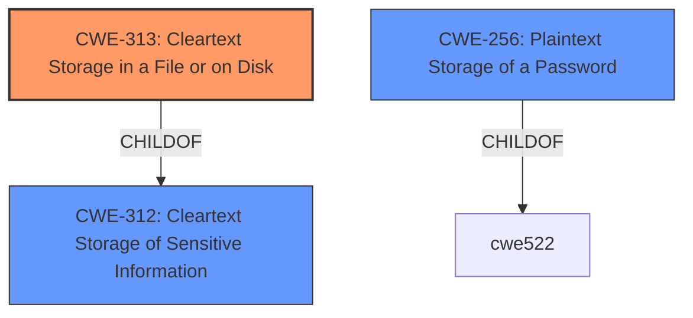

# Analysis Report for CVE-2020-35455

# Vulnerability Analysis Report: CVE-2020-35455

## Description


## Analysis (with Relationship Data)

# Summary
| CWE ID | CWE Name | Confidence | CWE Abstraction Level | CWE Vulnerability Mapping Label | CWE-Vulnerability Mapping Notes |
|---|---|---|---|---|---|
| CWE-313 | Cleartext Storage in a File or on Disk | 1.0 | Variant | Allowed | Primary CWE |
| CWE-312 | Cleartext Storage of Sensitive Information | 0.8 | Base | Allowed | Secondary Candidate |
| CWE-256 | Plaintext Storage of a Password | 0.7 | Base | Allowed | Secondary Candidate |

## Evidence and Confidence

*   **Confidence Score:** 0.9
*   **Evidence Strength:** HIGH

## Relationship Analysis
The primary weakness identified is CWE-313 (Cleartext Storage in a File or on Disk), which is a variant of CWE-312 (Cleartext Storage of Sensitive Information). CWE-312 is a more general case, while CWE-313 is specific to files and disks. Since the vulnerability description explicitly mentions storage in Shared Preferences (files) and SQLite database (on disk), CWE-313 is more appropriate. CWE-256 (Plaintext Storage of a Password) is also relevant, as credentials are being stored insecurely.



## Vulnerability Chain
The vulnerability chain starts with the **insecure data storage** (**ROOTCAUSE**). This leads to the storage of user credentials and personal data in plaintext. An attacker with local access can then read this data, leading to full account compromise and exposure of sensitive personal information.

## Summary of Analysis
The initial assessment identified several potential CWEs, including CWE-313, CWE-312, and CWE-256. Based on the detailed vulnerability description and the provided CVE reference, the application **insecurely** stores sensitive data, including user credentials, in plaintext within Shared Preferences and the SQLite database. This aligns directly with CWE-313, which specifies **"Cleartext Storage in a File or on Disk."** While CWE-312 is a parent, CWE-313 is more specific and accurately reflects the described vulnerability. CWE-256 is considered since the description involves passwords.
The evidence from the "CVE Reference Links Content Summary" clearly supports this: "The vulnerability stems from **insecure data storage** practices within the Taidii Diibear Android application. Specifically, the application stores sensitive data in plaintext within two locations: Shared Preferences and SQLite Database."
The selection of CWE-313 is at the optimal level of specificity because it's a Variant, which is preferred and accurately describes the **weakness**.

Relevant CWE Information:

# Enhanced Context (25 CWEs)
The following CWEs were identified as potentially relevant to this vulnerability:

## CWE-312: Cleartext Storage of Sensitive Information
**Abstraction Level**: Base
**Similarity Score**: 0.82
**Source**: dense

**Description**:
The product stores sensitive information in cleartext within a resource that might be accessible to another control sphere.

**Mapping Guidance**:
- Usage: Allowed
- Rationale: This CWE entry is at the Base level of abstraction, which is a preferred level of abstraction for mapping to the root causes of vulnerabilities.

## CWE-313: Cleartext Storage in a File or on Disk
**Abstraction Level**: Variant
**Similarity Score**: 0.76
**Source**: dense

**Description**:
The product stores sensitive information in cleartext in a file, or on disk.

**Mapping Guidance**:
- Usage: Allowed
- Rationale: This CWE entry is at the Variant level of abstraction, which is a preferred level of abstraction for mapping to the root causes of vulnerabilities.

## CWE-256: Plaintext Storage of a Password
**Abstraction Level**: Base
**Similarity Score**: 0.73
**Source**: dense

**Description**:
Storing a password in plaintext may result in a system compromise.

**Mapping Guidance**:
- Usage: Allowed
- Rationale: This CWE entry is at the Base level of abstraction, which is a preferred level of abstraction for mapping to the root causes of vulnerabilities.


## CWE Relationship Analysis

Current CWEs represent these abstraction levels: .


### Vulnerability Chain Analysis

**Chain starting from CWE-313:**
- 313 (Cleartext Storage in a File or on Disk) - ROOT


**Chain starting from CWE-256:**
- 256 (Plaintext Storage of a Password) - ROOT


### CWE Relationship Diagram

```mermaid
graph TD
    classDef primary fill:#f96,stroke:#333,stroke-width:2px
    classDef secondary fill:#69f,stroke:#333
    classDef tertiary fill:#9e9,stroke:#333
```


*Report generated on 2025-04-01 18:19:43*
