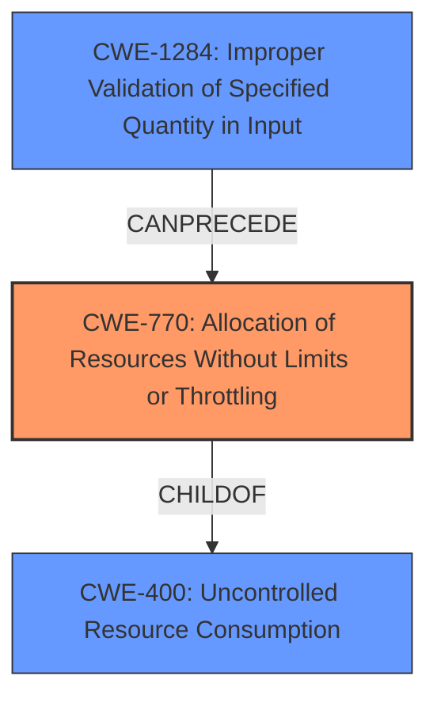

# Analysis for CVE-2020-35498

# Summary
| CWE ID | CWE Name | Confidence | CWE Abstraction Level | CWE Vulnerability Mapping Label | CWE-Vulnerability Mapping Notes |
|---|---|---|---|---|---|
| CWE-770 | Allocation of Resources Without Limits or Throttling | 0.8 | Base | Allowed | Primary CWE |
| CWE-1284 | Improper Validation of Specified Quantity in Input | 0.7 | Base | Allowed | Secondary Candidate |
| CWE-400 | Uncontrolled Resource Consumption | 0.6 | Class | Discouraged | Secondary Candidate |

## Evidence and Confidence

*   **Confidence Score:** 0.8
*   **Evidence Strength:** HIGH

## Relationship Analysis
The primary CWE selected is CWE-770, which is a base-level CWE and a child of CWE-400. The analysis also considered CWE-1284, which can precede CWE-770. The relationships between CWEs assisted in determining the root cause and potential vulnerability chain.

## Vulnerability Chain
The vulnerability chain starts with a **limitation in the implementation of userspace packet parsing**, potentially caused by **improper validation of input** (CWE-1284). This leads to **allocation of resources without limits or throttling** (CWE-770), eventually resulting in **uncontrolled resource consumption** (CWE-400) and a denial of service.

## Summary of Analysis
The initial analysis focused on the **root cause**, identified as a limitation in userspace packet parsing. The description and CVE reference suggest that a specially crafted packet can cause the kernel to allocate an excessive amount of resources, leading to a denial of service. The selection of CWE-770 is based on the evidence that the system **allocates resources without limits or throttling**, violating the intended security policy.

The evidence supports this: "The OVS packet parsing logic in userspace does not handle packets with excessive Ethernet padding correctly...Specifically, when the padding length exceeds 255 bytes, the packet parsing aborts prematurely, ignoring header fields from layers 3 and 4." This **limitation in implementation of userspace packet parsing** leads to an issue.

CWE-1284 was considered because the vulnerability involves **improper handling of a quantity (padding length)** in the input packet. However, the core issue is the lack of limits on resource allocation after the parsing error, making CWE-770 the more direct cause.

CWE-400 was also considered, but it is a class-level CWE and therefore less specific than CWE-770. It represents the impact (uncontrolled resource consumption) rather than the root cause (allocation without limits).

The final decision is based on the evidence provided and the relationships between CWEs, resulting in the selection of CWE-770 as the primary weakness, with CWE-1284 and CWE-400 as contributing factors. The chosen CWEs are at the optimal level of specificity.

Relevant CWE Information:

# Enhanced Context (25 CWEs)
The following CWEs were identified as potentially relevant to this vulnerability:

## CWE-404: Improper Resource Shutdown or Release
**Abstraction Level**: Class
**Similarity Score**: 0.76
**Source**: dense

**Description**:
The product does not release or incorrectly releases a resource before it is made available for re-use.

**Mapping Guidance**:
- Usage: Allowed-with-Review
- Rationale: This CWE entry is a Class and might have Base-level children that would be more appropriate

## CWE-667: Improper Locking
**Abstraction Level**: Class
**Similarity Score**: 0.76
**Source**: dense

**Description**:
The product does not properly acquire or release a lock on a resource, leading to unexpected resource state changes and behaviors.

**Mapping Guidance**:
- Usage: Allowed-with-Review
- Rationale: This CWE entry is a Class and might have Base-level children that would be more appropriate

## CWE-833: Deadlock
**Abstraction Level**: Base
**Similarity Score**: 0.75
**Source**: dense

**Description**:
The product contains multiple threads or executable segments that are waiting for each other to release a necessary lock, resulting in deadlock.

**Mapping Guidance**:
- Usage: Allowed
- Rationale: This CWE entry is at the Base level of abstraction, which is a preferred level of abstraction for mapping to the root causes of vulnerabilities.

## CWE-664: Improper Control of a Resource Through its Lifetime
**Abstraction Level**: Pillar
**Similarity Score**: 0.74
**Source**: dense

**Description**:
The product does not maintain or incorrectly maintains control over a resource throughout its lifetime of creation, use, and release.

**Mapping Guidance**:
- Usage: Discouraged
- Rationale: This CWE entry is high-level when lower-level children are available.

## CWE-226: Sensitive Information in Resource Not Removed Before Reuse
**Abstraction Level**: Base
**Similarity Score**: 0.73
**Source**: dense

**Description**:
The product releases a resource such as memory or a file so that it can be made available for reuse, but it does not clear or "zeroize" the information contained in the resource before the product performs a critical state transition or makes the resource available for reuse by other entities.

**Mapping Guidance**:
- Usage: Allowed
- Rationale: This CWE entry is at the Base level of abstraction, which is a preferred level of abstraction for mapping to the root causes of vulnerabilities.

## CWE-413: Improper Resource Locking
**Abstraction Level**: Base
**Similarity Score**: 0.73
**Source**: dense

**Description**:
The product does not lock or does not correctly lock a resource when the product must have exclusive access to the resource.

**Mapping Guidance**:
- Usage: Allowed
- Rationale: This CWE entry is at the Base level of abstraction, which is a preferred level of abstraction for mapping to the root causes of vulnerabilities.

## CWE-1325: Improperly Controlled Sequential Memory Allocation
**Abstraction Level**: Base
**Similarity Score**: 0.73
**Source**: dense

**Description**:
The product manages a group of objects or resources and performs a separate memory allocation for each object, but it does not properly limit the total amount of memory that is consumed by all of the combined objects.

**Mapping Guidance**:
- Usage: Allowed
- Rationale: This CWE entry is at the Base level of abstraction, which is a preferred level of abstraction for mapping to the root causes of vulnerabilities.

## CWE-789: Memory Allocation with Excessive Size Value
**Abstraction Level**: Variant
**Similarity Score**: 0.72
**Source**: dense

**Description**:
The product allocates memory based on an untrusted, large size value, but it does not ensure that the size is within expected limits, allowing arbitrary amounts of memory to be allocated.

**Mapping Guidance**:
- Usage: Allowed
- Rationale: This CWE entry is at the Variant level of abstraction, which is a preferred level of abstraction for mapping to the root causes of vulnerabilities.

## CWE-405: Asymmetric Resource Consumption (Amplification)
**Abstraction Level**: Class
**Similarity Score**: 0.72
**Source**: dense

**Description**:
The product does not properly control situations in which an adversary can cause the product to consume or produce excessive resources without requiring the adversary to invest equivalent work or otherwise prove authorization, i.e., the adversary's influence is "asymmetric."

**Mapping Guidance**:
- Usage: Allowed-with-Review
- Rationale: This CWE entry is a Class and might have Base-level children that would be more appropriate

## CWE-662: Improper Synchronization
**Abstraction Level**: Class
**Similarity Score**: 0.72
**Source**: dense

**Description**:
The product utilizes multiple threads or processes to allow temporary access to a shared resource that can only be exclusive to one process at a time, but it does not properly synchronize these actions, which might cause simultaneous accesses of this resource by multiple threads or processes.

**Mapping Guidance**:
- Usage: Discouraged
- Rationale: This CWE entry is a level-1 Class (i.e., a child of a Pillar). It might have lower-level children that would be more appropriate

## CWE-770: Allocation of Resources Without Limits or Throttling
**Abstraction Level**: Base
**Similarity Score**: 5779.09
**Source**: sparse

**Description**:
The product allocates a reusable resource