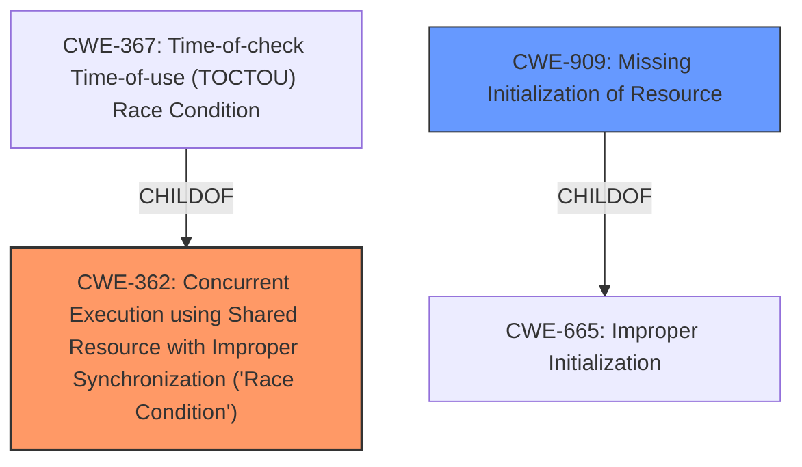

# Analysis Report for CVE-2020-35508

# Vulnerability Analysis Report: CVE-2020-35508

## Description


## Analysis (with Relationship Data)

# Summary
| CWE ID | CWE Name | Confidence | CWE Abstraction Level | CWE Vulnerability Mapping Label | CWE-Vulnerability Mapping Notes |
|---|---|---|---|---|---|
| CWE-362 | Concurrent Execution using Shared Resource with Improper Synchronization ('Race Condition') | 0.9 | Class | Allowed-with-Review | Primary CWE |
| CWE-909 | Missing Initialization of Resource | 0.7 | Class | Allowed-with-Review | Secondary CWE |

## Evidence and Confidence

*   **Confidence Score:** 0.8
*   **Evidence Strength:** HIGH

## Relationship Analysis
The primary weakness is a **race condition** (CWE-362). CWE-362 is a Class-level CWE, and it has a child CWE-367 "Time-of-check Time-of-use (TOCTOU) Race Condition" which is a Base-level CWE. However, the description does not indicate the TOCTOU condition specifically. The secondary weakness is **incorrect initialization of process id**, which maps to CWE-909 "Missing Initialization of Resource". CWE-909 is a Class-level CWE, and is a child of CWE-665 "Improper Initialization". The relationship to CWE-665 is not explicit, so the Class-level CWE-909 is appropriate.



## Vulnerability Chain
The vulnerability chain starts with a **race condition and incorrect initialization of the process id** in the Linux kernel's child/parent process identification handling. This allows a local attacker to **bypass checks to send any signal to a privileged process**.

## Summary of Analysis
The vulnerability description highlights two issues: a **race condition and incorrect initialization of the process id**.

The **race condition** maps directly to CWE-362 "Concurrent Execution using Shared Resource with Improper Synchronization ('Race Condition')". The vulnerability description states: "A flaw possibility of **race condition**... was found in the Linux kernel child/parent process identification handling while filtering signal handlers." The "CVE Reference Links Content Summary" states: "The root cause is a **race condition** during process creation when using `CLONE_PARENT` flag in the `copy_process` function." This makes CWE-362 a strong primary candidate.

The **incorrect initialization of the process id** maps to CWE-909 "Missing Initialization of Resource". The vulnerability description states: "... **incorrect initialization of the process id** was found in the Linux kernel child/parent process identification handling while filtering signal handlers." The "CVE Reference Links Content Summary" states: "Also, there is an issue of **incorrect initialization of process ID**."

CWE-367 "Time-of-check Time-of-use (TOCTOU) Race Condition" was considered because it is a child of CWE-362 and is a Base-level CWE, but the description does not explicitly state a TOCTOU condition where the state of a resource is checked before use, but can change between the check and the use in a way that invalidates the results of the check.

CWE-667 "Improper Locking" was considered as a possible cause of the race condition but was not chosen because there is no specific mention of locking mechanisms being used or misused.

CWE-415 "Double Free", CWE-364 "Signal Handler Race Condition", CWE-123 "Write-what-where Condition", CWE-662 "Improper Synchronization", CWE-476 "NULL Pointer Dereference" and CWE-908 "Use of Uninitialized Resource" were considered, but the description does not contain any information that supports those CWEs.


## CWE Relationship Analysis

Current CWEs represent these abstraction levels: .


### Vulnerability Chain Analysis

**Chain starting from CWE-667:**
- 667 (Improper Locking) - ROOT


**Chain starting from CWE-415:**
- 415 (Double Free) - ROOT


### CWE Relationship Diagram

```mermaid
graph TD
    classDef primary fill:#f96,stroke:#333,stroke-width:2px
    classDef secondary fill:#69f,stroke:#333
    classDef tertiary fill:#9e9,stroke:#333
```


*Report generated on 2025-04-02 09:28:36*
