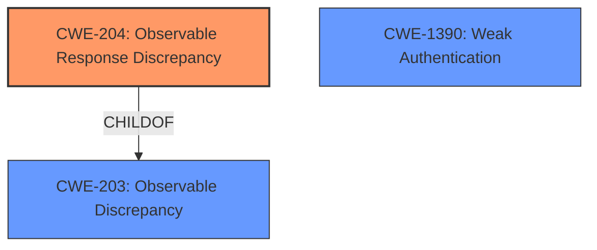

# Analysis Report for CVE-2020-35518

# Vulnerability Analysis Report: CVE-2020-35518

## Description


## Analysis (with Relationship Data)

# Summary
| CWE ID  | CWE Name                                                      | Confidence | CWE Abstraction Level | CWE Vulnerability Mapping Label | CWE-Vulnerability Mapping Notes |
| :-------- | :------------------------------------------------------------ | :--------- | :---------------------- | :------------------------------ | :------------------------------ |
| CWE-204   | Observable Response Discrepancy                               | 0.9        | Base                    | Primary                         | Allowed                       |
| CWE-203   | Observable Discrepancy                                        | 0.6        | Base                    | Secondary                       | Allowed                       |
| CWE-1390  | Weak Authentication                                           | 0.5        | Class                   | Secondary                       | Allowed-with-Review           |

## Evidence and Confidence

*   **Confidence Score:** 0.8
*   **Evidence Strength:** HIGH

## Relationship Analysis
The primary CWE selected is CWE-204, which is a child of CWE-203. This parent-child relationship indicates that CWE-204 is a more specific case of CWE-203. CWE-1390 is related as a weakness that could potentially lead to similar vulnerabilities, but it is a class and not as specific.



## Vulnerability Chain
The vulnerability chain starts with the **incorrect** error handling in 389-ds-base. This leads to the disclosure of information about the existence of entries in the LDAP database, which can be exploited by an unauthenticated attacker.

## Summary of Analysis
The initial analysis pointed towards CWE-204 as the primary weakness, given the **observable response discrepancy** that reveals internal state. The vulnerability description and the CVE Reference Links Content Summary provide strong evidence for this.

> The LDAP server was returning specific error messages that revealed information about the existence of entries during the bind operation. Specifically, it was returning 'No such entry' (LDAP_NO_SUCH_OBJECT) if a bind was attempted on a non-existent entry, and 'inappropriate authentication' (LDAP_INAPPROPRIATE_AUTH) if the entry exists, but did not have 'userpassword' set. This allowed unauthenticated users to enumerate existing entries in the directory.

This evidence strongly supports the selection of CWE-204.

CWE-203 was considered as a more general case of **observable discrepancy**, but CWE-204 provides a more precise description of the vulnerability.
CWE-1390 was considered because the vulnerability is related to authentication, but the root cause is more about the **information disclosure** via error messages rather than a fundamentally **weak authentication** mechanism.

Therefore, CWE-204 is the most appropriate and specific choice.

Relevant CWE Information:

# Enhanced Context (25 CWEs)
The following CWEs were identified as potentially relevant to this vulnerability:

## CWE-204: Observable Response Discrepancy
**Abstraction Level**: Base
**Similarity Score**: 0.78
**Source**: dense

**Description**:
The product provides different responses to incoming requests in a way that reveals internal state information to an unauthorized actor outside of the intended control sphere.

**Mapping Guidance**:
- Usage: Allowed
- Rationale: This CWE entry is at the Base level of abstraction, which is a preferred level of abstraction for mapping to the root causes of vulnerabilities.

## CWE-203: Observable Discrepancy
**Abstraction Level**: Base
**Similarity Score**: 0.75
**Source**: dense

**Description**:
The product behaves differently or sends different responses under different circumstances in a way that is observable to an unauthorized actor, which exposes security-relevant information about the state of the product, such as whether a particular operation was successful or not.

**Mapping Guidance**:
- Usage: Allowed
- Rationale: This CWE entry is at the Base level of abstraction, which is a preferred level of abstraction for mapping to the root causes of vulnerabilities.

## CWE-1390: Weak Authentication
**Abstraction Level**: Class
**Similarity Score**: 0.75
**Source**: dense

**Description**:
The product uses an authentication mechanism to restrict access to specific users or identities, but the mechanism does not sufficiently prove that the claimed identity is correct.

**Mapping Guidance**:
- Usage: Allowed-with-Review
- Rationale: This CWE entry is a Class and might have Base-level children that would be more appropriate

### Technical Explanation for CWE-204:

*   How the vulnerability's details match the CWE's characteristics: The 389-ds-base server responds differently depending on whether a DN exists, revealing internal state (existence of the entry) to an unauthenticated attacker.
*   The security implications and potential impact: An attacker can enumerate valid DNs without authentication, which can be used for further attacks.
*   Any parent-child relationships or chain patterns that influenced your mapping: CWE-204 is a child of CWE-203, indicating a more specific type of observable discrepancy.
*   Whether the weakness is primary or secondary in the vulnerability: This is the primary weakness.
*   How the official MITRE mapping guidance influenced your decision: The usage is ALLOWED and the abstraction level is Base, which is preferred.

### Technical Explanation for CWE-203:

*   How the vulnerability's details match the CWE's characteristics: The 389-ds-base server exhibits different behavior depending on the existence of a DN.
*   The security implications and potential impact: Information disclosure about the LDAP database structure.
*   Any parent-child relationships or chain patterns that influenced your mapping: CWE-204 is a more specific child of this CWE.
*   Whether the weakness is primary or secondary in the vulnerability: This is a secondary, more general weakness.
*   How the official MITRE mapping guidance influenced your decision: The usage is ALLOWED and the abstraction level is Base, which is preferred.

### Technical Explanation for CWE-1390:

*   How the vulnerability's details match the CWE's characteristics: The authentication mechanism reveals information that it should not.
*   The security implications and potential impact: Potential for bypassing authentication or gaining unauthorized access.
*   Any parent-child relationships or chain patterns that influenced your mapping: Not directly part of a clear chain in this case.
*   Whether the weakness is primary or secondary in the vulnerability: This is a secondary weakness.
*   How the official MITRE mapping guidance influenced your decision: Usage is Allowed-with-Review, suggesting a need for careful consideration.

### CWEs Considered but Not Used:

*   CWE-90 (LDAP Injection): Not applicable because there is no indication of improper neutralization of special elements in an LDAP query. The issue is with the different responses.
*   CWE-639 (Authorization Bypass Through User-Controlled Key): Not applicable because the issue is not related to bypassing authorization through a user-controlled key.
*   CWE-350 (Reliance on Reverse DNS Resolution for a Security-Critical Action): Not applicable as DNS resolution is not involved.
*   CWE-540 (Inclusion of Sensitive Information in Source Code): Not applicable as the issue is not related to source code exposure.
*   CWE-807 (Reliance on Untrusted Inputs in a Security Decision): While there is a reliance on inputs, the core issue is the different responses based on those inputs, making CWE-204 more fitting.


## CWE Relationship Analysis

Current CWEs represent these abstraction levels: .


### Vulnerability Chain Analysis

**Chain starting from CWE-350:**
- 350 (Reliance on Reverse DNS Resolution for a Security-Critical Action) - ROOT


**Chain starting from CWE-807:**
- 807 (Reliance on Untrusted Inputs in a Security Decision) - ROOT


### CWE Relationship Diagram

```mermaid
graph TD
    classDef primary fill:#f96,stroke:#333,stroke-width:2px
    classDef secondary fill:#69f,stroke:#333
    classDef tertiary fill:#9e9,stroke:#333
```


*Report generated on 2025-04-02 01:02:17*
