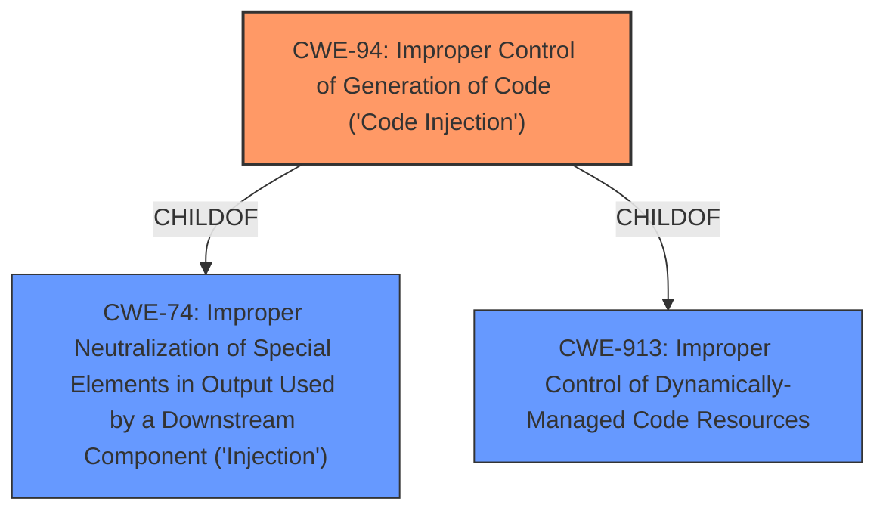

# Analysis Report for CVE-2020-35564

# Vulnerability Analysis Report: CVE-2020-35564

## Description


## Analysis (with Relationship Data)

# Summary
| CWE ID | CWE Name | Confidence | CWE Abstraction Level | CWE Vulnerability Mapping Label | CWE-Vulnerability Mapping Notes |
|---|---|---|---|---|---|
| CWE-94 | Improper Control of Generation of Code ('Code Injection') | 0.8 | Base | Allowed-with-Review | Primary CWE: The **root cause** is an **outdated and unused component** allowing for malicious user input of active code. This aligns with the CWE-94 description where the product constructs a code segment using externally-influenced input without proper neutralization. |

## Evidence and Confidence

*   **Confidence Score:** 0.8
*   **Evidence Strength:** HIGH

## Relationship Analysis
The primary CWE is CWE-94, which is at the Base level. It has ChildOf relationships to CWE-74 and CWE-913. No chain relationships appear relevant in this case. The choice of CWE-94 is based on the injection of active code, as opposed to data, which is what the description says.



## Vulnerability Chain
The vulnerability chain starts with an **outdated and unused component**, leading to **improper control of generation of code**, which results in the **injection of malicious code**.
- Root Cause: **Outdated and unused component**
- Weakness: CWE-94, Improper Control of Generation of Code ('Code Injection')
- Impact: Malicious user input of active code

## Summary of Analysis
The initial assessment, based on the vulnerability description and CVE Reference Links Content Summary, indicates that the **root cause** is an **outdated and unused component** that allows for the **injection of malicious user input of active code**.
The summary indicates **Weaknesses/vulnerabilities present**: Improper Neutralization of Special Elements in Output Used by a Downstream Component ("Injection"), also described as CWE-74.
The retriever results also include CWE-74 as a related CWE. However, the key aspect of this vulnerability is the active code injection, which aligns more directly with CWE-94. While CWE-74 (Improper Neutralization of Special Elements in Output Used by a Downstream Component ('Injection')) is a parent of CWE-94, the latter is more specific because it involves code generation rather than general data injection.
The choice of CWE-94 is at the Base level of abstraction, providing a more specific and accurate representation of the vulnerability. This is supported by the evidence of active code injection, and the relationships confirm its place within the broader category of injection vulnerabilities.
CWE-78, OS Command Injection, was considered but deemed less appropriate because the vulnerability description doesn't explicitly state that the injected code is an OS command.
CWE-22, Path Traversal, was considered but deemed less appropriate because the code injection isn't necessarily related to path manipulation.
The selection of CWE-94 is justified by the specific details of the vulnerability and aligns with the principle of choosing the most specific CWE that accurately represents the weakness. The confidence level is rated at 0.8 due to the clear indication of active code injection in the vulnerability description.

Relevant CWE Information:
- CWE-94: Improper Control of Generation of Code ('Code Injection')
  - The product constructs all or part of a code segment using externally-influenced input from an upstream component, but it does not neutralize or incorrectly neutralizes special elements that could modify the syntax or behavior of the intended code segment.
  - The vulnerability allows for the injection of malicious user input of active code.


## CWE Relationship Analysis

Current CWEs represent these abstraction levels: .


### Vulnerability Chain Analysis

**Chain starting from CWE-78:**
- 78 (Improper Neutralization of Special Elements used in an OS Command ('OS Command Injection')) - ROOT


**Chain starting from CWE-74:**
- 74 (Improper Neutralization of Special Elements in Output Used by a Downstream Component ('Injection')) - ROOT


### CWE Relationship Diagram

```mermaid
graph TD
    classDef primary fill:#f96,stroke:#333,stroke-width:2px
    classDef secondary fill:#69f,stroke:#333
    classDef tertiary fill:#9e9,stroke:#333
```


*Report generated on 2025-04-02 16:27:15*
