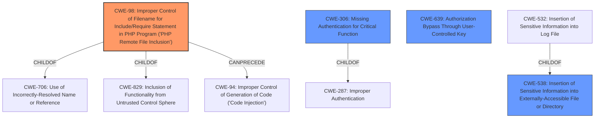

# Enhanced Analysis for CVE-2020-35580

# Summary
| CWE ID | CWE Name | Confidence | CWE Abstraction Level | CWE Vulnerability Mapping Label | CWE-Vulnerability Mapping Notes |
|---|---|---|---|---|---|
| CWE-98 | Improper Control of Filename for Include/Require Statement in PHP Program ('PHP Remote File Inclusion') | 1.0 | Variant | Allowed | Primary CWE |
| CWE-306 | Missing Authentication for Critical Function | 0.75 | Base | Allowed | Secondary Candidate |
| CWE-538 | Insertion of Sensitive Information into Externally-Accessible File or Directory | 0.75 | Base | Allowed | Secondary Candidate |
| CWE-639 | Authorization Bypass Through User-Controlled Key | 0.75 | Base | Allowed | Secondary Candidate |

## Evidence and Confidence

*   **Confidence Score:** 0.9
*   **Evidence Strength:** HIGH

## Relationship Analysis
The primary CWE is CWE-98, which is a variant of CWE-706 and CWE-829. CWE-98 can precede CWE-94.
CWE-306 is a child of CWE-287.
CWE-538 has a child CWE-532.
CWE-639 does not have any relationships to other CWEs besides itself.



## Vulnerability Chain
The chain of weaknesses starts with the **local file inclusion** vulnerability which allows reading arbitrary files. This leads to information disclosure of sensitive data, including the Super Admin API key and user password hashes. The Super Admin API key then allows for unauthorized API access.

## Summary of Analysis
The initial analysis identified the **local file inclusion** vulnerability as the primary weakness. The key phrase "**local file inclusion**" strongly suggests CWE-98, "Improper Control of Filename for Include/Require Statement in PHP Program ('PHP Remote File Inclusion')."

The provided evidence clearly states: "A **local file inclusion** vulnerability in the FileServlet in all SearchBlox before 9.2.2 allows remote, unauthenticated users to read arbitrary files from the operating system via a /searchblox/servlet/FileServlet?col=url= request." This confirms the presence of a file inclusion vulnerability.

The analysis was refined by considering the additional weaknesses arising from this vulnerability. The lack of authentication (CWE-306) allows unauthenticated users to exploit the LFI. The LFI leads to the exposure of the Super Admin API key and user password hashes, which represents an insertion of sensitive information into an externally accessible file (CWE-538). Finally, the API key allows for authorization bypass (CWE-639).

The selected CWEs are at the optimal level of specificity, as they accurately represent the root cause and the subsequent weaknesses that arise from the initial vulnerability.

Relevant CWE Information:
- CWE-98: Is the most accurate because the vulnerability is a file inclusion.
- CWE-306: There is a lack of authentication on the FileServlet.
- CWE-538: Because the Super Admin API key and user password hashes are exposed.
- CWE-639: Because the API key allows for authorization bypass.


## CWE Relationship Analysis

Current CWEs represent these abstraction levels: .


### Vulnerability Chain Analysis

**Chain starting from CWE-306:**
- 306 (Missing Authentication for Critical Function) - ROOT


**Chain starting from CWE-538:**
- 538 (Insertion of Sensitive Information into Externally-Accessible File or Directory) - ROOT


### CWE Relationship Diagram

```mermaid
graph TD
    classDef primary fill:#f96,stroke:#333,stroke-width:2px
    classDef secondary fill:#69f,stroke:#333
    classDef tertiary fill:#9e9,stroke:#333
```