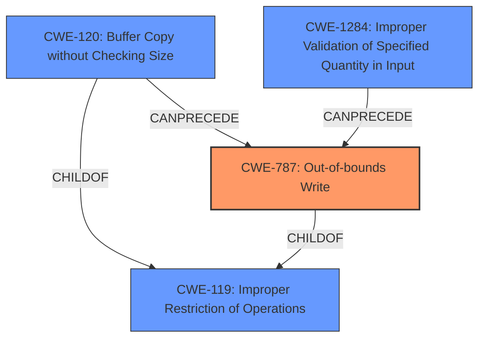

# Analysis for CVE-2020-35608

# Summary
| CWE ID    | CWE Name                                                        | Confidence | CWE Abstraction Level | CWE Vulnerability Mapping Label | CWE-Vulnerability Mapping Notes |
| :--------- | :-------------------------------------------------------------- | :--------- | :---------------------- | :------------------------------ | :------------------------------ |
| CWE-787   | Out-of-bounds Write                                             | 0.9        | Base                    | Primary                         | Allowed                         |
| CWE-120   | Buffer Copy without Checking Size of Input ('Classic Buffer Overflow') | 0.7        | Base                    | Secondary                       | Allowed-with-Review             |
| CWE-1284  | Improper Validation of Specified Quantity in Input            | 0.6        | Base                    | Secondary                       | Allowed                         |

## Evidence and Confidence

*   **Confidence Score:** 0.8
*   **Evidence Strength:** HIGH

## Relationship Analysis
The primary CWE is CWE-787, which is a base-level weakness describing an out-of-bounds write. This is related to the `PACKET_MMAP` functionality where the kernel writes received network packets into a shared memory buffer. CWE-787 is a child of CWE-119 (Improper Restriction of Operations within the Bounds of a Memory Buffer). CWE-120 (Buffer Copy without Checking Size of Input) is another child of CWE-119 and can precede CWE-787. CWE-1284 (Improper Validation of Specified Quantity in Input) is also considered, as the size or length of the packets might not be properly validated, potentially leading to the out-of-bounds write.

## Vulnerability Chain
The vulnerability chain starts with a specially crafted AF_PACKET socket. The kernel writes attacker-controlled data into a shared memory buffer with executable permissions due to the `PACKET_MMAP` feature, leading to an **out-of-bounds write (CWE-787)** and ultimately code execution. **Improper validation of the size of the input (CWE-1284)** could contribute to the vulnerability.

## Summary of Analysis
The primary weakness is an **out-of-bounds write (CWE-787)**, where the kernel writes data past the intended buffer.
The vulnerability description states: "The vulnerability lies in the usage of the `PACKET_MMAP` kernel feature in conjunction with the `AF_PACKET` socket. This feature allows mapping a shared memory buffer between the kernel and user space. The kernel writes received network packets into this buffer, and if the user-space process maps this buffer with `PROT_READ|PROT_EXEC`, the attacker can inject and execute arbitrary code by controlling the content of received packets."
CWE-787 is a base-level CWE, which is preferred. The Retriever Results also listed CWE-787 as the top CWE ID match.
CWE-120 is a potential contributing factor since the size of the input buffer from the network may not be checked before being copied to the shared memory region. The CWE description states: "The product copies an input buffer to an output buffer without verifying that the size of the input buffer is less than the size of the output buffer, leading to a buffer overflow." This is also a base-level CWE.
CWE-1284 is also a candidate since the quantity/size of the input may not be properly validated leading to the out-of-bounds write.
CWE-119 (Improper Restriction of Operations within the Bounds of a Memory Buffer) was considered but not chosen because it is a Class-level CWE and is discouraged.
CWE-190 (Integer Overflow or Wraparound) was considered but not chosen because the root cause is not an integer overflow, but rather an out-of-bounds write due to the kernel writing attacker-controlled data into a memory region without proper bounds checking.
CWE-125 (Out-of-bounds Read) was considered but is not the primary issue. The primary issue is writing to an out-of-bounds memory region, not reading.

Relevant CWE Information:

# Enhanced Context (25 CWEs)
The following CWEs were identified as potentially relevant to this vulnerability:

## CWE-191: Integer Underflow (Wrap or Wraparound)
**Abstraction Level**: Base
**Similarity Score**: 0.79
**Source**: dense

**Description**:
The product subtracts one value from another, such that the result is less than the minimum allowable integer value, which produces a value that is not equal to the correct result.

**Mapping Guidance**:
- Usage: Allowed
- Rationale: This CWE entry is at the Base level of abstraction, which is a preferred level of abstraction for mapping to the root causes of vulnerabilities.

## CWE-131: Incorrect Calculation of Buffer Size
**Abstraction Level**: Base
**Similarity Score**: 0.78
**Source**: dense

**Description**:
The product does not correctly calculate the size to be used when allocating a buffer, which could lead to a buffer overflow.

**Mapping Guidance**:
- Usage: Allowed
- Rationale: This CWE entry is at the Base level of abstraction, which is a preferred level of abstraction for mapping to the root causes of vulnerabilities.

## CWE-805: Buffer Access with Incorrect Length Value
**Abstraction Level**: Base
**Similarity Score**: 0.77
**Source**: dense

**Description**:
The product uses a sequential operation to read or write a buffer, but it uses an incorrect length value that causes it to access memory that is outside of the bounds of the buffer.

**Mapping Guidance**:
- Usage: Allowed
- Rationale: This CWE entry is at the Base level of abstraction, which is a preferred level of abstraction for mapping to the root causes of vulnerabilities.

## CWE-124: Buffer Underwrite ('Buffer Underflow')
**Abstraction Level**: Base
**Similarity Score**: 0.76
**Source**: dense

**Description**:
The product writes to a buffer using an index or pointer that references a memory location prior to the beginning of the buffer.

**Mapping Guidance**:
- Usage: Allowed
- Rationale: This CWE entry is at the Base level of abstraction, which is a preferred level of abstraction for mapping to the root causes of vulnerabilities.

## CWE-197: Numeric Truncation Error
**Abstraction Level**: Base
**Similarity Score**: 0.76
**Source**: dense

**Description**:
Truncation errors occur when a primitive is cast to a primitive of a smaller size and data is lost in the conversion.

**Mapping Guidance**:
- Usage: Allowed
- Rationale: This CWE entry is at the Base level of abstraction, which is a preferred level of abstraction for mapping to the root causes of vulnerabilities.

## CWE-126: Buffer Over-read
**Abstraction Level**: Variant
**Similarity Score**: 0.76
**Source**: dense

**Description**:
The product reads from a buffer using buffer access mechanisms such as indexes or pointers that reference memory locations after the targeted buffer.

**Mapping Guidance**:
- Usage: Allowed
- Rationale: This CWE entry is at the Variant level of abstraction, which is a preferred level of abstraction for mapping to the root causes of vulnerabilities.

## CWE-190: Integer Overflow or Wraparound
**Abstraction Level**: Base
**Similarity Score**: 0.76
**Source**: dense

**Description**:
The product performs a calculation that can
         produce an integer overflow or wraparound when the logic
         assumes that the resulting value will always be larger than
         the original value. This occurs when an integer value is
         incremented to a value that is too large to store in the
         associated representation. When this occurs, the value may
         become a very small or negative number.

**Mapping Guidance**:
- Usage: Allowed
- Rationale: This CWE entry is at the Base level of abstraction, which is a preferred level of abstraction for mapping to the root causes of vulnerabilities.

## CWE-125: Out-of-bounds Read
**Abstraction Level**: Base
**Similarity Score**: 0.76
**Source**: dense

**Description**:
The product reads data past the end, or before the beginning, of the intended buffer.

**Mapping Guidance