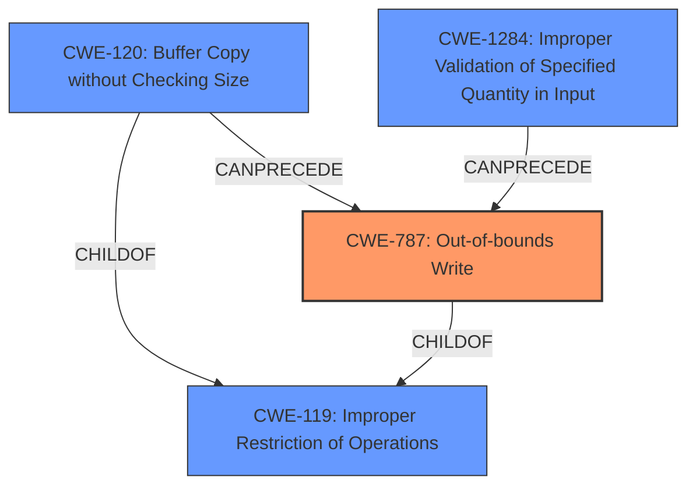

# Analysis for CVE-2020-35608

# Summary
| CWE ID    | CWE Name                                                        | Confidence | CWE Abstraction Level | CWE Vulnerability Mapping Label | CWE-Vulnerability Mapping Notes |
| :--------- | :-------------------------------------------------------------- | :--------- | :---------------------- | :------------------------------ | :------------------------------ |
| CWE-787   | Out-of-bounds Write                                             | 0.9        | Base                    | Primary                         | Allowed                         |
| CWE-120   | Buffer Copy without Checking Size of Input ('Classic Buffer Overflow') | 0.7        | Base                    | Secondary                       | Allowed-with-Review             |
| CWE-1284  | Improper Validation of Specified Quantity in Input            | 0.6        | Base                    | Secondary                       | Allowed                         |

## Evidence and Confidence

*   **Confidence Score:** 0.8
*   **Evidence Strength:** HIGH

## Relationship Analysis
The primary CWE is CWE-787, which is a base-level weakness describing an out-of-bounds write. This is related to the `PACKET_MMAP` functionality where the kernel writes received network packets into a shared memory buffer. CWE-787 is a child of CWE-119 (Improper Restriction of Operations within the Bounds of a Memory Buffer). CWE-120 (Buffer Copy without Checking Size of Input) is another child of CWE-119 and can precede CWE-787. CWE-1284 (Improper Validation of Specified Quantity in Input) is also considered, as the size or length of the packets might not be properly validated, potentially leading to the out-of-bounds write.

## Vulnerability Chain
The vulnerability chain starts with a specially crafted AF_PACKET socket. The kernel writes attacker-controlled data into a shared memory buffer with executable permissions due to the `PACKET_MMAP` feature, leading to an **out-of-bounds write (CWE-787)** and ultimately code execution. **Improper validation of the size of the input (CWE-1284)** could contribute to the vulnerability.

## Summary of Analysis
The primary weakness is an **out-of-bounds write (CWE-787)**, where the kernel writes data past the intended buffer.
The vulnerability description states: "The vulnerability lies in the usage of the `PACKET_MMAP` kernel feature in conjunction with the `AF_PACKET` socket. This feature allows mapping a shared memory buffer between the kernel and user space. The kernel writes received network packets into this buffer, and if the user-space process maps this buffer with `PROT_READ|PROT_EXEC`, the attacker can inject and execute arbitrary code by controlling the content of received packets."
CWE-787 is a base-level CWE, which is preferred. The Retriever Results also listed CWE-787 as the top CWE ID match.
CWE-120 is a potential contributing factor since the size of the input buffer from the network may not be checked before being copied to the shared memory region. The CWE description states: "The product copies an input buffer to an output buffer without verifying that the size of the input buffer is less than the size of the output buffer, leading to a buffer overflow." This is also a base-level CWE.
CWE-1284 is also a candidate since the quantity/size of the input may not be properly validated leading to the out-of-bounds write.
CWE-119 (Improper Restriction of Operations within the Bounds of a Memory Buffer) was considered but not chosen because it is a Class-level CWE and is discouraged.
CWE-190 (Integer Overflow or Wraparound) was considered but not chosen because the root cause is not an integer overflow, but rather an out-of-bounds write due to the kernel writing attacker-controlled data into a memory region without proper bounds checking.
CWE-125 (Out-of-bounds Read) was considered but is not the primary issue. The primary issue is writing to an out-of-bounds memory region, not reading.

Relevant CWE Information:

# Enhanced Context (25 CWEs)
The following CWEs were identified as potentially relevant to this vulnerability:

## CWE-191: Integer Underflow (Wrap or Wraparound)
**Abstraction Level**: Base
**Similarity Score**: 0.79
**Source**: dense

**Description**:
The product subtracts one value from another, such that the result is less than the minimum allowable integer value, which produces a value that is not equal to the correct result.

**Mapping Guidance**:
- Usage: Allowed
- Rationale: This CWE entry is at the Base level of abstraction, which is a preferred level of abstraction for mapping to the root causes of vulnerabilities.

## CWE-131: Incorrect Calculation of Buffer Size
**Abstraction Level**: Base
**Similarity Score**: 0.78
**Source**: dense

**Description**:
The product does not correctly calculate the size to be used when allocating a buffer, which could lead to a buffer overflow.

**Mapping Guidance**:
- Usage: Allowed
- Rationale: This CWE entry is at the Base level of abstraction, which is a preferred level of abstraction for mapping to the root causes of vulnerabilities.

## CWE-805: Buffer Access with Incorrect Length Value
**Abstraction Level**: Base
**Similarity Score**: 0.77
**Source**: dense

**Description**:
The product uses a sequential operation to read or write a buffer, but it uses an incorrect length value that causes it to access memory that is outside of the bounds of the buffer.

**Mapping Guidance**:
- Usage: Allowed
- Rationale: This CWE entry is at the Base level of abstraction, which is a preferred level of abstraction for mapping to the root causes of vulnerabilities.

## CWE-124: Buffer Underwrite ('Buffer Underflow')
**Abstraction Level**: Base
**Similarity Score**: 0.76
**Source**: dense

**Description**:
The product writes to a buffer using an index or pointer that references a memory location prior to the beginning of the buffer.

**Mapping Guidance**:
- Usage: Allowed
- Rationale: This CWE entry is at the Base level of abstraction, which is a preferred level of abstraction for mapping to the root causes of vulnerabilities.

## CWE-197: Numeric Truncation Error
**Abstraction Level**: Base
**Similarity Score**: 0.76
**Source**: dense

**Description**:
Truncation errors occur when a primitive is cast to a primitive of a smaller size and data is lost in the conversion.

**Mapping Guidance**:
- Usage: Allowed
- Rationale: This CWE entry is at the Base level of abstraction, which is a preferred level of abstraction for mapping to the root causes of vulnerabilities.

## CWE-126: Buffer Over-read
**Abstraction Level**: Variant
**Similarity Score**: 0.76
**Source**: dense

**Description**:
The product reads from a buffer using buffer access mechanisms such as indexes or pointers that reference memory locations after the targeted buffer.

**Mapping Guidance**:
- Usage: Allowed
- Rationale: This CWE entry is at the Variant level of abstraction, which is a preferred level of abstraction for mapping to the root causes of vulnerabilities.

## CWE-190: Integer Overflow or Wraparound
**Abstraction Level**: Base
**Similarity Score**: 0.76
**Source**: dense

**Description**:
The product performs a calculation that can
         produce an integer overflow or wraparound when the logic
         assumes that the resulting value will always be larger than
         the original value. This occurs when an integer value is
         incremented to a value that is too large to store in the
         associated representation. When this occurs, the value may
         become a very small or negative number.

**Mapping Guidance**:
- Usage: Allowed
- Rationale: This CWE entry is at the Base level of abstraction, which is a preferred level of abstraction for mapping to the root causes of vulnerabilities.

## CWE-125: Out-of-bounds Read
**Abstraction Level**: Base
**Similarity Score**: 0.76
**Source**: dense

**Description**:
The product reads data past the end, or before the beginning, of the intended buffer.

**Mapping Guidance

# Enhanced Query for CVE-2020-35608

## Vulnerability Description
A code execution vulnerability exists in the normal worlds signed code execution functionality of Microsoft Azure Sphere 20.07. A specially crafted AF_PACKET socket can cause a process to create an executable memory mapping with controllable content. An attacker can execute a shellcode that uses the PACKET_MMAP functionality to trigger this vulnerability.

### Vulnerability Description Key Phrases
- **impact:** code execution
- **vector:** specially crafted AF_PACKET socket
- **attacker:** attacker
- **product:** Microsoft Azure Sphere
- **version:** 20.07
- **component:** normal worlds signed code execution functionality

## CVE Reference Links Content Summary
The provided content is related to a vulnerability, but it has no CVE ID assigned. The Talos report ID is TALOS-2020-1134, which describes an unsigned code execution vulnerability in Microsoft Azure Sphere.

**Root cause of vulnerability:** The vulnerability lies in the usage of the `PACKET_MMAP` kernel feature in conjunction with the `AF_PACKET` socket. This feature allows mapping a shared memory buffer between the kernel and user space. The kernel writes received network packets into this buffer, and if the user-space process maps this buffer with `PROT_READ|PROT_EXEC`, the attacker can inject and execute arbitrary code by controlling the content of received packets.

**Weaknesses/vulnerabilities present:**
- The primary vulnerability lies in the ability to create a memory mapping with executable permissions and then have the kernel fill this memory with attacker-controlled data via network packets.
- The system has a restriction where memory cannot be marked as writable and then executable, or vice-versa, but this can be bypassed by the `PACKET_MMAP` functionality.
- The `networkd` system app has the `CAP_NET_RAW` capability, making it vulnerable.
-  The default memory protection mechanisms are circumvented by the direct mapping of network data into memory with execute permissions

**Impact of exploitation:**
- Successful exploitation allows for arbitrary code execution within the context of the vulnerable process (e.g., `networkd`).
- The attacker can achieve full control over the compromised process
- It can lead to further compromise of the system.

**Attack vectors:**
- The primary attack vector is the network.
- The attacker needs to be able to send packets to a vulnerable service with the CAP_NET_RAW capability.

**Required attacker capabilities/position:**
- The attacker needs to be able to send network traffic to the vulnerable device.
- The attacker must have compromised a process or have a foothold that allows them to make use of the PACKET_MMAP functionality.
- The compromised process must possess the `CAP_NET_RAW` capability to create the AF_PACKET socket.
- The attacker needs to know the memory layout (or be able to discover it) to find and jump to the injected shellcode.

## Retriever Results

### Top Combined Results

| Rank | CWE ID | Name | Abstraction | Usage  | Retrievers | Individual Scores |
|------|--------|------|-------------|-------|------------|-------------------|
| 1 | 787 | Out-of-bounds Write | Base | Allowed | sparse | 0.106 |
| 2 | 190 | Integer Overflow or Wraparound | Base | Allowed | sparse | 0.105 |
| 3 | 125 | Out-of-bounds Read | Base | Allowed | sparse | 0.098 |
| 4 | 129 | Improper Validation of Array Index | Variant | Allowed | sparse | 0.093 |
| 5 | 197 | Numeric Truncation Error | Base | Allowed | sparse | 0.093 |
| 6 | 1342 | Information Exposure through Microarchitectural State after Transient Execution | Base | Allowed | dense | 0.558 |
| 7 | 781 | Improper Address Validation in IOCTL with METHOD_NEITHER I/O Control Code | Variant | Allowed | graph | 0.003 |
| 8 | 1284 | Improper Validation of Specified Quantity in Input | Base | Allowed | sparse | 0.093 |
| 9 | 782 | Exposed IOCTL with Insufficient Access Control | Variant | Allowed | sparse | 0.093 |
| 10 | 120 | Buffer Copy without Checking Size of Input ('Classic Buffer Overflow') | Base | Allowed-with-Review | sparse | 0.092 |

# Complete CWE Specifications

## CWE-787: Out-of-bounds Write
**Abstraction:** Base
**Status:** Draft

### Description
The product writes data past the end, or before the beginning, of the intended buffer.

### Extended Description
Not provided

### Alternative Terms
Memory Corruption: Often used to describe the consequences of writing to memory outside the bounds of a buffer, or to memory that is otherwise invalid.

### Relationships
ChildOf -> CWE-119
ChildOf -> CWE-119
ChildOf -> CWE-119
ChildOf -> CWE-119

### Mapping Guidance
**Usage:** Allowed
**Rationale:** This CWE entry is at the Base level of abstraction, which is a preferred level of abstraction for mapping to the root causes of vulnerabilities.
**Comments:** Carefully read both the name and description to ensure that this mapping is an appropriate fit. Do not try to 'force' a mapping to a lower-level Base/Variant simply to comply with this preferred level of abstraction.
**Reasons:**
- Acceptable-Use

### Observed Examples
- **CVE-2023-1017:** The reference implementation code for a Trusted Platform Module does not implement length checks on data, allowing for an attacker to write 2 bytes past the end of a buffer.
- **CVE-2021-21220:** Chain: insufficient input validation (CWE-20) in browser allows heap corruption (CWE-787), as exploited in the wild per CISA KEV.
- **CVE-2021-28664:** GPU kernel driver allows memory corruption because a user can obtain read/write access to read-only pages, as exploited in the wild per CISA KEV.

## CWE-190: Integer Overflow or Wraparound
**Abstraction:** Base
**Status:** Stable

### Description
The product performs a calculation that can
         produce an integer overflow or wraparound when the logic
         assumes that the resulting value will always be larger than
         the original value. This occurs when an integer value is
         incremented to a value that is too large to store in the
         associated representation. When this occurs, the value may
         become a very small or negative number.

### Extended Description
Not provided

### Alternative Terms
Overflow: The terms "overflow" and "wraparound" are used interchangeably by some people, but they can have more precise distinctions by others. See Terminology Notes.
Wraparound: The terms "overflow" and "wraparound" are used interchangeably by some people, but they can have more precise distinctions by others. See Terminology Notes.
wrap, wrap-around, wrap around: Alternate spellings of "wraparound"

### Relationships
ChildOf -> CWE-682
ChildOf -> CWE-682
ChildOf -> CWE-20
CanPrecede -> CWE-119

### Mapping Guidance
**Usage:** Allowed
**Rationale:** This CWE entry is at the Base level of abstraction, which is a preferred level of abstraction for mapping to the root causes of vulnerabilities.
**Comments:** Be careful of terminology problems with "overflow," "underflow," and "wraparound" - see Terminology Notes. Carefully read both the name and description to ensure that this mapping is an appropriate fit. Do not try to 'force' a mapping to a lower-level Base/Variant simply to comply with this preferred level of abstraction.
**Reasons:**
- Acceptable-Use
**Suggested Alternatives:**
- CWE-191: Integer Underflow (Wrap or Wraparound). Consider CWE-191 when the result is less than the minimum value that can be represented (sometimes called "underflows").

### Additional Notes
**[Relationship]** Integer overflows can be primary to buffer overflows when they cause less memory to be allocated than expected.

**[Terminology]** 

"Integer overflow" is sometimes used to cover several types of errors, including signedness errors, or buffer overflows that involve manipulation of integer data types instead of characters. Part of the confusion results from the fact that 0xffffffff is -1 in a signed context. Other confusion also arises because of the role that integer overflows have in chains.

A "wraparound" is a well-defined, standard behavior that follows specific rules for how to handle situations when the intended numeric value is too large or too small to be represented, as specified in standards such as C11.

"Overflow" is sometimes conflated with "wraparound" but typically indicates a non-standard or undefined behavior.

The "overflow" term is sometimes used to indicate cases where either the maximum or the minimum is exceeded, but others might only use "overflow" to indicate exceeding the maximum while using "underflow" for exceeding the minimum.

Some people use "overflow" to mean any value outside the representable range - whether greater than the maximum, or less than the minimum - but CWE uses "underflow" for cases in which the intended result is less than the minimum.

See [REF-1440] for additional explanation of the ambiguity of terminology.

**[Other]** While there may be circumstances in which the logic intentionally relies on wrapping - such as with modular arithmetic in timers or counters - it can have security consequences if the wrap is unexpected. This is especially the case if the integer overflow can be triggered using user-supplied inputs.

### Observed Examples
- **CVE-2021-43537:** Chain: in a web browser, an unsigned 64-bit integer is forcibly cast to a 32-bit integer (CWE-681) and potentially leading to an integer overflow (CWE-190). If an integer overflow occurs, this can cause heap memory corruption (CWE-122)
- **CVE-2022-21668:** Chain: Python library does not limit the resources used to process images that specify a very large number of bands (CWE-1284), leading to excessive memory consumption (CWE-789) or an integer overflow (CWE-190).
- **CVE-2022-0545:** Chain: 3D renderer has an integer overflow (CWE-190) leading to write-what-where condition (CWE-123) using a crafted image.

## CWE-125: Out-of-bounds Read
**Abstraction:** Base
**Status:** Draft

### Description
The product reads data past the end, or before the beginning, of the intended buffer.

### Extended Description
Not provided

### Alternative Terms
OOB read: Shorthand for "Out of bounds" read

### Relationships
ChildOf -> CWE-119
ChildOf -> CWE-119
ChildOf -> CWE-119
ChildOf -> CWE-119

### Mapping Guidance
**Usage:** Allowed
**Rationale:** This CWE entry is at the Base level of abstraction, which is a preferred level of abstraction for mapping to the root causes of vulnerabilities.
**Comments:** Carefully read both the name and description to ensure that this mapping is an appropriate fit. Do not try to 'force' a mapping to a lower-level Base/Variant simply to comply with this preferred level of abstraction.
**Reasons:**
- Acceptable-Use

### Observed Examples
- **CVE-2023-1018:** The reference implementation code for a Trusted Platform Module does not implement length checks on data, allowing for an attacker to read 2 bytes past the end of a buffer.
- **CVE-2020-11899:** Out-of-bounds read in IP stack used in embedded systems, as exploited in the wild per CISA KEV.
- **CVE-2014-0160:** Chain: "Heartbleed" bug receives an inconsistent length parameter (CWE-130) enabling an out-of-bounds read (CWE-126), returning memory that could include private cryptographic keys and other sensitive data.

## CWE-129: Improper Validation of Array Index
**Abstraction:** Variant
**Status:** Draft

### Description
The product uses untrusted input when calculating or using an array index, but the product does not validate or incorrectly validates the index to ensure the index references a valid position within the array.

### Extended Description
Not provided

### Alternative Terms
out-of-bounds array index
index-out-of-range
array index underflow

### Relationships
ChildOf -> CWE-1285
ChildOf -> CWE-20
CanPrecede -> CWE-119
CanPrecede -> CWE-823
CanPrecede -> CWE-789

### Mapping Guidance
**Usage:** Allowed
**Rationale:** This CWE entry is at the Variant level of abstraction, which is a preferred level of abstraction for mapping to the root causes of vulnerabilities.
**Comments:** Carefully read both the name and description to ensure that this mapping is an appropriate fit. Do not try to 'force' a mapping to a lower-level Base/Variant simply to comply with this preferred level of abstraction.
**Reasons:**
- Acceptable-Use

### Additional Notes
**[Relationship]** This weakness can precede uncontrolled memory allocation (CWE-789) in languages that automatically expand an array when an index is used that is larger than the size of the array, such as JavaScript.

**[Theoretical]** An improperly validated array index might lead directly to the always-incorrect behavior of "access of array using out-of-bounds index."

### Observed Examples
- **CVE-2005-0369:** large ID in packet used as array index
- **CVE-2001-1009:** negative array index as argument to POP LIST command
- **CVE-2003-0721:** Integer signedness error leads to negative array index

## CWE-197: Numeric Truncation Error
**Abstraction:** Base
**Status:** Incomplete

### Description
Truncation errors occur when a primitive is cast to a primitive of a smaller size and data is lost in the conversion.

### Extended Description
When a primitive is cast to a smaller primitive, the high order bits of the large value are lost in the conversion, potentially resulting in an unexpected value that is not equal to the original value. This value may be required as an index into a buffer, a loop iterator, or simply necessary state data. In any case, the value cannot be trusted and the system will be in an undefined state. While this method may be employed viably to isolate the low bits of a value, this usage is rare, and truncation usually implies that an implementation error has occurred.

### Alternative Terms
None

### Relationships
ChildOf -> CWE-681
ChildOf -> CWE-681
ChildOf -> CWE-681
CanAlsoBe -> CWE-195
CanAlsoBe -> CWE-196
CanAlsoBe -> CWE-192
CanAlsoBe -> CWE-194

### Mapping Guidance
**Usage:** Allowed
**Rationale:** This CWE entry is at the Base level of abstraction, which is a preferred level of abstraction for mapping to the root causes of vulnerabilities.
**Comments:** Carefully read both the name and description to ensure that this mapping is an appropriate fit. Do not try to 'force' a mapping to a lower-level Base/Variant simply to comply with this preferred level of abstraction.
**Reasons:**
- Acceptable-Use

### Additional Notes
**[Research Gap]** This weakness has traditionally been under-studied and under-reported, although vulnerabilities in popular software have been published in 2008 and 2009.

### Observed Examples
- **CVE-2020-17087:** Chain: integer truncation (CWE-197) causes small buffer allocation (CWE-131) leading to out-of-bounds write (CWE-787) in kernel pool, as exploited in the wild per CISA KEV.
- **CVE-2009-0231:** Integer truncation of length value leads to heap-based buffer overflow.
- **CVE-2008-3282:** Size of a particular type changes for 64-bit platforms, leading to an integer truncation in document processor causes incorrect index to be generated.

## CWE-1342: Information Exposure through Microarchitectural State after Transient Execution
**Abstraction:** Base
**Status:** Incomplete

### Description
The processor does not properly clear microarchitectural state after incorrect microcode assists or speculative execution, resulting in transient execution.

### Extended Description

In many processor architectures an exception, mis-speculation, or microcode assist results in a flush operation to clear results that are no longer required. This action prevents these results from influencing architectural state that is intended to be visible from software. However, traces of this transient execution may remain in microarchitectural buffers, resulting in a change in microarchitectural state that can expose sensitive information to an attacker using side-channel analysis. For example, Load Value Injection (LVI) [REF-1202] can exploit direct injection of erroneous values into intermediate load and store buffers.

Several conditions may need to be fulfilled for a successful attack:

  1. incorrect transient execution that results in remanence of sensitive information;

  1. attacker has the ability to provoke microarchitectural exceptions;

  1. operations and structures in victim code that can be exploited must be identified.

### Alternative Terms
None

### Relationships
ChildOf -> CWE-226
ChildOf -> CWE-226

### Mapping Guidance
**Usage:** Allowed
**Rationale:** This CWE entry is at the Base level of abstraction, which is a preferred level of abstraction for mapping to the root causes of vulnerabilities.
**Comments:** Carefully read both the name and description to ensure that this mapping is an appropriate fit. Do not try to 'force' a mapping to a lower-level Base/Variant simply to comply with this preferred level of abstraction.
**Reasons:**
- Acceptable-Use

### Additional Notes
**[Relationship]** CWE-1342 differs from CWE-1303, which is related to misprediction and biasing microarchitectural components, while CWE-1342 addresses illegal data flows and retention. For example, Spectre is an instance of CWE-1303 biasing branch prediction to steer the transient execution indirectly.

**[Maintenance]** As of CWE 4.9, members of the CWE Hardware SIG are closely analyzing this entry and others to improve CWE's coverage of transient execution weaknesses, which include issues related to Spectre, Meltdown, and other attacks. Additional investigation may include other weaknesses related to microarchitectural state. As a result, this entry might change significantly in CWE 4.10.

### Observed Examples
- **CVE-2020-0551:** Load value injection in some processors utilizing speculative execution may allow an authenticated user to enable information disclosure via a side-channel with local access.

## CWE-781: Improper Address Validation in IOCTL with METHOD_NEITHER I/O Control Code
**Abstraction:** Variant
**Status:** Draft

### Description
The product defines an IOCTL that uses METHOD_NEITHER for I/O, but it does not validate or incorrectly validates the addresses that are provided.

### Extended Description
When an IOCTL uses the METHOD_NEITHER option for I/O control, it is the responsibility of the IOCTL to validate the addresses that have been supplied to it. If validation is missing or incorrect, attackers can supply arbitrary memory addresses, leading to code execution or a denial of service.

### Alternative Terms
None

### Relationships
ChildOf -> CWE-1285
CanPrecede -> CWE-822

### Mapping Guidance
**Usage:** Allowed
**Rationale:** This CWE entry is at the Variant level of abstraction, which is a preferred level of abstraction for mapping to the root causes of vulnerabilities.
**Comments:** Carefully read both the name and description to ensure that this mapping is an appropriate fit. Do not try to 'force' a mapping to a lower-level Base/Variant simply to comply with this preferred level of abstraction.
**Reasons:**
- Acceptable-Use

### Additional Notes
**[Applicable Platform]** 

Because IOCTL functionality is typically performing low-level actions and closely interacts with the operating system, this weakness may only appear in code that is written in low-level languages.

**[Research Gap]** 

While this type of issue has been known since 2006, it is probably still under-studied and under-reported. Most of the focus has been on high-profile software and security products, but other kinds of system software also use drivers. Since exploitation requires the development of custom code, it requires some skill to find this weakness.

Because exploitation typically requires local privileges, it might not be a priority for active attackers. However, remote exploitation may be possible for software such as device drivers. Even when remote vectors are not available, it may be useful as the final privilege-escalation step in multi-stage remote attacks against application-layer software, or as the primary attack by a local user on a multi-user system.

### Observed Examples
- **CVE-2006-2373:** Driver for file-sharing and messaging protocol allows attackers to execute arbitrary code.
- **CVE-2009-0686:** Anti-virus product does not validate addresses, allowing attackers to gain SYSTEM privileges.
- **CVE-2009-0824:** DVD software allows attackers to cause a crash.

## CWE-1284: Improper Validation of Specified Quantity in Input
**Abstraction:** Base
**Status:** Incomplete

### Description
The product receives input that is expected to specify a quantity (such as size or length), but it does not validate or incorrectly validates that the quantity has the required properties.

### Extended Description

Specified quantities include size, length, frequency, price, rate, number of operations, time, and others. Code may rely on specified quantities to allocate resources, perform calculations, control iteration, etc. When the quantity is not properly validated, then attackers can specify malicious quantities to cause excessive resource allocation, trigger unexpected failures, enable buffer overflows, etc.

### Alternative Terms
None

### Relationships
ChildOf -> CWE-20
ChildOf -> CWE-20
CanPrecede -> CWE-789

### Mapping Guidance
**Usage:** Allowed
**Rationale:** This CWE entry is at the Base level of abstraction, which is a preferred level of abstraction for mapping to the root causes of vulnerabilities.
**Comments:** Carefully read both the name and description to ensure that this mapping is an appropriate fit. Do not try to 'force' a mapping to a lower-level Base/Variant simply to comply with this preferred level of abstraction.
**Reasons:**
- Acceptable-Use

### Additional Notes
**[Maintenance]** This entry is still under development and will continue to see updates and content improvements.

### Observed Examples
- **CVE-2022-21668:** Chain: Python library does not limit the resources used to process images that specify a very large number of bands (CWE-1284), leading to excessive memory consumption (CWE-789) or an integer overflow (CWE-190).
- **CVE-2008-1440:** lack of validation of length field leads to infinite loop
- **CVE-2008-2374:** lack of validation of string length fields allows memory consumption or buffer over-read

## CWE-782: Exposed IOCTL with Insufficient Access Control
**Abstraction:** Variant
**Status:** Draft

### Description
The product implements an IOCTL with functionality that should be restricted, but it does not properly enforce access control for the IOCTL.

### Extended Description

When an IOCTL contains privileged functionality and is exposed unnecessarily, attackers may be able to access this functionality by invoking the IOCTL. Even if the functionality is benign, if the programmer has assumed that the IOCTL would only be accessed by a trusted process, there may be little or no validation of the incoming data, exposing weaknesses that would never be reachable if the attacker cannot call the IOCTL directly.

The implementations of IOCTLs will differ between operating system types and versions, so the methods of attack and prevention may vary widely.

### Alternative Terms
None

### Relationships
ChildOf -> CWE-749
CanPrecede -> CWE-781

### Mapping Guidance
**Usage:** Allowed
**Rationale:** This CWE entry is at the Variant level of abstraction, which is a preferred level of abstraction for mapping to the root causes of vulnerabilities.
**Comments:** Carefully read both the name and description to ensure that this mapping is an appropriate fit. Do not try to 'force' a mapping to a lower-level Base/Variant simply to comply with this preferred level of abstraction.
**Reasons:**
- Acceptable-Use

### Additional Notes
**[Relationship]** This can be primary to many other weaknesses when the programmer assumes that the IOCTL can only be accessed by trusted parties. For example, a program or driver might not validate incoming addresses in METHOD_NEITHER IOCTLs in Windows environments (CWE-781), which could allow buffer overflow and similar attacks to take place, even when the attacker never should have been able to access the IOCTL at all.

**[Applicable Platform]** 

Because IOCTL functionality is typically performing low-level actions and closely interacts with the operating system, this weakness may only appear in code that is written in low-level languages.

### Observed Examples
- **CVE-2009-2208:** Operating system does not enforce permissions on an IOCTL that can be used to modify network settings.
- **CVE-2008-3831:** Device driver does not restrict ioctl calls to its direct rendering manager.
- **CVE-2008-3525:** ioctl does not check for a required capability before processing certain requests.

## CWE-120: Buffer Copy without Checking Size of Input ('Classic Buffer Overflow')
**Abstraction:** Base
**Status:** Incomplete

### Description
The product copies an input buffer to an output buffer without verifying that the size of the input buffer is less than the size of the output buffer, leading to a buffer overflow.

### Extended Description
A buffer overflow condition exists when a product attempts to put more data in a buffer than it can hold, or when it attempts to put data in a memory area outside of the boundaries of a buffer. The simplest type of error, and the most common cause of buffer overflows, is the "classic" case in which the product copies the buffer without restricting how much is copied. Other variants exist, but the existence of a classic overflow strongly suggests that the programmer is not considering even the most basic of security protections.

### Alternative Terms
Classic Buffer Overflow: This term was frequently used by vulnerability researchers during approximately 1995 to 2005 to differentiate buffer copies without length checks (which had been known about for decades) from other emerging weaknesses that still involved invalid accesses of buffers, as vulnerability researchers began to develop advanced exploitation techniques.
Unbounded Transfer

### Relationships
ChildOf -> CWE-119
ChildOf -> CWE-119
ChildOf -> CWE-119
ChildOf -> CWE-119
CanPrecede -> CWE-123
ChildOf -> CWE-20

### Mapping Guidance
**Usage:** Allowed-with-Review
**Rationale:** There are some indications that this CWE ID might be misused and selected simply because it mentions "buffer overflow" - an increasingly vague term. This CWE entry is only appropriate for "Buffer Copy" operations (not buffer reads), in which where there is no "Checking [the] Size of Input", and (by implication of the copy) writing past the end of the buffer.
**Comments:** If the vulnerability being analyzed involves out-of-bounds reads, then consider CWE-125 or descendants. For root cause analysis: if there is any input validation, consider children of CWE-20 such as CWE-1284. If there is a calculation error for buffer sizes, consider CWE-131 or similar.
**Reasons:**
- Frequent Misuse

### Additional Notes
**[Relationship]** At the code level, stack-based and heap-based overflows do not differ significantly, so there usually is not a need to distinguish them. From the attacker perspective, they can be quite different, since different techniques are required to exploit them.

**[Terminology]** Many issues that are now called "buffer overflows" are substantively different than the "classic" overflow, including entirely different bug types that rely on overflow exploit techniques, such as integer signedness errors, integer overflows, and format string bugs. This imprecise terminology can make it difficult to determine which variant is being reported.

### Observed Examples
- **CVE-2000-1094:** buffer overflow using command with long argument
- **CVE-1999-0046:** buffer overflow in local program using long environment variable
- **CVE-2002-1337:** buffer overflow in comment characters, when product increments a counter for a ">" but does not decrement for "<"

