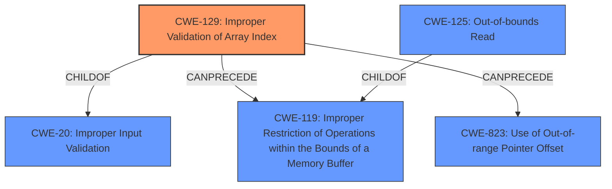

# Enhanced Analysis for CVE-2020-35630

# Summary

| CWE ID | CWE Name | Confidence | CWE Abstraction Level | CWE Vulnerability Mapping Label | CWE-Vulnerability Mapping Notes |
|---|---|---|---|---|---|
| CWE-129 | Improper Validation of Array Index | 0.9 | Variant | Allowed | Primary CWE |
| CWE-125 | Out-of-bounds Read | 0.7 | Base | Allowed | Secondary Candidate |

## Evidence and Confidence

*   **Confidence Score:** 0.8
*   **Evidence Strength:** HIGH

## Relationship Analysis

The primary CWE selected is CWE-129 **(Improper Validation of Array Index)**, which is a Variant of CWE-20 **(Improper Input Validation)**. CWE-129 can lead to CWE-119 **(Improper Restriction of Operations within the Bounds of a Memory Buffer)** and CWE-823 **(Use of Out-of-range Pointer Offset)**. CWE-125 **(Out-of-bounds Read)** is a Base level CWE and a ChildOf CWE-119.



## Vulnerability Chain

The vulnerability chain starts with the lack of proper validation of the array index (CWE-129), which then leads to an out-of-bounds read (CWE-125). The **out-of-bounds read** can then potentially lead to code execution due to type confusion.

## Summary of Analysis

The vulnerability involves an **out-of-bounds read** in the Nef polygon-parsing functionality of CGAL. The root cause is the **lack of proper bounds checking** when reading indices from a file. Specifically, the `SNC_io_parser::read_sface()` function **does not validate the index** before using it to access the `Vertex_of` vector.

The initial assessment focused on CWE-125 **(Out-of-bounds Read)**, but after further analysis and considering the root cause, CWE-129 **(Improper Validation of Array Index)** was deemed a more appropriate primary CWE. The code reads an `index` value from the input stream and directly uses it to access the `Vertex_of` vector **without validation**.

Evidence:
- "The root cause of the vulnerability lies in the **lack of proper bounds checking** when reading indices from a file during the parsing of Nef polygon data in the CGAL library."
- "Specifically, the `SNC_io_parser::read_sface()` function **does not validate the index** before using it to access the `Vertex_of` vector, leading to an out-of-bounds read."
- "The code reads an `index` value from the input stream (`in`) and directly uses it to access the `Vertex_of` vector **without validation**."

The selection of CWE-129 is further supported by the retriever results which lists CWE-129 as the top combined result, with a similarity score of 0.828.

CWE-125 is kept as a secondary CWE because it represents the direct consequence of the **improper validation** and is explicitly mentioned in the vulnerability description.

The final decision is based on a combination of the evidence in the vulnerability description, the retriever results, and the relationships between the CWEs. CWE-129 is at the optimal level of specificity as it directly addresses the root cause of the vulnerability.

Relevant CWE Information:
- CWE-129: Improper Validation of Array Index
- CWE-125: Out-of-bounds Read


## CWE Relationship Analysis

Current CWEs represent these abstraction levels: .


### Vulnerability Chain Analysis

**Chain starting from CWE-823:**
- 823 (Use of Out-of-range Pointer Offset) - ROOT


**Chain starting from CWE-125:**
- 125 (Out-of-bounds Read) - ROOT


### CWE Relationship Diagram

```mermaid
graph TD
    classDef primary fill:#f96,stroke:#333,stroke-width:2px
    classDef secondary fill:#69f,stroke:#333
    classDef tertiary fill:#9e9,stroke:#333
```